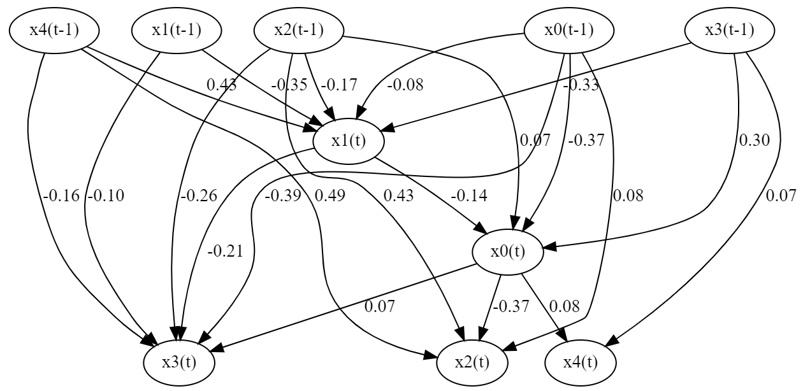
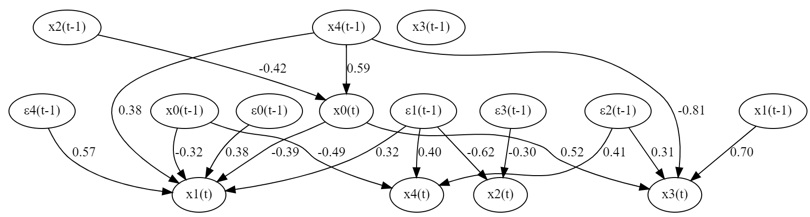

Tutorial
========
In this tutorial, we will show you how to run LiNGAM algorithms and see the results. We will also show you how to run the bootstrap method and check the results.

Requirements
------------

The following packages must be installed in order to run this tutorial. And import if necessary:

* numpy
* pandas
* scikit-learn
* graphviz
* statsmodels

LiNGAM algorithm
----------------

First, we use lingam package:

.. code-block:: python

    import lingam

Then, if we want to run DirectLiNGAM algorithm, we create a :class:`~lingam.DirectLiNGAM` object and call the :func:`~lingam.DirectLiNGAM.fit` method:

.. code-block:: python

    model = lingam.DirectLiNGAM()
    model.fit(X)

* If you want to use the ICA-LiNGAM algorithm, replace :class:`~lingam.DirectLiNGAM` above with :class:`~lingam.ICALiNGAM`.

Using the :attr:`~lingam.DirectLiNGAM.causal_order_` property, we can see the causal ordering as a result of the causal discovery.

.. code-block:: python

    print(model.causal_order_)

The output of the :attr:`~lingam.DirectLiNGAM.causal_order_` property is as follows:

.. code-block:: python

    [3, 0, 2, 5, 1, 4]

Also, using the :attr:`~lingam.DirectLiNGAM.adjacency_matrix_` property, we can see the adjacency matrix as a result of the causal discovery.

.. code-block:: python

    print(model.adjacency_matrix_)

The output of the :attr:`~lingam.DirectLiNGAM.adjacency_matrix_` property is as follows:

.. code-block:: python

    [[ 0.     0.     0.     3.006  0.     0.   ]
     [ 3.002  0.     1.996  0.     0.     0.   ]
     [ 0.     0.     0.     6.001  0.     0.   ]
     [ 0.     0.     0.     0.     0.     0.   ]
     [ 7.978  0.    -0.988  0.     0.     0.   ]
     [ 3.998  0.     0.     0.     0.     0.   ]]

For example, we can draw a causal graph by using graphviz as follows:

.. image:: image/dag.png

For details, see also https://github.com/cdt15/lingam/blob/master/examples/DirectLiNGAM.ipynb

Bootstrapping
-------------

First, we create :class:`~lingam.DirectLiNGAM` object as above:

.. code-block:: python

    model = lingam.DirectLiNGAM()

Then, we call :func:`~lingam.DirectLiNGAM.bootstrap` method instead of :func:`~lingam.DirectLiNGAM.fit`. Here, the second argument specifies the number of bootstrap sampling.:

.. code-block:: python

    result = model.bootstrap(X, 100)

Causal Directions
^^^^^^^^^^^^^^^^^

Since :class:`~lingam.BootstrapResult` object is returned, we can get the ranking of the causal directions extracted by :func:`~lingam.BootstrapResult.get_causal_direction_counts` method. 

.. code-block:: python

    cdc = result.get_causal_direction_counts(n_directions=8, min_causal_effect=0.01)

For example, we can check the result as follows:

.. code-block:: python

    from lingam.utils import print_causal_directions
    print_causal_directions(cdc, 100)

.. code-block:: python

    x0 <--- x3 (100.0%)
    x1 <--- x0 (100.0%)
    x1 <--- x2 (100.0%)
    x2 <--- x3 (100.0%)
    x4 <--- x0 (100.0%)
    x4 <--- x2 (100.0%)
    x5 <--- x0 (100.0%)
    x0 <--- x2 (15.0%)

Increasing the value of `min_causal_effect` argument, causal directions with small effect does not output.

.. code-block:: python

    cdc = result.get_causal_direction_counts(n_directions=8, min_causal_effect=0.1)

.. code-block:: python

    print_causal_directions(cdc, 100)

.. code-block:: python

    x0 <--- x3 (100.0%)
    x1 <--- x0 (100.0%)
    x1 <--- x2 (100.0%)
    x2 <--- x3 (100.0%)
    x4 <--- x0 (100.0%)
    x4 <--- x2 (100.0%)
    x5 <--- x0 (100.0%)

By setting the value of `split_by_causal_effect_sign` argument to True, causal directions are split depending on the sign of the causal effect.

.. code-block:: python

    cdc = result.get_causal_direction_counts(n_directions=8, min_causal_effect=0.01, split_by_causal_effect_sign=True)

.. code-block:: python

    print_causal_directions(cdc, 100)

.. code-block:: python

    x0 <--- x3 (b>0) (100.0%)
    x1 <--- x0 (b>0) (100.0%)
    x1 <--- x2 (b>0) (100.0%)
    x2 <--- x3 (b>0) (100.0%)
    x4 <--- x0 (b>0) (100.0%)
    x4 <--- x2 (b<0) (100.0%)
    x5 <--- x0 (b>0) (100.0%)
    x0 <--- x2 (b>0) (8.0%)
    x0 <--- x2 (b<0) (7.0%)

Directed Acyclic Graphs
^^^^^^^^^^^^^^^^^^^^^^^

Also, using the :func:`~lingam.BootstrapResult.get_directed_acyclic_graph_counts` method, we can get the ranking of the DAGs extracted.

.. code-block:: python

    dagc = result.get_directed_acyclic_graph_counts(n_dags=3, min_causal_effect=0.01)

For example, we can check the result as follows:

.. code-block:: python

    from lingam.utils import print_dagc
    print_dagc(dagc, 100)

.. code-block:: python

    DAG[0]: 77.0%
        x0 <--- x3
        x1 <--- x0
        x1 <--- x2
        x2 <--- x3
        x4 <--- x0
        x4 <--- x2
    DAG[1]: 14.0%
        x0 <--- x2
        x0 <--- x3
        x1 <--- x0
        x1 <--- x2
        x2 <--- x3
        x4 <--- x0
        x4 <--- x2
    DAG[2]: 3.0%
        x0 <--- x3
        x1 <--- x0
        x1 <--- x2
        x2 <--- x3
        x4 <--- x0
        x4 <--- x2
        x4 <--- x5

Increasing the value of `min_causal_effect` argument, causal directions with small effect does not output.

.. code-block:: python

    dagc = result.get_directed_acyclic_graph_counts(n_dags=3, min_causal_effect=0.1)

.. code-block:: python

    print_dagc(dagc, 100)

.. code-block:: python

    DAG[0]: 77.0%
        x0 <--- x3
        x1 <--- x0
        x1 <--- x2
        x2 <--- x3
        x4 <--- x0
        x4 <--- x2
        x5 <--- x0
    DAG[1]: 14.0%
        x0 <--- x2
        x0 <--- x3
        x1 <--- x0
        x1 <--- x2
        x2 <--- x3
        x4 <--- x0
        x4 <--- x2
        x5 <--- x0
    DAG[2]: 3.0%
        x0 <--- x3
        x1 <--- x0
        x1 <--- x2
        x2 <--- x3
        x4 <--- x0
        x4 <--- x2
        x4 <--- x5
        x5 <--- x0

By setting the value of `split_by_causal_effect_sign` argument to True, causal directions are split depending on the sign of the causal effect.

.. code-block:: python

    dagc = result.get_directed_acyclic_graph_counts(n_dags=3, min_causal_effect=0.01, split_by_causal_effect_sign=True)

.. code-block:: python

    print_dagc(dagc, 100)

.. code-block:: python

    DAG[0]: 77.0%
        x0 <--- x3 (b>0)
        x1 <--- x0 (b>0)
        x1 <--- x2 (b>0)
        x2 <--- x3 (b>0)
        x4 <--- x0 (b>0)
        x4 <--- x2 (b<0)
        x5 <--- x0 (b>0)
        x5 <--- x0 (b<0)
    DAG[1]: 14.0%
        x0 <--- x2 (b>0)
        x0 <--- x3 (b>0)
        x1 <--- x0 (b>0)
        x1 <--- x2 (b>0)
        x2 <--- x3 (b>0)
        x4 <--- x0 (b>0)
        x4 <--- x2 (b<0)
        x5 <--- x0 (b>0)
        x5 <--- x0 (b<0)
    DAG[2]: 3.0%
        x0 <--- x3 (b>0)
        x1 <--- x0 (b>0)
        x1 <--- x2 (b>0)
        x2 <--- x3 (b>0)
        x4 <--- x0 (b>0)
        x4 <--- x2 (b<0)
        x4 <--- x5 (b>0)
        x5 <--- x0 (b>0)
        x5 <--- x0 (b<0)

Probability
^^^^^^^^^^^

Also, using the :func:`~lingam.BootstrapResult.get_probabilities` method, we can get the probability of bootstrapping.

.. code-block:: python

    prob = result.get_probabilities(min_causal_effect=0.01)
    print(prob)

For example, we can check the result as follows:

.. code-block:: python

    [[0.   0.   0.15 1.   0.   0.  ]
     [1.   0.   1.   0.04 0.   0.  ]
     [0.   0.   0.   1.   0.   0.  ]
     [0.   0.   0.   0.   0.   0.  ]
     [1.   0.   1.   0.   0.   0.04]
     [1.   0.   0.   0.   0.02 0.  ]]

For details, see also https://github.com/cdt15/lingam/blob/master/examples/Bootstrap.ipynb

Use of Prior Knowledge
----------------------

we use lingam package and :func:`~lingam.utils.make_prior_knowledge`:

.. code-block:: python

    import lingam
    form lingam.utils import make_prior_knowledge

First, we create a prior knowledge matrix:

.. code-block:: python

    prior_knowledge = make_prior_knowledge(
        n_variables=6,
        exogenous_variables=[3],
        sink_variables=[1],
        paths=[[2, 4]],
        no_paths=[[4, 1], [1, 5]])
    print(prior_knowledge)

.. code-block:: python

    [[ 0  0 -1 -1 -1 -1]
     [-1  0 -1 -1  0 -1]
     [-1  0  0 -1  0 -1]
     [ 0  0  0  0  0  0]
     [-1  0  1 -1  0 -1]
     [-1  0 -1 -1 -1  0]]

Then, if we use a prior knowledge, we set prior knowledge matrix to :class:`~lingam.DirectLiNGAM` object:

.. code-block:: python

    model = lingam.DirectLiNGAM(prior_knowledge=prior_knowledge)
    model.fit(X)

Using the :attr:`~lingam.DirectLiNGAM.causal_order_` property, we can see the causal ordering as a result of the causal discovery.

.. code-block:: python

    print(model.causal_order_)

The output of the :attr:`~lingam.DirectLiNGAM.causal_order_` property is as follows:

.. code-block:: python

    [3, 2, 0, 4, 5, 1]

Also, using the :attr:`~lingam.DirectLiNGAM.adjacency_matrix_` property, we can see the adjacency matrix as a result of the causal discovery.

.. code-block:: python

    print(model.adjacency_matrix_)

The output of the :attr:`~lingam.DirectLiNGAM.adjacency_matrix_` property is as follows:

.. code-block:: python

    [[ 0.     0.     0.     2.992  0.     0.   ]
     [ 2.898  0.     1.965  0.     0.     0.   ]
     [ 0.     0.     0.     5.996  0.     0.   ]
     [ 0.     0.     0.     0.     0.     0.   ]
     [ 8.004  0.    -1.001  0.     0.     0.   ]
     [ 3.984  0.     0.     0.     0.     0.   ]]

For details, see also https://github.com/cdt15/lingam/blob/master/examples/DirectLiNGAM(PriorKnowledge).ipynb

Use of Multiple Dataset
-----------------------

We use lingam package:

.. code-block:: python

    import lingam

First, if we use two datasets, we create a list like this:

.. code-block:: python

    X_list = [X1, X2]

Then, we create a :class:`~lingam.MultiGroupDirectLiNGAM` object and call the :func:`~lingam.MultiGroupDirectLiNGAM.fit` method:

.. code-block:: python

    model = lingam.MultiGroupDirectLiNGAM()
    model.fit(X_list)

Using the :attr:`~lingam.MultiGroupDirectLiNGAM.causal_order_` property, we can see the causal ordering as a result of the causal discovery.

.. code-block:: python

    print(model.causal_order_)

Also, using the :attr:`~lingam.MultiGroupDirectLiNGAM.adjacency_matrices_` property, we can see the adjacency matrix as a result of the causal discovery. 
Since :attr:`~lingam.MultiGroupDirectLiNGAM.adjacency_matrices_` property returns a list, we can access the first matrix by indexing as follows:

.. code-block:: python

    print(model.adjacency_matrices_[0])

For details, see also https://github.com/cdt15/lingam/blob/master/examples/MultiGroupDirectLiNGAM.ipynb

Total Effect
------------

We use lingam package:

.. code-block:: python

    import lingam

Then, we create a :class:`~lingam.DirectLiNGAM` object and call the :func:`~lingam.DirectLiNGAM.fit` method:

.. code-block:: python

    model = lingam.DirectLiNGAM()
    model.fit(X)

To estimate the total effect, we can call :func:`~lingam.DirectLiNGAM.estimate_total_effect` method. The following example estimates the total effect from x3 to x1.

.. code-block:: python

    te = model.estimate_total_effect(X, 3, 1)
    print(f'total effect: {te:.3f}')

.. code-block:: python

    total effect: 21.002

For details, see also https://github.com/cdt15/lingam/blob/master/examples/TotalEffect.ipynb

Causal Effect
-------------

First, we use lingam package:

.. code-block:: python

    import lingam

Then, we create a :class:`~lingam.DirectLiNGAM` object and call the :func:`~lingam.DirectLiNGAM.fit` method:

.. code-block:: python

    model = lingam.DirectLiNGAM()
    model.fit(X)

Next, we create the prediction model. In the following example, linear regression model is created, but it is also possible to create logistic regression model or non-linear regression model.

.. code-block:: python

    from sklearn.linear_model import LinearRegression

    target = 0
    features = [i for i in range(X.shape[1]) if i != target]
    reg = LinearRegression()
    reg.fit(X.iloc[:, features], X.iloc[:, target])

Identification of Feature with Greatest Causal Influence on Prediction
^^^^^^^^^^^^^^^^^^^^^^^^^^^^^^^^^^^^^^^^^^^^^^^^^^^^^^^^^^^^^^^^^^^^^^

We create a :class:`~lingam.CausalEffect` object and call the :func:`~lingam.CausalEffect.estimate_effects_on_prediction` method.

.. code-block:: python

    ce = lingam.CausalEffect(model)
    effects = ce.estimate_effects_on_prediction(X, target, reg)

To identify of the feature having the greatest intervention effect on the prediction, we can get the feature that maximizes the value of the obtained list.

.. code-block:: python

    print(X.columns[np.argmax(effects)])

.. code-block:: python

    cylinders

Estimation of Optimal Intervention
^^^^^^^^^^^^^^^^^^^^^^^^^^^^^^^^^^

To estimate of the intervention such that the expectation of the prediction of the post-intervention observations is equal or close to a specified value, we use :func:`~lingam.CausalEffect.estimate_optimal_intervention` method of :class:`~lingam.CausalEffect`.
In the following example, we estimate the intervention value at variable index 1 so that the predicted value is close to 15.

.. code-block:: python

    c = ce.estimate_optimal_intervention(X, target, reg, 1, 15)
    print(f'Optimal intervention: {c:.3f}')

.. code-block:: python

    Optimal intervention: 7.871

For details, see also https://github.com/cdt15/lingam/blob/master/examples/CausalEffect.ipynb
https://github.com/cdt15/lingam/blob/master/examples/CausalEffect(LassoCV).ipynb
https://github.com/cdt15/lingam/blob/master/examples/CausalEffect(LogisticRegression).ipynb
https://github.com/cdt15/lingam/blob/master/examples/CausalEffect(LightGBM).ipynb

Time Series
-----------

VAR-LiNGAM
^^^^^^^^^^

First, we use lingam package:

.. code-block:: python

    import lingam

Then, if we want to run VARLiNGAM algorithm, we create a :class:`~lingam.VARLiNGAM` object and call the :func:`~lingam.VARLiNGAM.fit` method:

.. code-block:: python

    model = lingam.VARLiNGAM()
    model.fit(X)

Using the :attr:`~lingam.VARLiNGAM.causal_order_` property, we can see the causal ordering as a result of the causal discovery.

.. code-block:: python

    print(model.causal_order_)

The output of the :attr:`~lingam.VARLiNGAM.causal_order_` property is as follows:

.. code-block:: python

    [1, 0, 3, 2, 4]

Also, using the :attr:`~lingam.VARLiNGAM.adjacency_matrices_` property, we can see the adjacency matrix as a result of the causal discovery.

.. code-block:: python

    print(model.adjacency_matrices_)

The output of the :attr:`~lingam.VARLiNGAM.adjacency_matrices_` property is as follows:

.. code-block:: python

    [[ 0.   , -0.189,  0.   ,  0.   ,  0.   ],
     [ 0.   ,  0.   ,  0.   ,  0.   ,  0.   ],
     [-0.286,  0.164,  0.   ,  0.   , -0.126],
     [ 0.168, -0.13 , -0.204,  0.   , -0.074],
     [ 0.166, -0.031,  0.   ,  0.   ,  0.   ]],

    [[-0.37 , -0.027,  0.066,  0.282,  0.044],
     [-0.083, -0.349, -0.168, -0.327,  0.43 ],
     [ 0.115,  0.013,  0.445,  0.083,  0.42 ],
     [-0.309, -0.084, -0.18 , -0.003, -0.088],
     [ 0.002, -0.002, -0.025,  0.035,  0.003]]

For example, we can draw a causal graph by using graphviz as follows:

For details, see also https://github.com/cdt15/lingam/blob/master/examples/VARLiNGAM.ipynb

VARMA-LiNGAM
^^^^^^^^^^^^

First, we use lingam package:

.. code-block:: python

    import lingam

Then, if we want to run VARMALiNGAM algorithm, we create a :class:`~lingam.VARMALiNGAM` object and call the :func:`~lingam.VARMALiNGAM.fit` method:

.. code-block:: python

    model = lingam.VARMALiNGAM()
    model.fit(X)

Using the :attr:`~lingam.VARMALiNGAM.causal_order_` property, we can see the causal ordering as a result of the causal discovery.

.. code-block:: python

    print(model.causal_order_)

The output of the :attr:`~lingam.VARMALiNGAM.causal_order_` property is as follows:

.. code-block:: python

    [2, 0, 1, 3, 4]

Also, using the :attr:`~lingam.VARMALiNGAM.adjacency_matrices_` property, we can see the adjacency matrix as a result of the causal discovery.

.. code-block:: python

    print(model.adjacency_matrices_)

The output of the :attr:`~lingam.VARMALiNGAM.adjacency_matrices_` property is as follows:

.. code-block:: python

    ([[[ 0.   ,  0.   , -0.238,  0.   ,  0.   ],
       [-0.392,  0.   ,  0.182,  0.   ,  0.   ],
       [ 0.   ,  0.   ,  0.   ,  0.   ,  0.   ],
       [ 0.523, -0.149,  0.   ,  0.   ,  0.   ],
       [ 0.   ,  0.   ,  0.   ,  0.   ,  0.   ]], 
      [[-0.145, -0.288, -0.418,  0.041,  0.592],
       [-0.324,  0.027,  0.024,  0.231,  0.379],
       [-0.249,  0.191, -0.01 ,  0.136,  0.261],
       [ 0.182,  0.698,  0.21 ,  0.197, -0.815],
       [-0.486,  0.063, -0.263,  0.112,  0.26 ]]]),

    ([[[ 0.247, -0.12 , -0.128, -0.124,  0.037],
       [ 0.378,  0.319, -0.12 , -0.023,  0.573],
       [-0.107, -0.624,  0.012, -0.303, -0.246],
       [-0.22 ,  0.26 ,  0.313,  0.227, -0.057],
       [ 0.255,  0.405,  0.41 ,  0.256, -0.286]]]))

For example, we can draw a causal graph by using graphviz as follows:

For details, see also https://github.com/cdt15/lingam/blob/master/examples/VARMALiNGAM.ipynb

