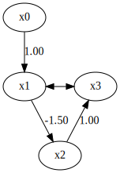

ABIC-LiNGAM
===========

Model
-----

ABIC-LiNGAM [1]_ is a score-based causal discovery method that extends the LiNGAM framework to handle scenarios with unmeasured confounders.
It aims to estimate causal structures, including causal directions, from observational data even when latent variables are present.
This ABIC-LiNGAM makes the following assumptions and preconditions: 

#. **Linearity**: Relationships between variables are linear.
#. **Non-Gaussianity**: Error terms follow a multivariate generalized normal distribution (MGGD); when :math:`\beta = 1`, it reduces to Gaussian.
#. **Error Independence**: Error terms are independent if no unmeasured confounders exist; otherwise, dependencies are allowed.
#. **Acyclicity**: The graph is an ADMG (no directed cycles).
#. **Bow-Free Condition**: No pair of variables has both a directed and a bidirected edge between them.
#. **Identifiability**: For bow-free ADMGs with MGGD errors, almost all parameters are identifiable from the observed covariance matrix.

References

    .. [1] Y. Morinishi and S. Shimizu. 
           Differentiable causal discovery of linear non-Gaussian acyclic models under unmeasured confounding. 
           Transactions on Machine Learning Research (TMLR), 2025.

Import and settings
-------------------

In this example, we need to import ``numpy``, ``pandas``, and
``graphviz`` in addition to ``lingam``.

.. code-block:: python

    import numpy as np
    import pandas as pd
    import graphviz
    from IPython.display import display, HTML
    
    import lingam
    from lingam.utils import make_dot
    from lingam.utils import MGGD, MGGDEstimator
    
    print([np.__version__, pd.__version__, graphviz.__version__, lingam.__version__])
    
    np.set_printoptions(precision=5, suppress=True)
    np.random.seed(42)

.. parsed-literal::

    ['1.26.4', '2.3.0', '0.20.3', '1.11.0']
    

Test data
---------

We create test data consisting of 6 variables.

.. code-block:: python

    d = 4
    B_true = np.zeros((d, d), dtype=float)
    B_true[0, 1] = 1.0    # x0 -> x1
    B_true[1, 2] = -1.5   # x1 -> x2
    B_true[2, 3] = 1.0    # x2 -> x3
    
    omega_true = np.array([
        [1.2, 0.0, 0.0, 0.0],
        [0.0, 1.0, 0.0, 0.6],  # x1 <-> x3
        [0.0, 0.0, 1.0, 0.0],
        [0.0, 0.6, 0.0, 1.0],
    ], dtype=float)
    
    n = 1000
    beta_shape = 3.0  # Non-Gaussian (Gaussian if 硫=1)
    
    mggd = MGGD(np.zeros(d), omega_true, beta_shape)
    eps = mggd.rvs(size=n)
    
    A = np.eye(d) - B_true
    X = eps @ np.linalg.inv(A)
    X -= X.mean(axis=0, keepdims=True)
    X = pd.DataFrame(X, columns=['x0', 'x1', 'x2', 'x3'])
    X.head()

.. raw:: html

    

    
    <table border="1" class="dataframe">
      <thead>
        <tr style="text-align: right;">
          <th></th>
          <th>x0</th>
          <th>x1</th>
          <th>x2</th>
          <th>x3</th>
        </tr>
      </thead>
      <tbody>
        <tr>
          <th>0</th>
          <td>0.707924</td>
          <td>0.285412</td>
          <td>0.000765</td>
          <td>-0.325608</td>
        </tr>
        <tr>
          <th>1</th>
          <td>0.551189</td>
          <td>1.152744</td>
          <td>-2.345113</td>
          <td>-1.553441</td>
        </tr>
        <tr>
          <th>2</th>
          <td>-0.163441</td>
          <td>0.294779</td>
          <td>-0.336241</td>
          <td>0.339230</td>
        </tr>
        <tr>
          <th>3</th>
          <td>-0.229596</td>
          <td>-0.679928</td>
          <td>0.982231</td>
          <td>0.562654</td>
        </tr>
        <tr>
          <th>4</th>
          <td>0.412978</td>
          <td>-0.391069</td>
          <td>0.112635</td>
          <td>-0.541435</td>
        </tr>
      </tbody>
    </table>
    

     

.. code-block:: python

    # Merge the coefficient matrix and the error covariance matrix to create the true graph.
    omega = omega_true.copy()
    np.fill_diagonal(omega, 0.0)
    graph_true = B_true.T.copy()
    graph_true[np.abs(omega) > 0] = np.nan
    
    make_dot(graph_true)

Causal Discovery
----------------

To run causal discovery, we create a ``ABICLiNGAM`` object and call the
``fit`` method. Here, we set the parameter ``beta`` estimated using the
MGGD estimator.

.. code-block:: python

    est = MGGDEstimator()
    mggd_est = est.fit(X.values)
    beta_hat = float(mggd_est.beta)
    print(f"beta_hat: {beta_hat}")
    
    model = lingam.ABICLiNGAM(beta=beta_hat)
    model.fit(X)

.. parsed-literal::

    beta_hat: 2.6066582934794456
    

.. parsed-literal::

    <lingam.abic_lingam.ABICLiNGAM at 0x139cc8beda0>

Using the ``coefficient_matrix_`` and ``error_covariance_matrix_``
properties, we can see the estimated coefficient matrix and the error
covariance matrix.

.. code-block:: python

    print("Estimated directed B:\n", model.coefficient_matrix_, "\n")
    print("Estimated bidirected Omega:\n", model.error_covariance_matrix_)

.. parsed-literal::

    Estimated directed B:
     [[ 0.       1.00579  0.       0.     ]
     [ 0.       0.      -1.52555  0.     ]
     [ 0.       0.       0.       0.99481]
     [ 0.       0.       0.       0.     ]] 
    
    Estimated bidirected Omega:
     [[0.27928 0.      0.      0.     ]
     [0.      0.22923 0.      0.13404]
     [0.      0.      0.22453 0.     ]
     [0.      0.13404 0.      0.22539]]
    

Additionally, as with other algorithms, using the ``causal_order_`` and
``adjacency_matrix_`` properties allows you to see the causal order and
adjacency matrix (with nan values for unobserved common causes).

.. code-block:: python

    print("Causal ordering =", model.causal_order_, "\n")
    print("Estimated adjacency_matrix:\n", model.adjacency_matrix_)

.. parsed-literal::

    Causal ordering = [0, 1, 2, 3] 
    
    Estimated adjacency_matrix:
     [[ 0.       0.       0.       0.     ]
     [ 1.00579  0.       0.           nan]
     [ 0.      -1.52555  0.       0.     ]
     [ 0.           nan  0.99481  0.     ]]
    

Next, we compare the estimation results using DirectLiNGAM with the same
data.

.. code-block:: python

    # DirectLiNGAM
    dl = lingam.DirectLiNGAM()
    dl.fit(X)
    
    true_svg = make_dot(graph_true).pipe(format='svg').decode('utf-8')
    svg1 = make_dot(model.adjacency_matrix_).pipe(format='svg').decode('utf-8')
    svg2 = make_dot(dl.adjacency_matrix_).pipe(format='svg').decode('utf-8')
    
    # Display side by side using HTML
    html = f"""
    

      

        <h3 style="text-align: center;">Ground Truth</h3>
        {true_svg}
      

      

        <h3 style="text-align: center;">ABIC-LiNGAM</h3>
        {svg1}
      

      

        <h3 style="text-align: center;">DirectLiNGAM</h3>
        {svg2}
      

    

    """
    
    display(HTML(html))

.. raw:: html

    
    

      

        <h3 style="text-align: center;">Ground Truth</h3>
        <?xml version="1.0" encoding="UTF-8" standalone="no"?>
    <!DOCTYPE svg PUBLIC "-//W3C//DTD SVG 1.1//EN"
     "http://www.w3.org/Graphics/SVG/1.1/DTD/svg11.dtd">
    <!-- Generated by graphviz version 6.0.2 (20221011.1828)
     -->
    <!-- Pages: 1 -->
    <svg width="152pt" height="218pt"
     viewBox="0.00 0.00 152.00 218.00" xmlns="http://www.w3.org/2000/svg" xmlns:xlink="http://www.w3.org/1999/xlink">
    <g id="graph0" class="graph" transform="scale(1 1) rotate(0) translate(4 214)">
    <polygon fill="white" stroke="none" points="-4,4 -4,-214 148,-214 148,4 -4,4"/>
    <!-- x0 -->
    <g id="node1" class="node">
    <title>x0</title>
    <ellipse fill="none" stroke="black" cx="27" cy="-192" rx="27" ry="18"/>
    <text text-anchor="middle" x="27" y="-188.3" font-family="Times New Roman,serif" font-size="14.00">x0</text>
    </g>
    <!-- x1 -->
    <g id="node2" class="node">
    <title>x1</title>
    <ellipse fill="none" stroke="black" cx="27" cy="-105" rx="27" ry="18"/>
    <text text-anchor="middle" x="27" y="-101.3" font-family="Times New Roman,serif" font-size="14.00">x1</text>
    </g>
    <!-- x0&#45;&gt;x1 -->
    <g id="edge1" class="edge">
    <title>x0&#45;&gt;x1</title>
    <path fill="none" stroke="black" d="M27,-173.8C27,-162.16 27,-146.55 27,-133.24"/>
    <polygon fill="black" stroke="black" points="30.5,-133.18 27,-123.18 23.5,-133.18 30.5,-133.18"/>
    <text text-anchor="middle" x="39.5" y="-144.8" font-family="Times New Roman,serif" font-size="14.00">1.00</text>
    </g>
    <!-- x2 -->
    <g id="node3" class="node">
    <title>x2</title>
    <ellipse fill="none" stroke="black" cx="72" cy="-18" rx="27" ry="18"/>
    <text text-anchor="middle" x="72" y="-14.3" font-family="Times New Roman,serif" font-size="14.00">x2</text>
    </g>
    <!-- x1&#45;&gt;x2 -->
    <g id="edge2" class="edge">
    <title>x1&#45;&gt;x2</title>
    <path fill="none" stroke="black" d="M35.68,-87.61C42.15,-75.38 51.12,-58.44 58.52,-44.46"/>
    <polygon fill="black" stroke="black" points="61.76,-45.81 63.35,-35.34 55.58,-42.54 61.76,-45.81"/>
    <text text-anchor="middle" x="67.5" y="-57.8" font-family="Times New Roman,serif" font-size="14.00">&#45;1.50</text>
    </g>
    <!-- x3 -->
    <g id="node4" class="node">
    <title>x3</title>
    <ellipse fill="none" stroke="black" cx="117" cy="-105" rx="27" ry="18"/>
    <text text-anchor="middle" x="117" y="-101.3" font-family="Times New Roman,serif" font-size="14.00">x3</text>
    </g>
    <!-- x1&#45;&gt;x3 -->
    <g id="edge4" class="edge">
    <title>x1&#45;&gt;x3</title>
    <path fill="none" stroke="black" d="M64.16,-105C69.4,-105 74.64,-105 79.88,-105"/>
    <polygon fill="black" stroke="black" points="64.07,-101.5 54.07,-105 64.07,-108.5 64.07,-101.5"/>
    <polygon fill="black" stroke="black" points="79.96,-108.5 89.96,-105 79.96,-101.5 79.96,-108.5"/>
    </g>
    <!-- x2&#45;&gt;x3 -->
    <g id="edge3" class="edge">
    <title>x2&#45;&gt;x3</title>
    <path fill="none" stroke="black" d="M80.65,-35.34C87.12,-47.56 96.08,-64.49 103.49,-78.49"/>
    <polygon fill="black" stroke="black" points="100.55,-80.41 108.32,-87.61 106.74,-77.14 100.55,-80.41"/>
    <text text-anchor="middle" x="109.5" y="-57.8" font-family="Times New Roman,serif" font-size="14.00">1.00</text>
    </g>
    </g>
    </svg>
    
      

      

        <h3 style="text-align: center;">ABIC-LiNGAM</h3>
        <?xml version="1.0" encoding="UTF-8" standalone="no"?>
    <!DOCTYPE svg PUBLIC "-//W3C//DTD SVG 1.1//EN"
     "http://www.w3.org/Graphics/SVG/1.1/DTD/svg11.dtd">
    <!-- Generated by graphviz version 6.0.2 (20221011.1828)
     -->
    <!-- Pages: 1 -->
    <svg width="152pt" height="218pt"
     viewBox="0.00 0.00 152.00 218.00" xmlns="http://www.w3.org/2000/svg" xmlns:xlink="http://www.w3.org/1999/xlink">
    <g id="graph0" class="graph" transform="scale(1 1) rotate(0) translate(4 214)">
    <polygon fill="white" stroke="none" points="-4,4 -4,-214 148,-214 148,4 -4,4"/>
    <!-- x0 -->
    <g id="node1" class="node">
    <title>x0</title>
    <ellipse fill="none" stroke="black" cx="27" cy="-192" rx="27" ry="18"/>
    <text text-anchor="middle" x="27" y="-188.3" font-family="Times New Roman,serif" font-size="14.00">x0</text>
    </g>
    <!-- x1 -->
    <g id="node2" class="node">
    <title>x1</title>
    <ellipse fill="none" stroke="black" cx="27" cy="-105" rx="27" ry="18"/>
    <text text-anchor="middle" x="27" y="-101.3" font-family="Times New Roman,serif" font-size="14.00">x1</text>
    </g>
    <!-- x0&#45;&gt;x1 -->
    <g id="edge1" class="edge">
    <title>x0&#45;&gt;x1</title>
    <path fill="none" stroke="black" d="M27,-173.8C27,-162.16 27,-146.55 27,-133.24"/>
    <polygon fill="black" stroke="black" points="30.5,-133.18 27,-123.18 23.5,-133.18 30.5,-133.18"/>
    <text text-anchor="middle" x="39.5" y="-144.8" font-family="Times New Roman,serif" font-size="14.00">1.01</text>
    </g>
    <!-- x2 -->
    <g id="node3" class="node">
    <title>x2</title>
    <ellipse fill="none" stroke="black" cx="72" cy="-18" rx="27" ry="18"/>
    <text text-anchor="middle" x="72" y="-14.3" font-family="Times New Roman,serif" font-size="14.00">x2</text>
    </g>
    <!-- x1&#45;&gt;x2 -->
    <g id="edge2" class="edge">
    <title>x1&#45;&gt;x2</title>
    <path fill="none" stroke="black" d="M35.68,-87.61C42.15,-75.38 51.12,-58.44 58.52,-44.46"/>
    <polygon fill="black" stroke="black" points="61.76,-45.81 63.35,-35.34 55.58,-42.54 61.76,-45.81"/>
    <text text-anchor="middle" x="67.5" y="-57.8" font-family="Times New Roman,serif" font-size="14.00">&#45;1.53</text>
    </g>
    <!-- x3 -->
    <g id="node4" class="node">
    <title>x3</title>
    <ellipse fill="none" stroke="black" cx="117" cy="-105" rx="27" ry="18"/>
    <text text-anchor="middle" x="117" y="-101.3" font-family="Times New Roman,serif" font-size="14.00">x3</text>
    </g>
    <!-- x1&#45;&gt;x3 -->
    <g id="edge4" class="edge">
    <title>x1&#45;&gt;x3</title>
    <path fill="none" stroke="black" d="M64.16,-105C69.4,-105 74.64,-105 79.88,-105"/>
    <polygon fill="black" stroke="black" points="64.07,-101.5 54.07,-105 64.07,-108.5 64.07,-101.5"/>
    <polygon fill="black" stroke="black" points="79.96,-108.5 89.96,-105 79.96,-101.5 79.96,-108.5"/>
    </g>
    <!-- x2&#45;&gt;x3 -->
    <g id="edge3" class="edge">
    <title>x2&#45;&gt;x3</title>
    <path fill="none" stroke="black" d="M80.65,-35.34C87.12,-47.56 96.08,-64.49 103.49,-78.49"/>
    <polygon fill="black" stroke="black" points="100.55,-80.41 108.32,-87.61 106.74,-77.14 100.55,-80.41"/>
    <text text-anchor="middle" x="109.5" y="-57.8" font-family="Times New Roman,serif" font-size="14.00">0.99</text>
    </g>
    </g>
    </svg>
    
      

      

        <h3 style="text-align: center;">DirectLiNGAM</h3>
        <?xml version="1.0" encoding="UTF-8" standalone="no"?>
    <!DOCTYPE svg PUBLIC "-//W3C//DTD SVG 1.1//EN"
     "http://www.w3.org/Graphics/SVG/1.1/DTD/svg11.dtd">
    <!-- Generated by graphviz version 6.0.2 (20221011.1828)
     -->
    <!-- Pages: 1 -->
    <svg width="140pt" height="305pt"
     viewBox="0.00 0.00 140.34 305.00" xmlns="http://www.w3.org/2000/svg" xmlns:xlink="http://www.w3.org/1999/xlink">
    <g id="graph0" class="graph" transform="scale(1 1) rotate(0) translate(4 301)">
    <polygon fill="white" stroke="none" points="-4,4 -4,-301 136.34,-301 136.34,4 -4,4"/>
    <!-- x0 -->
    <g id="node1" class="node">
    <title>x0</title>
    <ellipse fill="none" stroke="black" cx="41.34" cy="-18" rx="27" ry="18"/>
    <text text-anchor="middle" x="41.34" y="-14.3" font-family="Times New Roman,serif" font-size="14.00">x0</text>
    </g>
    <!-- x1 -->
    <g id="node2" class="node">
    <title>x1</title>
    <ellipse fill="none" stroke="black" cx="41.34" cy="-105" rx="27" ry="18"/>
    <text text-anchor="middle" x="41.34" y="-101.3" font-family="Times New Roman,serif" font-size="14.00">x1</text>
    </g>
    <!-- x1&#45;&gt;x0 -->
    <g id="edge1" class="edge">
    <title>x1&#45;&gt;x0</title>
    <path fill="none" stroke="black" d="M41.34,-86.8C41.34,-75.16 41.34,-59.55 41.34,-46.24"/>
    <polygon fill="black" stroke="black" points="44.84,-46.18 41.34,-36.18 37.84,-46.18 44.84,-46.18"/>
    <text text-anchor="middle" x="53.84" y="-57.8" font-family="Times New Roman,serif" font-size="14.00">0.65</text>
    </g>
    <!-- x2 -->
    <g id="node3" class="node">
    <title>x2</title>
    <ellipse fill="none" stroke="black" cx="31.34" cy="-279" rx="27" ry="18"/>
    <text text-anchor="middle" x="31.34" y="-275.3" font-family="Times New Roman,serif" font-size="14.00">x2</text>
    </g>
    <!-- x2&#45;&gt;x0 -->
    <g id="edge2" class="edge">
    <title>x2&#45;&gt;x0</title>
    <path fill="none" stroke="black" d="M24.94,-261.42C12.93,-228 -10.39,-150.33 5.34,-87 9.2,-71.46 17.35,-55.56 24.91,-43.04"/>
    <polygon fill="black" stroke="black" points="27.87,-44.91 30.25,-34.58 21.95,-41.17 27.87,-44.91"/>
    <text text-anchor="middle" x="12.84" y="-144.8" font-family="Times New Roman,serif" font-size="14.00">0.39</text>
    </g>
    <!-- x2&#45;&gt;x1 -->
    <g id="edge4" class="edge">
    <title>x2&#45;&gt;x1</title>
    <path fill="none" stroke="black" d="M32.34,-260.88C34.08,-231 37.67,-169.11 39.76,-133.27"/>
    <polygon fill="black" stroke="black" points="43.27,-133.24 40.35,-123.05 36.28,-132.83 43.27,-133.24"/>
    <text text-anchor="middle" x="50.84" y="-188.3" font-family="Times New Roman,serif" font-size="14.00">&#45;0.64</text>
    </g>
    <!-- x3 -->
    <g id="node4" class="node">
    <title>x3</title>
    <ellipse fill="none" stroke="black" cx="105.34" cy="-192" rx="27" ry="18"/>
    <text text-anchor="middle" x="105.34" y="-188.3" font-family="Times New Roman,serif" font-size="14.00">x3</text>
    </g>
    <!-- x2&#45;&gt;x3 -->
    <g id="edge6" class="edge">
    <title>x2&#45;&gt;x3</title>
    <path fill="none" stroke="black" d="M44.57,-262.8C55.94,-249.75 72.49,-230.74 85.45,-215.85"/>
    <polygon fill="black" stroke="black" points="88.3,-217.91 92.23,-208.06 83.02,-213.31 88.3,-217.91"/>
    <text text-anchor="middle" x="84.84" y="-231.8" font-family="Times New Roman,serif" font-size="14.00">0.86</text>
    </g>
    <!-- x3&#45;&gt;x0 -->
    <g id="edge3" class="edge">
    <title>x3&#45;&gt;x0</title>
    <path fill="none" stroke="black" d="M103.4,-173.7C99.86,-146.84 90.73,-94.03 70.34,-54 68.09,-49.57 65.19,-45.21 62.1,-41.14"/>
    <polygon fill="black" stroke="black" points="64.69,-38.78 55.64,-33.29 59.29,-43.23 64.69,-38.78"/>
    <text text-anchor="middle" x="107.84" y="-101.3" font-family="Times New Roman,serif" font-size="14.00">&#45;0.39</text>
    </g>
    <!-- x3&#45;&gt;x1 -->
    <g id="edge5" class="edge">
    <title>x3&#45;&gt;x1</title>
    <path fill="none" stroke="black" d="M87.55,-178.05C80.03,-171.96 71.6,-164.23 65.34,-156 59.88,-148.81 55.19,-140.17 51.45,-132.11"/>
    <polygon fill="black" stroke="black" points="54.56,-130.48 47.37,-122.71 48.14,-133.27 54.56,-130.48"/>
    <text text-anchor="middle" x="77.84" y="-144.8" font-family="Times New Roman,serif" font-size="14.00">0.10</text>
    </g>
    </g>
    </svg>
    
      

    

    

