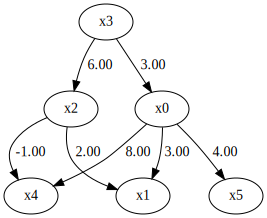
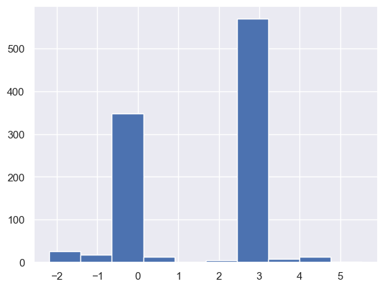
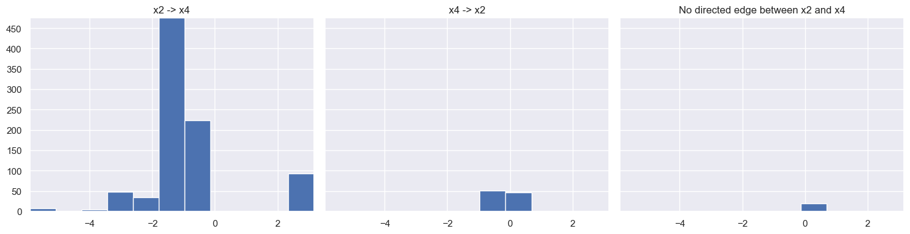

Bootstrap
=========

Import and settings
-------------------

In this example, we need to import ``numpy``, ``pandas``, and ``graphviz`` in addition to ``lingam``.

.. code-block:: python

    import numpy as np
    import pandas as pd
    import graphviz
    import lingam
    from lingam.utils import print_causal_directions, print_dagc, make_dot
    
    import warnings
    warnings.filterwarnings("ignore")
    
    print([np.__version__, pd.__version__, graphviz.__version__, lingam.__version__])
    
    np.set_printoptions(precision=3, suppress=True)
    np.random.seed(0)

.. parsed-literal::

    ['1.26.4', '2.3.3', '0.21', '1.12.1']
    

Test data
---------

We create test data consisting of 6 variables.

.. code-block:: python

    _size = 100
    x3 = np.random.uniform(size=_size)
    x0 = 3.0*x3 + np.random.uniform(size=_size)
    x2 = 6.0*x3 + np.random.uniform(size=_size)
    x1 = 3.0*x0 + 2.0*x2 + np.random.uniform(size=_size)
    x5 = 4.0*x0 + np.random.uniform(size=_size)
    x4 = 8.0*x0 - 1.0*x2 + np.random.uniform(size=_size)
    X = pd.DataFrame(np.array([x0, x1, x2, x3, x4, x5]).T ,columns=['x0', 'x1', 'x2', 'x3', 'x4', 'x5'])
    X.head()

.. raw:: html

    

    
    <table border="1" class="dataframe">
      <thead>
        <tr style="text-align: right;">
          <th></th>
          <th>x0</th>
          <th>x1</th>
          <th>x2</th>
          <th>x3</th>
          <th>x4</th>
          <th>x5</th>
        </tr>
      </thead>
      <tbody>
        <tr>
          <th>0</th>
          <td>2.324257</td>
          <td>15.088680</td>
          <td>3.604677</td>
          <td>0.548814</td>
          <td>15.299760</td>
          <td>9.698288</td>
        </tr>
        <tr>
          <th>1</th>
          <td>2.415576</td>
          <td>17.995735</td>
          <td>4.987480</td>
          <td>0.715189</td>
          <td>14.710164</td>
          <td>10.591596</td>
        </tr>
        <tr>
          <th>2</th>
          <td>2.543484</td>
          <td>15.952262</td>
          <td>3.994332</td>
          <td>0.602763</td>
          <td>16.878512</td>
          <td>10.273552</td>
        </tr>
        <tr>
          <th>3</th>
          <td>2.596838</td>
          <td>14.769421</td>
          <td>3.448903</td>
          <td>0.544883</td>
          <td>18.076397</td>
          <td>11.332654</td>
        </tr>
        <tr>
          <th>4</th>
          <td>1.519718</td>
          <td>10.099609</td>
          <td>2.566608</td>
          <td>0.423655</td>
          <td>9.924640</td>
          <td>6.948359</td>
        </tr>
      </tbody>
    </table>
    

     

.. code-block:: python

    m = np.array([[0.0, 0.0, 0.0, 3.0, 0.0, 0.0],
                  [3.0, 0.0, 2.0, 0.0, 0.0, 0.0],
                  [0.0, 0.0, 0.0, 6.0, 0.0, 0.0],
                  [0.0, 0.0, 0.0, 0.0, 0.0, 0.0],
                  [8.0, 0.0,-1.0, 0.0, 0.0, 0.0],
                  [4.0, 0.0, 0.0, 0.0, 0.0, 0.0]])
    
    make_dot(m)

Bootstrapping
-------------

We call :func:`~lingam.DirectLiNGAM.bootstrap` method instead of :func:`~lingam.DirectLiNGAM.fit`. Here, the second argument specifies the number of bootstrap sampling.

.. code-block:: python

    n_samples = 1000
    
    model = lingam.DirectLiNGAM()
    result = model.bootstrap(X, n_sampling=n_samples)

Causal Directions
-----------------

Since :class:`~lingam.BootstrapResult` object is returned, we can get the ranking of the causal directions extracted by :func:`~lingam.BootstrapResult.get_causal_direction_counts` method. In the following sample code, ``n_directions`` option is limited to the causal directions of the top 8 rankings, and ``min_causal_effect`` option is limited to causal directions with a coefficient of 0.01 or more.

.. code-block:: python

    cdc = result.get_causal_direction_counts(n_directions=8, min_causal_effect=0.01, split_by_causal_effect_sign=True)

We can check the result by utility function.

.. code-block:: python

    print_causal_directions(cdc, n_samples)

.. parsed-literal::

    x4 <--- x2 (b<0) (87.9%)
    x4 <--- x0 (b>0) (86.6%)
    x1 <--- x2 (b>0) (77.5%)
    x1 <--- x0 (b>0) (77.3%)
    x2 <--- x3 (b>0) (76.1%)
    x5 <--- x0 (b>0) (75.4%)
    x0 <--- x3 (b>0) (45.4%)
    x0 <--- x5 (b>0) (24.6%)
    

Directed Acyclic Graphs
-----------------------

Also, using the :func:`~lingam.BootstrapResult.get_directed_acyclic_graph_counts()` method, we can
get the ranking of the DAGs extracted. In the following sample code,
``n_dags`` option is limited to the dags of the top 3 rankings, and
``min_causal_effect`` option is limited to causal directions with a
coefficient of 0.01 or more.

.. code-block:: python

    dagc = result.get_directed_acyclic_graph_counts(n_dags=3, min_causal_effect=0.01, split_by_causal_effect_sign=True)

We can check the result by utility function.

.. code-block:: python

    print_dagc(dagc, n_samples)

.. parsed-literal::

    DAG[0]: 17.0%
    	x0 <--- x3 (b>0)
    	x1 <--- x0 (b>0)
    	x1 <--- x2 (b>0)
    	x2 <--- x3 (b>0)
    	x4 <--- x0 (b>0)
    	x4 <--- x2 (b<0)
    	x5 <--- x0 (b>0)
    DAG[1]: 4.2%
    	x0 <--- x3 (b>0)
    	x1 <--- x0 (b>0)
    	x1 <--- x2 (b>0)
    	x3 <--- x2 (b>0)
    	x4 <--- x0 (b>0)
    	x4 <--- x2 (b<0)
    	x5 <--- x0 (b>0)
    DAG[2]: 3.9%
    	x1 <--- x0 (b>0)
    	x1 <--- x2 (b>0)
    	x2 <--- x3 (b>0)
    	x3 <--- x0 (b>0)
    	x4 <--- x0 (b>0)
    	x4 <--- x2 (b<0)
    	x5 <--- x0 (b>0)
    

Probability
-----------

Using the :func:`~lingam.BootstrapResult.get_probabilities()` method, we can get the probability of
bootstrapping.

.. code-block:: python

    prob = result.get_probabilities(min_causal_effect=0.01)
    print(prob)

.. parsed-literal::

    [[0.    0.178 0.163 0.482 0.134 0.246]
     [0.773 0.    0.775 0.202 0.069 0.064]
     [0.2   0.225 0.    0.761 0.093 0.032]
     [0.183 0.166 0.19  0.    0.031 0.084]
     [0.866 0.074 0.88  0.121 0.    0.043]
     [0.754 0.059 0.065 0.095 0.062 0.   ]]
    

Total Causal Effects
--------------------

Using the ``get_total_causal_effects()`` method, we can get the list of
total causal effect. The total causal effects we can get are dictionary
type variable. We can display the list nicely by assigning it to
pandas.DataFrame. Also, we have replaced the variable index with a label
below.

.. code-block:: python

    causal_effects = result.get_total_causal_effects(min_causal_effect=0.01)
    
    # Assign to pandas.DataFrame for pretty display
    df = pd.DataFrame(causal_effects)
    labels = [f'x{i}' for i in range(X.shape[1])]
    df['from'] = df['from'].apply(lambda x : labels[x])
    df['to'] = df['to'].apply(lambda x : labels[x])
    df

.. raw:: html

    

    
    <table border="1" class="dataframe">
      <thead>
        <tr style="text-align: right;">
          <th></th>
          <th>from</th>
          <th>to</th>
          <th>effect</th>
          <th>probability</th>
        </tr>
      </thead>
      <tbody>
        <tr>
          <th>0</th>
          <td>x2</td>
          <td>x4</td>
          <td>-0.986006</td>
          <td>0.884</td>
        </tr>
        <tr>
          <th>1</th>
          <td>x0</td>
          <td>x4</td>
          <td>7.975821</td>
          <td>0.866</td>
        </tr>
        <tr>
          <th>2</th>
          <td>x3</td>
          <td>x4</td>
          <td>17.169757</td>
          <td>0.858</td>
        </tr>
        <tr>
          <th>3</th>
          <td>x3</td>
          <td>x1</td>
          <td>20.553538</td>
          <td>0.794</td>
        </tr>
        <tr>
          <th>4</th>
          <td>x0</td>
          <td>x1</td>
          <td>3.020369</td>
          <td>0.793</td>
        </tr>
        <tr>
          <th>5</th>
          <td>x3</td>
          <td>x2</td>
          <td>5.968590</td>
          <td>0.788</td>
        </tr>
        <tr>
          <th>6</th>
          <td>x2</td>
          <td>x1</td>
          <td>1.992771</td>
          <td>0.775</td>
        </tr>
        <tr>
          <th>7</th>
          <td>x0</td>
          <td>x5</td>
          <td>3.984278</td>
          <td>0.754</td>
        </tr>
        <tr>
          <th>8</th>
          <td>x3</td>
          <td>x5</td>
          <td>11.686617</td>
          <td>0.657</td>
        </tr>
        <tr>
          <th>9</th>
          <td>x3</td>
          <td>x0</td>
          <td>2.920996</td>
          <td>0.653</td>
        </tr>
        <tr>
          <th>10</th>
          <td>x0</td>
          <td>x2</td>
          <td>1.679845</td>
          <td>0.343</td>
        </tr>
        <tr>
          <th>11</th>
          <td>x2</td>
          <td>x5</td>
          <td>0.155444</td>
          <td>0.282</td>
        </tr>
        <tr>
          <th>12</th>
          <td>x5</td>
          <td>x4</td>
          <td>1.550997</td>
          <td>0.266</td>
        </tr>
        <tr>
          <th>13</th>
          <td>x0</td>
          <td>x3</td>
          <td>0.305366</td>
          <td>0.260</td>
        </tr>
        <tr>
          <th>14</th>
          <td>x5</td>
          <td>x1</td>
          <td>0.939446</td>
          <td>0.259</td>
        </tr>
        <tr>
          <th>15</th>
          <td>x5</td>
          <td>x0</td>
          <td>0.249365</td>
          <td>0.246</td>
        </tr>
        <tr>
          <th>16</th>
          <td>x1</td>
          <td>x4</td>
          <td>0.863039</td>
          <td>0.245</td>
        </tr>
        <tr>
          <th>17</th>
          <td>x2</td>
          <td>x0</td>
          <td>0.120842</td>
          <td>0.244</td>
        </tr>
        <tr>
          <th>18</th>
          <td>x1</td>
          <td>x2</td>
          <td>0.285349</td>
          <td>0.225</td>
        </tr>
        <tr>
          <th>19</th>
          <td>x1</td>
          <td>x5</td>
          <td>0.576121</td>
          <td>0.199</td>
        </tr>
        <tr>
          <th>20</th>
          <td>x1</td>
          <td>x0</td>
          <td>0.144407</td>
          <td>0.197</td>
        </tr>
        <tr>
          <th>21</th>
          <td>x5</td>
          <td>x2</td>
          <td>0.451434</td>
          <td>0.196</td>
        </tr>
        <tr>
          <th>22</th>
          <td>x1</td>
          <td>x3</td>
          <td>0.046961</td>
          <td>0.194</td>
        </tr>
        <tr>
          <th>23</th>
          <td>x2</td>
          <td>x3</td>
          <td>0.133917</td>
          <td>0.191</td>
        </tr>
        <tr>
          <th>24</th>
          <td>x5</td>
          <td>x3</td>
          <td>0.076654</td>
          <td>0.168</td>
        </tr>
        <tr>
          <th>25</th>
          <td>x4</td>
          <td>x1</td>
          <td>0.362045</td>
          <td>0.144</td>
        </tr>
        <tr>
          <th>26</th>
          <td>x4</td>
          <td>x5</td>
          <td>0.478376</td>
          <td>0.143</td>
        </tr>
        <tr>
          <th>27</th>
          <td>x4</td>
          <td>x0</td>
          <td>0.123534</td>
          <td>0.134</td>
        </tr>
        <tr>
          <th>28</th>
          <td>x4</td>
          <td>x2</td>
          <td>-0.139721</td>
          <td>0.097</td>
        </tr>
        <tr>
          <th>29</th>
          <td>x4</td>
          <td>x3</td>
          <td>-0.006454</td>
          <td>0.043</td>
        </tr>
      </tbody>
    </table>
    

We can easily perform sorting operations with pandas.DataFrame.

.. code-block:: python

    df.sort_values('effect', ascending=False).head()

.. raw:: html

    

    
    <table border="1" class="dataframe">
      <thead>
        <tr style="text-align: right;">
          <th></th>
          <th>from</th>
          <th>to</th>
          <th>effect</th>
          <th>probability</th>
        </tr>
      </thead>
      <tbody>
        <tr>
          <th>3</th>
          <td>x3</td>
          <td>x1</td>
          <td>20.553538</td>
          <td>0.794</td>
        </tr>
        <tr>
          <th>2</th>
          <td>x3</td>
          <td>x4</td>
          <td>17.169757</td>
          <td>0.858</td>
        </tr>
        <tr>
          <th>8</th>
          <td>x3</td>
          <td>x5</td>
          <td>11.686617</td>
          <td>0.657</td>
        </tr>
        <tr>
          <th>1</th>
          <td>x0</td>
          <td>x4</td>
          <td>7.975821</td>
          <td>0.866</td>
        </tr>
        <tr>
          <th>5</th>
          <td>x3</td>
          <td>x2</td>
          <td>5.968590</td>
          <td>0.788</td>
        </tr>
      </tbody>
    </table>
    

.. code-block:: python

    df.sort_values('probability', ascending=True).head()

.. raw:: html

    

    
    <table border="1" class="dataframe">
      <thead>
        <tr style="text-align: right;">
          <th></th>
          <th>from</th>
          <th>to</th>
          <th>effect</th>
          <th>probability</th>
        </tr>
      </thead>
      <tbody>
        <tr>
          <th>29</th>
          <td>x4</td>
          <td>x3</td>
          <td>-0.006454</td>
          <td>0.043</td>
        </tr>
        <tr>
          <th>28</th>
          <td>x4</td>
          <td>x2</td>
          <td>-0.139721</td>
          <td>0.097</td>
        </tr>
        <tr>
          <th>27</th>
          <td>x4</td>
          <td>x0</td>
          <td>0.123534</td>
          <td>0.134</td>
        </tr>
        <tr>
          <th>26</th>
          <td>x4</td>
          <td>x5</td>
          <td>0.478376</td>
          <td>0.143</td>
        </tr>
        <tr>
          <th>25</th>
          <td>x4</td>
          <td>x1</td>
          <td>0.362045</td>
          <td>0.144</td>
        </tr>
      </tbody>
    </table>
    

And with pandas.DataFrame, we can easily filter by keywords. The
following code extracts the causal direction towards x1.

.. code-block:: python

    df[df['to']=='x1'].head()

.. raw:: html

    

    
    <table border="1" class="dataframe">
      <thead>
        <tr style="text-align: right;">
          <th></th>
          <th>from</th>
          <th>to</th>
          <th>effect</th>
          <th>probability</th>
        </tr>
      </thead>
      <tbody>
        <tr>
          <th>3</th>
          <td>x3</td>
          <td>x1</td>
          <td>20.553538</td>
          <td>0.794</td>
        </tr>
        <tr>
          <th>4</th>
          <td>x0</td>
          <td>x1</td>
          <td>3.020369</td>
          <td>0.793</td>
        </tr>
        <tr>
          <th>6</th>
          <td>x2</td>
          <td>x1</td>
          <td>1.992771</td>
          <td>0.775</td>
        </tr>
        <tr>
          <th>14</th>
          <td>x5</td>
          <td>x1</td>
          <td>0.939446</td>
          <td>0.259</td>
        </tr>
        <tr>
          <th>25</th>
          <td>x4</td>
          <td>x1</td>
          <td>0.362045</td>
          <td>0.144</td>
        </tr>
      </tbody>
    </table>
    

Because it holds the raw data of the total causal effect (the original data
for calculating the median), it is possible to draw a histogram of the
values of the causal effect, as shown below.

.. code-block:: python

    import matplotlib.pyplot as plt
    import seaborn as sns
    sns.set()
    %matplotlib inline
    
    from_index = 3 # index of x3
    to_index = 0 # index of x0
    plt.hist(result.total_effects_[:, to_index, from_index])

Furthermore, when we separate the bootstrap coefficient distributions
into the three structural cases - X->Y, Y->X, and no directed edge between
X and Y - the resulting histograms are shown below.

.. code-block:: python

    import matplotlib.ticker as ticker
    
    from_index, to_index = 2, 4
    
    te_xy = result.total_effects_[:, to_index, from_index]
    te_yx = result.total_effects_[:, from_index, to_index]
    
    both_zero_mask = (te_xy == 0.0) & (te_yx == 0.0)
    te_zero = result.total_effects_[both_zero_mask, to_index, from_index]
    
    te_xy = te_xy[te_xy != 0.0]
    te_yx = te_yx[te_yx != 0.0]
    
    bins_count = int(np.ceil(1 + np.log2(max(n_samples, 1))))
    
    # calculate xmin, xmax
    arr_list = [te_xy, te_yx, te_zero]
    if any(a.size > 0 for a in arr_list):
        vals = np.concatenate([a for a in arr_list if a.size > 0])
    else:
        vals = np.array([0.0])
    
    xmin, xmax = np.min(vals), np.max(vals)
    if xmin == xmax:
        eps = 1e-9 if xmin == 0 else abs(xmin) * 1e-3
        xmin, xmax = xmin - eps, xmax + eps
    
    bin_edges = np.linspace(xmin, xmax, bins_count + 1)
    
    # calculate ymax
    counts_xy, _ = np.histogram(te_xy, bins=bin_edges) if te_xy.size > 0 else (np.zeros(bins_count, dtype=int), None)
    counts_yx, _ = np.histogram(te_yx, bins=bin_edges) if te_yx.size > 0 else (np.zeros(bins_count, dtype=int), None)
    counts_zz, _ = np.histogram(te_zero, bins=bin_edges) if te_zero.size > 0 else (np.zeros(bins_count, dtype=int), None)
    
    ymax = int(max(counts_xy.max(initial=0), counts_yx.max(initial=0), counts_zz.max(initial=0)))
    ymax = max(ymax, 1)
    # If you want to set ymax to the number of bootstrap iterations, uncomment next line.
    # ymax = n_samples
    
    # display histograms
    fig, axes = plt.subplots(1, 3, figsize=(15, 4), sharex=True, sharey=True)
    labels = [f'x{i}' for i in range(X.shape[1])]
    
    axes[0].hist(te_xy, bins=bin_edges)
    axes[0].set_title(f"{labels[from_index]} -> {labels[to_index]}")
    axes[0].yaxis.set_major_locator(ticker.MaxNLocator(integer=True))
    axes[0].set_xlim(xmin, xmax)
    axes[0].set_ylim(0, ymax)
    
    axes[1].hist(te_yx, bins=bin_edges)
    axes[1].set_title(f"{labels[to_index]} -> {labels[from_index]}")
    axes[1].yaxis.set_major_locator(ticker.MaxNLocator(integer=True))
    axes[1].set_xlim(xmin, xmax)
    axes[1].set_ylim(0, ymax)
    
    axes[2].hist(te_zero, bins=bin_edges)
    axes[2].set_title("No directed edge between " + labels[from_index] + " and " + labels[to_index])
    axes[2].yaxis.set_major_locator(ticker.MaxNLocator(integer=True))
    axes[2].set_xlim(xmin, xmax)
    axes[2].set_ylim(0, ymax)
    
    plt.tight_layout()
    plt.show()

Bootstrap Probability of Path
-----------------------------

Using the ``get_paths()`` method, we can explore all paths from any
variable to any variable and calculate the bootstrap probability for
each path. The path will be output as an array of variable indices. For
example, the array ``[3, 0, 1]`` shows the path from variable X3 through
variable X0 to variable X1.

.. code-block:: python

    from_index = 3 # index of x3
    to_index = 1 # index of x1
    
    pd.DataFrame(result.get_paths(from_index, to_index))

.. raw:: html

    

    
    <table border="1" class="dataframe">
      <thead>
        <tr style="text-align: right;">
          <th></th>
          <th>path</th>
          <th>effect</th>
          <th>probability</th>
        </tr>
      </thead>
      <tbody>
        <tr>
          <th>0</th>
          <td>[3, 2, 1]</td>
          <td>11.914854</td>
          <td>0.660</td>
        </tr>
        <tr>
          <th>1</th>
          <td>[3, 0, 1]</td>
          <td>8.756234</td>
          <td>0.443</td>
        </tr>
        <tr>
          <th>2</th>
          <td>[3, 1]</td>
          <td>2.105700</td>
          <td>0.202</td>
        </tr>
        <tr>
          <th>3</th>
          <td>[3, 2, 0, 1]</td>
          <td>1.635862</td>
          <td>0.094</td>
        </tr>
        <tr>
          <th>4</th>
          <td>[3, 5, 0, 1]</td>
          <td>8.670284</td>
          <td>0.060</td>
        </tr>
        <tr>
          <th>5</th>
          <td>[3, 4, 0, 1]</td>
          <td>6.979752</td>
          <td>0.054</td>
        </tr>
        <tr>
          <th>6</th>
          <td>[3, 2, 4, 1]</td>
          <td>-1.146483</td>
          <td>0.038</td>
        </tr>
        <tr>
          <th>7</th>
          <td>[3, 0, 4, 1]</td>
          <td>4.459602</td>
          <td>0.028</td>
        </tr>
        <tr>
          <th>8</th>
          <td>[3, 0, 5, 1]</td>
          <td>2.864025</td>
          <td>0.026</td>
        </tr>
        <tr>
          <th>9</th>
          <td>[3, 2, 4, 0, 1]</td>
          <td>-4.602396</td>
          <td>0.024</td>
        </tr>
        <tr>
          <th>10</th>
          <td>[3, 0, 2, 1]</td>
          <td>-1.512156</td>
          <td>0.022</td>
        </tr>
        <tr>
          <th>11</th>
          <td>[3, 4, 1]</td>
          <td>4.954881</td>
          <td>0.019</td>
        </tr>
        <tr>
          <th>12</th>
          <td>[3, 2, 5, 0, 1]</td>
          <td>0.374461</td>
          <td>0.009</td>
        </tr>
        <tr>
          <th>13</th>
          <td>[3, 2, 0, 5, 1]</td>
          <td>0.583856</td>
          <td>0.008</td>
        </tr>
        <tr>
          <th>14</th>
          <td>[3, 5, 4, 0, 1]</td>
          <td>6.941594</td>
          <td>0.007</td>
        </tr>
        <tr>
          <th>15</th>
          <td>[3, 4, 5, 0, 1]</td>
          <td>2.145360</td>
          <td>0.007</td>
        </tr>
        <tr>
          <th>16</th>
          <td>[3, 4, 2, 1]</td>
          <td>-1.080988</td>
          <td>0.007</td>
        </tr>
        <tr>
          <th>17</th>
          <td>[3, 5, 1]</td>
          <td>3.272935</td>
          <td>0.006</td>
        </tr>
        <tr>
          <th>18</th>
          <td>[3, 4, 0, 5, 1]</td>
          <td>2.697207</td>
          <td>0.005</td>
        </tr>
        <tr>
          <th>19</th>
          <td>[3, 4, 2, 0, 1]</td>
          <td>-0.219167</td>
          <td>0.005</td>
        </tr>
        <tr>
          <th>20</th>
          <td>[3, 0, 5, 2, 1]</td>
          <td>5.181321</td>
          <td>0.004</td>
        </tr>
        <tr>
          <th>21</th>
          <td>[3, 5, 0, 4, 1]</td>
          <td>5.442240</td>
          <td>0.004</td>
        </tr>
        <tr>
          <th>22</th>
          <td>[3, 5, 2, 1]</td>
          <td>1.537410</td>
          <td>0.003</td>
        </tr>
        <tr>
          <th>23</th>
          <td>[3, 4, 5, 1]</td>
          <td>4.166390</td>
          <td>0.003</td>
        </tr>
        <tr>
          <th>24</th>
          <td>[3, 0, 5, 4, 1]</td>
          <td>-0.522766</td>
          <td>0.003</td>
        </tr>
        <tr>
          <th>25</th>
          <td>[3, 2, 4, 5, 0, 1]</td>
          <td>-1.083415</td>
          <td>0.003</td>
        </tr>
        <tr>
          <th>26</th>
          <td>[3, 5, 4, 1]</td>
          <td>-7.351469</td>
          <td>0.002</td>
        </tr>
        <tr>
          <th>27</th>
          <td>[3, 2, 4, 5, 1]</td>
          <td>0.203801</td>
          <td>0.002</td>
        </tr>
        <tr>
          <th>28</th>
          <td>[3, 2, 4, 0, 5, 1]</td>
          <td>-1.303056</td>
          <td>0.002</td>
        </tr>
        <tr>
          <th>29</th>
          <td>[3, 5, 2, 0, 1]</td>
          <td>-0.006054</td>
          <td>0.002</td>
        </tr>
        <tr>
          <th>30</th>
          <td>[3, 5, 4, 2, 1]</td>
          <td>-15.137090</td>
          <td>0.002</td>
        </tr>
        <tr>
          <th>31</th>
          <td>[3, 4, 0, 2, 1]</td>
          <td>-3.885974</td>
          <td>0.001</td>
        </tr>
        <tr>
          <th>32</th>
          <td>[3, 2, 5, 4, 1]</td>
          <td>-0.035426</td>
          <td>0.001</td>
        </tr>
        <tr>
          <th>33</th>
          <td>[3, 5, 0, 2, 1]</td>
          <td>7.112032</td>
          <td>0.001</td>
        </tr>
        <tr>
          <th>34</th>
          <td>[3, 2, 0, 4, 1]</td>
          <td>-3.206907</td>
          <td>0.001</td>
        </tr>
        <tr>
          <th>35</th>
          <td>[3, 5, 2, 4, 0, 1]</td>
          <td>0.351331</td>
          <td>0.001</td>
        </tr>
        <tr>
          <th>36</th>
          <td>[3, 0, 4, 5, 1]</td>
          <td>-0.695107</td>
          <td>0.001</td>
        </tr>
        <tr>
          <th>37</th>
          <td>[3, 5, 4, 0, 2, 1]</td>
          <td>14.386599</td>
          <td>0.001</td>
        </tr>
        <tr>
          <th>38</th>
          <td>[3, 4, 2, 0, 5, 1]</td>
          <td>-0.072976</td>
          <td>0.001</td>
        </tr>
      </tbody>
    </table>
    

