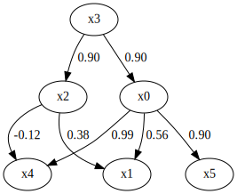
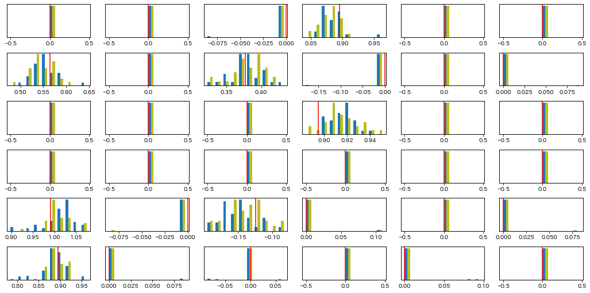

Bootstrap with imputation
=========================

This notebook explains how to use ``bootstrap_with_imputation``.
``bootstrap_with_imputation`` performs causal discovery with multiple
imputations on data with missing values.

Hereinafter, NaN or nan represents missing values.

Import and settings
-------------------

.. code-block:: python

    import numpy as np
    
    import lingam
    from lingam.utils import make_dot
    from lingam.tools import bootstrap_with_imputation
    
    import matplotlib.pyplot as plt
    
    print([np.__version__, lingam.__version__])
    
    np.set_printoptions(precision=3, suppress=True)
    np.random.seed(0)

.. parsed-literal::

    ['1.24.4', '1.8.3']

Test data
---------

Test data is generated according to the following adjacency matrix.

.. code-block:: python

    m = np.array([
        [ 0.000,  0.000,  0.000,  0.895,  0.000,  0.000],
        [ 0.565,  0.000,  0.377,  0.000,  0.000,  0.000],
        [ 0.000,  0.000,  0.000,  0.895,  0.000,  0.000],
        [ 0.000,  0.000,  0.000,  0.000,  0.000,  0.000],
        [ 0.991,  0.000, -0.124,  0.000,  0.000,  0.000],
        [ 0.895,  0.000,  0.000,  0.000,  0.000,  0.000]
    ])
    
    make_dot(m)

The variance of all variables in this data is approximately 1.0 and the
mean is approximately 0.0, the variance of error terms excluding an
exogenous variable is approximately 0.2.

.. code-block:: python

    sample_size = 1000
    
    error_vars = [0.2, 0.2, 0.2, 1.0, 0.2, 0.2]
    params = [0.5 * np.sqrt(12 * v) for v in error_vars]
    
    generate_error = lambda p: np.random.uniform(-p, p, size=sample_size)
    e = np.array([generate_error(p) for p in params])
    
    X = np.linalg.pinv(np.eye(len(m)) - m) @ e
    X = X.T
    
    X.shape

.. parsed-literal::

    (1000, 6)

.. code-block:: python

    X.mean(axis=0)

.. parsed-literal::

    array([-0.057, -0.03 , -0.042, -0.056, -0.069, -0.061])

.. code-block:: python

    X.var(axis=0)

.. parsed-literal::

    array([0.968, 0.989, 1.021, 0.982, 0.979, 0.973])

.. code-block:: python

    e.T.var(axis=0)

.. parsed-literal::

    array([0.203, 0.215, 0.197, 0.982, 0.191, 0.202])

Some data for x5 will be replaced by NaN using the MCAR method.

.. code-block:: python

    X_mcar = X.copy()
    
    prop_missing = [0, 0, 0, 0, 0, 0.1]
    
    for i, prop in enumerate(prop_missing):
        mask = np.random.uniform(0, 1, size=len(X_mcar))
        X_mcar[mask < prop, i] = np.nan

The proportaion of missing is the following:

.. code-block:: python

    np.isnan(X_mcar).sum(axis=0) / sample_size

.. parsed-literal::

    array([0.   , 0.   , 0.   , 0.   , 0.   , 0.098])

Causal discovery with missing data
----------------------------------

``bootstrap_with_imputation`` discovers causality in given data with
NaNs.

In the following settings, ``bootstrap_with_imputation`` creates 30
bootstrap samples and repeat the imputation 5 times for each bootstrap
sample and performs causal discovery assuming a common causal structure
on the 5 imputed data.

.. code-block:: python

    n_sampling = 30
    n_repeats = 5
    causal_orders, adj_matrices_list, resampled_indices, imputation_results = bootstrap_with_imputation(X_mcar, n_sampling, n_repeats)

``causal_orders`` stores the causal order of the 30 bootstrap samples.

.. code-block:: python

    causal_orders.shape

.. parsed-literal::

    (30, 6)

``adj_matrices_list`` is the list of adjacency matrices estimated from
the results of 5 repeated imputations for each of the 30 bootstrap
samples.

.. code-block:: python

    adj_matrices_list.shape

.. parsed-literal::

    (30, 5, 6, 6)

``resampled_indices`` contains lists of the original indices of the 30
bootstrap samples.

.. code-block:: python

    resampled_indices.shape

.. parsed-literal::

    (30, 1000)

``imputation_results`` stores the result of imputations.

.. code-block:: python

    imputation_results.shape

.. parsed-literal::

    (30, 5, 1000, 6)

Checking results
----------------

Comparing obtained results with results for data with no missing
~~~~~~~~~~~~~~~~~~~~~~~~~~~~~~~~~~~~~~~~~~~~~~~~~~~~~~~~~~~~~~~~

Histogram
^^^^^^^^^

The results for data with no missing data are as follows:

.. code-block:: python

    model = lingam.DirectLiNGAM()
    bs_result = model.bootstrap(X, n_sampling)

The adjacency matirces is stored in ``adjacency_matrices_``.

.. code-block:: python

    bs_result.adjacency_matrices_.shape

.. parsed-literal::

    (30, 6, 6)

The distributions of the elements of the estimated adjacency matrix of
the two bootstrap results are compared as follows:

.. code-block:: python

    n_features = X.shape[1]
    
    fig, axes = plt.subplots(n_features, n_features, figsize=(n_features * 2.4, n_features * 1.2))
    
    for i in range(n_features):
        for j in range(n_features):
            result_missing = adj_matrices_list[:, :, i, j].flatten()
            result_no_missing = bs_result.adjacency_matrices_[:, i, j].flatten()
            
            xrange = (
                min(*result_missing, *result_no_missing),
                max(*result_missing, *result_no_missing)
            )
            
            hist, edges = np.histogram(result_missing, range=xrange)
            hist2, edges2 = np.histogram(result_no_missing, range=xrange)
            
            width = (edges[1] - edges[0]) / 3
            
            ax = axes[i, j]
            ax.bar(edges[:-1], hist, width=width, align="edge", color="tab:blue")
            ax.set_yticks([])
            
            ax = axes[i, j].twinx()
            ax.bar(edges2[:-1] + width, hist2, width=width, align="edge", color="tab:olive")
            ax.set_yticks([])
            
            ax.axvline(m[i, j], color="red")
    
    plt.tight_layout()
    plt.show()

Red vertical lines indicate true values. The [i, j] of this scatter
matrix indicates the distribution of the [i, j] of the adjacency matrix.
Blue histograms are results with missing data, orange histograms are
results with no missing data.

Median value of each element of the matrix
^^^^^^^^^^^^^^^^^^^^^^^^^^^^^^^^^^^^^^^^^^

Median values of each element of the adjacency matrix estimated on the
data with missing values are as follows:

.. code-block:: python

    np.median(adj_matrices_list, axis=(0, 1))

.. parsed-literal::

    array([[ 0.   ,  0.   ,  0.   ,  0.882,  0.   ,  0.   ],
           [ 0.555,  0.   ,  0.381,  0.   ,  0.   ,  0.   ],
           [ 0.   ,  0.   ,  0.   ,  0.918,  0.   ,  0.   ],
           [ 0.   ,  0.   ,  0.   ,  0.   ,  0.   ,  0.   ],
           [ 1.025,  0.   , -0.147,  0.   ,  0.   ,  0.   ],
           [ 0.892,  0.   ,  0.   ,  0.   ,  0.   ,  0.   ]])

The average value of each element of the adjacency matrix estimated on
the data with no missing values is as follows:

.. code-block:: python

    np.median(bs_result.adjacency_matrices_, axis=0)

.. parsed-literal::

    array([[ 0.   ,  0.   ,  0.   ,  0.882,  0.   ,  0.   ],
           [ 0.546,  0.   ,  0.383,  0.   ,  0.   ,  0.   ],
           [ 0.   ,  0.   ,  0.   ,  0.912,  0.   ,  0.   ],
           [ 0.   ,  0.   ,  0.   ,  0.   ,  0.   ,  0.   ],
           [ 1.002,  0.   , -0.136,  0.   ,  0.   ,  0.   ],
           [ 0.89 ,  0.   ,  0.   ,  0.   ,  0.   ,  0.   ]])

Comparing each result with the adjacency matrix used in the data
generation, it is clear that they are all able to estimate the presence
of true edges.

.. code-block:: python

    m

.. parsed-literal::

    array([[ 0.   ,  0.   ,  0.   ,  0.895,  0.   ,  0.   ],
           [ 0.565,  0.   ,  0.377,  0.   ,  0.   ,  0.   ],
           [ 0.   ,  0.   ,  0.   ,  0.895,  0.   ,  0.   ],
           [ 0.   ,  0.   ,  0.   ,  0.   ,  0.   ,  0.   ],
           [ 0.991,  0.   , -0.124,  0.   ,  0.   ,  0.   ],
           [ 0.895,  0.   ,  0.   ,  0.   ,  0.   ,  0.   ]])

Getting bootstrap samples and imputed bootstrap samples
-------------------------------------------------------

To get bootstrap samples, do the following:

.. code-block:: python

    bootstrap_samples = np.array([X_mcar[indices] for indices in resampled_indices])
    bootstrap_samples.shape

.. parsed-literal::

    (30, 1000, 6)

``bootstrap_samples`` contains NaNs. For example, the number of NaNs
that the first bootstrap sample has is as follows:

.. code-block:: python

    np.isnan(bootstrap_samples[0]).sum(axis=0)

.. parsed-literal::

    array([ 0,  0,  0,  0,  0, 85])

``imputation_results`` stores the result of the imputation. When
X_mcar[i, j] is NaN, the complementary values are stored in the
imputation_results[i, j], and when X_mcar[i, j] is non-NaN, NaN is
stored in the imputation_results[i, j].

The first 8 rows of the first imputation result for the first bootstrap
sample is as follows:

.. code-block:: python

    imputation_results[0, 0, :8]

.. parsed-literal::

    array([[  nan,   nan,   nan,   nan,   nan,   nan],
           [  nan,   nan,   nan,   nan,   nan,   nan],
           [  nan,   nan,   nan,   nan,   nan,   nan],
           [  nan,   nan,   nan,   nan,   nan,   nan],
           [  nan,   nan,   nan,   nan,   nan,   nan],
           [  nan,   nan,   nan,   nan,   nan,   nan],
           [  nan,   nan,   nan,   nan,   nan, 0.188],
           [  nan,   nan,   nan,   nan,   nan,   nan]])

The first 8 rows of each of the first bootstrap_sample is as follows:

.. code-block:: python

    bootstrap_samples[0, :8]

.. parsed-literal::

    array([[-0.193, -0.072,  1.018,  0.328, -0.863, -0.622],
           [-1.972, -1.887, -1.687, -1.489, -1.216, -1.622],
           [-0.444, -1.18 , -0.49 ,  0.269, -0.483, -0.011],
           [ 0.531,  0.996,  1.201,  0.968,  1.035,  0.708],
           [-2.202, -1.915, -0.988, -1.704, -1.42 , -1.531],
           [ 1.6  ,  1.756,  0.591,  1.127,  1.494,  0.743],
           [ 0.441, -0.17 , -0.933, -0.244,  1.117,    nan],
           [ 0.746,  1.629,  1.329,  0.976,  0.302,  0.756]])

``bootstrap_samples`` is the data before the imputation is performed, so
the missing values are still NaN.

To obtain the imputed bootstrap_samples, do the following:

.. code-block:: python

    imputed_bootstrap_samples = []
    
    for i in range(n_sampling):
        imputeds = []
        for j in range(n_repeats):
            pos = ~np.isnan(imputation_results[i, j])
            
            imputed = bootstrap_samples[i].copy()
            imputed[pos] = imputation_results[i, j, pos]
            
            imputeds.append(imputed)
        imputed_bootstrap_samples.append(imputeds)
    imputed_bootstrap_samples = np.array(imputed_bootstrap_samples)

It is confirmed that NaN was imputed.

.. code-block:: python

    imputed_bootstrap_samples[0, 0, :8]

.. parsed-literal::

    array([[-0.193, -0.072,  1.018,  0.328, -0.863, -0.622],
           [-1.972, -1.887, -1.687, -1.489, -1.216, -1.622],
           [-0.444, -1.18 , -0.49 ,  0.269, -0.483, -0.011],
           [ 0.531,  0.996,  1.201,  0.968,  1.035,  0.708],
           [-2.202, -1.915, -0.988, -1.704, -1.42 , -1.531],
           [ 1.6  ,  1.756,  0.591,  1.127,  1.494,  0.743],
           [ 0.441, -0.17 , -0.933, -0.244,  1.117,  0.188],
           [ 0.746,  1.629,  1.329,  0.976,  0.302,  0.756]])

