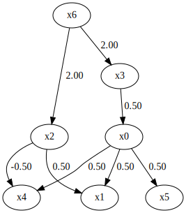
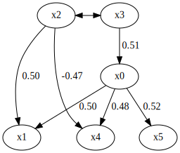
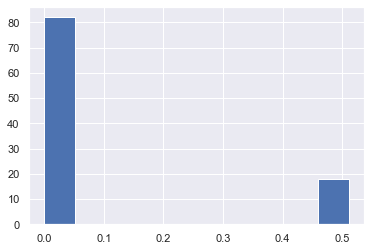

BottomUpParceLiNGAM
===================

Model
-------------------
This method assumes an extension of the basic LiNGAM model [1]_ to hidden common cause cases. 
Specifically, this implements Algorithm 1 of [3]_ except the Step 2. 
Similarly to the basic LiNGAM model [1]_, this method makes the following assumptions:

#. Linearity
#. Non-Gaussian continuous error variables (except at most one)
#. Acyclicity

However, it allows the following hidden common causes:

#. Only exogenous observed variables may share hidden common causes.

This is a simpler version of the latent variable LiNGAM [2]_ that extends the basic LiNGAM model to hidden common causes. 
Note that the latent variable LiNGAM [2]_ allows the existence of hidden common causes between any observed variables. 
However, this kind of causal graph structures are often assumed in the classic structural equation modelling [4]_. 

Denote observed variables by $x_i$ and error variables by $e_i$ ( $i=1, ..., p$ ) and coefficients or connection strengths $b_{ij}$ ( $i,j=1, ..., p$ ). 
Collect them in vectors $x$ and $e$ and a matrix $B$, respectivelly. 
Due to the acyclicity assumption, the adjacency matrix $B$ can be permuted to be strictly lower-triangular by a simultaneous row and column permutation.
The error variables $e_i$ except those corresponding to exogenous observed variables are independent due to the assumption that only exogenous observed variables may share hidden common causes. 

Then, mathematically, the model for observed variable vector $x$ is written as 

$$ x = Bx + e. $$

References

    .. [1] S. Shimizu, P. O. Hoyer, A. Hyvärinen, and A. J. Kerminen.
       A linear non-gaussian acyclic model for causal discovery.
       Journal of Machine Learning Research, 7:2003-2030, 2006.
    .. [2] P. O. Hoyer, S. Shimizu, A. Kerminen, and M. Palviainen. 
      Estimation of causal effects using linear non-gaussian causal models with hidden variables. 
      International Journal of Approximate Reasoning, 49(2): 362-378, 2008.
    .. [3] T. Tashiro, S. Shimizu, A. Hyvärinen, T. Washio. 
      ParceLiNGAM: a causal ordering method robust against latent confounders. 
      Neural computation, 26(1): 57-83, 2014. 
    .. [4] K. A. Bollen. Structural Equations With Latent Variables, 1984, Wiley.

Import and settings
-------------------

In this example, we need to import ``numpy``, ``pandas``, and
``graphviz`` in addition to ``lingam``.

.. code-block:: python

    import numpy as np
    import pandas as pd
    import graphviz
    import lingam
    from lingam.utils import print_causal_directions, print_dagc, make_dot
    
    import warnings
    warnings.filterwarnings('ignore')
    
    print([np.__version__, pd.__version__, graphviz.__version__, lingam.__version__])
    
    np.set_printoptions(precision=3, suppress=True)

.. parsed-literal::

    ['1.16.2', '0.24.2', '0.11.1', '1.5.4']
    

Test data
---------

First, we generate a causal structure with 7 variables. Then we create a
dataset with 6 variables from x0 to x5, with x6 being the latent
variable for x2 and x3.

.. code-block:: python

    np.random.seed(1000)

    x6 = np.random.uniform(size=1000)
    x3 = 2.0*x6 + np.random.uniform(size=1000)
    x0 = 0.5*x3 + np.random.uniform(size=1000)
    x2 = 2.0*x6 + np.random.uniform(size=1000)
    x1 = 0.5*x0 + 0.5*x2 + np.random.uniform(size=1000)
    x5 = 0.5*x0 + np.random.uniform(size=1000)
    x4 = 0.5*x0 - 0.5*x2 + np.random.uniform(size=1000)

    # The latent variable x6 is not included.
    X = pd.DataFrame(np.array([x0, x1, x2, x3, x4, x5]).T, columns=['x0', 'x1', 'x2', 'x3', 'x4', 'x5'])

    X.head()

.. raw:: html

    

    
    <table border="1" class="dataframe">
      <thead>
        <tr style="text-align: right;">
          <th></th>
          <th>x0</th>
          <th>x1</th>
          <th>x2</th>
          <th>x3</th>
          <th>x4</th>
          <th>x5</th>
        </tr>
      </thead>
      <tbody>
        <tr>
          <th>0</th>
          <td>1.505949</td>
          <td>2.667827</td>
          <td>2.029420</td>
          <td>1.463708</td>
          <td>0.615387</td>
          <td>1.157907</td>
        </tr>
        <tr>
          <th>1</th>
          <td>1.379130</td>
          <td>1.721744</td>
          <td>0.965613</td>
          <td>0.801952</td>
          <td>0.919654</td>
          <td>0.957148</td>
        </tr>
        <tr>
          <th>2</th>
          <td>1.436825</td>
          <td>2.845166</td>
          <td>2.773506</td>
          <td>2.533417</td>
          <td>-0.616746</td>
          <td>0.903326</td>
        </tr>
        <tr>
          <th>3</th>
          <td>1.562885</td>
          <td>2.205270</td>
          <td>1.080121</td>
          <td>1.192257</td>
          <td>1.240595</td>
          <td>1.411295</td>
        </tr>
        <tr>
          <th>4</th>
          <td>1.940721</td>
          <td>2.974182</td>
          <td>2.140298</td>
          <td>1.886342</td>
          <td>0.451992</td>
          <td>1.770786</td>
        </tr>
      </tbody>
    </table>
    

     

.. code-block:: python

    m = np.array([[0.0, 0.0, 0.0, 0.5, 0.0, 0.0, 0.0],
                  [0.5, 0.0, 0.5, 0.0, 0.0, 0.0, 0.0],
                  [0.0, 0.0, 0.0, 0.0, 0.0, 0.0, 2.0],
                  [0.0, 0.0, 0.0, 0.0, 0.0, 0.0, 2.0],
                  [0.5, 0.0,-0.5, 0.0, 0.0, 0.0, 0.0],
                  [0.5, 0.0, 0.0, 0.0, 0.0, 0.0, 0.0],
                  [0.0, 0.0, 0.0, 0.0, 0.0, 0.0, 0.0]])

    dot = make_dot(m)

    # Save pdf
    dot.render('dag')

    # Save png
    dot.format = 'png'
    dot.render('dag')

    dot

Causal Discovery
----------------

To run causal discovery, we create a ``BottomUpParceLiNGAM`` object and
call the ``fit`` method.

.. code-block:: python

    model = lingam.BottomUpParceLiNGAM()
    model.fit(X)

.. parsed-literal::

    <lingam.bottom_up_parce_lingam.BottomUpParceLiNGAM at 0x2098ee24860>

Using the ``causal_order_`` properties, we can see the causal ordering
as a result of the causal discovery. x2 and x3, which have latent
confounders as parents, are stored in a list without causal ordering.

.. code-block:: python

    model.causal_order_

.. parsed-literal::

    [[2, 3], 0, 5, 1, 4]

Also, using the ``adjacency_matrix_`` properties, we can see the
adjacency matrix as a result of the causal discovery. The coefficients
between variables with latent confounders are np.nan.

.. code-block:: python

    model.adjacency_matrix_

.. parsed-literal::

    array([[ 0.   ,  0.   ,  0.   ,  0.506,  0.   ,  0.   ],
           [ 0.499,  0.   ,  0.495,  0.007,  0.   ,  0.   ],
           [ 0.   ,  0.   ,  0.   ,    nan,  0.   ,  0.   ],
           [ 0.   ,  0.   ,    nan,  0.   ,  0.   ,  0.   ],
           [ 0.448,  0.   , -0.451,  0.   ,  0.   ,  0.   ],
           [ 0.48 ,  0.   ,  0.   ,  0.   ,  0.   ,  0.   ]])

We can draw a causal graph by utility funciton.

.. code-block:: python

    make_dot(model.adjacency_matrix_)

Independence between error variables
------------------------------------

To check if the LiNGAM assumption is broken, we can get p-values of
independence between error variables. The value in the i-th row and j-th
column of the obtained matrix shows the p-value of the independence of
the error variables :math:`e_i` and :math:`e_j`.

.. code-block:: python

    p_values = model.get_error_independence_p_values(X)
    print(p_values)

.. parsed-literal::

    [[0.    0.491   nan   nan 0.763 0.2  ]
     [0.491 0.      nan   nan 0.473 0.684]
     [  nan   nan 0.      nan   nan   nan]
     [  nan   nan   nan 0.      nan   nan]
     [0.763 0.473   nan   nan 0.    0.427]
     [0.2   0.684   nan   nan 0.427 0.   ]]
    

Bootstrapping
-------------

We call ``bootstrap()`` method instead of ``fit()``. Here, the second
argument specifies the number of bootstrap sampling.

.. code-block:: python

    import warnings
    warnings.filterwarnings('ignore', category=UserWarning)
    
    model = lingam.BottomUpParceLiNGAM()
    result = model.bootstrap(X, n_sampling=100)

Causal Directions
-----------------

Since ``BootstrapResult`` object is returned, we can get the ranking of
the causal directions extracted by ``get_causal_direction_counts()``
method. In the following sample code, ``n_directions`` option is limited
to the causal directions of the top 8 rankings, and
``min_causal_effect`` option is limited to causal directions with a
coefficient of 0.01 or more.

.. code-block:: python

    cdc = result.get_causal_direction_counts(n_directions=8, min_causal_effect=0.01, split_by_causal_effect_sign=True)

We can check the result by utility function.

.. code-block:: python

    print_causal_directions(cdc, 100)

.. parsed-literal::

    x4 <--- x0 (b>0) (45.0%)
    x4 <--- x2 (b<0) (45.0%)
    x1 <--- x0 (b>0) (41.0%)
    x1 <--- x2 (b>0) (41.0%)
    x5 <--- x0 (b>0) (26.0%)
    x1 <--- x3 (b>0) (21.0%)
    x0 <--- x3 (b>0) (12.0%)
    x5 <--- x2 (b>0) (7.0%)
    

Directed Acyclic Graphs
-----------------------

Also, using the ``get_directed_acyclic_graph_counts()`` method, we can
get the ranking of the DAGs extracted. In the following sample code,
``n_dags`` option is limited to the dags of the top 3 rankings, and
``min_causal_effect`` option is limited to causal directions with a
coefficient of 0.01 or more.

.. code-block:: python

    dagc = result.get_directed_acyclic_graph_counts(n_dags=3, min_causal_effect=0.01, split_by_causal_effect_sign=True)

We can check the result by utility function.

.. code-block:: python

    print_dagc(dagc, 100)

.. parsed-literal::

    DAG[0]: 33.0%
    DAG[1]: 13.0%
    	x4 <--- x0 (b>0)
    	x4 <--- x2 (b<0)
    DAG[2]: 7.0%
    	x1 <--- x0 (b>0)
    	x1 <--- x2 (b>0)
    

Probability
-----------

Using the ``get_probabilities()`` method, we can get the probability of
bootstrapping.

.. code-block:: python

    prob = result.get_probabilities(min_causal_effect=0.01)
    print(prob)

.. parsed-literal::

    [[0.   0.01 0.   0.12 0.01 0.  ]
     [0.41 0.   0.41 0.21 0.   0.  ]
     [0.   0.   0.   0.02 0.   0.  ]
     [0.   0.   0.   0.   0.   0.  ]
     [0.45 0.03 0.45 0.02 0.   0.07]
     [0.26 0.01 0.07 0.02 0.   0.  ]]
    

Total Causal Effects
--------------------

Using the ``get_total_causal_effects()`` method, we can get the list of
total causal effect. The total causal effects we can get are dictionary
type variable. We can display the list nicely by assigning it to
pandas.DataFrame. Also, we have replaced the variable index with a label
below.

.. code-block:: python

    causal_effects = result.get_total_causal_effects(min_causal_effect=0.01)
    
    # Assign to pandas.DataFrame for pretty display
    df = pd.DataFrame(causal_effects)
    labels = [f'x{i}' for i in range(X.shape[1])]
    df['from'] = df['from'].apply(lambda x : labels[x])
    df['to'] = df['to'].apply(lambda x : labels[x])
    df

.. raw:: html

    

    
    <table border="1" class="dataframe">
      <thead>
        <tr style="text-align: right;">
          <th></th>
          <th>from</th>
          <th>to</th>
          <th>effect</th>
          <th>probability</th>
        </tr>
      </thead>
      <tbody>
        <tr>
          <th>0</th>
          <td>x0</td>
          <td>x5</td>
          <td>0.515510</td>
          <td>0.12</td>
        </tr>
        <tr>
          <th>1</th>
          <td>x0</td>
          <td>x1</td>
          <td>0.477885</td>
          <td>0.11</td>
        </tr>
        <tr>
          <th>2</th>
          <td>x0</td>
          <td>x4</td>
          <td>0.494946</td>
          <td>0.11</td>
        </tr>
        <tr>
          <th>3</th>
          <td>x2</td>
          <td>x1</td>
          <td>0.482657</td>
          <td>0.02</td>
        </tr>
        <tr>
          <th>4</th>
          <td>x2</td>
          <td>x4</td>
          <td>-0.490889</td>
          <td>0.02</td>
        </tr>
        <tr>
          <th>5</th>
          <td>x3</td>
          <td>x0</td>
          <td>0.511008</td>
          <td>0.01</td>
        </tr>
        <tr>
          <th>6</th>
          <td>x3</td>
          <td>x1</td>
          <td>0.653876</td>
          <td>0.01</td>
        </tr>
        <tr>
          <th>7</th>
          <td>x3</td>
          <td>x2</td>
          <td>0.790837</td>
          <td>0.01</td>
        </tr>
        <tr>
          <th>8</th>
          <td>x3</td>
          <td>x4</td>
          <td>-0.126227</td>
          <td>0.01</td>
        </tr>
        <tr>
          <th>9</th>
          <td>x3</td>
          <td>x5</td>
          <td>0.265528</td>
          <td>0.01</td>
        </tr>
      </tbody>
    </table>
    

     

We can easily perform sorting operations with pandas.DataFrame.

.. code-block:: python

    df.sort_values('effect', ascending=False).head()

.. raw:: html

    

    
    <table border="1" class="dataframe">
      <thead>
        <tr style="text-align: right;">
          <th></th>
          <th>from</th>
          <th>to</th>
          <th>effect</th>
          <th>probability</th>
        </tr>
      </thead>
      <tbody>
        <tr>
          <th>7</th>
          <td>x3</td>
          <td>x2</td>
          <td>0.790837</td>
          <td>0.01</td>
        </tr>
        <tr>
          <th>6</th>
          <td>x3</td>
          <td>x1</td>
          <td>0.653876</td>
          <td>0.01</td>
        </tr>
        <tr>
          <th>0</th>
          <td>x0</td>
          <td>x5</td>
          <td>0.515510</td>
          <td>0.12</td>
        </tr>
        <tr>
          <th>5</th>
          <td>x3</td>
          <td>x0</td>
          <td>0.511008</td>
          <td>0.01</td>
        </tr>
        <tr>
          <th>2</th>
          <td>x0</td>
          <td>x4</td>
          <td>0.494946</td>
          <td>0.11</td>
        </tr>
      </tbody>
    </table>
    

     

.. code-block:: python

    df.sort_values('probability', ascending=True).head()

.. raw:: html

    

    
    <table border="1" class="dataframe">
      <thead>
        <tr style="text-align: right;">
          <th></th>
          <th>from</th>
          <th>to</th>
          <th>effect</th>
          <th>probability</th>
        </tr>
      </thead>
      <tbody>
        <tr>
          <th>5</th>
          <td>x3</td>
          <td>x0</td>
          <td>0.511008</td>
          <td>0.01</td>
        </tr>
        <tr>
          <th>6</th>
          <td>x3</td>
          <td>x1</td>
          <td>0.653876</td>
          <td>0.01</td>
        </tr>
        <tr>
          <th>7</th>
          <td>x3</td>
          <td>x2</td>
          <td>0.790837</td>
          <td>0.01</td>
        </tr>
        <tr>
          <th>8</th>
          <td>x3</td>
          <td>x4</td>
          <td>-0.126227</td>
          <td>0.01</td>
        </tr>
        <tr>
          <th>9</th>
          <td>x3</td>
          <td>x5</td>
          <td>0.265528</td>
          <td>0.01</td>
        </tr>
      </tbody>
    </table>
    

     

And with pandas.DataFrame, we can easily filter by keywords. The
following code extracts the causal direction towards x1.

.. code-block:: python

    df[df['to']=='x1'].head()

.. raw:: html

    

    
    <table border="1" class="dataframe">
      <thead>
        <tr style="text-align: right;">
          <th></th>
          <th>from</th>
          <th>to</th>
          <th>effect</th>
          <th>probability</th>
        </tr>
      </thead>
      <tbody>
        <tr>
          <th>1</th>
          <td>x0</td>
          <td>x1</td>
          <td>0.477885</td>
          <td>0.11</td>
        </tr>
        <tr>
          <th>3</th>
          <td>x2</td>
          <td>x1</td>
          <td>0.482657</td>
          <td>0.02</td>
        </tr>
        <tr>
          <th>6</th>
          <td>x3</td>
          <td>x1</td>
          <td>0.653876</td>
          <td>0.01</td>
        </tr>
      </tbody>
    </table>
    

     

Because it holds the raw data of the total causal effect (the original data
for calculating the median), it is possible to draw a histogram of the
values of the causal effect, as shown below.

.. code-block:: python

    import matplotlib.pyplot as plt
    import seaborn as sns
    sns.set()
    %matplotlib inline
    
    from_index = 0 # index of x0
    to_index = 5 # index of x5
    plt.hist(result.total_effects_[:, to_index, from_index])

Bootstrap Probability of Path
-----------------------------

Using the ``get_paths()`` method, we can explore all paths from any
variable to any variable and calculate the bootstrap probability for
each path. The path will be output as an array of variable indices. For
example, the array ``[3, 0, 1]`` shows the path from variable X3 through
variable X0 to variable X1.

.. code-block:: python

    from_index = 3 # index of x3
    to_index = 1 # index of x0
    
    pd.DataFrame(result.get_paths(from_index, to_index))

.. raw:: html

    

    
    <table border="1" class="dataframe">
      <thead>
        <tr style="text-align: right;">
          <th></th>
          <th>path</th>
          <th>effect</th>
          <th>probability</th>
        </tr>
      </thead>
      <tbody>
        <tr>
          <th>0</th>
          <td>[3, 1]</td>
          <td>0.028621</td>
          <td>0.23</td>
        </tr>
        <tr>
          <th>1</th>
          <td>[3, 0, 1]</td>
          <td>0.255185</td>
          <td>0.11</td>
        </tr>
        <tr>
          <th>2</th>
          <td>[3, 2, 1]</td>
          <td>0.372204</td>
          <td>0.02</td>
        </tr>
      </tbody>
    </table>
    

