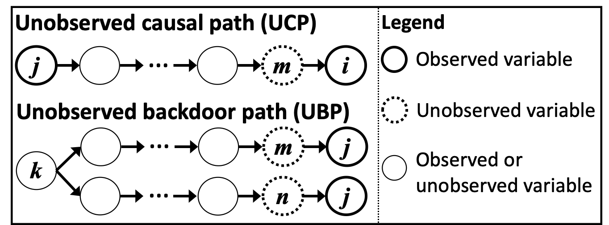
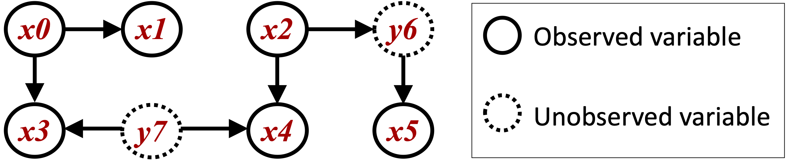

CAM-UV
=====

Model
-------------------
This method CAM-UV (Causal Additive Models with Unobserved Variables) assumes an extension of the basic CAM model [1]_ to include unobserved variables.
This method makes the following assumptions:

#. The effects of direct causes on a variable form generalized additive models (GAMs).
#. The causal structures form directed acyclic graphs (DAGs).

CAM-UV allows the existence of unobserved variables.
It outputs a causal graph where a undirected edge indicates the pair of variables that have an unobserved causal path (UCP) or an unobserved backdoor path (UBP), and a directed edge indicates the causal direction of a pair of variables that do not have an UCP or UBP.

**Definition of UCPs ans UBPs:** As shown in the below figure, a causal path from :math:`x_j` to :math:`x_i` is called an UCP if it ends with the directed edge connecting :math:`x_i` and its unobserved direct cause. A backdoor path between :math:`x_i` and :math:`x_j` is called an UBP if it starts with the edge connecting :math:`x_i` and its unobserved direct cause, and ends with the edge connecting :math:`x_j` and its unobserved direct cause.

References

    .. [1] P. Bühlmann, J. Peters, and J. Ernest.
       CAM: Causal additive models, high-dimensional order search and penalized regression.
       Annals of Statistics, 42(6):2526–2556, 2014.
    .. [2] T. N. Maeda and S. Shimizu. Causal additive models with unobserved variables.
       In Proc. 27th Conference on Uncertainty in Artificial Intelligence (UAI2021), PMLR 161:97-106, 2021.

Import and settings
-------------------

In this example, we need to import ``numpy`` in addition to ``lingam``.

.. code-block:: python

    import numpy as np
    import random
    import lingam

    

Test data
---------

First, we generate a causal structure with 2 unobserved variables (y6 and y7) and 6 observed variables (x0--x5) as shown in the below figure.

.. code-block:: python

    def get_noise(n):
        noise = ((np.random.rand(1, n)-0.5)*5).reshape(n)
        mean = get_random_constant(0.0,2.0)
        noise += mean
        return noise

    def causal_func(cause):
        a = get_random_constant(-5.0,5.0)
        b = get_random_constant(-1.0,1.0)
        c = int(random.uniform(2,3))
        return ((cause+a)**(c))+b

    def get_random_constant(s,b):
        constant = random.uniform(-1.0, 1.0)
        if constant>0:
            constant = random.uniform(s, b)
        else:
            constant = random.uniform(-b, -s)
        return constant

    def create_data(n):
        causal_pairs = [[0,1],[0,3],[2,4]]
        intermediate_pairs = [[2,5]]
        confounder_pairs = [[3,4]]

        n_variables = 6

        data = np.zeros((n, n_variables)) # observed data
        confounders = np.zeros((n, len(confounder_pairs))) # data of unobserced common causes

        # Adding external effects
        for i in range(n_variables):
            data[:,i] = get_noise(n)
        for i in range(len(confounder_pairs)):
            confounders[:,i] = get_noise(n)
            confounders[:,i] = confounders[:,i] / np.std(confounders[:,i])

        # Adding the effects of unobserved common causes
        for i, cpair in enumerate(confounder_pairs):
            cpair = list(cpair)
            cpair.sort()
            data[:,cpair[0]] += causal_func(confounders[:,i])
            data[:,cpair[1]] += causal_func(confounders[:,i])

        for i1 in range(n_variables)[0:n_variables]:
            data[:,i1] = data[:,i1] / np.std(data[:,i1])
            for i2 in range(n_variables)[i1+1:n_variables+1]:
                # Adding direct effects between observed variables
                if [i1, i2] in causal_pairs:
                    data[:,i2] += causal_func(data[:,i1])
                # Adding undirected effects between observed variables mediated through unobserved variables
                if [i1, i2] in intermediate_pairs:
                    interm = causal_func(data[:,i1])+get_noise(n)
                    interm = interm / np.std(interm)
                    data[:,i2] += causal_func(interm)

        return data

    sample_size = 2000
    X = create_data(sample_size)

Causal Discovery
----------------

To run causal discovery, we create a ``CAMUV`` object and call the ``fit``
method.

.. code-block:: python

    model = lingam.CAMUV()
    model.fit(X)

Using the ``adjacency_matrix_`` properties, we can see the adjacency matrix as a result of the causal discovery. When the value of a variable pair is np.nan, the variables have a UCP or UBP.

.. code-block:: python

    model.adjacency_matrix_

.. parsed-literal::

    array([[ 0.,  0.,  0.,  0.,  0.,  0.],
           [ 1.,  0.,  0.,  0.,  0.,  0.],
           [ 0.,  0.,  0.,  0.,  0., nan],
           [ 1.,  0.,  0.,  0., nan,  0.],
           [ 0.,  0.,  1., nan,  0.,  0.],
           [ 0.,  0., nan,  0.,  0.,  0.]])

