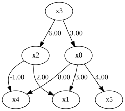
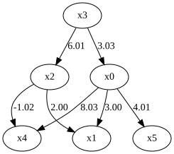
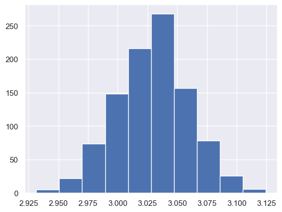

DirectLiNGAM using GPU
======================

Preparing to Use the GPU Version of DirectLiNGAM
------------------------------------------------

.. warning::

   The instructions in this notebook have been validated using our fork
   of **culingam**:

   https://github.com/ikeuchi-screen/culingam

   Please use this repository rather than the original
   ``aknvictor/culingam`` repository.

Before installing the GPU-enabled version of DirectLiNGAM, you must
identify your GPU architecture and configure the appropriate build
environment.

Identify Your GPU Architecture
~~~~~~~~~~~~~~~~~~~~~~~~~~~~~~

The recommended method is to use ``nvidia-smi``.

Recent NVIDIA drivers can report both the GPU name and Compute
Capability directly:

.. code-block:: bash

   nvidia-smi --query-gpu=name,compute_cap --format=csv,noheader

**Example output:**

::

   NVIDIA GeForce RTX 4090, 8.9

- **GPU**: RTX 4090
- **Compute Capability**: 8.9
- **Architecture**: sm_89

If only the GPU model name is available, you can find the corresponding
Compute Capability from `NVIDIA’s official CUDA GPU
list <https://developer.nvidia.com/cuda/gpus>`__.

Linux Installation
~~~~~~~~~~~~~~~~~~

1. Clone the ``culingam`` repository.

.. code-block:: bash

   git clone https://github.com/ikeuchi-screen/culingam
   cd culingam

2. Set the ``CUDA_HOME`` environment variable to your CUDA Toolkit
   installation path.

.. code-block:: bash

   export CUDA_HOME=/usr/local/cuda-12.6

3. Set the ``GPU_ARCH`` environment variable to match your GPU
   architecture.

.. code-block:: bash

   export GPU_ARCH=sm_89

4. Install the package.

.. code-block:: bash

   pip install .

Windows Installation
~~~~~~~~~~~~~~~~~~~~

1. Clone the ``culingam`` repository.

.. code-block:: bat

   git clone https://github.com/ikeuchi-screen/culingam
   cd culingam

2. Set the ``CUDA_HOME`` environment variable to your CUDA Toolkit
   installation path.

.. code-block:: bat

   set CUDA_HOME=C:\Program Files\NVIDIA GPU Computing Toolkit\CUDA\v12.6

3. Set the ``GPU_ARCH`` environment variable to match your GPU
   architecture.

.. code-block:: bat

   set GPU_ARCH=sm_89

4. Install the package. The ``--no-build-isolation`` option is
   recommended because it allows the build process to access the
   CUDA-related environment variables and dependencies available in the
   current Python environment.

.. code-block:: bash

   pip install -v --no-build-isolation .

Import and settings
-------------------

In this example, we need to import ``numpy``, ``pandas``, and
``graphviz`` in addition to ``lingam``.

.. code-block:: python

    import numpy as np
    import pandas as pd
    import graphviz
    import lingam
    from lingam.utils import print_causal_directions, print_dagc, make_dot, evaluate_model_fit
    
    import warnings
    warnings.filterwarnings("ignore")
    
    print([np.__version__, pd.__version__, graphviz.__version__, lingam.__version__])
    
    np.set_printoptions(precision=3, suppress=True)
    np.random.seed(42)

.. parsed-literal::

    ['1.26.4', '2.2.3', '0.20.3', '1.13.0']
    

Test data
---------

We create test data consisting of 6 variables.

.. code-block:: python

    x3 = np.random.uniform(size=1000)
    x0 = 3.0*x3 + np.random.uniform(size=1000)
    x2 = 6.0*x3 + np.random.uniform(size=1000)
    x1 = 3.0*x0 + 2.0*x2 + np.random.uniform(size=1000)
    x5 = 4.0*x0 + np.random.uniform(size=1000)
    x4 = 8.0*x0 - 1.0*x2 + np.random.uniform(size=1000)
    X = pd.DataFrame(np.array([x0, x1, x2, x3, x4, x5]).T ,columns=['x0', 'x1', 'x2', 'x3', 'x4', 'x5'])
    X.head()

.. raw:: html

    

    
    <table border="1" class="dataframe">
      <thead>
        <tr style="text-align: right;">
          <th></th>
          <th>x0</th>
          <th>x1</th>
          <th>x2</th>
          <th>x3</th>
          <th>x4</th>
          <th>x5</th>
        </tr>
      </thead>
      <tbody>
        <tr>
          <th>0</th>
          <td>1.308753</td>
          <td>9.616856</td>
          <td>2.508946</td>
          <td>0.374540</td>
          <td>8.354715</td>
          <td>5.807009</td>
        </tr>
        <tr>
          <th>1</th>
          <td>3.394044</td>
          <td>22.881342</td>
          <td>5.951265</td>
          <td>0.950714</td>
          <td>21.674522</td>
          <td>14.381608</td>
        </tr>
        <tr>
          <th>2</th>
          <td>3.068928</td>
          <td>20.053687</td>
          <td>5.298218</td>
          <td>0.731994</td>
          <td>20.107750</td>
          <td>13.035872</td>
        </tr>
        <tr>
          <th>3</th>
          <td>2.528200</td>
          <td>15.892469</td>
          <td>3.841497</td>
          <td>0.598658</td>
          <td>16.724110</td>
          <td>10.266701</td>
        </tr>
        <tr>
          <th>4</th>
          <td>1.274617</td>
          <td>6.811720</td>
          <td>1.208062</td>
          <td>0.156019</td>
          <td>9.858525</td>
          <td>5.247718</td>
        </tr>
      </tbody>
    </table>
    

     

.. code-block:: python

    m = np.array([[0.0, 0.0, 0.0, 3.0, 0.0, 0.0],
                  [3.0, 0.0, 2.0, 0.0, 0.0, 0.0],
                  [0.0, 0.0, 0.0, 6.0, 0.0, 0.0],
                  [0.0, 0.0, 0.0, 0.0, 0.0, 0.0],
                  [8.0, 0.0,-1.0, 0.0, 0.0, 0.0],
                  [4.0, 0.0, 0.0, 0.0, 0.0, 0.0]])
    
    dot = make_dot(m)
    
    # Save pdf
    dot.render('dag')
    
    # Save png
    dot.format = 'png'
    dot.render('dag')
    
    dot

Causal Discovery using GPU
--------------------------

To run causal discovery, we create a ``DirectLiNGAM`` object and call
the ``fit`` method.

**When using GPU acceleration,** instantiate the model with the option
``measure='pwling_fast'``.

.. code-block:: python

    model = lingam.DirectLiNGAM(measure='pwling_fast')
    model.fit(X)

.. parsed-literal::

    <lingam.direct_lingam.DirectLiNGAM at 0x268aea5c500>

Using the ``causal_order_`` properties, we can see the causal ordering
as a result of the causal discovery.

.. code-block:: python

    model.causal_order_

.. parsed-literal::

    [3, 2, 0, 4, 5, 1]

Also, using the ``adjacency_matrix_`` properties, we can see the
adjacency matrix as a result of the causal discovery.

.. code-block:: python

    model.adjacency_matrix_

.. parsed-literal::

    array([[ 0.   ,  0.   ,  0.   ,  3.029,  0.   ,  0.   ],
           [ 2.999,  0.   ,  1.995,  0.   ,  0.   ,  0.   ],
           [ 0.   ,  0.   ,  0.   ,  6.014,  0.   ,  0.   ],
           [ 0.   ,  0.   ,  0.   ,  0.   ,  0.   ,  0.   ],
           [ 8.03 ,  0.   , -1.025,  0.   ,  0.   ,  0.   ],
           [ 4.013,  0.   ,  0.   ,  0.   ,  0.   ,  0.   ]])

We can draw a causal graph by utility funciton.

.. code-block:: python

    make_dot(model.adjacency_matrix_)

Independence between error variables
------------------------------------

To check if the LiNGAM assumption is broken, we can get p-values of
independence between error variables. The value in the i-th row and j-th
column of the obtained matrix shows the p-value of the independence of
the error variables :math:`e_i` and :math:`e_j`.

.. code-block:: python

    p_values = model.get_error_independence_p_values(X)
    print(p_values)

.. parsed-literal::

    [[0.    0.76  0.377 0.672 0.446 0.087]
     [0.76  0.    0.792 0.423 0.253 0.15 ]
     [0.377 0.792 0.    0.941 0.477 0.445]
     [0.672 0.423 0.941 0.    0.369 0.529]
     [0.446 0.253 0.477 0.369 0.    0.545]
     [0.087 0.15  0.445 0.529 0.545 0.   ]]
    

.. code-block:: python

    evaluate_model_fit(model.adjacency_matrix_, X)

.. raw:: html

    

    
    <table border="1" class="dataframe">
      <thead>
        <tr style="text-align: right;">
          <th></th>
          <th>DoF</th>
          <th>DoF Baseline</th>
          <th>chi2</th>
          <th>chi2 p-value</th>
          <th>chi2 Baseline</th>
          <th>CFI</th>
          <th>GFI</th>
          <th>AGFI</th>
          <th>NFI</th>
          <th>TLI</th>
          <th>RMSEA</th>
          <th>AIC</th>
          <th>BIC</th>
          <th>LogLik</th>
        </tr>
      </thead>
      <tbody>
        <tr>
          <th>Value</th>
          <td>9</td>
          <td>16</td>
          <td>7.581943</td>
          <td>0.576761</td>
          <td>23272.542135</td>
          <td>1.000061</td>
          <td>0.999674</td>
          <td>0.999421</td>
          <td>0.999674</td>
          <td>1.000108</td>
          <td>0</td>
          <td>23.984836</td>
          <td>82.877899</td>
          <td>0.007582</td>
        </tr>
      </tbody>
    </table>
    

     

Bootstrapping using GPU
-----------------------

We call ``bootstrap()`` method instead of ``fit()``. Here, the second
argument specifies the number of bootstrap sampling.

**When using GPU acceleration,** instantiate the model with the option
``measure='pwling_fast'``.

.. code-block:: python

    n_samples = 1000
    
    model = lingam.DirectLiNGAM(measure='pwling_fast')
    result = model.bootstrap(X, n_sampling=n_samples)

Causal Directions
-----------------

Since ``BootstrapResult`` object is returned, we can get the ranking of
the causal directions extracted by ``get_causal_direction_counts()``
method. In the following sample code, ``n_directions`` option is limited
to the causal directions of the top 8 rankings, and
``min_causal_effect`` option is limited to causal directions with a
coefficient of 0.01 or more.

.. code-block:: python

    cdc = result.get_causal_direction_counts(n_directions=8, min_causal_effect=0.01, split_by_causal_effect_sign=True)

We can check the result by utility function.

.. code-block:: python

    print_causal_directions(cdc, n_samples)

.. parsed-literal::

    x5 <--- x0 (b>0) (100.0%)
    x1 <--- x0 (b>0) (100.0%)
    x1 <--- x2 (b>0) (100.0%)
    x2 <--- x3 (b>0) (99.7%)
    x4 <--- x2 (b<0) (98.4%)
    x0 <--- x3 (b>0) (97.6%)
    x4 <--- x0 (b>0) (97.4%)
    x1 <--- x5 (b<0) (10.9%)
    

Directed Acyclic Graphs
-----------------------

Also, using the ``get_directed_acyclic_graph_counts()`` method, we can
get the ranking of the DAGs extracted. In the following sample code,
``n_dags`` option is limited to the dags of the top 3 rankings, and
``min_causal_effect`` option is limited to causal directions with a
coefficient of 0.01 or more.

.. code-block:: python

    dagc = result.get_directed_acyclic_graph_counts(n_dags=3, min_causal_effect=0.01, split_by_causal_effect_sign=True)

We can check the result by utility function.

.. code-block:: python

    print_dagc(dagc, n_samples)

.. parsed-literal::

    DAG[0]: 67.8%
    	x0 <--- x3 (b>0)
    	x1 <--- x0 (b>0)
    	x1 <--- x2 (b>0)
    	x2 <--- x3 (b>0)
    	x4 <--- x0 (b>0)
    	x4 <--- x2 (b<0)
    	x5 <--- x0 (b>0)
    DAG[1]: 7.7%
    	x0 <--- x3 (b>0)
    	x1 <--- x0 (b>0)
    	x1 <--- x2 (b>0)
    	x1 <--- x5 (b<0)
    	x2 <--- x3 (b>0)
    	x4 <--- x0 (b>0)
    	x4 <--- x2 (b<0)
    	x5 <--- x0 (b>0)
    DAG[2]: 4.2%
    	x0 <--- x3 (b>0)
    	x1 <--- x0 (b>0)
    	x1 <--- x2 (b>0)
    	x2 <--- x3 (b>0)
    	x4 <--- x0 (b>0)
    	x4 <--- x2 (b<0)
    	x4 <--- x5 (b<0)
    	x5 <--- x0 (b>0)
    

Probability
-----------

Using the ``get_probabilities()`` method, we can get the probability of
bootstrapping.

.. code-block:: python

    prob = result.get_probabilities(min_causal_effect=0.01)
    print(prob)

.. parsed-literal::

    [[0.    0.    0.057 0.976 0.026 0.   ]
     [1.    0.    1.    0.008 0.065 0.109]
     [0.008 0.    0.    0.997 0.003 0.   ]
     [0.    0.    0.003 0.    0.    0.   ]
     [0.974 0.008 0.984 0.036 0.    0.058]
     [1.    0.002 0.046 0.011 0.036 0.   ]]
    

Total Causal Effects
--------------------

Using the ``get_total_causal_effects()`` method, we can get the list of
total causal effect. The total causal effects we can get are dictionary
type variable. We can display the list nicely by assigning it to
pandas.DataFrame. Also, we have replaced the variable index with a label
below.

.. code-block:: python

    causal_effects = result.get_total_causal_effects(min_causal_effect=0.01)
    
    # Assign to pandas.DataFrame for pretty display
    df = pd.DataFrame(causal_effects)
    labels = [f'x{i}' for i in range(X.shape[1])]
    df['from'] = df['from'].apply(lambda x : labels[x])
    df['to'] = df['to'].apply(lambda x : labels[x])
    df

.. raw:: html

    

    
    <table border="1" class="dataframe">
      <thead>
        <tr style="text-align: right;">
          <th></th>
          <th>from</th>
          <th>to</th>
          <th>effect</th>
          <th>probability</th>
        </tr>
      </thead>
      <tbody>
        <tr>
          <th>0</th>
          <td>x3</td>
          <td>x0</td>
          <td>3.030269</td>
          <td>1.000</td>
        </tr>
        <tr>
          <th>1</th>
          <td>x0</td>
          <td>x1</td>
          <td>3.001860</td>
          <td>1.000</td>
        </tr>
        <tr>
          <th>2</th>
          <td>x2</td>
          <td>x1</td>
          <td>1.995733</td>
          <td>1.000</td>
        </tr>
        <tr>
          <th>3</th>
          <td>x3</td>
          <td>x1</td>
          <td>21.090294</td>
          <td>1.000</td>
        </tr>
        <tr>
          <th>4</th>
          <td>x0</td>
          <td>x5</td>
          <td>4.013368</td>
          <td>1.000</td>
        </tr>
        <tr>
          <th>5</th>
          <td>x3</td>
          <td>x5</td>
          <td>12.157223</td>
          <td>1.000</td>
        </tr>
        <tr>
          <th>6</th>
          <td>x3</td>
          <td>x4</td>
          <td>18.171285</td>
          <td>1.000</td>
        </tr>
        <tr>
          <th>7</th>
          <td>x3</td>
          <td>x2</td>
          <td>6.014649</td>
          <td>0.997</td>
        </tr>
        <tr>
          <th>8</th>
          <td>x2</td>
          <td>x4</td>
          <td>-1.025236</td>
          <td>0.984</td>
        </tr>
        <tr>
          <th>9</th>
          <td>x0</td>
          <td>x4</td>
          <td>8.032282</td>
          <td>0.974</td>
        </tr>
        <tr>
          <th>10</th>
          <td>x2</td>
          <td>x5</td>
          <td>0.089743</td>
          <td>0.109</td>
        </tr>
        <tr>
          <th>11</th>
          <td>x5</td>
          <td>x1</td>
          <td>-0.096742</td>
          <td>0.109</td>
        </tr>
        <tr>
          <th>12</th>
          <td>x4</td>
          <td>x1</td>
          <td>0.098537</td>
          <td>0.093</td>
        </tr>
        <tr>
          <th>13</th>
          <td>x4</td>
          <td>x5</td>
          <td>-0.055553</td>
          <td>0.060</td>
        </tr>
        <tr>
          <th>14</th>
          <td>x5</td>
          <td>x4</td>
          <td>-0.095708</td>
          <td>0.058</td>
        </tr>
        <tr>
          <th>15</th>
          <td>x2</td>
          <td>x0</td>
          <td>0.095348</td>
          <td>0.058</td>
        </tr>
        <tr>
          <th>16</th>
          <td>x4</td>
          <td>x0</td>
          <td>0.123473</td>
          <td>0.026</td>
        </tr>
        <tr>
          <th>17</th>
          <td>x0</td>
          <td>x2</td>
          <td>0.092491</td>
          <td>0.008</td>
        </tr>
        <tr>
          <th>18</th>
          <td>x1</td>
          <td>x4</td>
          <td>0.094129</td>
          <td>0.008</td>
        </tr>
        <tr>
          <th>19</th>
          <td>x2</td>
          <td>x3</td>
          <td>0.163980</td>
          <td>0.003</td>
        </tr>
        <tr>
          <th>20</th>
          <td>x4</td>
          <td>x2</td>
          <td>-0.012233</td>
          <td>0.003</td>
        </tr>
        <tr>
          <th>21</th>
          <td>x1</td>
          <td>x5</td>
          <td>-0.090495</td>
          <td>0.002</td>
        </tr>
      </tbody>
    </table>
    

     

We can easily perform sorting operations with pandas.DataFrame.

.. code-block:: python

    df.sort_values('effect', ascending=False).head()

.. raw:: html

    

    
    <table border="1" class="dataframe">
      <thead>
        <tr style="text-align: right;">
          <th></th>
          <th>from</th>
          <th>to</th>
          <th>effect</th>
          <th>probability</th>
        </tr>
      </thead>
      <tbody>
        <tr>
          <th>3</th>
          <td>x3</td>
          <td>x1</td>
          <td>21.090294</td>
          <td>1.000</td>
        </tr>
        <tr>
          <th>6</th>
          <td>x3</td>
          <td>x4</td>
          <td>18.171285</td>
          <td>1.000</td>
        </tr>
        <tr>
          <th>5</th>
          <td>x3</td>
          <td>x5</td>
          <td>12.157223</td>
          <td>1.000</td>
        </tr>
        <tr>
          <th>9</th>
          <td>x0</td>
          <td>x4</td>
          <td>8.032282</td>
          <td>0.974</td>
        </tr>
        <tr>
          <th>7</th>
          <td>x3</td>
          <td>x2</td>
          <td>6.014649</td>
          <td>0.997</td>
        </tr>
      </tbody>
    </table>
    

     

.. code-block:: python

    df.sort_values('probability', ascending=True).head()

.. raw:: html

    

    
    <table border="1" class="dataframe">
      <thead>
        <tr style="text-align: right;">
          <th></th>
          <th>from</th>
          <th>to</th>
          <th>effect</th>
          <th>probability</th>
        </tr>
      </thead>
      <tbody>
        <tr>
          <th>21</th>
          <td>x1</td>
          <td>x5</td>
          <td>-0.090495</td>
          <td>0.002</td>
        </tr>
        <tr>
          <th>19</th>
          <td>x2</td>
          <td>x3</td>
          <td>0.163980</td>
          <td>0.003</td>
        </tr>
        <tr>
          <th>20</th>
          <td>x4</td>
          <td>x2</td>
          <td>-0.012233</td>
          <td>0.003</td>
        </tr>
        <tr>
          <th>18</th>
          <td>x1</td>
          <td>x4</td>
          <td>0.094129</td>
          <td>0.008</td>
        </tr>
        <tr>
          <th>17</th>
          <td>x0</td>
          <td>x2</td>
          <td>0.092491</td>
          <td>0.008</td>
        </tr>
      </tbody>
    </table>
    

     

And with pandas.DataFrame, we can easily filter by keywords. The
following code extracts the causal direction towards x1.

.. code-block:: python

    df[df['to']=='x1'].head()

.. raw:: html

    

    
    <table border="1" class="dataframe">
      <thead>
        <tr style="text-align: right;">
          <th></th>
          <th>from</th>
          <th>to</th>
          <th>effect</th>
          <th>probability</th>
        </tr>
      </thead>
      <tbody>
        <tr>
          <th>1</th>
          <td>x0</td>
          <td>x1</td>
          <td>3.001860</td>
          <td>1.000</td>
        </tr>
        <tr>
          <th>2</th>
          <td>x2</td>
          <td>x1</td>
          <td>1.995733</td>
          <td>1.000</td>
        </tr>
        <tr>
          <th>3</th>
          <td>x3</td>
          <td>x1</td>
          <td>21.090294</td>
          <td>1.000</td>
        </tr>
        <tr>
          <th>11</th>
          <td>x5</td>
          <td>x1</td>
          <td>-0.096742</td>
          <td>0.109</td>
        </tr>
        <tr>
          <th>12</th>
          <td>x4</td>
          <td>x1</td>
          <td>0.098537</td>
          <td>0.093</td>
        </tr>
      </tbody>
    </table>
    

     

Because it holds the raw data of the total causal effect (the original
data for calculating the median), it is possible to draw a histogram of
the values of the causal effect, as shown below.

.. code-block:: python

    import matplotlib.pyplot as plt
    import seaborn as sns
    sns.set()
    %matplotlib inline
    
    from_index = 3 # index of x3
    to_index = 0 # index of x0
    plt.hist(result.total_effects_[:, to_index, from_index])

.. parsed-literal::

    (array([  5.,  22.,  74., 148., 216., 268., 157.,  78.,  26.,   6.]),
     array([2.931, 2.951, 2.97 , 2.989, 3.009, 3.028, 3.047, 3.067, 3.086,
            3.105, 3.124]),
     <BarContainer object of 10 artists>)

Bootstrap Probability of Path
-----------------------------

Using the ``get_paths()`` method, we can explore all paths from any
variable to any variable and calculate the bootstrap probability for
each path. The path will be output as an array of variable indices. For
example, the array ``[3, 0, 1]`` shows the path from variable X3 through
variable X0 to variable X1.

.. code-block:: python

    from_index = 3 # index of x3
    to_index = 1 # index of x1
    
    pd.DataFrame(result.get_paths(from_index, to_index))

.. raw:: html

    

    
    <table border="1" class="dataframe">
      <thead>
        <tr style="text-align: right;">
          <th></th>
          <th>path</th>
          <th>effect</th>
          <th>probability</th>
        </tr>
      </thead>
      <tbody>
        <tr>
          <th>0</th>
          <td>[3, 2, 1]</td>
          <td>12.008340</td>
          <td>0.997</td>
        </tr>
        <tr>
          <th>1</th>
          <td>[3, 0, 1]</td>
          <td>9.087017</td>
          <td>0.976</td>
        </tr>
        <tr>
          <th>2</th>
          <td>[3, 0, 5, 1]</td>
          <td>-1.191347</td>
          <td>0.108</td>
        </tr>
        <tr>
          <th>3</th>
          <td>[3, 0, 4, 1]</td>
          <td>2.306179</td>
          <td>0.064</td>
        </tr>
        <tr>
          <th>4</th>
          <td>[3, 2, 4, 1]</td>
          <td>-0.577927</td>
          <td>0.064</td>
        </tr>
        <tr>
          <th>5</th>
          <td>[3, 2, 0, 1]</td>
          <td>1.883982</td>
          <td>0.057</td>
        </tr>
        <tr>
          <th>6</th>
          <td>[3, 4, 0, 1]</td>
          <td>6.864029</td>
          <td>0.026</td>
        </tr>
        <tr>
          <th>7</th>
          <td>[3, 2, 4, 0, 1]</td>
          <td>-1.903159</td>
          <td>0.010</td>
        </tr>
        <tr>
          <th>8</th>
          <td>[3, 1]</td>
          <td>0.592553</td>
          <td>0.008</td>
        </tr>
        <tr>
          <th>9</th>
          <td>[3, 0, 2, 1]</td>
          <td>0.568672</td>
          <td>0.008</td>
        </tr>
        <tr>
          <th>10</th>
          <td>[3, 0, 4, 5, 1]</td>
          <td>0.256110</td>
          <td>0.007</td>
        </tr>
        <tr>
          <th>11</th>
          <td>[3, 2, 4, 5, 1]</td>
          <td>-0.064143</td>
          <td>0.007</td>
        </tr>
        <tr>
          <th>12</th>
          <td>[3, 2, 5, 1]</td>
          <td>0.083223</td>
          <td>0.006</td>
        </tr>
        <tr>
          <th>13</th>
          <td>[3, 4, 2, 0, 1]</td>
          <td>-0.078440</td>
          <td>0.003</td>
        </tr>
        <tr>
          <th>14</th>
          <td>[3, 2, 0, 5, 1]</td>
          <td>-0.204375</td>
          <td>0.003</td>
        </tr>
        <tr>
          <th>15</th>
          <td>[3, 4, 2, 1]</td>
          <td>-0.444512</td>
          <td>0.003</td>
        </tr>
        <tr>
          <th>16</th>
          <td>[3, 4, 1]</td>
          <td>0.700691</td>
          <td>0.002</td>
        </tr>
        <tr>
          <th>17</th>
          <td>[3, 0, 2, 4, 1]</td>
          <td>-0.029277</td>
          <td>0.002</td>
        </tr>
        <tr>
          <th>18</th>
          <td>[3, 2, 0, 4, 1]</td>
          <td>0.332604</td>
          <td>0.002</td>
        </tr>
        <tr>
          <th>19</th>
          <td>[3, 0, 5, 4, 1]</td>
          <td>-0.102309</td>
          <td>0.002</td>
        </tr>
        <tr>
          <th>20</th>
          <td>[3, 4, 0, 5, 1]</td>
          <td>-1.181309</td>
          <td>0.001</td>
        </tr>
        <tr>
          <th>21</th>
          <td>[3, 2, 4, 0, 5, 1]</td>
          <td>0.260121</td>
          <td>0.001</td>
        </tr>
        <tr>
          <th>22</th>
          <td>[3, 5, 1]</td>
          <td>0.059515</td>
          <td>0.001</td>
        </tr>
      </tbody>
    </table>
    

     

