Draw Causal Graph
=================

Import and settings
-------------------

In this example, we need to import ``numpy``, ``pandas``, and
``graphviz`` in addition to ``lingam``. And to draw the causal graph, we
need to import ``make_dot`` method from ``lingam.utils``.

.. code-block:: python

    import numpy as np
    import pandas as pd
    import graphviz
    import lingam
    from lingam.utils import make_dot
    
    print([np.__version__, pd.__version__, graphviz.__version__, lingam.__version__])
    
    np.set_printoptions(precision=3, suppress=True)
    np.random.seed(0)

.. parsed-literal::

    ['1.16.2', '0.24.2', '0.11.1', '1.3.1']
    

Draw the result of LiNGAM
-------------------------

First, we can draw a simple graph that is the result of LiNGAM.

.. code-block:: python

    x3 = np.random.uniform(size=10000)
    x0 = 3.0*x3 + np.random.uniform(size=10000)
    x2 = 6.0*x3 + np.random.uniform(size=10000)
    x1 = 3.0*x0 + 2.0*x2 + np.random.uniform(size=10000)
    x5 = 4.0*x0 + np.random.uniform(size=10000)
    x4 = 8.0*x0 - 1.0*x2 + np.random.uniform(size=10000)
    X = pd.DataFrame(np.array([x0, x1, x2, x3, x4, x5]).T ,columns=['x0', 'x1', 'x2', 'x3', 'x4', 'x5'])
    
    model = lingam.DirectLiNGAM()
    model.fit(X)
    make_dot(model.adjacency_matrix_)

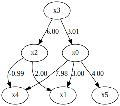

If we want to change the variable name, we can use ``labels``.

.. code-block:: python

    labels = [f'var{i}' for i in range(X.shape[1])]
    make_dot(model.adjacency_matrix_, labels=labels)

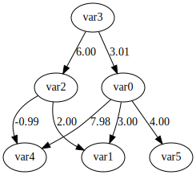

Save graph
----------

The created dot data can be saved as an image file in addition to being
displayed in Jupyter Notebook.

.. code-block:: python

    dot = make_dot(model.adjacency_matrix_, labels=labels)
    
    # Save pdf
    dot.render('dag')
    
    # Save png
    dot.format = 'png'
    dot.render('dag')

.. parsed-literal::

    'dag.png'

Draw the result of LiNGAM with prediction model
-----------------------------------------------

For example, we create a linear regression model with x0 as the target
variable.

.. code-block:: python

    from sklearn.linear_model import LinearRegression
    
    target = 0
    features = [i for i in range(X.shape[1]) if i != target]
    reg = LinearRegression()
    
    reg.fit(X.iloc[:, features], X.iloc[:, target])

.. parsed-literal::

    LinearRegression(copy_X=True, fit_intercept=True, n_jobs=None,
             normalize=False)

By specify ``prediction_feature_indices`` and ``prediction_coefs`` that
can be obtained from the prediction model, we can draw the prediction
model with the causal structure.

.. code-block:: python

    make_dot(model.adjacency_matrix_, prediction_feature_indices=features, prediction_coefs=reg.coef_)

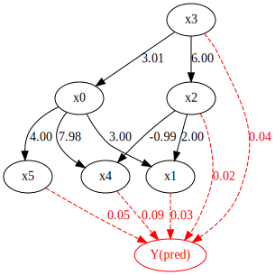

Also, we can change the label of the target variable by
``prediction_target_label``, omit the coefficient of prediction model
without ``prediction_coefs``, and change the color by
``prediction_line_color``.

.. code-block:: python

    make_dot(model.adjacency_matrix_, prediction_feature_indices=features, prediction_target_label='Target', prediction_line_color='#0000FF')

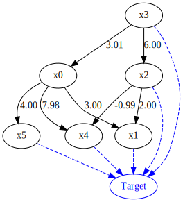

In addition to the above, we can use ``prediction_feature_importance``
to draw the importance of the prediction model as an edge label.

.. code-block:: python

    import lightgbm as lgb
    
    target = 0
    features = [i for i in range(X.shape[1]) if i != target]
    reg = lgb.LGBMRegressor(random_state=0)
    reg.fit(X.iloc[:, features], X.iloc[:, target])
    reg.feature_importances_

.. parsed-literal::

    array([619, 205, 310, 957, 909])

.. code-block:: python

    make_dot(model.adjacency_matrix_, prediction_feature_indices=features, prediction_feature_importance=reg.feature_importances_)

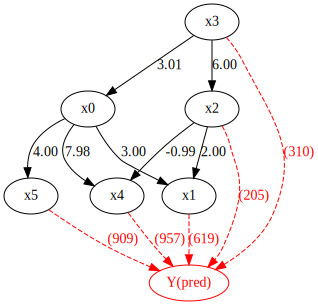

Highlight paths between specified nodes
---------------------------------------

make_dot highlights the path specified by the path argument.

.. code-block:: python

    make_dot(model.adjacency_matrix_, path=(3, 1))

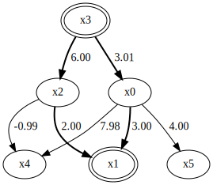

If detect_cycles is True, simple cycles are displayed with a dashed edge.

.. code-block:: python

    result = model.adjacency_matrix_.copy()
    result[0, 1] = 100
    result[3, 1] = 100
    
    make_dot(result, path=(3, 1), path_color="red", detect_cycle=True)

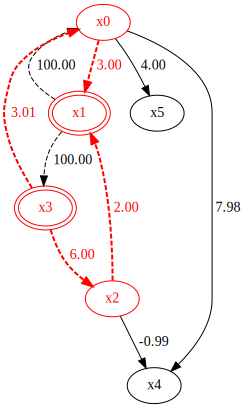

Draw the result of LiNGAM with emphasis on descendants and ancestors
--------------------------------------------------------------------

``make_dot_highlight`` highlights descendants or ancestors of the graph.

The first argument is the result and the second argument is the index of the target variable. There are four types of cluster names: target, ancestor, descendant, and others. target contains only the node specified in the second argument. Nodes that are ancestors or descendants of target belong to ancestor or descendant. The number appended to the cluster name is the distance from target. Other nodes belong to others.

.. code-block:: python

    make_dot_highlight(model.adjacency_matrix_, 0)

It is also possible to disable the display of clusters of ancestors and descendants.

.. code-block:: python

    make_dot_highlight(model.adjacency_matrix_, 0, max_dsc=0, max_anc=None)

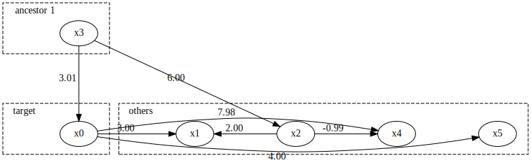

It is also possible to suppress the display of the others cluster.

.. code-block:: python

    make_dot_highlight(model.adjacency_matrix_, 0, max_dsc=0, max_anc=None, draw_others=False)

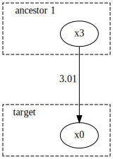

Draw the result of Bootstrap with emphasis on descendants and ancestors
-----------------------------------------------------------------------

It is possible to visualize results that include the cyclic portion, such as the result of a bootstrap.

.. code-block:: python

    result = model.bootstrap(X, n_sampling=100)

.. code-block:: python

    median = np.median(result.adjacency_matrices_, axis=0)
    make_dot(median, lower_limit=0)

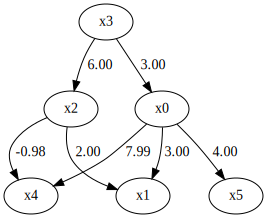

Applying ``make_dot_highlight`` to this graph draws the following graph. Dashed edges indicate simple cycles.

.. code-block:: python

    make_dot_highlight(median, 0, detect_cycle=True)

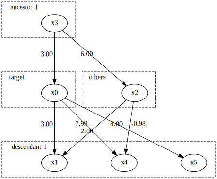

You can reduce the edges by setting lower_limit.

.. code-block:: python

    make_dot_highlight(median, 0, detect_cycle=True, lower_limit=0.1)

You can also set the color map and the spacing of the nodes.

.. code-block:: python

    make_dot_highlight(median, 0, lower_limit=0.001, cmap="cool", vmargin=3, hmargin=3)

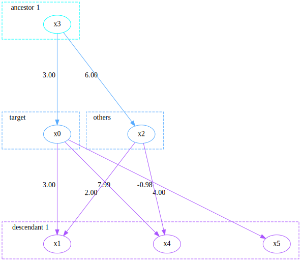

