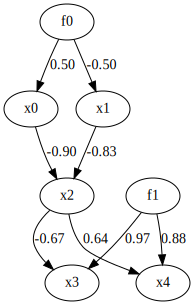

Finding ancestors of each variable
==================================

By using ``utils.extract_ancestors``, which implements Algorithm 1 of RCD method [1]_, we can extract the ancestors of variables.
Since RCD allows for the existence of unobserved common causes, we can search for ancestors even when there are unobserved common causes, as in the following example.

References

    .. [1] T. N. Maeda and S. Shimizu. RCD: Repetitive causal discovery of linear non-Gaussian acyclic models with latent confounders. 
      In Proc. 23rd International Conference on Artificial Intelligence and Statistics (AISTATS2020), Palermo, Sicily, Italy. PMLR 108:735-745, 2020.

Import and settings
-------------------

.. code-block:: python

	import random

	import numpy as np
	import pandas as pd

	from sklearn.utils import check_array
	from lingam.utils import make_dot, extract_ancestors

Test data
---------

.. code-block:: python

	def get_coef():
	    coef = random.random()
	    return coef if coef >= 0.5 else coef - 1.0
	get_external_effect = lambda n: np.random.normal(0.0, 0.5, n) ** 3

	B = np.array([[       0.0,        0.0,        0.0,        0.0,        0.0, get_coef(),        0.0],
	              [       0.0,        0.0,        0.0,        0.0,        0.0, get_coef(),        0.0],
	              [get_coef(), get_coef(),        0.0,        0.0,        0.0,        0.0,        0.0],
	              [       0.0,        0.0, get_coef(),        0.0,        0.0,        0.0, get_coef()],
	              [       0.0,        0.0, get_coef(),        0.0,        0.0,        0.0, get_coef()],
	              [       0.0,        0.0,        0.0,        0.0,        0.0,        0.0,        0.0],
	              [       0.0,        0.0,        0.0,        0.0,        0.0,        0.0,        0.0]])

	samples = 500
	f0 = get_external_effect(samples)
	f1 = get_external_effect(samples)
	x0 = f0 * B[0, 5] + get_external_effect(samples)
	x1 = f0 * B[1, 5] + get_external_effect(samples)
	x2 = x0 * B[2, 0] + x1 * B[2, 1] + get_external_effect(samples)
	x3 = x2 * B[3, 2] + f1 * B[3, 6] + get_external_effect(samples)
	x4 = x2 * B[4, 2] + f1 * B[4, 6] + get_external_effect(samples)

	# f0 and f1 are latent confounders
	X = pd.DataFrame(np.array([x0, x1, x2, x3, x4]).T ,columns=['x0', 'x1', 'x2', 'x3', 'x4'])

	make_dot(B, labels=['x0', 'x1', 'x2', 'x3', 'x4', 'f0', 'f1'])

Extract the ancestors of each observed variable
-----------------------------------------------

.. code-block:: python

	M = extract_ancestors(X)

	for i in range(X.shape[1]):
	    if len(M[i]) == 0:
	        print(f'x{i} has no ancestors.')
	    else:
	        print(f'The ancestors of x{i} are ' + ', '.join([f'x{n}' for n in M[i]]))

.. parsed-literal::

    x0 has no ancestors.
    x1 has no ancestors.
    The ancestors of x2 are x0, x1
    The ancestors of x3 are x0, x1, x2
    The ancestors of x4 are x0, x1, x2

