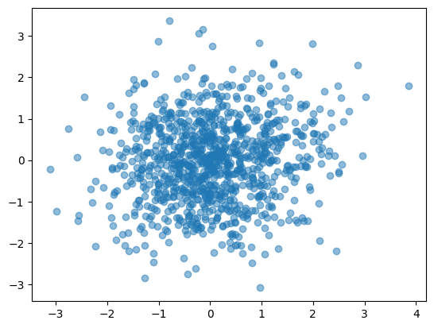
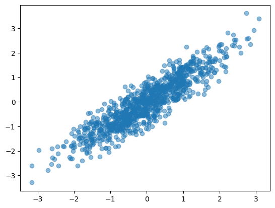
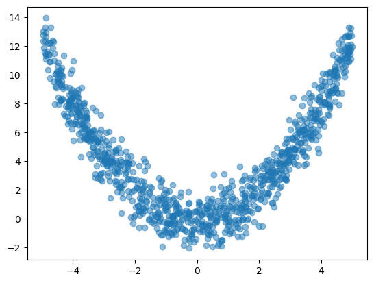
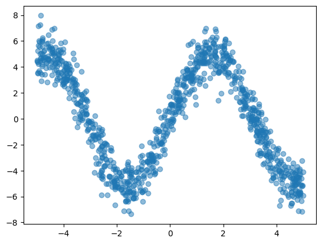

F-correlation
=============

By using ``utils.f_correlation``, which implements the F-correlation [1]_, we can compute the nonlinear correlation between two variables.

References

    .. [1] Bach, Francis R., and Michael I. Jordan. "Kernel independent component analysis." Journal of machine learning research 3.Jul (2002): 1-48.

Import and settings
-------------------

.. code-block:: python

    import numpy as np
    import matplotlib.pyplot as plt
    from lingam.utils import f_correlation

Test data
---------

.. code-block:: python

    def linear_data(n, r):
        a = np.random.randn(n)
        e1 = np.random.randn(n)
        e2 = np.random.randn(n)
        if r < 0:
            r = -r
            x = -np.sqrt(r)*a - np.sqrt(1-r)*e1
        else:
            x = np.sqrt(r)*a + np.sqrt(1-r)*e1
        y = np.sqrt(r)*a + np.sqrt(1-r)*e2
        return x, y

    def x2_data(n):
        x = np.random.uniform(-5, 5, n)
        e = np.random.randn(n)
        y = 0.5 * (x ** 2) + e
        return x, y

    def sin_data(n):
        e = np.random.randn(n)
        x = np.random.uniform(-5, 5, n)
        y = 5 * np.sin(x) + e
        return x, y

Linear correlated data (Uncorrelated)
-------------------------------------

.. code-block:: python

    x, y = linear_data(1000, 0.1)
    corr = np.corrcoef(x, y)[0, 1]
    print(f"Pearson's correlation coefficient= {corr:.3f}")

    corr = f_correlation(x, y)
    print(f'F-correlation= {corr:.3f}')

    plt.scatter(x, y, alpha=0.5)
    plt.show()

.. parsed-literal::

    Pearson's correlation coefficient= 0.126
    F-correlation= 0.120
    

Linear correlated data (Strongly correlated)
--------------------------------------------

.. code-block:: python

    x, y = linear_data(1000, 0.9)
    corr = np.corrcoef(x, y)[0, 1]
    print(f"Pearson's correlation coefficient= {corr:.3f}")

    corr = f_correlation(x, y)
    print(f'F-correlation= {corr:.3f}')

    plt.scatter(x, y, alpha=0.5)
    plt.show()

.. parsed-literal::

    Pearson's correlation coefficient= 0.907
    F-correlation= 0.814
    

  

Non-linear correlated data (Quadratic function)
-----------------------------------------------

.. code-block:: python

    x, y = x2_data(1000)
    corr = np.corrcoef(x, y)[0, 1]
    print(f"Pearson's correlation coefficient= {corr:.3f}")

    corr = f_correlation(x, y)
    print(f'F-correlation= {corr:.3f}')

    plt.scatter(x, y, alpha=0.5)
    plt.show()

    Pearson's correlation coefficient= 0.037
    F-correlation= 0.848

Non-linear correlated data (Sin function)
-----------------------------------------

.. code-block:: python

    x, y = sin_data(1000)
    corr = np.corrcoef(x, y)[0, 1]
    print(f"Pearson's correlation coefficient= {corr:.3f}")

    corr = f_correlation(x, y)
    print(f'F-correlation= {corr:.3f}')

    plt.scatter(x, y, alpha=0.5)
    plt.show()

.. parsed-literal::

    Pearson's correlation coefficient= -0.275
    F-correlation= 0.853
    

    
