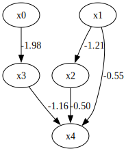
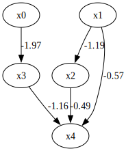
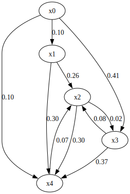
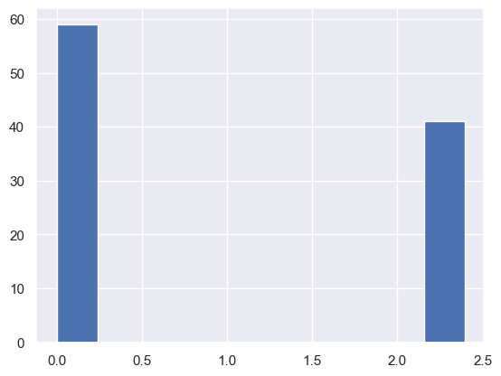

GroupLiNGAM
===========

Model
-------------------
This method GroupLiNGAM (Group Linear Non-Gaussian Acyclic Model) [2]_ assumes an extension of the basic LiNGAM model [1]_ to a more general class of models, which can include latent confounding structures and grouped variable interactions.
Similarly to the basic LiNGAM model [1]_, this method makes the following assumptions:

#. Linearity
#. Non-Gaussian continuous error variables
#. Acyclicity of variable subsets (blocks)

However, GroupLiNGAM allows for the existence of latent confounders and grouped causal structures. It outputs a causal graph where the variables are partitioned into ordered disjoint subsets (blocks), and the causal ordering is determined among these blocks. Within each block, variables may be mutually dependent, but no variable in a later block influences any variable in an earlier block.

The algorithm identifies exogenous blocks by evaluating the statistical independence between a subset of variables and the residuals of the remaining variables regressed on that subset. This process is repeated recursively to determine the full block ordering.

References

    .. [1] S. Shimizu, P. O. Hoyer, A. Hyvärinen, and A. J. Kerminen.
       A linear non-gaussian acyclic model for causal discovery.
       Journal of Machine Learning Research, 7:2003-2030, 2006.
    .. [2] Y. Kawahara, K. Bollen, S. Shimizu, and T. Washio.
       GroupLiNGAM: Linear non-Gaussian acyclic models for sets of variables.
       arXiv preprint arXiv:1006.5041, 2010.

Import and settings
-------------------

In this example, we need to import ``numpy``, ``pandas``, and
``graphviz`` in addition to ``lingam``.

.. code:: ipython3

    import numpy as np
    import pandas as pd
    import graphviz
    import lingam
    from lingam.utils import print_causal_directions, print_dagc, make_prior_knowledge, make_dot

    import warnings
    warnings.filterwarnings('ignore')

    print([np.__version__, pd.__version__, graphviz.__version__, lingam.__version__])

    np.set_printoptions(precision=3, suppress=True)

.. parsed-literal::

    ['1.26.4', '2.2.3', '0.20.3', '1.11.0']

Test data
---------

First, we generate a causal structure with 5 variables. Then we create a
dataset with 5 variables from x0 to x4.

These variables are grouped as follows: - Group 1: x0, x1 - Group 2: x2,
x3 - Group 3: x4

.. code:: ipython3

    np.random.seed(100)
    n_samples=1000

    def get_external_effect(n_samples):
        zi = np.random.normal(0, 1, n_samples)
        qi = np.random.choice(np.concatenate((np.random.uniform(0.5, 0.8, n_samples//2),
                                              np.random.uniform(1.2, 2.0, n_samples//2))))
        ei = np.sign(zi) * np.abs(zi) ** qi
        ei = (ei - np.mean(ei)) / np.std(ei)
        return ei

    x0 = get_external_effect(n_samples)
    x1 = get_external_effect(n_samples)
    x2 = -1.21 * x1 + get_external_effect(n_samples)
    x3 = -1.98 * x0 + get_external_effect(n_samples)
    x4 = -0.55 * x1 - 0.50 * x2 - 1.16 * x3 + get_external_effect(n_samples)

    # データフレームにまとめる
    X = pd.DataFrame(np.array([x0, x1, x2, x3, x4]).T, columns=['x0', 'x1', 'x2', 'x3', 'x4'])

    X.head()

.. raw:: html

    

    
    <table border="1" class="dataframe">
      <thead>
        <tr style="text-align: right;">
          <th></th>
          <th>x0</th>
          <th>x1</th>
          <th>x2</th>
          <th>x3</th>
          <th>x4</th>
        </tr>
      </thead>
      <tbody>
        <tr>
          <th>0</th>
          <td>-1.608789</td>
          <td>1.230028</td>
          <td>-1.516625</td>
          <td>3.914554</td>
          <td>-6.042585</td>
        </tr>
        <tr>
          <th>1</th>
          <td>0.078166</td>
          <td>-0.040099</td>
          <td>0.073176</td>
          <td>-0.454598</td>
          <td>0.860043</td>
        </tr>
        <tr>
          <th>2</th>
          <td>0.741542</td>
          <td>-0.228636</td>
          <td>0.024761</td>
          <td>-1.807335</td>
          <td>3.379655</td>
        </tr>
        <tr>
          <th>3</th>
          <td>-0.043394</td>
          <td>0.002091</td>
          <td>0.499962</td>
          <td>0.709751</td>
          <td>-1.574337</td>
        </tr>
        <tr>
          <th>4</th>
          <td>0.549565</td>
          <td>-0.352250</td>
          <td>2.541741</td>
          <td>-0.000427</td>
          <td>-1.948394</td>
        </tr>
      </tbody>
    </table>
    

.. code:: ipython3

    m = np.array([[   0.0,   0.0,   0.0,   0.0, 0.0],
                  [   0.0,   0.0,   0.0,   0.0, 0.0],
                  [   0.0, -1.21,   0.0,   0.0, 0.0],
                  [ -1.98,   0.0,   0.0,   0.0, 0.0],
                  [   0.0, -0.55, -0.50, -1.16, 0.0]])

    dot = make_dot(m, labels=['x0', 'x1', 'x2', 'x3', 'x4'])

    # Save pdf
    dot.render('dag')

    # Save png
    dot.format = 'png'
    dot.render('dag')

    dot

Causal Discovery
----------------

To run causal discovery, we create a ``GroupLiNGAM`` object and call the
``fit`` method.

.. code:: ipython3

    model = lingam.GroupLiNGAM()
    model.fit(X)

.. parsed-literal::

    <lingam.group_lingam.GroupLiNGAM at 0x1ea9fa59690>

Using the ``causal_order_`` properties, we can see the causal order of
the variables by group as a result of the causal discovery.

.. code:: ipython3

    model.causal_order_

.. parsed-literal::

    [[0], [1], [2], [3], [4]]

Also, using the ``adjacency_matrix_`` properties, we can see the
adjacency matrix as a result of the causal discovery. The coefficients
between variables estimated with the same group are np.nan.

.. code:: ipython3

    model.adjacency_matrix_

.. parsed-literal::

    array([[ 0.   ,  0.   ,  0.   ,  0.   ,  0.   ],
           [ 0.   ,  0.   ,  0.   ,  0.   ,  0.   ],
           [ 0.   , -1.189,  0.   ,  0.   ,  0.   ],
           [-1.968,  0.   ,  0.   ,  0.   ,  0.   ],
           [ 0.   , -0.566, -0.494, -1.155,  0.   ]])

.. code:: ipython3

    make_dot(model.adjacency_matrix_)

Bootstrapping
-------------

We call ``bootstrap()`` method instead of ``fit()``. Here, the third
argument specifies the number of bootstrap sampling.

.. code:: ipython3

    model = lingam.GroupLiNGAM()
    result = model.bootstrap(X, 100)

Causal Directions
-----------------

Since ``BootstrapResult`` object is returned, we can get the ranking of
the causal directions extracted by ``get_causal_direction_counts()``
method. In the following sample code, ``n_directions`` option is limited
to the causal directions of the top 8 rankings, and
``min_causal_effect`` option is limited to causal directions with a
coefficient of 0.01 or more.

.. code:: ipython3

    cdc = result.get_causal_direction_counts(n_directions=8, min_causal_effect=0.01, split_by_causal_effect_sign=True)

We can check the result by utility function.

.. code:: ipython3

    print_causal_directions(cdc, 100)

.. parsed-literal::

    x3 <--- x0 (b<0) (41.0%)
    x4 <--- x3 (b<0) (37.0%)
    x4 <--- x1 (b<0) (30.0%)
    x4 <--- x2 (b<0) (30.0%)
    x2 <--- x1 (b<0) (26.0%)
    x1 <--- x0 (b<0) (10.0%)
    x4 <--- x0 (b>0) (9.0%)
    x2 <--- x3 (b<0) (7.0%)

Directed Acyclic Graphs
-----------------------

Also, using the ``get_directed_acyclic_graph_counts()`` method, we can
get the ranking of the DAGs extracted. In the following sample code,
``n_dags`` option is limited to the dags of the top 3 rankings, and
``min_causal_effect`` option is limited to causal directions with a
coefficient of 0.01 or more.

.. code:: ipython3

    dagc = result.get_directed_acyclic_graph_counts(n_dags=3, min_causal_effect=0.01, split_by_causal_effect_sign=True)

We can check the result by utility function.

.. code:: ipython3

    print_dagc(dagc, 100)

.. parsed-literal::

    DAG[0]: 52.0%
    DAG[1]: 9.0%
    	x2 <--- x1 (b<0)
    	x3 <--- x0 (b<0)
    	x4 <--- x1 (b<0)
    	x4 <--- x2 (b<0)
    	x4 <--- x3 (b<0)
    DAG[2]: 6.0%
    	x3 <--- x0 (b<0)
    	x4 <--- x1 (b<0)
    	x4 <--- x2 (b<0)
    	x4 <--- x3 (b<0)

Probability
-----------

Using the ``get_probabilities()`` method, we can get the probability of
bootstrapping.

.. code:: ipython3

    prob = result.get_probabilities(min_causal_effect=0.01)
    print(prob)

.. parsed-literal::

    [[0.   0.   0.   0.   0.  ]
     [0.1  0.   0.   0.   0.  ]
     [0.   0.26 0.   0.08 0.07]
     [0.41 0.   0.02 0.   0.  ]
     [0.1  0.3  0.3  0.37 0.  ]]

.. code:: ipython3

    make_dot(prob)

Total Causal Effects
--------------------

Using the ``get_total_causal_effects()`` method, we can get the list of
total causal effect. The total causal effects we can get are dictionary
type variable. We can display the list nicely by assigning it to
pandas.DataFrame. Also, we have replaced the variable index with a label
below.

.. code:: ipython3

    causal_effects = result.get_total_causal_effects(min_causal_effect=0.01)

    # Assign to pandas.DataFrame for pretty display
    df = pd.DataFrame(causal_effects)
    labels = [f'x{i}' for i in range(X.shape[1])]
    df['from'] = df['from'].apply(lambda x : labels[x])
    df['to'] = df['to'].apply(lambda x : labels[x])
    df

.. raw:: html

    

    
    <table border="1" class="dataframe">
      <thead>
        <tr style="text-align: right;">
          <th></th>
          <th>from</th>
          <th>to</th>
          <th>effect</th>
          <th>probability</th>
        </tr>
      </thead>
      <tbody>
        <tr>
          <th>0</th>
          <td>x0</td>
          <td>x3</td>
          <td>-1.962729</td>
          <td>0.41</td>
        </tr>
        <tr>
          <th>1</th>
          <td>x0</td>
          <td>x4</td>
          <td>2.274981</td>
          <td>0.41</td>
        </tr>
        <tr>
          <th>2</th>
          <td>x3</td>
          <td>x4</td>
          <td>-1.157587</td>
          <td>0.37</td>
        </tr>
        <tr>
          <th>3</th>
          <td>x2</td>
          <td>x4</td>
          <td>-0.502988</td>
          <td>0.30</td>
        </tr>
        <tr>
          <th>4</th>
          <td>x1</td>
          <td>x4</td>
          <td>-0.055790</td>
          <td>0.27</td>
        </tr>
        <tr>
          <th>5</th>
          <td>x1</td>
          <td>x2</td>
          <td>-1.194837</td>
          <td>0.26</td>
        </tr>
        <tr>
          <th>6</th>
          <td>x0</td>
          <td>x2</td>
          <td>0.098141</td>
          <td>0.11</td>
        </tr>
        <tr>
          <th>7</th>
          <td>x0</td>
          <td>x1</td>
          <td>-0.103320</td>
          <td>0.10</td>
        </tr>
        <tr>
          <th>8</th>
          <td>x3</td>
          <td>x2</td>
          <td>0.013554</td>
          <td>0.07</td>
        </tr>
        <tr>
          <th>9</th>
          <td>x4</td>
          <td>x2</td>
          <td>-0.421758</td>
          <td>0.07</td>
        </tr>
        <tr>
          <th>10</th>
          <td>x2</td>
          <td>x3</td>
          <td>0.060265</td>
          <td>0.02</td>
        </tr>
      </tbody>
    </table>
    

We can easily perform sorting operations with pandas.DataFrame.

.. code:: ipython3

    df.sort_values('effect', ascending=False).head()

.. raw:: html

    

    
    <table border="1" class="dataframe">
      <thead>
        <tr style="text-align: right;">
          <th></th>
          <th>from</th>
          <th>to</th>
          <th>effect</th>
          <th>probability</th>
        </tr>
      </thead>
      <tbody>
        <tr>
          <th>1</th>
          <td>x0</td>
          <td>x4</td>
          <td>2.274981</td>
          <td>0.41</td>
        </tr>
        <tr>
          <th>6</th>
          <td>x0</td>
          <td>x2</td>
          <td>0.098141</td>
          <td>0.11</td>
        </tr>
        <tr>
          <th>10</th>
          <td>x2</td>
          <td>x3</td>
          <td>0.060265</td>
          <td>0.02</td>
        </tr>
        <tr>
          <th>8</th>
          <td>x3</td>
          <td>x2</td>
          <td>0.013554</td>
          <td>0.07</td>
        </tr>
        <tr>
          <th>4</th>
          <td>x1</td>
          <td>x4</td>
          <td>-0.055790</td>
          <td>0.27</td>
        </tr>
      </tbody>
    </table>
    

.. code:: ipython3

    df.sort_values('probability', ascending=True).head()

.. raw:: html

    

    
    <table border="1" class="dataframe">
      <thead>
        <tr style="text-align: right;">
          <th></th>
          <th>from</th>
          <th>to</th>
          <th>effect</th>
          <th>probability</th>
        </tr>
      </thead>
      <tbody>
        <tr>
          <th>10</th>
          <td>x2</td>
          <td>x3</td>
          <td>0.060265</td>
          <td>0.02</td>
        </tr>
        <tr>
          <th>8</th>
          <td>x3</td>
          <td>x2</td>
          <td>0.013554</td>
          <td>0.07</td>
        </tr>
        <tr>
          <th>9</th>
          <td>x4</td>
          <td>x2</td>
          <td>-0.421758</td>
          <td>0.07</td>
        </tr>
        <tr>
          <th>7</th>
          <td>x0</td>
          <td>x1</td>
          <td>-0.103320</td>
          <td>0.10</td>
        </tr>
        <tr>
          <th>6</th>
          <td>x0</td>
          <td>x2</td>
          <td>0.098141</td>
          <td>0.11</td>
        </tr>
      </tbody>
    </table>
    

Because it holds the raw data of the total causal effect (the original
data for calculating the median), it is possible to draw a histogram of
the values of the causal effect, as shown below.

.. code:: ipython3

    import matplotlib.pyplot as plt
    import seaborn as sns
    sns.set()
    %matplotlib inline

    from_index = 0 # index of x0
    to_index = 4 # index of x4
    plt.hist(result.total_effects_[:, to_index, from_index])

.. parsed-literal::

    (array([59.,  0.,  0.,  0.,  0.,  0.,  0.,  0.,  0., 41.]),
     array([0.   , 0.239, 0.479, 0.718, 0.958, 1.197, 1.437, 1.676, 1.916,
            2.155, 2.394]),
     <BarContainer object of 10 artists>)

Bootstrap Probability of Path
-----------------------------

Using the ``get_paths()`` method, we can explore all paths from any
variable to any variable and calculate the bootstrap probability for
each path. The path will be output as an array of variable indices. For
example, the array ``[3, 0, 1]`` shows the path from variable X3 through
variable X0 to variable X1.

.. code:: ipython3

    from_index = 0 # index of x0
    to_index = 4 # index of x4

    pd.DataFrame(result.get_paths(from_index, to_index))

.. raw:: html

    

    
    <table border="1" class="dataframe">
      <thead>
        <tr style="text-align: right;">
          <th></th>
          <th>path</th>
          <th>effect</th>
          <th>probability</th>
        </tr>
      </thead>
      <tbody>
        <tr>
          <th>0</th>
          <td>[0, 3, 4]</td>
          <td>2.282423</td>
          <td>0.32</td>
        </tr>
        <tr>
          <th>1</th>
          <td>[0, 4]</td>
          <td>2.259718</td>
          <td>0.10</td>
        </tr>
        <tr>
          <th>2</th>
          <td>[0, 1, 4]</td>
          <td>0.058662</td>
          <td>0.06</td>
        </tr>
        <tr>
          <th>3</th>
          <td>[0, 1, 2, 4]</td>
          <td>-0.055391</td>
          <td>0.04</td>
        </tr>
      </tbody>
    </table>
    

