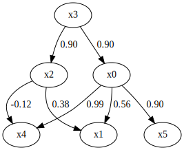
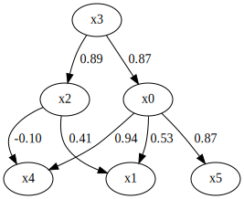

HighDimDirectLiNGAM
===================

Import and settings
-------------------

In this example, we need to import ``numpy``, ``pandas``, and
``graphviz`` in addition to ``lingam``.

.. code:: ipython3

    import numpy as np
    import pandas as pd
    import graphviz
    import lingam
    from lingam import HighDimDirectLiNGAM
    from lingam.utils import make_dot
    
    print([np.__version__, pd.__version__, graphviz.__version__, lingam.__version__])
    
    np.set_printoptions(precision=3, suppress=True)
    np.random.seed(100)

.. parsed-literal::

    ['1.24.4', '2.0.3', '0.20.1', '1.8.3']

Test data
---------

We create test data consisting of 6 variables.

.. code:: ipython3

    m = np.array([
        [ 0.000,  0.000,  0.000,  0.895,  0.000,  0.000],
        [ 0.565,  0.000,  0.377,  0.000,  0.000,  0.000],
        [ 0.000,  0.000,  0.000,  0.895,  0.000,  0.000],
        [ 0.000,  0.000,  0.000,  0.000,  0.000,  0.000],
        [ 0.991,  0.000, -0.124,  0.000,  0.000,  0.000],
        [ 0.895,  0.000,  0.000,  0.000,  0.000,  0.000]
    ])
    
    generate_error = lambda p: np.random.uniform(-p, p, size=1000)
    
    error_vars = [0.2, 0.2, 0.2, 1.0, 0.2, 0.2]
    params = [0.5 * np.sqrt(12 * v) for v in error_vars]
    e = np.array([generate_error(p) for p in params])
    
    X = np.linalg.pinv(np.eye(len(m)) - m) @ e
    X = pd.DataFrame(X.T)
    
    display(make_dot(m))
    
    X.head()

.. raw:: html

    

    
    <table border="1" class="dataframe">
      <thead>
        <tr style="text-align: right;">
          <th></th>
          <th>0</th>
          <th>1</th>
          <th>2</th>
          <th>3</th>
          <th>4</th>
          <th>5</th>
        </tr>
      </thead>
      <tbody>
        <tr>
          <th>0</th>
          <td>-1.245034</td>
          <td>-2.070303</td>
          <td>-1.684946</td>
          <td>-1.466231</td>
          <td>-0.607202</td>
          <td>-1.208680</td>
        </tr>
        <tr>
          <th>1</th>
          <td>-0.129694</td>
          <td>-0.453755</td>
          <td>-0.525306</td>
          <td>0.238720</td>
          <td>-0.770446</td>
          <td>0.214530</td>
        </tr>
        <tr>
          <th>2</th>
          <td>-0.426608</td>
          <td>0.434575</td>
          <td>-0.070464</td>
          <td>-0.346001</td>
          <td>-0.891935</td>
          <td>0.060805</td>
        </tr>
        <tr>
          <th>3</th>
          <td>-0.058363</td>
          <td>-0.412667</td>
          <td>0.134419</td>
          <td>-0.661997</td>
          <td>-0.661361</td>
          <td>0.382801</td>
        </tr>
        <tr>
          <th>4</th>
          <td>0.560928</td>
          <td>0.631961</td>
          <td>1.636429</td>
          <td>1.484039</td>
          <td>0.757059</td>
          <td>0.526978</td>
        </tr>
      </tbody>
    </table>
    

Causal Discovery
----------------

To run causal discovery, we create a ``HighDimDirectLiNGAM`` object and
call the ``fit`` method.

.. code:: ipython3

    model = HighDimDirectLiNGAM()
    model.fit(X)

.. parsed-literal::

    <lingam.high_dim_direct_lingam.HighDimDirectLiNGAM at 0x7f47d61bcc10>

Using the ``causal_order_`` properties, we can see the causal ordering
as a result of the causal discovery.

.. code:: ipython3

    model.causal_order_

.. parsed-literal::

    [3, 2, 0, 4, 1, 5]

Also, using the ``adjacency_matrix_`` properties, we can see the
adjacency matrix as a result of the causal discovery.

.. code:: ipython3

    model.adjacency_matrix_

.. parsed-literal::

    array([[ 0.   ,  0.   ,  0.   ,  0.87 ,  0.   ,  0.   ],
           [ 0.535,  0.   ,  0.411,  0.   ,  0.   ,  0.   ],
           [ 0.   ,  0.   ,  0.   ,  0.894,  0.   ,  0.   ],
           [ 0.   ,  0.   ,  0.   ,  0.   ,  0.   ,  0.   ],
           [ 0.937,  0.   , -0.103,  0.   ,  0.   ,  0.   ],
           [ 0.875,  0.   ,  0.   ,  0.   ,  0.   ,  0.   ]])

We can draw a causal graph by utility funciton.

.. code:: ipython3

    make_dot(model.adjacency_matrix_)

