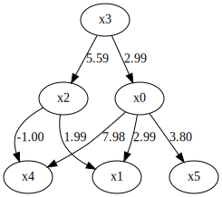

DirectLiNGAM
============

Model
-------------------

DirectLiNGAM [1]_ is a direct method for learning the basic LiNGAM model [2]_. 
It uses an entropy-based measure [3]_ to evaluate independence between error variables. 
The basic LiNGAM model makes the following assumptions. 

#. Linearity
#. Non-Gaussian continuous error variables (except at most one)
#. Acyclicity
#. No hidden common causes

Denote observed variables by $x_i$ and error variables by $e_i$ ( $i=1, ..., p$ ) and coefficients or connection strengths $b_{ij}$ ( $i,j=1, ..., p$ ). 
Collect them in vectors $x$ and $e$ and a matrix $B$, respectivelly. 
Due to the acyclicity assumption, the coefficient matrix $B$ can be permuted to be strictly lower-triangular by a simultaneous row and column permutation.
The error variables $e_i$ ( $i=1, ..., p$ ) are independent due to the assumption of no hidden common causes. 

Then, mathematically, the model for observed variables $x_i$ ( $i=1, ..., p$ ) is written as 

$$ x = Bx + e. $$

Example applications are found `here <https://www.shimizulab.org/lingam/lingampapers/applications-and-tailor-made-methods>`__. 
For example, [4]_ uses the basic LiNGAM model to infer causal relations of health indice including LDL, HDL, and γGT. 

References

    .. [1] S. Shimizu, T. Inazumi, Y. Sogawa, A. Hyvärinen, Y. Kawahara, T. Washio, P. O. Hoyer and K. Bollen. 
        DirectLiNGAM: A direct method for learning a linear non-Gaussian structural equation model. 
        Journal of Machine Learning Research, 12(Apr): 1225–1248, 2011.
    .. [2] S. Shimizu, P. O. Hoyer, A. Hyvärinen, and A. J. Kerminen.
       A linear non-gaussian acyclic model for causal discovery.
       Journal of Machine Learning Research, 7:2003-2030, 2006.
    .. [3] A. Hyvärinen and S. M. Smith. 
       Pairwise likelihood ratios for estimation of non-Gaussian structural eauation models. 
       Journal of Machine Learning Research 14:111-152, 2013.
    .. [4] J. Kotoku, A. Oyama, K. Kitazumi, H. Toki, A. Haga, R. Yamamoto, M. Shinzawa, M. Yamakawa, S. Fukui, K. Yamamoto, T. Moriyama. 
       Causal relations of health indices inferred statistically using the DirectLiNGAM algorithm from big data of Osaka prefecture health checkups. 
       PLoS ONE,15(12): e0243229, 2020.

Import and settings
-------------------

In this example, we need to import ``numpy``, ``pandas``, and ``graphviz`` in addition to ``lingam``.

.. code-block:: python

    import numpy as np
    import pandas as pd
    import graphviz
    import lingam
    from lingam.utils import make_dot
    
    print([np.__version__, pd.__version__, graphviz.__version__, lingam.__version__])
    
    np.set_printoptions(precision=3, suppress=True)
    np.random.seed(100)

.. parsed-literal::

    ['1.16.2', '0.24.2', '0.11.1', '1.5.1']
    

Test data
---------

We create test data consisting of 6 variables.

.. code-block:: python

    x3 = np.random.uniform(size=1000)
    x0 = 3.0*x3 + np.random.uniform(size=1000)
    x2 = 6.0*x3 + np.random.uniform(size=1000)
    x1 = 3.0*x0 + 2.0*x2 + np.random.uniform(size=1000)
    x5 = 4.0*x0 + np.random.uniform(size=1000)
    x4 = 8.0*x0 - 1.0*x2 + np.random.uniform(size=1000)
    X = pd.DataFrame(np.array([x0, x1, x2, x3, x4, x5]).T ,columns=['x0', 'x1', 'x2', 'x3', 'x4', 'x5'])
    X.head()

.. raw:: html

    

    
    <table border="1" class="dataframe">
      <thead>
        <tr style="text-align: right;">
          <th></th>
          <th>x0</th>
          <th>x1</th>
          <th>x2</th>
          <th>x3</th>
          <th>x4</th>
          <th>x5</th>
        </tr>
      </thead>
      <tbody>
        <tr>
          <th>0</th>
          <td>1.657947</td>
          <td>12.090323</td>
          <td>3.519873</td>
          <td>0.543405</td>
          <td>10.182785</td>
          <td>7.401408</td>
        </tr>
        <tr>
          <th>1</th>
          <td>1.217345</td>
          <td>7.607388</td>
          <td>1.693219</td>
          <td>0.278369</td>
          <td>8.758949</td>
          <td>4.912979</td>
        </tr>
        <tr>
          <th>2</th>
          <td>2.226804</td>
          <td>13.483555</td>
          <td>3.201513</td>
          <td>0.424518</td>
          <td>15.398626</td>
          <td>9.098729</td>
        </tr>
        <tr>
          <th>3</th>
          <td>2.756527</td>
          <td>20.654225</td>
          <td>6.037873</td>
          <td>0.844776</td>
          <td>16.795156</td>
          <td>11.147294</td>
        </tr>
        <tr>
          <th>4</th>
          <td>0.319283</td>
          <td>3.340782</td>
          <td>0.727265</td>
          <td>0.004719</td>
          <td>2.343100</td>
          <td>2.037974</td>
        </tr>
      </tbody>
    </table>
    

     

.. code-block:: python

    m = np.array([[0.0, 0.0, 0.0, 3.0, 0.0, 0.0],
                  [3.0, 0.0, 2.0, 0.0, 0.0, 0.0],
                  [0.0, 0.0, 0.0, 6.0, 0.0, 0.0],
                  [0.0, 0.0, 0.0, 0.0, 0.0, 0.0],
                  [8.0, 0.0,-1.0, 0.0, 0.0, 0.0],
                  [4.0, 0.0, 0.0, 0.0, 0.0, 0.0]])
    
    dot = make_dot(m)
    
    # Save pdf
    dot.render('dag')
    
    # Save png
    dot.format = 'png'
    dot.render('dag')
    
    dot

.. image:: ../image/lingam1.svg

Causal Discovery
----------------

Then, if we want to run DirectLiNGAM algorithm, we create a :class:`~lingam.DirectLiNGAM` object and call the :func:`~lingam.DirectLiNGAM.fit` method:

.. code-block:: python

    model = lingam.DirectLiNGAM()
    model.fit(X)

.. parsed-literal::

    <lingam.direct_lingam.DirectLiNGAM at 0x1f6afac2fd0>

* If you want to use the ICA-LiNGAM algorithm, replace :class:`~lingam.DirectLiNGAM` above with :class:`~lingam.ICALiNGAM`.

Using the :attr:`~lingam.DirectLiNGAM.causal_order_` property, we can see the causal ordering as a result of the causal discovery.

.. code-block:: python

    model.causal_order_

.. parsed-literal::

    [3, 0, 2, 1, 4, 5]

Also, using the :attr:`~lingam.DirectLiNGAM.adjacency_matrix_` property, we can see the adjacency matrix as a result of the causal discovery.

.. code-block:: python

    model.adjacency_matrix_

.. parsed-literal::

    array([[ 0.   ,  0.   ,  0.   ,  2.994,  0.   ,  0.   ],
           [ 2.995,  0.   ,  1.993,  0.   ,  0.   ,  0.   ],
           [ 0.   ,  0.   ,  0.   ,  5.586,  0.   ,  0.   ],
           [ 0.   ,  0.   ,  0.   ,  0.   ,  0.   ,  0.   ],
           [ 7.981,  0.   , -0.996,  0.   ,  0.   ,  0.   ],
           [ 3.795,  0.   ,  0.   ,  0.   ,  0.   ,  0.   ]])

We can draw a causal graph by utility funciton.

.. code-block:: python

    make_dot(model.adjacency_matrix_)

Independence between error variables
------------------------------------

To check if the LiNGAM assumption is broken, we can get p-values of
independence between error variables. The value in the i-th row and j-th
column of the obtained matrix shows the p-value of the independence of
the error variables :math:`e_i` and :math:`e_j`.

.. code-block:: python

    p_values = model.get_error_independence_p_values(X)
    print(p_values)

.. parsed-literal::

    [[0.    0.925 0.443 0.978 0.834 0.   ]
     [0.925 0.    0.133 0.881 0.317 0.214]
     [0.443 0.133 0.    0.    0.64  0.001]
     [0.978 0.881 0.    0.    0.681 0.   ]
     [0.834 0.317 0.64  0.681 0.    0.742]
     [0.    0.214 0.001 0.    0.742 0.   ]]
    

