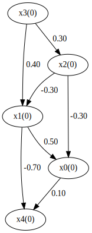
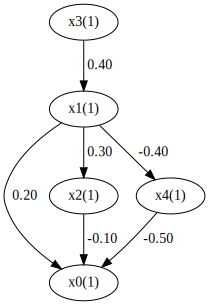
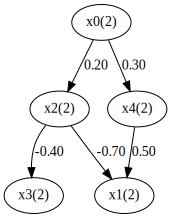
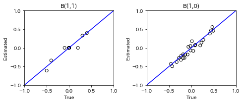
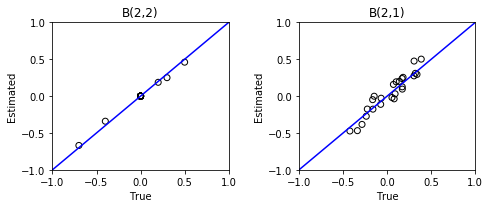
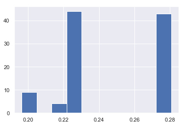

Longitudinal LiNGAM
===================

Import and settings
-------------------

In this example, we need to import ``numpy``, ``pandas``, and ``graphviz`` in addition to ``lingam``.

.. code:: ipython3

    import numpy as np
    import pandas as pd
    import matplotlib.pyplot as plt
    import graphviz
    import lingam
    from lingam.utils import print_causal_directions, print_dagc, make_dot
    
    import warnings
    warnings.filterwarnings('ignore')
    
    print([np.__version__, pd.__version__, graphviz.__version__, lingam.__version__])
    
    np.set_printoptions(precision=3, suppress=True)
    np.random.seed(0)

.. parsed-literal::

    ['1.16.2', '0.24.2', '0.11.1', '1.3.1']
    

Test data
---------

We create test data consisting of 5 variables. The causal model at each timepoint is as follows.

.. code:: ipython3

    # setting
    n_features = 5
    n_samples = 200
    n_lags = 1
    n_timepoints = 3
    
    causal_orders = []
    B_t_true = np.empty((n_timepoints, n_features, n_features))
    B_tau_true = np.empty((n_timepoints, n_lags, n_features, n_features))
    X_t = np.empty((n_timepoints, n_samples, n_features))

.. code:: ipython3

    # B(0,0)
    B_t_true[0] = np.array([[0.0, 0.5,-0.3, 0.0, 0.0],
                            [0.0, 0.0,-0.3, 0.4, 0.0],
                            [0.0, 0.0, 0.0, 0.3, 0.0],
                            [0.0, 0.0, 0.0, 0.0, 0.0],
                            [0.1,-0.7, 0.0, 0.0, 0.0]])
    causal_orders.append([3, 2, 1, 0, 4])
    make_dot(B_t_true[0], labels=[f'x{i}(0)' for i in range(5)])

.. code:: ipython3

    # B(1,1)
    B_t_true[1] = np.array([[0.0, 0.2,-0.1, 0.0,-0.5],
                            [0.0, 0.0, 0.0, 0.4, 0.0],
                            [0.0, 0.3, 0.0, 0.0, 0.0],
                            [0.0, 0.0, 0.0, 0.0, 0.0],
                            [0.0,-0.4, 0.0, 0.0, 0.0]])
    causal_orders.append([3, 1, 2, 4, 0])
    make_dot(B_t_true[1], labels=[f'x{i}(1)' for i in range(5)])

.. code:: ipython3

    # B(2,2)
    B_t_true[2] = np.array([[0.0, 0.0, 0.0, 0.0, 0.0],
                            [0.0, 0.0,-0.7, 0.0, 0.5],
                            [0.2, 0.0, 0.0, 0.0, 0.0],
                            [0.0, 0.0,-0.4, 0.0, 0.0],
                            [0.3, 0.0, 0.0, 0.0, 0.0]])
    causal_orders.append([0, 2, 4, 3, 1])
    make_dot(B_t_true[2], labels=[f'x{i}(2)' for i in range(5)])

.. code:: ipython3

    # create B(t,t-τ) and X
    for t in range(n_timepoints):
        # external influence
        expon = 0.1
        ext = np.empty((n_features, n_samples))
        for i in range(n_features):
            ext[i, :] = np.random.normal(size=(1, n_samples));
            ext[i, :] = np.multiply(np.sign(ext[i, :]), abs(ext[i, :]) ** expon);
            ext[i, :] = ext[i, :] - np.mean(ext[i, :]);
            ext[i, :] = ext[i, :] / np.std(ext[i, :]);
    
        # create B(t,t-τ)
        for tau in range(n_lags):
            value = np.random.uniform(low=0.01, high=0.5, size=(n_features, n_features))
            sign = np.random.choice([-1, 1], size=(n_features, n_features))
            B_tau_true[t, tau] = np.multiply(value, sign)
    
        # create X(t)
        X = np.zeros((n_features, n_samples))
        for co in causal_orders[t]:
            X[co] = np.dot(B_t_true[t][co, :], X) + ext[co]
            if t > 0:
                for tau in range(n_lags):
                    X[co] = X[co] + np.dot(B_tau_true[t, tau][co, :], X_t[t-(tau+1)].T)
        
        X_t[t] = X.T

Causal Discovery
----------------

To run causal discovery, we create a :class:`~lingam.LongitudinalLiNGAM` object by specifying the ``n_lags`` parameter. Then, we call the :func:`~lingam.LongitudinalLiNGAM.fit` method.

.. code:: ipython3

    model = lingam.LongitudinalLiNGAM(n_lags=n_lags)
    model = model.fit(X_t)

Using the :attr:`~lingam.LongitudinalLiNGAM.causal_orders_` property, we can see the causal ordering in time-points as a result of the causal discovery. All elements are nan because the causal order of B(t,t) at t=0 is not calculated. So access to the time points above t=1.

.. code:: ipython3

    print(model.causal_orders_[0]) # nan at t=0
    print(model.causal_orders_[1])
    print(model.causal_orders_[2])

.. parsed-literal::

    [nan, nan, nan, nan, nan]
    [3, 1, 2, 4, 0]
    [0, 4, 2, 3, 1]
    

Also, using the :attr:`~lingam.LongitudinalLiNGAM.adjacency_matrices_` property, we can see the adjacency matrix as a result of the causal discovery. As with the causal order, all elements are nan because the B(t,t) and B(t,t-τ) at t=0 is not calculated. So access to the time points above t=1. Also, if we run causal discovery with n_lags=2, B(t,t-τ) at t=1 is also not computed, so all the elements are nan.

.. code:: ipython3

    t = 0 # nan at t=0
    print('B(0,0):')
    print(model.adjacency_matrices_[t, 0])
    print('B(0,-1):')
    print(model.adjacency_matrices_[t, 1])
    
    t = 1
    print('B(1,1):')
    print(model.adjacency_matrices_[t, 0])
    print('B(1,0):')
    print(model.adjacency_matrices_[t, 1])
    
    t = 2
    print('B(2,2):')
    print(model.adjacency_matrices_[t, 0])
    print('B(2,1):')
    print(model.adjacency_matrices_[t, 1])

.. parsed-literal::

    B(0,0):
    [[nan nan nan nan nan]
     [nan nan nan nan nan]
     [nan nan nan nan nan]
     [nan nan nan nan nan]
     [nan nan nan nan nan]]
    B(0,-1):
    [[nan nan nan nan nan]
     [nan nan nan nan nan]
     [nan nan nan nan nan]
     [nan nan nan nan nan]
     [nan nan nan nan nan]]
    B(1,1):
    [[ 0.     0.099  0.     0.    -0.52 ]
     [ 0.     0.     0.     0.398  0.   ]
     [ 0.     0.384  0.    -0.162  0.   ]
     [ 0.     0.     0.     0.     0.   ]
     [ 0.    -0.249 -0.074  0.     0.   ]]
    B(1,0):
    [[ 0.025  0.116 -0.202  0.054 -0.216]
     [ 0.139 -0.211 -0.43   0.558  0.051]
     [-0.135  0.178  0.421  0.173  0.031]
     [ 0.384 -0.083 -0.495 -0.072 -0.323]
     [-0.206 -0.354 -0.199 -0.293  0.468]]
    B(2,2):
    [[ 0.     0.     0.     0.     0.   ]
     [ 0.     0.    -0.67   0.     0.46 ]
     [ 0.187  0.     0.     0.     0.   ]
     [ 0.     0.    -0.341  0.     0.   ]
     [ 0.25   0.     0.     0.     0.   ]]
    B(2,1):
    [[ 0.194  0.2    0.031 -0.473 -0.002]
     [-0.384 -0.037  0.158  0.255  0.095]
     [ 0.126  0.275 -0.048  0.502 -0.019]
     [ 0.238 -0.469  0.475 -0.029 -0.176]
     [-0.177  0.309 -0.112  0.295 -0.273]]
    

.. code:: ipython3

    for t in range(1, n_timepoints):
        B_t, B_tau = model.adjacency_matrices_[t]
        plt.figure(figsize=(7, 3))
    
        plt.subplot(1,2,1)
        plt.plot([-1, 1],[-1, 1], marker="", color="blue", label="support")
        plt.scatter(B_t_true[t], B_t, facecolors='none', edgecolors='black')
        plt.xlim(-1, 1)
        plt.ylim(-1, 1)
        plt.xlabel('True')
        plt.ylabel('Estimated')
        plt.title(f'B({t},{t})')
    
        plt.subplot(1,2,2)
        plt.plot([-1, 1],[-1, 1], marker="", color="blue", label="support")
        plt.scatter(B_tau_true[t], B_tau, facecolors='none', edgecolors='black')
        plt.xlim(-1, 1)
        plt.ylim(-1, 1)
        plt.xlabel('True')
        plt.ylabel('Estimated')
        plt.title(f'B({t},{t-1})')
    
        plt.tight_layout()
        plt.show()

Bootstrapping
-------------

We call :func:`~lingam.LongitudinalLiNGAM.bootstrap` method instead of :func:`~lingam.LongitudinalLiNGAM.fit`. Here, the second argument specifies the number of bootstrap sampling.

.. code:: ipython3

    model = lingam.LongitudinalLiNGAM()
    result = model.bootstrap(X_t, n_sampling=100)

Causal Directions
-----------------

Since :class:`~lingam.LongitudinalBootstrapResult` object is returned, we can get the ranking of the causal directions extracted by :func:`~lingam.LongitudinalBootstrapResult.get_causal_direction_counts` method. In the following sample code, ``n_directions`` option is limited to the causal directions of the top 8 rankings, and ``min_causal_effect`` option is limited to causal directions with a coefficient of 0.01 or more.

.. code:: ipython3

    cdc_list = result.get_causal_direction_counts(n_directions=12, min_causal_effect=0.01, split_by_causal_effect_sign=True)

.. code:: ipython3

    t = 1
    labels = [f'x{i}({u})' for u in [t, t-1] for i in range(5)]
    print_causal_directions(cdc_list[t], 100, labels=labels)

.. parsed-literal::

    x4(1) <--- x4(0) (b>0) (100.0%)
    x2(1) <--- x0(0) (b<0) (100.0%)
    x3(1) <--- x0(0) (b>0) (100.0%)
    x1(1) <--- x3(0) (b>0) (100.0%)
    x1(1) <--- x2(0) (b<0) (100.0%)
    x3(1) <--- x2(0) (b<0) (100.0%)
    x3(1) <--- x4(0) (b<0) (100.0%)
    x1(1) <--- x3(1) (b>0) (100.0%)
    x0(1) <--- x4(1) (b<0) (100.0%)
    x4(1) <--- x1(0) (b<0) (100.0%)
    x4(1) <--- x1(1) (b<0) (100.0%)
    x2(1) <--- x2(0) (b>0) (100.0%)
    

.. code:: ipython3

    t = 2
    labels = [f'x{i}({u})' for u in [t, t-1] for i in range(5)]
    print_causal_directions(cdc_list[t], 100, labels=labels)

.. parsed-literal::

    x0(2) <--- x0(1) (b>0) (100.0%)
    x4(2) <--- x1(1) (b>0) (100.0%)
    x3(2) <--- x2(1) (b>0) (100.0%)
    x3(2) <--- x1(1) (b<0) (100.0%)
    x3(2) <--- x0(1) (b>0) (100.0%)
    x3(2) <--- x2(2) (b<0) (100.0%)
    x2(2) <--- x3(1) (b>0) (100.0%)
    x2(2) <--- x1(1) (b>0) (100.0%)
    x4(2) <--- x3(1) (b>0) (100.0%)
    x1(2) <--- x3(1) (b>0) (100.0%)
    x1(2) <--- x2(1) (b>0) (100.0%)
    x1(2) <--- x0(1) (b<0) (100.0%)
    

Directed Acyclic Graphs
-----------------------

Also, using the :func:`~lingam.LongitudinalBootstrapResult.get_directed_acyclic_graph_counts` method, we can get the ranking of the DAGs extracted. In the following sample code, ``n_dags`` option is limited to the dags of the top 3 rankings, and ``min_causal_effect`` option is limited to causal directions with a coefficient of 0.01 or more.

.. code:: ipython3

    dagc_list = result.get_directed_acyclic_graph_counts(n_dags=3, min_causal_effect=0.01, split_by_causal_effect_sign=True)

.. code:: ipython3

    t = 1
    labels = [f'x{i}({u})' for u in [t, t-1] for i in range(5)]
    print_dagc(dagc_list[t], 100, labels=labels)

.. parsed-literal::

    DAG[0]: 2.0%
    	x0(1) <--- x4(1) (b<0)
    	x0(1) <--- x0(0) (b>0)
    	x0(1) <--- x1(0) (b>0)
    	x0(1) <--- x2(0) (b<0)
    	x0(1) <--- x3(0) (b>0)
    	x0(1) <--- x4(0) (b<0)
    	x1(1) <--- x3(1) (b>0)
    	x1(1) <--- x0(0) (b>0)
    	x1(1) <--- x1(0) (b<0)
    	x1(1) <--- x2(0) (b<0)
    	x1(1) <--- x3(0) (b>0)
    	x1(1) <--- x4(0) (b>0)
    	x2(1) <--- x1(1) (b>0)
    	x2(1) <--- x0(0) (b<0)
    	x2(1) <--- x1(0) (b>0)
    	x2(1) <--- x2(0) (b>0)
    	x2(1) <--- x3(0) (b>0)
    	x2(1) <--- x4(0) (b>0)
    	x3(1) <--- x0(0) (b>0)
    	x3(1) <--- x1(0) (b<0)
    	x3(1) <--- x2(0) (b<0)
    	x3(1) <--- x4(0) (b<0)
    	x4(1) <--- x1(1) (b<0)
    	x4(1) <--- x0(0) (b<0)
    	x4(1) <--- x1(0) (b<0)
    	x4(1) <--- x2(0) (b<0)
    	x4(1) <--- x3(0) (b<0)
    	x4(1) <--- x4(0) (b>0)
    DAG[1]: 1.0%
    	x0(1) <--- x2(1) (b<0)
    	x0(1) <--- x4(1) (b<0)
    	x0(1) <--- x0(0) (b>0)
    	x0(1) <--- x1(0) (b<0)
    	x0(1) <--- x2(0) (b<0)
    	x0(1) <--- x3(0) (b>0)
    	x0(1) <--- x4(0) (b<0)
    	x1(1) <--- x3(1) (b>0)
    	x1(1) <--- x0(0) (b>0)
    	x1(1) <--- x1(0) (b<0)
    	x1(1) <--- x2(0) (b<0)
    	x1(1) <--- x3(0) (b>0)
    	x1(1) <--- x4(0) (b>0)
    	x2(1) <--- x1(1) (b>0)
    	x2(1) <--- x0(0) (b<0)
    	x2(1) <--- x2(0) (b>0)
    	x2(1) <--- x3(0) (b>0)
    	x2(1) <--- x4(0) (b>0)
    	x3(1) <--- x0(0) (b>0)
    	x3(1) <--- x1(0) (b>0)
    	x3(1) <--- x2(0) (b<0)
    	x3(1) <--- x3(0) (b<0)
    	x3(1) <--- x4(0) (b<0)
    	x4(1) <--- x1(1) (b<0)
    	x4(1) <--- x2(1) (b<0)
    	x4(1) <--- x3(1) (b>0)
    	x4(1) <--- x0(0) (b<0)
    	x4(1) <--- x1(0) (b<0)
    	x4(1) <--- x2(0) (b>0)
    	x4(1) <--- x3(0) (b>0)
    	x4(1) <--- x4(0) (b>0)
    DAG[2]: 1.0%
    	x0(1) <--- x1(1) (b>0)
    	x0(1) <--- x4(1) (b<0)
    	x0(1) <--- x1(0) (b>0)
    	x0(1) <--- x2(0) (b<0)
    	x0(1) <--- x3(0) (b>0)
    	x0(1) <--- x4(0) (b<0)
    	x1(1) <--- x3(1) (b>0)
    	x1(1) <--- x0(0) (b>0)
    	x1(1) <--- x1(0) (b<0)
    	x1(1) <--- x2(0) (b<0)
    	x1(1) <--- x3(0) (b>0)
    	x1(1) <--- x4(0) (b>0)
    	x2(1) <--- x1(1) (b>0)
    	x2(1) <--- x0(0) (b<0)
    	x2(1) <--- x1(0) (b>0)
    	x2(1) <--- x2(0) (b>0)
    	x2(1) <--- x3(0) (b>0)
    	x2(1) <--- x4(0) (b>0)
    	x3(1) <--- x0(0) (b>0)
    	x3(1) <--- x1(0) (b<0)
    	x3(1) <--- x2(0) (b<0)
    	x3(1) <--- x3(0) (b<0)
    	x3(1) <--- x4(0) (b<0)
    	x4(1) <--- x1(1) (b<0)
    	x4(1) <--- x2(1) (b<0)
    	x4(1) <--- x3(1) (b>0)
    	x4(1) <--- x0(0) (b<0)
    	x4(1) <--- x1(0) (b<0)
    	x4(1) <--- x2(0) (b<0)
    	x4(1) <--- x3(0) (b<0)
    	x4(1) <--- x4(0) (b>0)
    

.. code:: ipython3

    t = 2
    labels = [f'x{i}({u})' for u in [t, t-1] for i in range(5)]
    print_dagc(dagc_list[t], 100, labels=labels)

.. parsed-literal::

    DAG[0]: 3.0%
    	x0(2) <--- x0(1) (b>0)
    	x0(2) <--- x1(1) (b>0)
    	x0(2) <--- x2(1) (b>0)
    	x0(2) <--- x3(1) (b<0)
    	x0(2) <--- x4(1) (b>0)
    	x1(2) <--- x2(2) (b<0)
    	x1(2) <--- x4(2) (b>0)
    	x1(2) <--- x0(1) (b<0)
    	x1(2) <--- x1(1) (b<0)
    	x1(2) <--- x2(1) (b>0)
    	x1(2) <--- x3(1) (b>0)
    	x1(2) <--- x4(1) (b>0)
    	x2(2) <--- x0(2) (b>0)
    	x2(2) <--- x0(1) (b>0)
    	x2(2) <--- x1(1) (b>0)
    	x2(2) <--- x2(1) (b<0)
    	x2(2) <--- x3(1) (b>0)
    	x2(2) <--- x4(1) (b<0)
    	x3(2) <--- x2(2) (b<0)
    	x3(2) <--- x0(1) (b>0)
    	x3(2) <--- x1(1) (b<0)
    	x3(2) <--- x2(1) (b>0)
    	x3(2) <--- x3(1) (b>0)
    	x3(2) <--- x4(1) (b<0)
    	x4(2) <--- x0(2) (b>0)
    	x4(2) <--- x0(1) (b<0)
    	x4(2) <--- x1(1) (b>0)
    	x4(2) <--- x2(1) (b<0)
    	x4(2) <--- x3(1) (b>0)
    	x4(2) <--- x4(1) (b<0)
    DAG[1]: 2.0%
    	x0(2) <--- x0(1) (b>0)
    	x0(2) <--- x1(1) (b>0)
    	x0(2) <--- x2(1) (b>0)
    	x0(2) <--- x3(1) (b<0)
    	x0(2) <--- x4(1) (b>0)
    	x1(2) <--- x2(2) (b<0)
    	x1(2) <--- x4(2) (b>0)
    	x1(2) <--- x0(1) (b<0)
    	x1(2) <--- x1(1) (b<0)
    	x1(2) <--- x2(1) (b>0)
    	x1(2) <--- x3(1) (b>0)
    	x1(2) <--- x4(1) (b<0)
    	x2(2) <--- x0(2) (b>0)
    	x2(2) <--- x0(1) (b>0)
    	x2(2) <--- x1(1) (b>0)
    	x2(2) <--- x2(1) (b<0)
    	x2(2) <--- x3(1) (b>0)
    	x2(2) <--- x4(1) (b>0)
    	x3(2) <--- x2(2) (b<0)
    	x3(2) <--- x0(1) (b>0)
    	x3(2) <--- x1(1) (b<0)
    	x3(2) <--- x2(1) (b>0)
    	x3(2) <--- x3(1) (b<0)
    	x3(2) <--- x4(1) (b<0)
    	x4(2) <--- x0(2) (b>0)
    	x4(2) <--- x0(1) (b<0)
    	x4(2) <--- x1(1) (b>0)
    	x4(2) <--- x2(1) (b<0)
    	x4(2) <--- x3(1) (b>0)
    	x4(2) <--- x4(1) (b<0)
    DAG[2]: 2.0%
    	x0(2) <--- x0(1) (b>0)
    	x0(2) <--- x1(1) (b>0)
    	x0(2) <--- x2(1) (b<0)
    	x0(2) <--- x3(1) (b<0)
    	x0(2) <--- x4(1) (b<0)
    	x1(2) <--- x2(2) (b<0)
    	x1(2) <--- x4(2) (b>0)
    	x1(2) <--- x0(1) (b<0)
    	x1(2) <--- x1(1) (b<0)
    	x1(2) <--- x2(1) (b>0)
    	x1(2) <--- x3(1) (b>0)
    	x1(2) <--- x4(1) (b>0)
    	x2(2) <--- x0(1) (b>0)
    	x2(2) <--- x1(1) (b>0)
    	x2(2) <--- x2(1) (b<0)
    	x2(2) <--- x3(1) (b>0)
    	x2(2) <--- x4(1) (b<0)
    	x3(2) <--- x2(2) (b<0)
    	x3(2) <--- x0(1) (b>0)
    	x3(2) <--- x1(1) (b<0)
    	x3(2) <--- x2(1) (b>0)
    	x3(2) <--- x3(1) (b<0)
    	x3(2) <--- x4(1) (b<0)
    	x4(2) <--- x0(2) (b>0)
    	x4(2) <--- x0(1) (b<0)
    	x4(2) <--- x1(1) (b>0)
    	x4(2) <--- x2(1) (b<0)
    	x4(2) <--- x3(1) (b>0)
    	x4(2) <--- x4(1) (b<0)
    

Probability
-----------

Using the :func:`~lingam.LongitudinalBootstrapResult.get_probabilities` method, we can get the probability of bootstrapping.

.. code:: ipython3

    probs = result.get_probabilities(min_causal_effect=0.01)
    print(probs[1])

.. parsed-literal::

    [[[0.   0.51 0.09 0.15 1.  ]
      [0.   0.   0.   1.   0.  ]
      [0.02 0.99 0.   0.52 0.3 ]
      [0.   0.   0.   0.   0.  ]
      [0.   1.   0.23 0.3  0.  ]]
    
     [[0.92 0.97 1.   0.94 0.99]
      [0.99 0.99 1.   1.   0.94]
      [1.   0.97 1.   0.99 0.87]
      [1.   0.98 1.   0.92 1.  ]
      [1.   1.   1.   1.   1.  ]]]
    

.. code:: ipython3

    t = 1
    print('B(1,1):')
    print(probs[t, 0])
    print('B(1,0):')
    print(probs[t, 1])
    
    t = 2
    print('B(2,2):')
    print(probs[t, 0])
    print('B(2,1):')
    print(probs[t, 1])

.. parsed-literal::

    B(1,1):
    [[0.   0.51 0.09 0.15 1.  ]
     [0.   0.   0.   1.   0.  ]
     [0.02 0.99 0.   0.52 0.3 ]
     [0.   0.   0.   0.   0.  ]
     [0.   1.   0.23 0.3  0.  ]]
    B(1,0):
    [[0.92 0.97 1.   0.94 0.99]
     [0.99 0.99 1.   1.   0.94]
     [1.   0.97 1.   0.99 0.87]
     [1.   0.98 1.   0.92 1.  ]
     [1.   1.   1.   1.   1.  ]]
    B(2,2):
    [[0.   0.   0.   0.   0.  ]
     [0.1  0.   1.   0.06 1.  ]
     [0.78 0.   0.   0.   0.13]
     [0.13 0.   1.   0.   0.16]
     [0.88 0.   0.   0.   0.  ]]
    B(2,1):
    [[1.   1.   0.91 1.   0.92]
     [1.   0.86 1.   1.   0.95]
     [0.95 1.   0.96 1.   0.8 ]
     [1.   1.   1.   0.92 1.  ]
     [0.99 1.   0.96 1.   1.  ]]
    

Causal Effects
--------------

Using the :func:`~lingam.LongitudinalBootstrapResult.get_causal_effects` method, we can get the list of causal effect. The causal effects we can get are dictionary type variable. We can display the list nicely by assigning it to pandas.DataFrame. Also, we have replaced the variable index with a label below.

.. code:: ipython3

    causal_effects = result.get_causal_effects(min_causal_effect=0.01)
    
    df = pd.DataFrame(causal_effects)
    
    labels = [f'x{i}({t})' for t in range(3) for i in range(5)]
    df['from'] = df['from'].apply(lambda x : labels[x])
    df['to'] = df['to'].apply(lambda x : labels[x])
    df

.. raw:: html

    

    
    <table border="1" class="dataframe">
      <thead>
        <tr style="text-align: right;">
          <th></th>
          <th>from</th>
          <th>to</th>
          <th>effect</th>
          <th>probability</th>
        </tr>
      </thead>
      <tbody>
        <tr>
          <th>0</th>
          <td>x1(1)</td>
          <td>x0(1)</td>
          <td>0.338725</td>
          <td>1.00</td>
        </tr>
        <tr>
          <th>1</th>
          <td>x0(1)</td>
          <td>x2(2)</td>
          <td>0.222189</td>
          <td>1.00</td>
        </tr>
        <tr>
          <th>2</th>
          <td>x1(1)</td>
          <td>x2(2)</td>
          <td>0.334539</td>
          <td>1.00</td>
        </tr>
        <tr>
          <th>3</th>
          <td>x3(1)</td>
          <td>x2(2)</td>
          <td>0.627104</td>
          <td>1.00</td>
        </tr>
        <tr>
          <th>4</th>
          <td>x4(1)</td>
          <td>x2(2)</td>
          <td>-0.192083</td>
          <td>1.00</td>
        </tr>
        <tr>
          <th>5</th>
          <td>x0(2)</td>
          <td>x2(2)</td>
          <td>0.231114</td>
          <td>1.00</td>
        </tr>
        <tr>
          <th>6</th>
          <td>x0(1)</td>
          <td>x3(2)</td>
          <td>0.148424</td>
          <td>1.00</td>
        </tr>
        <tr>
          <th>7</th>
          <td>x1(1)</td>
          <td>x3(2)</td>
          <td>-0.288648</td>
          <td>1.00</td>
        </tr>
        <tr>
          <th>8</th>
          <td>x2(1)</td>
          <td>x3(2)</td>
          <td>0.464517</td>
          <td>1.00</td>
        </tr>
        <tr>
          <th>9</th>
          <td>x2(2)</td>
          <td>x1(2)</td>
          <td>-0.684859</td>
          <td>1.00</td>
        </tr>
        <tr>
          <th>10</th>
          <td>x3(1)</td>
          <td>x3(2)</td>
          <td>-0.335765</td>
          <td>1.00</td>
        </tr>
        <tr>
          <th>11</th>
          <td>x0(2)</td>
          <td>x3(2)</td>
          <td>-0.126437</td>
          <td>1.00</td>
        </tr>
        <tr>
          <th>12</th>
          <td>x2(2)</td>
          <td>x3(2)</td>
          <td>-0.401410</td>
          <td>1.00</td>
        </tr>
        <tr>
          <th>13</th>
          <td>x0(1)</td>
          <td>x4(2)</td>
          <td>-0.110202</td>
          <td>1.00</td>
        </tr>
        <tr>
          <th>14</th>
          <td>x1(1)</td>
          <td>x4(2)</td>
          <td>0.419646</td>
          <td>1.00</td>
        </tr>
        <tr>
          <th>15</th>
          <td>x2(1)</td>
          <td>x4(2)</td>
          <td>-0.075903</td>
          <td>1.00</td>
        </tr>
        <tr>
          <th>16</th>
          <td>x3(1)</td>
          <td>x4(2)</td>
          <td>0.316278</td>
          <td>1.00</td>
        </tr>
        <tr>
          <th>17</th>
          <td>x4(1)</td>
          <td>x4(2)</td>
          <td>-0.210909</td>
          <td>1.00</td>
        </tr>
        <tr>
          <th>18</th>
          <td>x0(2)</td>
          <td>x4(2)</td>
          <td>0.250131</td>
          <td>1.00</td>
        </tr>
        <tr>
          <th>19</th>
          <td>x4(1)</td>
          <td>x3(2)</td>
          <td>-0.315993</td>
          <td>1.00</td>
        </tr>
        <tr>
          <th>20</th>
          <td>x0(2)</td>
          <td>x1(2)</td>
          <td>-0.014613</td>
          <td>1.00</td>
        </tr>
        <tr>
          <th>21</th>
          <td>x4(2)</td>
          <td>x1(2)</td>
          <td>0.457002</td>
          <td>1.00</td>
        </tr>
        <tr>
          <th>22</th>
          <td>x3(1)</td>
          <td>x1(2)</td>
          <td>-0.107434</td>
          <td>1.00</td>
        </tr>
        <tr>
          <th>23</th>
          <td>x3(1)</td>
          <td>x0(1)</td>
          <td>0.116298</td>
          <td>1.00</td>
        </tr>
        <tr>
          <th>24</th>
          <td>x4(1)</td>
          <td>x0(1)</td>
          <td>-0.562715</td>
          <td>1.00</td>
        </tr>
        <tr>
          <th>25</th>
          <td>x3(1)</td>
          <td>x1(1)</td>
          <td>0.397728</td>
          <td>1.00</td>
        </tr>
        <tr>
          <th>26</th>
          <td>x1(1)</td>
          <td>x2(1)</td>
          <td>0.384131</td>
          <td>1.00</td>
        </tr>
        <tr>
          <th>27</th>
          <td>x1(1)</td>
          <td>x4(1)</td>
          <td>-0.379965</td>
          <td>1.00</td>
        </tr>
        <tr>
          <th>28</th>
          <td>x4(1)</td>
          <td>x1(2)</td>
          <td>0.276994</td>
          <td>1.00</td>
        </tr>
        <tr>
          <th>29</th>
          <td>x0(1)</td>
          <td>x0(2)</td>
          <td>0.195237</td>
          <td>1.00</td>
        </tr>
        <tr>
          <th>30</th>
          <td>x1(1)</td>
          <td>x0(2)</td>
          <td>0.289916</td>
          <td>1.00</td>
        </tr>
        <tr>
          <th>31</th>
          <td>x2(1)</td>
          <td>x0(2)</td>
          <td>0.035207</td>
          <td>1.00</td>
        </tr>
        <tr>
          <th>32</th>
          <td>x3(1)</td>
          <td>x4(1)</td>
          <td>-0.028890</td>
          <td>1.00</td>
        </tr>
        <tr>
          <th>33</th>
          <td>x3(1)</td>
          <td>x0(2)</td>
          <td>-0.318041</td>
          <td>1.00</td>
        </tr>
        <tr>
          <th>34</th>
          <td>x4(1)</td>
          <td>x0(2)</td>
          <td>-0.257058</td>
          <td>1.00</td>
        </tr>
        <tr>
          <th>35</th>
          <td>x0(1)</td>
          <td>x1(2)</td>
          <td>-0.575730</td>
          <td>1.00</td>
        </tr>
        <tr>
          <th>36</th>
          <td>x1(1)</td>
          <td>x1(2)</td>
          <td>-0.153895</td>
          <td>1.00</td>
        </tr>
        <tr>
          <th>37</th>
          <td>x2(1)</td>
          <td>x1(2)</td>
          <td>0.196489</td>
          <td>1.00</td>
        </tr>
        <tr>
          <th>38</th>
          <td>x2(1)</td>
          <td>x2(2)</td>
          <td>-0.062109</td>
          <td>0.99</td>
        </tr>
        <tr>
          <th>39</th>
          <td>x4(2)</td>
          <td>x3(2)</td>
          <td>-0.070714</td>
          <td>0.92</td>
        </tr>
        <tr>
          <th>40</th>
          <td>x4(2)</td>
          <td>x2(2)</td>
          <td>0.033930</td>
          <td>0.69</td>
        </tr>
        <tr>
          <th>41</th>
          <td>x3(2)</td>
          <td>x1(2)</td>
          <td>-0.063276</td>
          <td>0.63</td>
        </tr>
        <tr>
          <th>42</th>
          <td>x2(1)</td>
          <td>x0(1)</td>
          <td>-0.011222</td>
          <td>0.58</td>
        </tr>
        <tr>
          <th>43</th>
          <td>x4(1)</td>
          <td>x2(1)</td>
          <td>-0.121987</td>
          <td>0.54</td>
        </tr>
        <tr>
          <th>44</th>
          <td>x2(1)</td>
          <td>x4(1)</td>
          <td>-0.108512</td>
          <td>0.46</td>
        </tr>
        <tr>
          <th>45</th>
          <td>x1(2)</td>
          <td>x3(2)</td>
          <td>-0.030521</td>
          <td>0.37</td>
        </tr>
        <tr>
          <th>46</th>
          <td>x2(2)</td>
          <td>x4(2)</td>
          <td>0.035184</td>
          <td>0.31</td>
        </tr>
        <tr>
          <th>47</th>
          <td>x0(1)</td>
          <td>x2(1)</td>
          <td>-0.071555</td>
          <td>0.10</td>
        </tr>
        <tr>
          <th>48</th>
          <td>x3(2)</td>
          <td>x4(2)</td>
          <td>-0.066850</td>
          <td>0.08</td>
        </tr>
      </tbody>
    </table>
    

     

We can easily perform sorting operations with pandas.DataFrame.

.. code:: ipython3

    df.sort_values('effect', ascending=False).head()

.. raw:: html

    

    
    <table border="1" class="dataframe">
      <thead>
        <tr style="text-align: right;">
          <th></th>
          <th>from</th>
          <th>to</th>
          <th>effect</th>
          <th>probability</th>
        </tr>
      </thead>
      <tbody>
        <tr>
          <th>3</th>
          <td>x3(1)</td>
          <td>x2(2)</td>
          <td>0.627104</td>
          <td>1.0</td>
        </tr>
        <tr>
          <th>8</th>
          <td>x2(1)</td>
          <td>x3(2)</td>
          <td>0.464517</td>
          <td>1.0</td>
        </tr>
        <tr>
          <th>21</th>
          <td>x4(2)</td>
          <td>x1(2)</td>
          <td>0.457002</td>
          <td>1.0</td>
        </tr>
        <tr>
          <th>14</th>
          <td>x1(1)</td>
          <td>x4(2)</td>
          <td>0.419646</td>
          <td>1.0</td>
        </tr>
        <tr>
          <th>25</th>
          <td>x3(1)</td>
          <td>x1(1)</td>
          <td>0.397728</td>
          <td>1.0</td>
        </tr>
      </tbody>
    </table>
    

     

And with pandas.DataFrame, we can easily filter by keywords. The following code extracts the causal direction towards x0(2).

.. code:: ipython3

    df[df['to']=='x0(2)'].head()

.. raw:: html

    

    
    <table border="1" class="dataframe">
      <thead>
        <tr style="text-align: right;">
          <th></th>
          <th>from</th>
          <th>to</th>
          <th>effect</th>
          <th>probability</th>
        </tr>
      </thead>
      <tbody>
        <tr>
          <th>29</th>
          <td>x0(1)</td>
          <td>x0(2)</td>
          <td>0.195237</td>
          <td>1.0</td>
        </tr>
        <tr>
          <th>30</th>
          <td>x1(1)</td>
          <td>x0(2)</td>
          <td>0.289916</td>
          <td>1.0</td>
        </tr>
        <tr>
          <th>31</th>
          <td>x2(1)</td>
          <td>x0(2)</td>
          <td>0.035207</td>
          <td>1.0</td>
        </tr>
        <tr>
          <th>33</th>
          <td>x3(1)</td>
          <td>x0(2)</td>
          <td>-0.318041</td>
          <td>1.0</td>
        </tr>
        <tr>
          <th>34</th>
          <td>x4(1)</td>
          <td>x0(2)</td>
          <td>-0.257058</td>
          <td>1.0</td>
        </tr>
      </tbody>
    </table>
    

     

Because it holds the raw data of the causal effect (the original data for calculating the median), it is possible to draw a histogram of the values of the causal effect, as shown below.

.. code:: ipython3

    import matplotlib.pyplot as plt
    import seaborn as sns
    sns.set()
    %matplotlib inline
    
    from_index = 5 # index of x0(1). (index:0)+(n_features:5)*(timepoint:1) = 5
    to_index = 12 # index of x2(2). (index:2)+(n_features:5)*(timepoint:2) = 12
    plt.hist(result.total_effects_[:, to_index, from_index])

