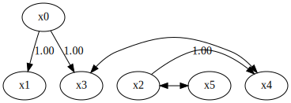
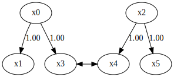
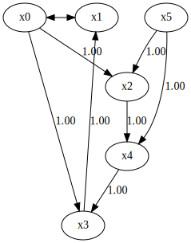

MultiGroupCAMUV
===============

Import and settings
-------------------

.. code-block:: python

    import numpy as np
    import random
    import lingam
    from lingam.utils import make_dot

.. code-block:: python

    def get_noise(n):
        noise = ((np.random.rand(1, n)-0.5)*5).reshape(n)
        mean = get_random_constant(0.0,2.0)
        noise += mean
        return noise

.. code-block:: python

    def causal_func(cause):
        a = get_random_constant(-5.0,5.0)
        b = get_random_constant(-1.0,1.0)
        c = int(random.uniform(2,3))
        return ((cause+a)**(c))+b

.. code-block:: python

    def get_random_constant(s,b):
        constant = random.uniform(-1.0, 1.0)
        if constant>0:
            constant = random.uniform(s, b)
        else:
            constant = random.uniform(-b, -s)
        return constant

.. code-block:: python

    def create_data(n, n_variables, causal_pairs, intermediate_pairs, confounder_pairs):
        data = np.zeros((n, n_variables)) # observed data
        confounders = np.zeros((n, len(confounder_pairs))) # data of unobserced common causes
    
        # Adding external effects
        for i in range(n_variables):
            data[:,i] = get_noise(n)
        for i in range(len(confounder_pairs)):
            confounders[:,i] = get_noise(n)
            confounders[:,i] = confounders[:,i] / np.std(confounders[:,i])
    
        # Adding the effects of unobserved common causes
        for i, cpair in enumerate(confounder_pairs):
            cpair = list(cpair)
            cpair.sort()
            data[:,cpair[0]] += causal_func(confounders[:,i])
            data[:,cpair[1]] += causal_func(confounders[:,i])
    
        for i1 in range(n_variables)[0:n_variables]:
            data[:,i1] = data[:,i1] / np.std(data[:,i1])
            for i2 in range(n_variables)[i1+1:n_variables+1]:
                # Adding direct effects between observed variables
                if [i1, i2] in causal_pairs:
                    data[:,i2] += causal_func(data[:,i1])
                # Adding undirected effects between observed variables mediated through unobserved variables
                if [i1, i2] in intermediate_pairs:
                    interm = causal_func(data[:,i1])+get_noise(n)
                    interm = interm / np.std(interm)
                    data[:,i2] += causal_func(interm)
        
        return data

.. code-block:: python

    def make_adjacency_matrix(n_variables, causal_pairs, confounder_pairs, intermediate_pairs):
        B = np.zeros([n_variables, n_variables])
        for pair in causal_pairs:
            B[pair[1], pair[0]] = 1
        for pair in confounder_pairs:
            B[pair[0], pair[1]] = np.nan
            B[pair[1], pair[0]] = np.nan
        for pair in intermediate_pairs:
            B[pair[0], pair[1]] = np.nan
            B[pair[1], pair[0]] = np.nan
        return B

Data generation
---------------

We generate two datasets consisting of 6 variables and 2 latent
variable.

.. code-block:: python

    n_variables = 6
    causal_pairs = [[0,1],[0,3],[2,4]]
    intermediate_pairs = [[2,5]]
    confounder_pairs = [[3,4]]
    
    make_dot(make_adjacency_matrix(n_variables, causal_pairs, confounder_pairs, intermediate_pairs))

.. code-block:: python

    X1 = create_data(100, n_variables, causal_pairs, intermediate_pairs, confounder_pairs)
    X2 = create_data(100, n_variables, causal_pairs, intermediate_pairs, confounder_pairs)
    X3 = create_data(100, n_variables, causal_pairs, intermediate_pairs, confounder_pairs)
    X_list = [X1, X2, X3]

Causal Discovery
----------------

To run causal discovery for multiple datasets, we create a
``MultiGroupCAMUV`` object and call the ``fit()`` method. Using the
``adjacency_matrix_`` properties, we can see the adjacency matrix as a
result of the causal discovery. The coefficients between variables with
latent confounders are **np.nan**.

.. code-block:: python

    model = lingam.MultiGroupCAMUV()
    model.fit(X_list)
    print(model._adjacency_matrix)
    make_dot(model._adjacency_matrix)

.. parsed-literal::

    [[ 0.  0.  0.  0.  0.  0.]
     [ 1.  0.  0.  0.  0.  0.]
     [ 0.  0.  0.  0.  0.  0.]
     [ 1.  0.  0.  0. nan  0.]
     [ 0.  0.  1. nan  0.  0.]
     [ 0.  0.  1.  0.  0.  0.]]
    

To compare, we run ``CAMUV`` with single dataset concatenating three
datasets. You can see that the causal structure cannot be estimated
correctly for a single dataset.

.. code-block:: python

    X_all = np.concatenate([X1, X2, X3])
    print(X_all.shape)
    model = lingam.CAMUV()
    model.fit(X_all)
    print(model._adjacency_matrix)
    make_dot(model._adjacency_matrix)

.. parsed-literal::

    (300, 6)
    [[ 0. nan  0.  0.  0.  0.]
     [nan  0.  0.  1.  0.  0.]
     [ 1.  0.  0.  0.  0.  1.]
     [ 1.  0.  0.  0.  1.  0.]
     [ 0.  0.  1.  0.  0.  1.]
     [ 0.  0.  0.  0.  0.  0.]]
    

