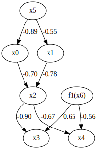
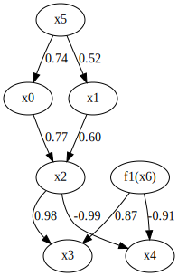
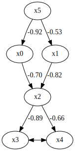
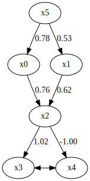
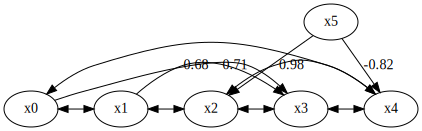

MultiGroupRCD
=============

Import and settings
-------------------

.. code-block:: python

    mport random
    import numpy as np
    import pandas as pd
    import graphviz
    import lingam
    from lingam.utils import print_causal_directions, print_dagc, make_dot

    np.set_printoptions(precision=3, suppress=True)
    np.random.seed(0)

Test data
---------

We generate two datasets consisting of 6 variables and 1 latent variable.

.. code-block:: python

    def get_coef():
        coef = random.random()
        return coef if coef >= 0.5 else coef - 1.0
    get_external_effect = lambda n: np.random.normal(0.0, 0.5, n) ** 3

.. code-block:: python

    B1 = np.array([[       0.0,        0.0,        0.0,        0.0,        0.0, get_coef(),        0.0],
                   [       0.0,        0.0,        0.0,        0.0,        0.0, get_coef(),        0.0],
                   [get_coef(), get_coef(),        0.0,        0.0,        0.0,        0.0,        0.0],
                   [       0.0,        0.0, get_coef(),        0.0,        0.0,        0.0, get_coef()],
                   [       0.0,        0.0, get_coef(),        0.0,        0.0,        0.0, get_coef()],
                   [       0.0,        0.0,        0.0,        0.0,        0.0,        0.0,        0.0],
                   [       0.0,        0.0,        0.0,        0.0,        0.0,        0.0,        0.0]])

    samples = 1000
    x5 = get_external_effect(samples)
    x6 = get_external_effect(samples)
    x0 = x5 * B1[0, 5] + get_external_effect(samples)
    x1 = x5 * B1[1, 5] + get_external_effect(samples)
    x2 = x0 * B1[2, 0] + x1 * B1[2, 1] + get_external_effect(samples)
    x3 = x2 * B1[3, 2] + x6 * B1[3, 6] + get_external_effect(samples)
    x4 = x2 * B1[4, 2] + x6 * B1[4, 6] + get_external_effect(samples)

    # x5, x6 is a latent variable.
    X1 = pd.DataFrame(np.array([x0, x1, x2, x3, x4, x5]).T ,columns=['x0', 'x1', 'x2', 'x3', 'x4', 'x5'])

.. code-block:: python

    make_dot(B1, labels=['x0', 'x1', 'x2', 'x3', 'x4', 'x5', 'f1(x6)'])

.. code-block:: python

    B2 = np.array([[       0.0,        0.0,        0.0,        0.0,        0.0, get_coef(),        0.0],
                   [       0.0,        0.0,        0.0,        0.0,        0.0, get_coef(),        0.0],
                   [get_coef(), get_coef(),        0.0,        0.0,        0.0,        0.0,        0.0],
                   [       0.0,        0.0, get_coef(),        0.0,        0.0,        0.0, get_coef()],
                   [       0.0,        0.0, get_coef(),        0.0,        0.0,        0.0, get_coef()],
                   [       0.0,        0.0,        0.0,        0.0,        0.0,        0.0,        0.0],
                   [       0.0,        0.0,        0.0,        0.0,        0.0,        0.0,        0.0]])

    samples = 1000
    x5 = get_external_effect(samples)
    x6 = get_external_effect(samples)
    x0 = x5 * B2[0, 5] + get_external_effect(samples)
    x1 = x5 * B2[1, 5] + get_external_effect(samples)
    x2 = x0 * B2[2, 0] + x1 * B2[2, 1] + get_external_effect(samples)
    x3 = x2 * B2[3, 2] + x6 * B2[3, 6] + get_external_effect(samples)
    x4 = x2 * B2[4, 2] + x6 * B2[4, 6] + get_external_effect(samples)

    # x5, x6 is a latent variable.
    X2 = pd.DataFrame(np.array([x0, x1, x2, x3, x4, x5]).T ,columns=['x0', 'x1', 'x2', 'x3', 'x4', 'x5'])

.. code-block:: python

    make_dot(B2, labels=['x0', 'x1', 'x2', 'x3', 'x4', 'x5', 'f1(x6)'])

We create a list variable that contains two datasets.

.. code-block:: python

    X_list = [X1, X2]

Causal Discovery
----------------

To run causal discovery for multiple datasets, we create a `MultiGroupRCD` object and call the `fit()` method.

.. code-block:: python

    model = lingam.MultiGroupRCD()
    model.fit(X_list)

Using the `ancestors_list_` properties, we can see the list of ancestors sets as a result of the causal discovery.

.. code-block:: python

    ancestors_list = model.ancestors_list_

    for i, ancestors in enumerate(ancestors_list):
        print(f'M{i}={ancestors}')

.. parsed-literal::

    M0={5}
    M1={5}
    M2={0, 1, 5}
    M3={0, 1, 2, 5}
    M4={0, 1, 2, 5}
    M5=set()

Also, using the `adjacency_matrix_` properties, we can see the adjacency matrix as a result of the causal discovery. The coefficients between variables with latent confounders are np.nan.

.. code-block:: python

    print(model.adjacency_matrices_[0])
    make_dot(model.adjacency_matrices_[0])

.. parsed-literal::

    [[ 0.     0.     0.     0.     0.    -0.92 ]
     [ 0.     0.     0.     0.     0.    -0.528]
     [-0.701 -0.821  0.     0.     0.     0.   ]
     [ 0.     0.    -0.891  0.       nan  0.   ]
     [ 0.     0.    -0.664    nan  0.     0.   ]
     [ 0.     0.     0.     0.     0.     0.   ]]
    

.. code-block:: python

    print(model.adjacency_matrices_[1])
    make_dot(model.adjacency_matrices_[1])

.. parsed-literal::

    [[ 0.     0.     0.     0.     0.     0.778]
     [ 0.     0.     0.     0.     0.     0.528]
     [ 0.755  0.621  0.     0.     0.     0.   ]
     [ 0.     0.     1.023  0.       nan  0.   ]
     [ 0.     0.    -0.996    nan  0.     0.   ]
     [ 0.     0.     0.     0.     0.     0.   ]]
    

To compare, we run `MultiGroupRCD` with single dataset concatenating two datasets. You can see that the causal structure cannot be estimated correctly for a single dataset.

.. code-block:: python

    X_all = pd.concat([X1, X2])
    print(X_all.shape)

    model_all = lingam.RCD()
    model_all.fit(X_all)

    ancestors_list = model.ancestors_list_

    for i, ancestors in enumerate(ancestors_list):
        print(f'M{i}={ancestors}')
        
    make_dot(model_all.adjacency_matrix_)

.. parsed-literal::

    (2000, 6)
    M0={5}
    M1={5}
    M2={0, 1, 5}
    M3={0, 1, 2, 5}
    M4={0, 1, 2, 5}
    M5=set()

