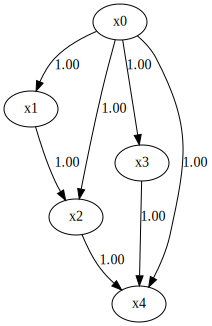

MultiGroupRESIT
===============

Import and settings
-------------------

In this example, we need to import ``numpy``, ``pandas``, and
``graphviz`` in addition to ``lingam``.

.. code-block:: python

    import random
    import numpy as np
    import pandas as pd
    import graphviz
    from IPython.display import display, HTML
    
    from scipy.stats import norm, uniform
    from sklearn.ensemble import RandomForestRegressor
    
    import lingam
    from lingam.utils import make_dot
    
    import warnings
    warnings.filterwarnings('ignore')
  

.. code-block:: python

    np.set_printoptions(precision=3, suppress=True)
    seed = 123
    random.seed(seed)
    np.random.seed(seed)

.. code-block:: python

    def test_causes(estimated, true):
        true = np.where(true > 0, 1, true)
        true = np.where(true < 0, -1, true)
        true = np.where(true == 0, 2, true)
        count_true = int(np.count_nonzero((true == 1) | (true == -1)))
        
        estimated = np.where(estimated > 0, 1, estimated)
        estimated = np.where(estimated < 0, -1, estimated)
        estimated = np.where(estimated == 0, -2, estimated)
        count_estimated = int(np.count_nonzero((estimated == 1) | (estimated == -1)))
    
        TP = int(np.count_nonzero(true == estimated))
        precision = 0 if count_estimated == 0 else TP / count_estimated
        recall = 0 if count_true == 0 else TP / count_true
        f_measure = 0 if precision+recall == 0 else 2*precision*recall/(precision+recall)
        
        return precision, recall, f_measure

.. code-block:: python

    def get_random_constant(s,b):
        constant = random.uniform(-1.0, 1.0)
        if constant>0:
            constant = random.uniform(s, b)
        else:
            constant = random.uniform(-b, -s)
        return constant
    
    def get_noise(n):
        noise = ((np.random.rand(1, n)-0.5)*5).reshape(n)
        mean = get_random_constant(0.0,2.0)
        noise += mean
        return noise
    
    def causal_func(cause):
        a = get_random_constant(-5.0,5.0)
        b = get_random_constant(-1.0,1.0)
        c = int(random.uniform(2,3))
        return ((cause+a)**(c))+b
    
    def create_data(adjacency_matrix, n_samples=100):
        n_variables = adjacency_matrix.shape[0]
        causal_pairs = np.array(np.where(np.abs(adjacency_matrix) > 0))[[1, 0], :].T
        causal_pairs = tuple(map(tuple, causal_pairs))
        # print(f"causal_pairs: {causal_pairs}")
        data = np.zeros((n_samples, n_variables))
    
        for i in range(n_variables):
            data[:,i] = get_noise(n_samples)
    
        for i1 in range(n_variables):
            data[:,i1] = data[:,i1] / np.std(data[:,i1])
            for i2 in range(i1, n_variables):
                if (i1, i2) in causal_pairs:
                    # print(f"x{i1} -> x{i2}")
                    data[:,i2] += causal_func(data[:,i1])
            
        return data

Test data
---------

First, we generate a causal structure with 5 variables.

.. code-block:: python

    n_samples = 100
    n_variables = 5
    n_pairs = 7
    causal_pairs = []
    while len(causal_pairs) < n_pairs:
        xi = random.randint(0, n_variables - 1)
        xj = random.randint(0, n_variables - 1)
        if xi == xj:
            continue
        xi, xj = sorted([xi, xj])
        if not (xi, xj) in causal_pairs:
            causal_pairs.append((xi, xj))
    
    true_graph = np.zeros([n_variables, n_variables])
    for pair in causal_pairs:
        true_graph[pair[1], pair[0]] = 1
    
    print(true_graph)
    make_dot(true_graph)

.. parsed-literal::

    [[0. 0. 0. 0. 0.]
     [1. 0. 0. 0. 0.]
     [1. 1. 0. 0. 0.]
     [1. 0. 0. 0. 0.]
     [1. 0. 1. 1. 0.]]
    

We create a list variable that contains two datasets.

.. code-block:: python

    X1 = pd.DataFrame(create_data(true_graph, n_samples), columns=[f'x{i}' for i in range(n_variables)])
    X2 = pd.DataFrame(create_data(true_graph, n_samples), columns=[f'x{i}' for i in range(n_variables)])
    X3 = pd.DataFrame(create_data(true_graph, n_samples), columns=[f'x{i}' for i in range(n_variables)])
    X_list = [X1, X2, X3]

Causal Discovery
----------------

To run causal discovery for multiple datasets, we create a
``MultiGroupRESIT`` object and call the ``fit()`` method.

.. code-block:: python

    reg = RandomForestRegressor(max_depth=4, random_state=0)
    
    model = lingam.MultiGroupRESIT(regressor=reg)
    model.fit(X_list)
    
    print(f"Causal Order={model.causal_order_}")
    for i in range(3):
        precision, recall, f_measure = test_causes(model._adjacency_matrices[i], true_graph)
        print(f"Dataset #{i+1}\n  Precision={precision:.3f}\n  Recall={recall:.3f}\n  F-measure={f_measure:.3f}\n")
    
    # Render both graphs as SVG strings
    true_svg = make_dot(true_graph).pipe(format='svg').decode('utf-8')
    svg1 = make_dot(model._adjacency_matrices[0]).pipe(format='svg').decode('utf-8')
    svg2 = make_dot(model._adjacency_matrices[1]).pipe(format='svg').decode('utf-8')
    svg3 = make_dot(model._adjacency_matrices[2]).pipe(format='svg').decode('utf-8')
    
    # Display side by side using HTML
    html = f"""
    

      

        <h3 style="text-align: center;">Ground Truth</h3>
        {true_svg}
      

      

        <h3 style="text-align: center;">Dataset #1</h3>
        {svg1}
      

      

        <h3 style="text-align: center;">Dataset #2</h3>
        {svg2}
      

      

        <h3 style="text-align: center;">Dataset #3</h3>
        {svg3}
      

    

    """
    
    display(HTML(html))

.. parsed-literal::

    Causal Order=[0, 2, 4, 3, 1]
    Dataset #1
      Precision=0.500
      Recall=0.429
      F-measure=0.462
    
    Dataset #2
      Precision=0.800
      Recall=0.571
      F-measure=0.667
    
    Dataset #3
      Precision=0.400
      Recall=0.286
      F-measure=0.333
    
    

.. raw:: html

    
    

      

        <h3 style="text-align: center;">Ground Truth</h3>
        <?xml version="1.0" encoding="UTF-8" standalone="no"?>
    <!DOCTYPE svg PUBLIC "-//W3C//DTD SVG 1.1//EN"
     "http://www.w3.org/Graphics/SVG/1.1/DTD/svg11.dtd">
    <!-- Generated by graphviz version 6.0.2 (20221011.1828)
     -->
    <!-- Pages: 1 -->
    <svg width="212pt" height="326pt"
     viewBox="0.00 0.00 212.00 326.00" xmlns="http://www.w3.org/2000/svg" xmlns:xlink="http://www.w3.org/1999/xlink">
    <g id="graph0" class="graph" transform="scale(1 1) rotate(0) translate(4 322)">
    <polygon fill="white" stroke="none" points="-4,4 -4,-322 208,-322 208,4 -4,4"/>
    <!-- x0 -->
    <g id="node1" class="node">
    <title>x0</title>
    <ellipse fill="none" stroke="black" cx="116" cy="-300" rx="27" ry="18"/>
    <text text-anchor="middle" x="116" y="-296.3" font-family="Times New Roman,serif" font-size="14.00">x0</text>
    </g>
    <!-- x1 -->
    <g id="node2" class="node">
    <title>x1</title>
    <ellipse fill="none" stroke="black" cx="27" cy="-213" rx="27" ry="18"/>
    <text text-anchor="middle" x="27" y="-209.3" font-family="Times New Roman,serif" font-size="14.00">x1</text>
    </g>
    <!-- x0&#45;&gt;x1 -->
    <g id="edge1" class="edge">
    <title>x0&#45;&gt;x1</title>
    <path fill="none" stroke="black" d="M92.62,-290.67C79.09,-284.89 62.5,-276.05 51,-264 44.6,-257.29 39.61,-248.55 35.89,-240.26"/>
    <polygon fill="black" stroke="black" points="39.09,-238.84 32.09,-230.88 32.6,-241.47 39.09,-238.84"/>
    <text text-anchor="middle" x="63.5" y="-252.8" font-family="Times New Roman,serif" font-size="14.00">1.00</text>
    </g>
    <!-- x2 -->
    <g id="node3" class="node">
    <title>x2</title>
    <ellipse fill="none" stroke="black" cx="72" cy="-105" rx="27" ry="18"/>
    <text text-anchor="middle" x="72" y="-101.3" font-family="Times New Roman,serif" font-size="14.00">x2</text>
    </g>
    <!-- x0&#45;&gt;x2 -->
    <g id="edge2" class="edge">
    <title>x0&#45;&gt;x2</title>
    <path fill="none" stroke="black" d="M111.23,-282.02C107.45,-268.3 102.13,-248.47 98,-231 90.06,-197.4 82.16,-158.42 77.19,-133.04"/>
    <polygon fill="black" stroke="black" points="80.59,-132.19 75.24,-123.05 73.72,-133.53 80.59,-132.19"/>
    <text text-anchor="middle" x="110.5" y="-209.3" font-family="Times New Roman,serif" font-size="14.00">1.00</text>
    </g>
    <!-- x3 -->
    <g id="node4" class="node">
    <title>x3</title>
    <ellipse fill="none" stroke="black" cx="138" cy="-159" rx="27" ry="18"/>
    <text text-anchor="middle" x="138" y="-155.3" font-family="Times New Roman,serif" font-size="14.00">x3</text>
    </g>
    <!-- x0&#45;&gt;x3 -->
    <g id="edge4" class="edge">
    <title>x0&#45;&gt;x3</title>
    <path fill="none" stroke="black" d="M118.7,-281.96C122.44,-258.3 129.25,-215.26 133.7,-187.15"/>
    <polygon fill="black" stroke="black" points="137.17,-187.61 135.28,-177.18 130.26,-186.51 137.17,-187.61"/>
    <text text-anchor="middle" x="135.5" y="-252.8" font-family="Times New Roman,serif" font-size="14.00">1.00</text>
    </g>
    <!-- x4 -->
    <g id="node5" class="node">
    <title>x4</title>
    <ellipse fill="none" stroke="black" cx="135" cy="-18" rx="27" ry="18"/>
    <text text-anchor="middle" x="135" y="-14.3" font-family="Times New Roman,serif" font-size="14.00">x4</text>
    </g>
    <!-- x0&#45;&gt;x4 -->
    <g id="edge5" class="edge">
    <title>x0&#45;&gt;x4</title>
    <path fill="none" stroke="black" d="M133.46,-286.13C140.31,-280.17 147.58,-272.51 152,-264 188.41,-193.99 182.75,-164.11 166,-87 162.75,-72.05 155.92,-56.44 149.49,-43.95"/>
    <polygon fill="black" stroke="black" points="152.54,-42.23 144.72,-35.08 146.37,-45.54 152.54,-42.23"/>
    <text text-anchor="middle" x="191.5" y="-155.3" font-family="Times New Roman,serif" font-size="14.00">1.00</text>
    </g>
    <!-- x1&#45;&gt;x2 -->
    <g id="edge3" class="edge">
    <title>x1&#45;&gt;x2</title>
    <path fill="none" stroke="black" d="M31.55,-195.26C35.79,-180.62 42.7,-158.95 51,-141 52.61,-137.51 54.48,-133.94 56.43,-130.46"/>
    <polygon fill="black" stroke="black" points="59.57,-132.03 61.64,-121.64 53.54,-128.47 59.57,-132.03"/>
    <text text-anchor="middle" x="63.5" y="-155.3" font-family="Times New Roman,serif" font-size="14.00">1.00</text>
    </g>
    <!-- x2&#45;&gt;x4 -->
    <g id="edge6" class="edge">
    <title>x2&#45;&gt;x4</title>
    <path fill="none" stroke="black" d="M78.07,-87.33C82.23,-77.14 88.37,-64.17 96,-54 100.01,-48.65 104.93,-43.49 109.92,-38.85"/>
    <polygon fill="black" stroke="black" points="112.47,-41.26 117.67,-32.03 107.85,-36 112.47,-41.26"/>
    <text text-anchor="middle" x="108.5" y="-57.8" font-family="Times New Roman,serif" font-size="14.00">1.00</text>
    </g>
    <!-- x3&#45;&gt;x4 -->
    <g id="edge7" class="edge">
    <title>x3&#45;&gt;x4</title>
    <path fill="none" stroke="black" d="M137.63,-140.96C137.12,-117.4 136.2,-74.64 135.59,-46.53"/>
    <polygon fill="black" stroke="black" points="139.09,-46.11 135.37,-36.18 132.09,-46.26 139.09,-46.11"/>
    <text text-anchor="middle" x="149.5" y="-101.3" font-family="Times New Roman,serif" font-size="14.00">1.00</text>
    </g>
    </g>
    </svg>
    
      

      

        <h3 style="text-align: center;">Dataset #1</h3>
        <?xml version="1.0" encoding="UTF-8" standalone="no"?>
    <!DOCTYPE svg PUBLIC "-//W3C//DTD SVG 1.1//EN"
     "http://www.w3.org/Graphics/SVG/1.1/DTD/svg11.dtd">
    <!-- Generated by graphviz version 6.0.2 (20221011.1828)
     -->
    <!-- Pages: 1 -->
    <svg width="195pt" height="305pt"
     viewBox="0.00 0.00 195.00 305.00" xmlns="http://www.w3.org/2000/svg" xmlns:xlink="http://www.w3.org/1999/xlink">
    <g id="graph0" class="graph" transform="scale(1 1) rotate(0) translate(4 301)">
    <polygon fill="white" stroke="none" points="-4,4 -4,-301 191,-301 191,4 -4,4"/>
    <!-- x0 -->
    <g id="node1" class="node">
    <title>x0</title>
    <ellipse fill="none" stroke="black" cx="90" cy="-279" rx="27" ry="18"/>
    <text text-anchor="middle" x="90" y="-275.3" font-family="Times New Roman,serif" font-size="14.00">x0</text>
    </g>
    <!-- x2 -->
    <g id="node3" class="node">
    <title>x2</title>
    <ellipse fill="none" stroke="black" cx="27" cy="-192" rx="27" ry="18"/>
    <text text-anchor="middle" x="27" y="-188.3" font-family="Times New Roman,serif" font-size="14.00">x2</text>
    </g>
    <!-- x0&#45;&gt;x2 -->
    <g id="edge2" class="edge">
    <title>x0&#45;&gt;x2</title>
    <path fill="none" stroke="black" d="M72.67,-264.97C65.34,-258.87 57.11,-251.15 51,-243 45.58,-235.77 40.91,-227.12 37.16,-219.07"/>
    <polygon fill="black" stroke="black" points="40.27,-217.44 33.07,-209.67 33.86,-220.24 40.27,-217.44"/>
    <text text-anchor="middle" x="63.5" y="-231.8" font-family="Times New Roman,serif" font-size="14.00">1.00</text>
    </g>
    <!-- x3 -->
    <g id="node4" class="node">
    <title>x3</title>
    <ellipse fill="none" stroke="black" cx="90" cy="-105" rx="27" ry="18"/>
    <text text-anchor="middle" x="90" y="-101.3" font-family="Times New Roman,serif" font-size="14.00">x3</text>
    </g>
    <!-- x0&#45;&gt;x3 -->
    <g id="edge3" class="edge">
    <title>x0&#45;&gt;x3</title>
    <path fill="none" stroke="black" d="M90,-260.88C90,-231 90,-169.11 90,-133.27"/>
    <polygon fill="black" stroke="black" points="93.5,-133.05 90,-123.05 86.5,-133.05 93.5,-133.05"/>
    <text text-anchor="middle" x="102.5" y="-188.3" font-family="Times New Roman,serif" font-size="14.00">1.00</text>
    </g>
    <!-- x4 -->
    <g id="node5" class="node">
    <title>x4</title>
    <ellipse fill="none" stroke="black" cx="160" cy="-192" rx="27" ry="18"/>
    <text text-anchor="middle" x="160" y="-188.3" font-family="Times New Roman,serif" font-size="14.00">x4</text>
    </g>
    <!-- x0&#45;&gt;x4 -->
    <g id="edge6" class="edge">
    <title>x0&#45;&gt;x4</title>
    <path fill="none" stroke="black" d="M102.51,-262.8C113.27,-249.75 128.92,-230.74 141.18,-215.85"/>
    <polygon fill="black" stroke="black" points="143.94,-218.01 147.59,-208.06 138.53,-213.56 143.94,-218.01"/>
    <text text-anchor="middle" x="141.5" y="-231.8" font-family="Times New Roman,serif" font-size="14.00">1.00</text>
    </g>
    <!-- x1 -->
    <g id="node2" class="node">
    <title>x1</title>
    <ellipse fill="none" stroke="black" cx="90" cy="-18" rx="27" ry="18"/>
    <text text-anchor="middle" x="90" y="-14.3" font-family="Times New Roman,serif" font-size="14.00">x1</text>
    </g>
    <!-- x2&#45;&gt;x3 -->
    <g id="edge4" class="edge">
    <title>x2&#45;&gt;x3</title>
    <path fill="none" stroke="black" d="M33.07,-174.33C37.23,-164.14 43.37,-151.17 51,-141 55.01,-135.65 59.93,-130.49 64.92,-125.85"/>
    <polygon fill="black" stroke="black" points="67.47,-128.26 72.67,-119.03 62.85,-123 67.47,-128.26"/>
    <text text-anchor="middle" x="63.5" y="-144.8" font-family="Times New Roman,serif" font-size="14.00">1.00</text>
    </g>
    <!-- x3&#45;&gt;x1 -->
    <g id="edge1" class="edge">
    <title>x3&#45;&gt;x1</title>
    <path fill="none" stroke="black" d="M90,-86.8C90,-75.16 90,-59.55 90,-46.24"/>
    <polygon fill="black" stroke="black" points="93.5,-46.18 90,-36.18 86.5,-46.18 93.5,-46.18"/>
    <text text-anchor="middle" x="102.5" y="-57.8" font-family="Times New Roman,serif" font-size="14.00">1.00</text>
    </g>
    <!-- x4&#45;&gt;x3 -->
    <g id="edge5" class="edge">
    <title>x4&#45;&gt;x3</title>
    <path fill="none" stroke="black" d="M147.49,-175.8C136.73,-162.75 121.08,-143.74 108.82,-128.85"/>
    <polygon fill="black" stroke="black" points="111.47,-126.56 102.41,-121.06 106.06,-131.01 111.47,-126.56"/>
    <text text-anchor="middle" x="141.5" y="-144.8" font-family="Times New Roman,serif" font-size="14.00">1.00</text>
    </g>
    </g>
    </svg>
    
      

      

        <h3 style="text-align: center;">Dataset #2</h3>
        <?xml version="1.0" encoding="UTF-8" standalone="no"?>
    <!DOCTYPE svg PUBLIC "-//W3C//DTD SVG 1.1//EN"
     "http://www.w3.org/Graphics/SVG/1.1/DTD/svg11.dtd">
    <!-- Generated by graphviz version 6.0.2 (20221011.1828)
     -->
    <!-- Pages: 1 -->
    <svg width="195pt" height="218pt"
     viewBox="0.00 0.00 195.00 218.00" xmlns="http://www.w3.org/2000/svg" xmlns:xlink="http://www.w3.org/1999/xlink">
    <g id="graph0" class="graph" transform="scale(1 1) rotate(0) translate(4 214)">
    <polygon fill="white" stroke="none" points="-4,4 -4,-214 191,-214 191,4 -4,4"/>
    <!-- x0 -->
    <g id="node1" class="node">
    <title>x0</title>
    <ellipse fill="none" stroke="black" cx="90" cy="-192" rx="27" ry="18"/>
    <text text-anchor="middle" x="90" y="-188.3" font-family="Times New Roman,serif" font-size="14.00">x0</text>
    </g>
    <!-- x2 -->
    <g id="node3" class="node">
    <title>x2</title>
    <ellipse fill="none" stroke="black" cx="27" cy="-105" rx="27" ry="18"/>
    <text text-anchor="middle" x="27" y="-101.3" font-family="Times New Roman,serif" font-size="14.00">x2</text>
    </g>
    <!-- x0&#45;&gt;x2 -->
    <g id="edge2" class="edge">
    <title>x0&#45;&gt;x2</title>
    <path fill="none" stroke="black" d="M72.67,-177.97C65.34,-171.87 57.11,-164.15 51,-156 45.58,-148.77 40.91,-140.12 37.16,-132.07"/>
    <polygon fill="black" stroke="black" points="40.27,-130.44 33.07,-122.67 33.86,-133.24 40.27,-130.44"/>
    <text text-anchor="middle" x="63.5" y="-144.8" font-family="Times New Roman,serif" font-size="14.00">1.00</text>
    </g>
    <!-- x3 -->
    <g id="node4" class="node">
    <title>x3</title>
    <ellipse fill="none" stroke="black" cx="160" cy="-105" rx="27" ry="18"/>
    <text text-anchor="middle" x="160" y="-101.3" font-family="Times New Roman,serif" font-size="14.00">x3</text>
    </g>
    <!-- x0&#45;&gt;x3 -->
    <g id="edge3" class="edge">
    <title>x0&#45;&gt;x3</title>
    <path fill="none" stroke="black" d="M102.51,-175.8C113.27,-162.75 128.92,-143.74 141.18,-128.85"/>
    <polygon fill="black" stroke="black" points="143.94,-131.01 147.59,-121.06 138.53,-126.56 143.94,-131.01"/>
    <text text-anchor="middle" x="141.5" y="-144.8" font-family="Times New Roman,serif" font-size="14.00">1.00</text>
    </g>
    <!-- x4 -->
    <g id="node5" class="node">
    <title>x4</title>
    <ellipse fill="none" stroke="black" cx="58" cy="-18" rx="27" ry="18"/>
    <text text-anchor="middle" x="58" y="-14.3" font-family="Times New Roman,serif" font-size="14.00">x4</text>
    </g>
    <!-- x0&#45;&gt;x4 -->
    <g id="edge4" class="edge">
    <title>x0&#45;&gt;x4</title>
    <path fill="none" stroke="black" d="M89.7,-173.8C88.87,-147.51 85.73,-95.97 74,-54 73.15,-50.95 72.06,-47.82 70.85,-44.76"/>
    <polygon fill="black" stroke="black" points="73.95,-43.1 66.75,-35.33 67.53,-45.9 73.95,-43.1"/>
    <text text-anchor="middle" x="99.5" y="-101.3" font-family="Times New Roman,serif" font-size="14.00">1.00</text>
    </g>
    <!-- x1 -->
    <g id="node2" class="node">
    <title>x1</title>
    <ellipse fill="none" stroke="black" cx="160" cy="-18" rx="27" ry="18"/>
    <text text-anchor="middle" x="160" y="-14.3" font-family="Times New Roman,serif" font-size="14.00">x1</text>
    </g>
    <!-- x2&#45;&gt;x4 -->
    <g id="edge5" class="edge">
    <title>x2&#45;&gt;x4</title>
    <path fill="none" stroke="black" d="M33.12,-87.21C37.5,-75.22 43.47,-58.85 48.46,-45.16"/>
    <polygon fill="black" stroke="black" points="51.75,-46.35 51.89,-35.76 45.17,-43.95 51.75,-46.35"/>
    <text text-anchor="middle" x="57.5" y="-57.8" font-family="Times New Roman,serif" font-size="14.00">1.00</text>
    </g>
    <!-- x3&#45;&gt;x1 -->
    <g id="edge1" class="edge">
    <title>x3&#45;&gt;x1</title>
    <path fill="none" stroke="black" d="M160,-86.8C160,-75.16 160,-59.55 160,-46.24"/>
    <polygon fill="black" stroke="black" points="163.5,-46.18 160,-36.18 156.5,-46.18 163.5,-46.18"/>
    <text text-anchor="middle" x="172.5" y="-57.8" font-family="Times New Roman,serif" font-size="14.00">1.00</text>
    </g>
    </g>
    </svg>
    
      

      

        <h3 style="text-align: center;">Dataset #3</h3>
        <?xml version="1.0" encoding="UTF-8" standalone="no"?>
    <!DOCTYPE svg PUBLIC "-//W3C//DTD SVG 1.1//EN"
     "http://www.w3.org/Graphics/SVG/1.1/DTD/svg11.dtd">
    <!-- Generated by graphviz version 6.0.2 (20221011.1828)
     -->
    <!-- Pages: 1 -->
    <svg width="134pt" height="305pt"
     viewBox="0.00 0.00 134.00 305.00" xmlns="http://www.w3.org/2000/svg" xmlns:xlink="http://www.w3.org/1999/xlink">
    <g id="graph0" class="graph" transform="scale(1 1) rotate(0) translate(4 301)">
    <polygon fill="white" stroke="none" points="-4,4 -4,-301 130,-301 130,4 -4,4"/>
    <!-- x0 -->
    <g id="node1" class="node">
    <title>x0</title>
    <ellipse fill="none" stroke="black" cx="63" cy="-279" rx="27" ry="18"/>
    <text text-anchor="middle" x="63" y="-275.3" font-family="Times New Roman,serif" font-size="14.00">x0</text>
    </g>
    <!-- x2 -->
    <g id="node3" class="node">
    <title>x2</title>
    <ellipse fill="none" stroke="black" cx="63" cy="-192" rx="27" ry="18"/>
    <text text-anchor="middle" x="63" y="-188.3" font-family="Times New Roman,serif" font-size="14.00">x2</text>
    </g>
    <!-- x0&#45;&gt;x2 -->
    <g id="edge3" class="edge">
    <title>x0&#45;&gt;x2</title>
    <path fill="none" stroke="black" d="M63,-260.8C63,-249.16 63,-233.55 63,-220.24"/>
    <polygon fill="black" stroke="black" points="66.5,-220.18 63,-210.18 59.5,-220.18 66.5,-220.18"/>
    <text text-anchor="middle" x="75.5" y="-231.8" font-family="Times New Roman,serif" font-size="14.00">1.00</text>
    </g>
    <!-- x1 -->
    <g id="node2" class="node">
    <title>x1</title>
    <ellipse fill="none" stroke="black" cx="63" cy="-18" rx="27" ry="18"/>
    <text text-anchor="middle" x="63" y="-14.3" font-family="Times New Roman,serif" font-size="14.00">x1</text>
    </g>
    <!-- x3 -->
    <g id="node4" class="node">
    <title>x3</title>
    <ellipse fill="none" stroke="black" cx="27" cy="-105" rx="27" ry="18"/>
    <text text-anchor="middle" x="27" y="-101.3" font-family="Times New Roman,serif" font-size="14.00">x3</text>
    </g>
    <!-- x2&#45;&gt;x3 -->
    <g id="edge4" class="edge">
    <title>x2&#45;&gt;x3</title>
    <path fill="none" stroke="black" d="M54.74,-174.76C51.86,-168.9 48.68,-162.2 46,-156 42.72,-148.41 39.43,-140.06 36.52,-132.39"/>
    <polygon fill="black" stroke="black" points="39.73,-130.97 32.97,-122.82 33.17,-133.41 39.73,-130.97"/>
    <text text-anchor="middle" x="58.5" y="-144.8" font-family="Times New Roman,serif" font-size="14.00">1.00</text>
    </g>
    <!-- x4 -->
    <g id="node5" class="node">
    <title>x4</title>
    <ellipse fill="none" stroke="black" cx="99" cy="-105" rx="27" ry="18"/>
    <text text-anchor="middle" x="99" y="-101.3" font-family="Times New Roman,serif" font-size="14.00">x4</text>
    </g>
    <!-- x2&#45;&gt;x4 -->
    <g id="edge5" class="edge">
    <title>x2&#45;&gt;x4</title>
    <path fill="none" stroke="black" d="M70.11,-174.21C75.22,-162.14 82.21,-145.64 88.03,-131.89"/>
    <polygon fill="black" stroke="black" points="91.35,-133.04 92.02,-122.47 84.9,-130.31 91.35,-133.04"/>
    <text text-anchor="middle" x="95.5" y="-144.8" font-family="Times New Roman,serif" font-size="14.00">1.00</text>
    </g>
    <!-- x3&#45;&gt;x1 -->
    <g id="edge1" class="edge">
    <title>x3&#45;&gt;x1</title>
    <path fill="none" stroke="black" d="M32.97,-87.18C36.54,-77.41 41.29,-64.91 46,-54 47.34,-50.9 48.8,-47.67 50.29,-44.49"/>
    <polygon fill="black" stroke="black" points="53.56,-45.77 54.74,-35.24 47.25,-42.74 53.56,-45.77"/>
    <text text-anchor="middle" x="58.5" y="-57.8" font-family="Times New Roman,serif" font-size="14.00">1.00</text>
    </g>
    <!-- x4&#45;&gt;x1 -->
    <g id="edge2" class="edge">
    <title>x4&#45;&gt;x1</title>
    <path fill="none" stroke="black" d="M91.89,-87.21C86.78,-75.14 79.79,-58.64 73.97,-44.89"/>
    <polygon fill="black" stroke="black" points="77.1,-43.31 69.98,-35.47 70.65,-46.04 77.1,-43.31"/>
    <text text-anchor="middle" x="95.5" y="-57.8" font-family="Times New Roman,serif" font-size="14.00">1.00</text>
    </g>
    </g>
    </svg>
    
      

    

    

To compare, we run ``RESIT`` with single dataset concatenating two
datasets.

.. code-block:: python

    X_all = pd.concat([X1, X2, X3])
    print(X_all.shape)
    
    model = lingam.RESIT(regressor=reg)
    model.fit(X_all)
    
    print(f"Causal Order={model.causal_order_}")
    precision, recall, f_measure = test_causes(model.adjacency_matrix_, true_graph)
    print(f"Precision={precision:.3f}\nRecall={recall:.3f}\nF-measure={f_measure:.3f}\n")
    svg = make_dot(model.adjacency_matrix_).pipe(format='svg').decode('utf-8')
    
    # Display side by side using HTML
    html = f"""
    

      

        <h3 style="text-align: center;">Ground Truth</h3>
        {true_svg}
      

      

        <h3 style="text-align: center;">Combined dataset</h3>
        {svg}
      

    

    """
    
    display(HTML(html))

.. parsed-literal::

    (300, 5)
    Causal Order=[3, 2, 4, 1, 0]
    Precision=0.200
    Recall=0.286
    F-measure=0.235
    
    

.. raw:: html

    
    

      

        <h3 style="text-align: center;">Ground Truth</h3>
        <?xml version="1.0" encoding="UTF-8" standalone="no"?>
    <!DOCTYPE svg PUBLIC "-//W3C//DTD SVG 1.1//EN"
     "http://www.w3.org/Graphics/SVG/1.1/DTD/svg11.dtd">
    <!-- Generated by graphviz version 6.0.2 (20221011.1828)
     -->
    <!-- Pages: 1 -->
    <svg width="212pt" height="326pt"
     viewBox="0.00 0.00 212.00 326.00" xmlns="http://www.w3.org/2000/svg" xmlns:xlink="http://www.w3.org/1999/xlink">
    <g id="graph0" class="graph" transform="scale(1 1) rotate(0) translate(4 322)">
    <polygon fill="white" stroke="none" points="-4,4 -4,-322 208,-322 208,4 -4,4"/>
    <!-- x0 -->
    <g id="node1" class="node">
    <title>x0</title>
    <ellipse fill="none" stroke="black" cx="116" cy="-300" rx="27" ry="18"/>
    <text text-anchor="middle" x="116" y="-296.3" font-family="Times New Roman,serif" font-size="14.00">x0</text>
    </g>
    <!-- x1 -->
    <g id="node2" class="node">
    <title>x1</title>
    <ellipse fill="none" stroke="black" cx="27" cy="-213" rx="27" ry="18"/>
    <text text-anchor="middle" x="27" y="-209.3" font-family="Times New Roman,serif" font-size="14.00">x1</text>
    </g>
    <!-- x0&#45;&gt;x1 -->
    <g id="edge1" class="edge">
    <title>x0&#45;&gt;x1</title>
    <path fill="none" stroke="black" d="M92.62,-290.67C79.09,-284.89 62.5,-276.05 51,-264 44.6,-257.29 39.61,-248.55 35.89,-240.26"/>
    <polygon fill="black" stroke="black" points="39.09,-238.84 32.09,-230.88 32.6,-241.47 39.09,-238.84"/>
    <text text-anchor="middle" x="63.5" y="-252.8" font-family="Times New Roman,serif" font-size="14.00">1.00</text>
    </g>
    <!-- x2 -->
    <g id="node3" class="node">
    <title>x2</title>
    <ellipse fill="none" stroke="black" cx="72" cy="-105" rx="27" ry="18"/>
    <text text-anchor="middle" x="72" y="-101.3" font-family="Times New Roman,serif" font-size="14.00">x2</text>
    </g>
    <!-- x0&#45;&gt;x2 -->
    <g id="edge2" class="edge">
    <title>x0&#45;&gt;x2</title>
    <path fill="none" stroke="black" d="M111.23,-282.02C107.45,-268.3 102.13,-248.47 98,-231 90.06,-197.4 82.16,-158.42 77.19,-133.04"/>
    <polygon fill="black" stroke="black" points="80.59,-132.19 75.24,-123.05 73.72,-133.53 80.59,-132.19"/>
    <text text-anchor="middle" x="110.5" y="-209.3" font-family="Times New Roman,serif" font-size="14.00">1.00</text>
    </g>
    <!-- x3 -->
    <g id="node4" class="node">
    <title>x3</title>
    <ellipse fill="none" stroke="black" cx="138" cy="-159" rx="27" ry="18"/>
    <text text-anchor="middle" x="138" y="-155.3" font-family="Times New Roman,serif" font-size="14.00">x3</text>
    </g>
    <!-- x0&#45;&gt;x3 -->
    <g id="edge4" class="edge">
    <title>x0&#45;&gt;x3</title>
    <path fill="none" stroke="black" d="M118.7,-281.96C122.44,-258.3 129.25,-215.26 133.7,-187.15"/>
    <polygon fill="black" stroke="black" points="137.17,-187.61 135.28,-177.18 130.26,-186.51 137.17,-187.61"/>
    <text text-anchor="middle" x="135.5" y="-252.8" font-family="Times New Roman,serif" font-size="14.00">1.00</text>
    </g>
    <!-- x4 -->
    <g id="node5" class="node">
    <title>x4</title>
    <ellipse fill="none" stroke="black" cx="135" cy="-18" rx="27" ry="18"/>
    <text text-anchor="middle" x="135" y="-14.3" font-family="Times New Roman,serif" font-size="14.00">x4</text>
    </g>
    <!-- x0&#45;&gt;x4 -->
    <g id="edge5" class="edge">
    <title>x0&#45;&gt;x4</title>
    <path fill="none" stroke="black" d="M133.46,-286.13C140.31,-280.17 147.58,-272.51 152,-264 188.41,-193.99 182.75,-164.11 166,-87 162.75,-72.05 155.92,-56.44 149.49,-43.95"/>
    <polygon fill="black" stroke="black" points="152.54,-42.23 144.72,-35.08 146.37,-45.54 152.54,-42.23"/>
    <text text-anchor="middle" x="191.5" y="-155.3" font-family="Times New Roman,serif" font-size="14.00">1.00</text>
    </g>
    <!-- x1&#45;&gt;x2 -->
    <g id="edge3" class="edge">
    <title>x1&#45;&gt;x2</title>
    <path fill="none" stroke="black" d="M31.55,-195.26C35.79,-180.62 42.7,-158.95 51,-141 52.61,-137.51 54.48,-133.94 56.43,-130.46"/>
    <polygon fill="black" stroke="black" points="59.57,-132.03 61.64,-121.64 53.54,-128.47 59.57,-132.03"/>
    <text text-anchor="middle" x="63.5" y="-155.3" font-family="Times New Roman,serif" font-size="14.00">1.00</text>
    </g>
    <!-- x2&#45;&gt;x4 -->
    <g id="edge6" class="edge">
    <title>x2&#45;&gt;x4</title>
    <path fill="none" stroke="black" d="M78.07,-87.33C82.23,-77.14 88.37,-64.17 96,-54 100.01,-48.65 104.93,-43.49 109.92,-38.85"/>
    <polygon fill="black" stroke="black" points="112.47,-41.26 117.67,-32.03 107.85,-36 112.47,-41.26"/>
    <text text-anchor="middle" x="108.5" y="-57.8" font-family="Times New Roman,serif" font-size="14.00">1.00</text>
    </g>
    <!-- x3&#45;&gt;x4 -->
    <g id="edge7" class="edge">
    <title>x3&#45;&gt;x4</title>
    <path fill="none" stroke="black" d="M137.63,-140.96C137.12,-117.4 136.2,-74.64 135.59,-46.53"/>
    <polygon fill="black" stroke="black" points="139.09,-46.11 135.37,-36.18 132.09,-46.26 139.09,-46.11"/>
    <text text-anchor="middle" x="149.5" y="-101.3" font-family="Times New Roman,serif" font-size="14.00">1.00</text>
    </g>
    </g>
    </svg>
    
      

      

        <h3 style="text-align: center;">Combined dataset</h3>
        <?xml version="1.0" encoding="UTF-8" standalone="no"?>
    <!DOCTYPE svg PUBLIC "-//W3C//DTD SVG 1.1//EN"
     "http://www.w3.org/Graphics/SVG/1.1/DTD/svg11.dtd">
    <!-- Generated by graphviz version 6.0.2 (20221011.1828)
     -->
    <!-- Pages: 1 -->
    <svg width="244pt" height="392pt"
     viewBox="0.00 0.00 244.00 392.00" xmlns="http://www.w3.org/2000/svg" xmlns:xlink="http://www.w3.org/1999/xlink">
    <g id="graph0" class="graph" transform="scale(1 1) rotate(0) translate(4 388)">
    <polygon fill="white" stroke="none" points="-4,4 -4,-388 240,-388 240,4 -4,4"/>
    <!-- x0 -->
    <g id="node1" class="node">
    <title>x0</title>
    <ellipse fill="none" stroke="black" cx="118" cy="-18" rx="27" ry="18"/>
    <text text-anchor="middle" x="118" y="-14.3" font-family="Times New Roman,serif" font-size="14.00">x0</text>
    </g>
    <!-- x1 -->
    <g id="node2" class="node">
    <title>x1</title>
    <ellipse fill="none" stroke="black" cx="146" cy="-105" rx="27" ry="18"/>
    <text text-anchor="middle" x="146" y="-101.3" font-family="Times New Roman,serif" font-size="14.00">x1</text>
    </g>
    <!-- x1&#45;&gt;x0 -->
    <g id="edge1" class="edge">
    <title>x1&#45;&gt;x0</title>
    <path fill="none" stroke="black" d="M140.47,-87.21C136.56,-75.33 131.23,-59.17 126.75,-45.56"/>
    <polygon fill="black" stroke="black" points="129.97,-44.16 123.52,-35.76 123.32,-46.35 129.97,-44.16"/>
    <text text-anchor="middle" x="145.5" y="-57.8" font-family="Times New Roman,serif" font-size="14.00">1.00</text>
    </g>
    <!-- x2 -->
    <g id="node3" class="node">
    <title>x2</title>
    <ellipse fill="none" stroke="black" cx="124" cy="-279" rx="27" ry="18"/>
    <text text-anchor="middle" x="124" y="-275.3" font-family="Times New Roman,serif" font-size="14.00">x2</text>
    </g>
    <!-- x2&#45;&gt;x0 -->
    <g id="edge2" class="edge">
    <title>x2&#45;&gt;x0</title>
    <path fill="none" stroke="black" d="M121.44,-261.08C118.02,-237.57 112.15,-193.67 110,-156 108.25,-125.38 108.21,-117.61 110,-87 110.79,-73.51 112.46,-58.59 114.07,-46.17"/>
    <polygon fill="black" stroke="black" points="117.57,-46.38 115.44,-36 110.63,-45.44 117.57,-46.38"/>
    <text text-anchor="middle" x="122.5" y="-144.8" font-family="Times New Roman,serif" font-size="14.00">1.00</text>
    </g>
    <!-- x2&#45;&gt;x1 -->
    <g id="edge5" class="edge">
    <title>x2&#45;&gt;x1</title>
    <path fill="none" stroke="black" d="M126.19,-260.88C130.01,-231 137.93,-169.11 142.51,-133.27"/>
    <polygon fill="black" stroke="black" points="146.02,-133.41 143.82,-123.05 139.08,-132.53 146.02,-133.41"/>
    <text text-anchor="middle" x="149.5" y="-188.3" font-family="Times New Roman,serif" font-size="14.00">1.00</text>
    </g>
    <!-- x4 -->
    <g id="node5" class="node">
    <title>x4</title>
    <ellipse fill="none" stroke="black" cx="209" cy="-192" rx="27" ry="18"/>
    <text text-anchor="middle" x="209" y="-188.3" font-family="Times New Roman,serif" font-size="14.00">x4</text>
    </g>
    <!-- x2&#45;&gt;x4 -->
    <g id="edge9" class="edge">
    <title>x2&#45;&gt;x4</title>
    <path fill="none" stroke="black" d="M137.3,-263.3C146.57,-253.19 159.32,-239.57 171,-228 175.69,-223.36 180.81,-218.5 185.74,-213.93"/>
    <polygon fill="black" stroke="black" points="188.23,-216.4 193.23,-207.06 183.5,-211.24 188.23,-216.4"/>
    <text text-anchor="middle" x="183.5" y="-231.8" font-family="Times New Roman,serif" font-size="14.00">1.00</text>
    </g>
    <!-- x3 -->
    <g id="node4" class="node">
    <title>x3</title>
    <ellipse fill="none" stroke="black" cx="82" cy="-366" rx="27" ry="18"/>
    <text text-anchor="middle" x="82" y="-362.3" font-family="Times New Roman,serif" font-size="14.00">x3</text>
    </g>
    <!-- x3&#45;&gt;x0 -->
    <g id="edge3" class="edge">
    <title>x3&#45;&gt;x0</title>
    <path fill="none" stroke="black" d="M60.88,-354.71C36.59,-341.21 0,-315.06 0,-280 0,-280 0,-280 0,-104 0,-62.64 48.33,-39.4 83.12,-28.04"/>
    <polygon fill="black" stroke="black" points="84.44,-31.29 92.98,-25.01 82.39,-24.6 84.44,-31.29"/>
    <text text-anchor="middle" x="12.5" y="-188.3" font-family="Times New Roman,serif" font-size="14.00">1.00</text>
    </g>
    <!-- x3&#45;&gt;x1 -->
    <g id="edge6" class="edge">
    <title>x3&#45;&gt;x1</title>
    <path fill="none" stroke="black" d="M79.24,-347.82C73.79,-308.25 65.37,-208.85 105,-141 108.55,-134.92 113.56,-129.39 118.86,-124.61"/>
    <polygon fill="black" stroke="black" points="121.19,-127.22 126.69,-118.17 116.75,-121.82 121.19,-127.22"/>
    <text text-anchor="middle" x="89.5" y="-231.8" font-family="Times New Roman,serif" font-size="14.00">1.00</text>
    </g>
    <!-- x3&#45;&gt;x2 -->
    <g id="edge8" class="edge">
    <title>x3&#45;&gt;x2</title>
    <path fill="none" stroke="black" d="M90.1,-348.61C96.14,-336.38 104.51,-319.44 111.42,-305.46"/>
    <polygon fill="black" stroke="black" points="114.63,-306.85 115.93,-296.34 108.36,-303.75 114.63,-306.85"/>
    <text text-anchor="middle" x="117.5" y="-318.8" font-family="Times New Roman,serif" font-size="14.00">1.00</text>
    </g>
    <!-- x3&#45;&gt;x4 -->
    <g id="edge10" class="edge">
    <title>x3&#45;&gt;x4</title>
    <path fill="none" stroke="black" d="M101.83,-353.69C112,-347.4 124.27,-339.03 134,-330 168.81,-297.71 176.59,-286.33 196,-243 199.23,-235.8 201.77,-227.64 203.72,-220.03"/>
    <polygon fill="black" stroke="black" points="207.17,-220.67 206.02,-210.14 200.35,-219.09 207.17,-220.67"/>
    <text text-anchor="middle" x="199.5" y="-275.3" font-family="Times New Roman,serif" font-size="14.00">1.00</text>
    </g>
    <!-- x4&#45;&gt;x0 -->
    <g id="edge4" class="edge">
    <title>x4&#45;&gt;x0</title>
    <path fill="none" stroke="black" d="M207.31,-173.75C203.71,-145.52 192.9,-89.11 162,-54 156.86,-48.16 150.65,-42.56 144.54,-37.62"/>
    <polygon fill="black" stroke="black" points="146.43,-34.66 136.37,-31.33 142.16,-40.2 146.43,-34.66"/>
    <text text-anchor="middle" x="208.5" y="-101.3" font-family="Times New Roman,serif" font-size="14.00">1.00</text>
    </g>
    <!-- x4&#45;&gt;x1 -->
    <g id="edge7" class="edge">
    <title>x4&#45;&gt;x1</title>
    <path fill="none" stroke="black" d="M192.19,-177.86C185.07,-171.73 177.04,-164.03 171,-156 165.46,-148.64 160.6,-139.87 156.66,-131.74"/>
    <polygon fill="black" stroke="black" points="159.84,-130.26 152.49,-122.62 153.47,-133.17 159.84,-130.26"/>
    <text text-anchor="middle" x="183.5" y="-144.8" font-family="Times New Roman,serif" font-size="14.00">1.00</text>
    </g>
    </g>
    </svg>
    
      

    

    

Additionally, for comparison, run ``RESIT`` on each of the two datasets
as a single dataset.

.. code-block:: python

    svg_list = []
    for i in range(3):
        model = lingam.RESIT(regressor=reg).fit(X_list[i])
        print(f"Dataset #{i+1}")
        print(f"  Causal Order={model.causal_order_}")
        precision, recall, f_measure = test_causes(model.adjacency_matrix_, true_graph)
        print(f"  Precision={precision:.3f}\n  Recall={recall:.3f}\n  F-measure={f_measure:.3f}\n")
        svg = make_dot(model.adjacency_matrix_).pipe(format='svg').decode('utf-8')
        svg_list.append(svg)
    
    # Display side by side using HTML
    html = f"""
    

      

        <h3 style="text-align: center;">Ground Truth</h3>
        {true_svg}
      

      

        <h3 style="text-align: center;">Dataset #1</h3>
        {svg_list[0]}
      

      

        <h3 style="text-align: center;">Dataset #2</h3>
        {svg_list[1]}
      

      

        <h3 style="text-align: center;">Dataset #3</h3>
        {svg_list[2]}
      

    

    """
    
    display(HTML(html))

.. parsed-literal::

    Dataset #1
      Causal Order=[0, 2, 3, 4, 1]
      Precision=0.750
      Recall=0.429
      F-measure=0.545
    
    Dataset #2
      Causal Order=[4, 2, 0, 1, 3]
      Precision=0.167
      Recall=0.143
      F-measure=0.154
    
    Dataset #3
      Causal Order=[1, 0, 3, 4, 2]
      Precision=0.500
      Recall=0.286
      F-measure=0.364
    
    

.. raw:: html

    
    

      

        <h3 style="text-align: center;">Ground Truth</h3>
        <?xml version="1.0" encoding="UTF-8" standalone="no"?>
    <!DOCTYPE svg PUBLIC "-//W3C//DTD SVG 1.1//EN"
     "http://www.w3.org/Graphics/SVG/1.1/DTD/svg11.dtd">
    <!-- Generated by graphviz version 6.0.2 (20221011.1828)
     -->
    <!-- Pages: 1 -->
    <svg width="212pt" height="326pt"
     viewBox="0.00 0.00 212.00 326.00" xmlns="http://www.w3.org/2000/svg" xmlns:xlink="http://www.w3.org/1999/xlink">
    <g id="graph0" class="graph" transform="scale(1 1) rotate(0) translate(4 322)">
    <polygon fill="white" stroke="none" points="-4,4 -4,-322 208,-322 208,4 -4,4"/>
    <!-- x0 -->
    <g id="node1" class="node">
    <title>x0</title>
    <ellipse fill="none" stroke="black" cx="116" cy="-300" rx="27" ry="18"/>
    <text text-anchor="middle" x="116" y="-296.3" font-family="Times New Roman,serif" font-size="14.00">x0</text>
    </g>
    <!-- x1 -->
    <g id="node2" class="node">
    <title>x1</title>
    <ellipse fill="none" stroke="black" cx="27" cy="-213" rx="27" ry="18"/>
    <text text-anchor="middle" x="27" y="-209.3" font-family="Times New Roman,serif" font-size="14.00">x1</text>
    </g>
    <!-- x0&#45;&gt;x1 -->
    <g id="edge1" class="edge">
    <title>x0&#45;&gt;x1</title>
    <path fill="none" stroke="black" d="M92.62,-290.67C79.09,-284.89 62.5,-276.05 51,-264 44.6,-257.29 39.61,-248.55 35.89,-240.26"/>
    <polygon fill="black" stroke="black" points="39.09,-238.84 32.09,-230.88 32.6,-241.47 39.09,-238.84"/>
    <text text-anchor="middle" x="63.5" y="-252.8" font-family="Times New Roman,serif" font-size="14.00">1.00</text>
    </g>
    <!-- x2 -->
    <g id="node3" class="node">
    <title>x2</title>
    <ellipse fill="none" stroke="black" cx="72" cy="-105" rx="27" ry="18"/>
    <text text-anchor="middle" x="72" y="-101.3" font-family="Times New Roman,serif" font-size="14.00">x2</text>
    </g>
    <!-- x0&#45;&gt;x2 -->
    <g id="edge2" class="edge">
    <title>x0&#45;&gt;x2</title>
    <path fill="none" stroke="black" d="M111.23,-282.02C107.45,-268.3 102.13,-248.47 98,-231 90.06,-197.4 82.16,-158.42 77.19,-133.04"/>
    <polygon fill="black" stroke="black" points="80.59,-132.19 75.24,-123.05 73.72,-133.53 80.59,-132.19"/>
    <text text-anchor="middle" x="110.5" y="-209.3" font-family="Times New Roman,serif" font-size="14.00">1.00</text>
    </g>
    <!-- x3 -->
    <g id="node4" class="node">
    <title>x3</title>
    <ellipse fill="none" stroke="black" cx="138" cy="-159" rx="27" ry="18"/>
    <text text-anchor="middle" x="138" y="-155.3" font-family="Times New Roman,serif" font-size="14.00">x3</text>
    </g>
    <!-- x0&#45;&gt;x3 -->
    <g id="edge4" class="edge">
    <title>x0&#45;&gt;x3</title>
    <path fill="none" stroke="black" d="M118.7,-281.96C122.44,-258.3 129.25,-215.26 133.7,-187.15"/>
    <polygon fill="black" stroke="black" points="137.17,-187.61 135.28,-177.18 130.26,-186.51 137.17,-187.61"/>
    <text text-anchor="middle" x="135.5" y="-252.8" font-family="Times New Roman,serif" font-size="14.00">1.00</text>
    </g>
    <!-- x4 -->
    <g id="node5" class="node">
    <title>x4</title>
    <ellipse fill="none" stroke="black" cx="135" cy="-18" rx="27" ry="18"/>
    <text text-anchor="middle" x="135" y="-14.3" font-family="Times New Roman,serif" font-size="14.00">x4</text>
    </g>
    <!-- x0&#45;&gt;x4 -->
    <g id="edge5" class="edge">
    <title>x0&#45;&gt;x4</title>
    <path fill="none" stroke="black" d="M133.46,-286.13C140.31,-280.17 147.58,-272.51 152,-264 188.41,-193.99 182.75,-164.11 166,-87 162.75,-72.05 155.92,-56.44 149.49,-43.95"/>
    <polygon fill="black" stroke="black" points="152.54,-42.23 144.72,-35.08 146.37,-45.54 152.54,-42.23"/>
    <text text-anchor="middle" x="191.5" y="-155.3" font-family="Times New Roman,serif" font-size="14.00">1.00</text>
    </g>
    <!-- x1&#45;&gt;x2 -->
    <g id="edge3" class="edge">
    <title>x1&#45;&gt;x2</title>
    <path fill="none" stroke="black" d="M31.55,-195.26C35.79,-180.62 42.7,-158.95 51,-141 52.61,-137.51 54.48,-133.94 56.43,-130.46"/>
    <polygon fill="black" stroke="black" points="59.57,-132.03 61.64,-121.64 53.54,-128.47 59.57,-132.03"/>
    <text text-anchor="middle" x="63.5" y="-155.3" font-family="Times New Roman,serif" font-size="14.00">1.00</text>
    </g>
    <!-- x2&#45;&gt;x4 -->
    <g id="edge6" class="edge">
    <title>x2&#45;&gt;x4</title>
    <path fill="none" stroke="black" d="M78.07,-87.33C82.23,-77.14 88.37,-64.17 96,-54 100.01,-48.65 104.93,-43.49 109.92,-38.85"/>
    <polygon fill="black" stroke="black" points="112.47,-41.26 117.67,-32.03 107.85,-36 112.47,-41.26"/>
    <text text-anchor="middle" x="108.5" y="-57.8" font-family="Times New Roman,serif" font-size="14.00">1.00</text>
    </g>
    <!-- x3&#45;&gt;x4 -->
    <g id="edge7" class="edge">
    <title>x3&#45;&gt;x4</title>
    <path fill="none" stroke="black" d="M137.63,-140.96C137.12,-117.4 136.2,-74.64 135.59,-46.53"/>
    <polygon fill="black" stroke="black" points="139.09,-46.11 135.37,-36.18 132.09,-46.26 139.09,-46.11"/>
    <text text-anchor="middle" x="149.5" y="-101.3" font-family="Times New Roman,serif" font-size="14.00">1.00</text>
    </g>
    </g>
    </svg>
    
      

      

        <h3 style="text-align: center;">Dataset #1</h3>
        <?xml version="1.0" encoding="UTF-8" standalone="no"?>
    <!DOCTYPE svg PUBLIC "-//W3C//DTD SVG 1.1//EN"
     "http://www.w3.org/Graphics/SVG/1.1/DTD/svg11.dtd">
    <!-- Generated by graphviz version 6.0.2 (20221011.1828)
     -->
    <!-- Pages: 1 -->
    <svg width="206pt" height="218pt"
     viewBox="0.00 0.00 206.00 218.00" xmlns="http://www.w3.org/2000/svg" xmlns:xlink="http://www.w3.org/1999/xlink">
    <g id="graph0" class="graph" transform="scale(1 1) rotate(0) translate(4 214)">
    <polygon fill="white" stroke="none" points="-4,4 -4,-214 202,-214 202,4 -4,4"/>
    <!-- x0 -->
    <g id="node1" class="node">
    <title>x0</title>
    <ellipse fill="none" stroke="black" cx="99" cy="-192" rx="27" ry="18"/>
    <text text-anchor="middle" x="99" y="-188.3" font-family="Times New Roman,serif" font-size="14.00">x0</text>
    </g>
    <!-- x2 -->
    <g id="node3" class="node">
    <title>x2</title>
    <ellipse fill="none" stroke="black" cx="27" cy="-105" rx="27" ry="18"/>
    <text text-anchor="middle" x="27" y="-101.3" font-family="Times New Roman,serif" font-size="14.00">x2</text>
    </g>
    <!-- x0&#45;&gt;x2 -->
    <g id="edge2" class="edge">
    <title>x0&#45;&gt;x2</title>
    <path fill="none" stroke="black" d="M86.13,-175.8C75.07,-162.75 58.96,-143.74 46.35,-128.85"/>
    <polygon fill="black" stroke="black" points="48.89,-126.43 39.76,-121.06 43.55,-130.96 48.89,-126.43"/>
    <text text-anchor="middle" x="80.5" y="-144.8" font-family="Times New Roman,serif" font-size="14.00">1.00</text>
    </g>
    <!-- x3 -->
    <g id="node4" class="node">
    <title>x3</title>
    <ellipse fill="none" stroke="black" cx="99" cy="-105" rx="27" ry="18"/>
    <text text-anchor="middle" x="99" y="-101.3" font-family="Times New Roman,serif" font-size="14.00">x3</text>
    </g>
    <!-- x0&#45;&gt;x3 -->
    <g id="edge3" class="edge">
    <title>x0&#45;&gt;x3</title>
    <path fill="none" stroke="black" d="M99,-173.8C99,-162.16 99,-146.55 99,-133.24"/>
    <polygon fill="black" stroke="black" points="102.5,-133.18 99,-123.18 95.5,-133.18 102.5,-133.18"/>
    <text text-anchor="middle" x="111.5" y="-144.8" font-family="Times New Roman,serif" font-size="14.00">1.00</text>
    </g>
    <!-- x4 -->
    <g id="node5" class="node">
    <title>x4</title>
    <ellipse fill="none" stroke="black" cx="171" cy="-105" rx="27" ry="18"/>
    <text text-anchor="middle" x="171" y="-101.3" font-family="Times New Roman,serif" font-size="14.00">x4</text>
    </g>
    <!-- x0&#45;&gt;x4 -->
    <g id="edge4" class="edge">
    <title>x0&#45;&gt;x4</title>
    <path fill="none" stroke="black" d="M111.87,-175.8C122.93,-162.75 139.04,-143.74 151.65,-128.85"/>
    <polygon fill="black" stroke="black" points="154.45,-130.96 158.24,-121.06 149.11,-126.43 154.45,-130.96"/>
    <text text-anchor="middle" x="152.5" y="-144.8" font-family="Times New Roman,serif" font-size="14.00">1.00</text>
    </g>
    <!-- x1 -->
    <g id="node2" class="node">
    <title>x1</title>
    <ellipse fill="none" stroke="black" cx="99" cy="-18" rx="27" ry="18"/>
    <text text-anchor="middle" x="99" y="-14.3" font-family="Times New Roman,serif" font-size="14.00">x1</text>
    </g>
    <!-- x3&#45;&gt;x1 -->
    <g id="edge1" class="edge">
    <title>x3&#45;&gt;x1</title>
    <path fill="none" stroke="black" d="M99,-86.8C99,-75.16 99,-59.55 99,-46.24"/>
    <polygon fill="black" stroke="black" points="102.5,-46.18 99,-36.18 95.5,-46.18 102.5,-46.18"/>
    <text text-anchor="middle" x="111.5" y="-57.8" font-family="Times New Roman,serif" font-size="14.00">1.00</text>
    </g>
    </g>
    </svg>
    
      

      

        <h3 style="text-align: center;">Dataset #2</h3>
        <?xml version="1.0" encoding="UTF-8" standalone="no"?>
    <!DOCTYPE svg PUBLIC "-//W3C//DTD SVG 1.1//EN"
     "http://www.w3.org/Graphics/SVG/1.1/DTD/svg11.dtd">
    <!-- Generated by graphviz version 6.0.2 (20221011.1828)
     -->
    <!-- Pages: 1 -->
    <svg width="138pt" height="392pt"
     viewBox="0.00 0.00 138.29 392.00" xmlns="http://www.w3.org/2000/svg" xmlns:xlink="http://www.w3.org/1999/xlink">
    <g id="graph0" class="graph" transform="scale(1 1) rotate(0) translate(4 388)">
    <polygon fill="white" stroke="none" points="-4,4 -4,-388 134.29,-388 134.29,4 -4,4"/>
    <!-- x0 -->
    <g id="node1" class="node">
    <title>x0</title>
    <ellipse fill="none" stroke="black" cx="65.29" cy="-192" rx="27" ry="18"/>
    <text text-anchor="middle" x="65.29" y="-188.3" font-family="Times New Roman,serif" font-size="14.00">x0</text>
    </g>
    <!-- x1 -->
    <g id="node2" class="node">
    <title>x1</title>
    <ellipse fill="none" stroke="black" cx="93.29" cy="-105" rx="27" ry="18"/>
    <text text-anchor="middle" x="93.29" y="-101.3" font-family="Times New Roman,serif" font-size="14.00">x1</text>
    </g>
    <!-- x0&#45;&gt;x1 -->
    <g id="edge3" class="edge">
    <title>x0&#45;&gt;x1</title>
    <path fill="none" stroke="black" d="M70.54,-174.31C73.62,-164.57 77.62,-152.07 81.29,-141 82.22,-138.2 83.2,-135.28 84.19,-132.37"/>
    <polygon fill="black" stroke="black" points="87.56,-133.31 87.48,-122.71 80.94,-131.04 87.56,-133.31"/>
    <text text-anchor="middle" x="93.79" y="-144.8" font-family="Times New Roman,serif" font-size="14.00">1.00</text>
    </g>
    <!-- x3 -->
    <g id="node4" class="node">
    <title>x3</title>
    <ellipse fill="none" stroke="black" cx="93.29" cy="-18" rx="27" ry="18"/>
    <text text-anchor="middle" x="93.29" y="-14.3" font-family="Times New Roman,serif" font-size="14.00">x3</text>
    </g>
    <!-- x1&#45;&gt;x3 -->
    <g id="edge6" class="edge">
    <title>x1&#45;&gt;x3</title>
    <path fill="none" stroke="black" d="M93.29,-86.8C93.29,-75.16 93.29,-59.55 93.29,-46.24"/>
    <polygon fill="black" stroke="black" points="96.79,-46.18 93.29,-36.18 89.79,-46.18 96.79,-46.18"/>
    <text text-anchor="middle" x="105.79" y="-57.8" font-family="Times New Roman,serif" font-size="14.00">1.00</text>
    </g>
    <!-- x2 -->
    <g id="node3" class="node">
    <title>x2</title>
    <ellipse fill="none" stroke="black" cx="65.29" cy="-279" rx="27" ry="18"/>
    <text text-anchor="middle" x="65.29" y="-275.3" font-family="Times New Roman,serif" font-size="14.00">x2</text>
    </g>
    <!-- x2&#45;&gt;x0 -->
    <g id="edge1" class="edge">
    <title>x2&#45;&gt;x0</title>
    <path fill="none" stroke="black" d="M65.29,-260.8C65.29,-249.16 65.29,-233.55 65.29,-220.24"/>
    <polygon fill="black" stroke="black" points="68.79,-220.18 65.29,-210.18 61.79,-220.18 68.79,-220.18"/>
    <text text-anchor="middle" x="77.79" y="-231.8" font-family="Times New Roman,serif" font-size="14.00">1.00</text>
    </g>
    <!-- x4 -->
    <g id="node5" class="node">
    <title>x4</title>
    <ellipse fill="none" stroke="black" cx="65.29" cy="-366" rx="27" ry="18"/>
    <text text-anchor="middle" x="65.29" y="-362.3" font-family="Times New Roman,serif" font-size="14.00">x4</text>
    </g>
    <!-- x4&#45;&gt;x0 -->
    <g id="edge2" class="edge">
    <title>x4&#45;&gt;x0</title>
    <path fill="none" stroke="black" d="M48.11,-352.08C33.32,-339.78 13.02,-319.81 4.29,-297 -1.43,-282.06 -1.43,-275.94 4.29,-261 11.59,-241.93 26.97,-224.85 40.46,-212.57"/>
    <polygon fill="black" stroke="black" points="42.86,-215.12 48.11,-205.92 38.27,-209.84 42.86,-215.12"/>
    <text text-anchor="middle" x="16.79" y="-275.3" font-family="Times New Roman,serif" font-size="14.00">1.00</text>
    </g>
    <!-- x4&#45;&gt;x1 -->
    <g id="edge4" class="edge">
    <title>x4&#45;&gt;x1</title>
    <path fill="none" stroke="black" d="M79.74,-350.79C85.05,-344.83 90.65,-337.53 94.29,-330 100.82,-316.5 99.46,-311.88 101.29,-297 108.94,-234.76 105.18,-218.7 106.29,-156 106.41,-149.33 107.47,-147.56 106.29,-141 105.76,-138.07 105.01,-135.06 104.12,-132.1"/>
    <polygon fill="black" stroke="black" points="107.34,-130.69 100.75,-122.39 100.72,-132.99 107.34,-130.69"/>
    <text text-anchor="middle" x="117.79" y="-231.8" font-family="Times New Roman,serif" font-size="14.00">1.00</text>
    </g>
    <!-- x4&#45;&gt;x2 -->
    <g id="edge5" class="edge">
    <title>x4&#45;&gt;x2</title>
    <path fill="none" stroke="black" d="M65.29,-347.8C65.29,-336.16 65.29,-320.55 65.29,-307.24"/>
    <polygon fill="black" stroke="black" points="68.79,-307.18 65.29,-297.18 61.79,-307.18 68.79,-307.18"/>
    <text text-anchor="middle" x="77.79" y="-318.8" font-family="Times New Roman,serif" font-size="14.00">1.00</text>
    </g>
    </g>
    </svg>
    
      

      

        <h3 style="text-align: center;">Dataset #3</h3>
        <?xml version="1.0" encoding="UTF-8" standalone="no"?>
    <!DOCTYPE svg PUBLIC "-//W3C//DTD SVG 1.1//EN"
     "http://www.w3.org/Graphics/SVG/1.1/DTD/svg11.dtd">
    <!-- Generated by graphviz version 6.0.2 (20221011.1828)
     -->
    <!-- Pages: 1 -->
    <svg width="206pt" height="218pt"
     viewBox="0.00 0.00 206.00 218.00" xmlns="http://www.w3.org/2000/svg" xmlns:xlink="http://www.w3.org/1999/xlink">
    <g id="graph0" class="graph" transform="scale(1 1) rotate(0) translate(4 214)">
    <polygon fill="white" stroke="none" points="-4,4 -4,-214 202,-214 202,4 -4,4"/>
    <!-- x0 -->
    <g id="node1" class="node">
    <title>x0</title>
    <ellipse fill="none" stroke="black" cx="27" cy="-105" rx="27" ry="18"/>
    <text text-anchor="middle" x="27" y="-101.3" font-family="Times New Roman,serif" font-size="14.00">x0</text>
    </g>
    <!-- x1 -->
    <g id="node2" class="node">
    <title>x1</title>
    <ellipse fill="none" stroke="black" cx="99" cy="-192" rx="27" ry="18"/>
    <text text-anchor="middle" x="99" y="-188.3" font-family="Times New Roman,serif" font-size="14.00">x1</text>
    </g>
    <!-- x1&#45;&gt;x0 -->
    <g id="edge1" class="edge">
    <title>x1&#45;&gt;x0</title>
    <path fill="none" stroke="black" d="M86.13,-175.8C75.07,-162.75 58.96,-143.74 46.35,-128.85"/>
    <polygon fill="black" stroke="black" points="48.89,-126.43 39.76,-121.06 43.55,-130.96 48.89,-126.43"/>
    <text text-anchor="middle" x="79.5" y="-144.8" font-family="Times New Roman,serif" font-size="14.00">1.00</text>
    </g>
    <!-- x2 -->
    <g id="node3" class="node">
    <title>x2</title>
    <ellipse fill="none" stroke="black" cx="99" cy="-105" rx="27" ry="18"/>
    <text text-anchor="middle" x="99" y="-101.3" font-family="Times New Roman,serif" font-size="14.00">x2</text>
    </g>
    <!-- x1&#45;&gt;x2 -->
    <g id="edge2" class="edge">
    <title>x1&#45;&gt;x2</title>
    <path fill="none" stroke="black" d="M99,-173.8C99,-162.16 99,-146.55 99,-133.24"/>
    <polygon fill="black" stroke="black" points="102.5,-133.18 99,-123.18 95.5,-133.18 102.5,-133.18"/>
    <text text-anchor="middle" x="111.5" y="-144.8" font-family="Times New Roman,serif" font-size="14.00">1.00</text>
    </g>
    <!-- x3 -->
    <g id="node4" class="node">
    <title>x3</title>
    <ellipse fill="none" stroke="black" cx="171" cy="-105" rx="27" ry="18"/>
    <text text-anchor="middle" x="171" y="-101.3" font-family="Times New Roman,serif" font-size="14.00">x3</text>
    </g>
    <!-- x1&#45;&gt;x3 -->
    <g id="edge3" class="edge">
    <title>x1&#45;&gt;x3</title>
    <path fill="none" stroke="black" d="M111.87,-175.8C122.93,-162.75 139.04,-143.74 151.65,-128.85"/>
    <polygon fill="black" stroke="black" points="154.45,-130.96 158.24,-121.06 149.11,-126.43 154.45,-130.96"/>
    <text text-anchor="middle" x="151.5" y="-144.8" font-family="Times New Roman,serif" font-size="14.00">1.00</text>
    </g>
    <!-- x4 -->
    <g id="node5" class="node">
    <title>x4</title>
    <ellipse fill="none" stroke="black" cx="171" cy="-18" rx="27" ry="18"/>
    <text text-anchor="middle" x="171" y="-14.3" font-family="Times New Roman,serif" font-size="14.00">x4</text>
    </g>
    <!-- x3&#45;&gt;x4 -->
    <g id="edge4" class="edge">
    <title>x3&#45;&gt;x4</title>
    <path fill="none" stroke="black" d="M171,-86.8C171,-75.16 171,-59.55 171,-46.24"/>
    <polygon fill="black" stroke="black" points="174.5,-46.18 171,-36.18 167.5,-46.18 174.5,-46.18"/>
    <text text-anchor="middle" x="183.5" y="-57.8" font-family="Times New Roman,serif" font-size="14.00">1.00</text>
    </g>
    </g>
    </svg>
    
      

    

    

