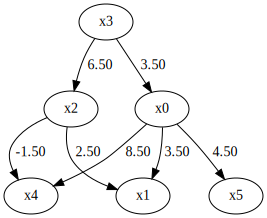
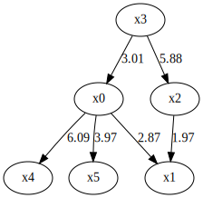
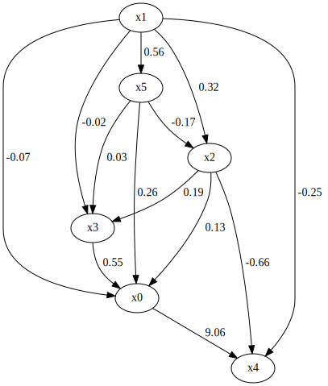
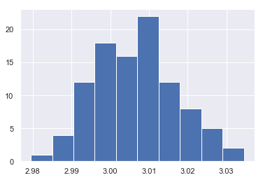

MultiGroupDirectLiNGAM
======================

Import and settings
-------------------

In this example, we need to import ``numpy``, ``pandas``, and ``graphviz`` in addition to ``lingam``.

.. code:: ipython3

    import numpy as np
    import pandas as pd
    import graphviz
    import lingam
    from lingam.utils import print_causal_directions, print_dagc, make_dot
    
    print([np.__version__, pd.__version__, graphviz.__version__, lingam.__version__])
    
    np.set_printoptions(precision=3, suppress=True)
    np.random.seed(0)

.. parsed-literal::

    ['1.16.2', '0.24.2', '0.11.1', '1.3.1']
    

Test data
---------

We generate two datasets consisting of 6 variables.

.. code:: ipython3

    x3 = np.random.uniform(size=10000)
    x0 = 3.0*x3 + np.random.uniform(size=10000)
    x2 = 6.0*x3 + np.random.uniform(size=10000)
    x1 = 3.0*x0 + 2.0*x2 + np.random.uniform(size=10000)
    x5 = 4.0*x0 + np.random.uniform(size=10000)
    x4 = 8.0*x0 - 1.0*x2 + np.random.uniform(size=10000)
    X1 = pd.DataFrame(np.array([x0, x1, x2, x3, x4, x5]).T ,columns=['x0', 'x1', 'x2', 'x3', 'x4', 'x5'])
    X1.head()

.. raw:: html

    

    
    <table border="1" class="dataframe">
      <thead>
        <tr style="text-align: right;">
          <th></th>
          <th>x0</th>
          <th>x1</th>
          <th>x2</th>
          <th>x3</th>
          <th>x4</th>
          <th>x5</th>
        </tr>
      </thead>
      <tbody>
        <tr>
          <th>0</th>
          <td>2.394708</td>
          <td>15.312359</td>
          <td>3.685054</td>
          <td>0.548814</td>
          <td>15.780259</td>
          <td>9.948090</td>
        </tr>
        <tr>
          <th>1</th>
          <td>2.325771</td>
          <td>16.145216</td>
          <td>4.332293</td>
          <td>0.715189</td>
          <td>14.335879</td>
          <td>9.514409</td>
        </tr>
        <tr>
          <th>2</th>
          <td>2.197313</td>
          <td>15.848718</td>
          <td>4.539881</td>
          <td>0.602763</td>
          <td>14.027410</td>
          <td>9.266158</td>
        </tr>
        <tr>
          <th>3</th>
          <td>1.672250</td>
          <td>13.200354</td>
          <td>3.675534</td>
          <td>0.544883</td>
          <td>10.421554</td>
          <td>6.771233</td>
        </tr>
        <tr>
          <th>4</th>
          <td>1.282752</td>
          <td>11.337503</td>
          <td>3.486211</td>
          <td>0.423655</td>
          <td>7.533376</td>
          <td>5.368668</td>
        </tr>
      </tbody>
    </table>
    

     

.. code:: ipython3

    m = np.array([[0.0, 0.0, 0.0, 3.0, 0.0, 0.0],
                  [3.0, 0.0, 2.0, 0.0, 0.0, 0.0],
                  [0.0, 0.0, 0.0, 6.0, 0.0, 0.0],
                  [0.0, 0.0, 0.0, 0.0, 0.0, 0.0],
                  [8.0, 0.0,-1.0, 0.0, 0.0, 0.0],
                  [4.0, 0.0, 0.0, 0.0, 0.0, 0.0]])
    
    make_dot(m)

.. image:: ../image/multiple_dataset_dag1.svg

.. code:: ipython3

    x3 = np.random.uniform(size=1000)
    x0 = 3.5*x3 + np.random.uniform(size=1000)
    x2 = 6.5*x3 + np.random.uniform(size=1000)
    x1 = 3.5*x0 + 2.5*x2 + np.random.uniform(size=1000)
    x5 = 4.5*x0 + np.random.uniform(size=1000)
    x4 = 8.5*x0 - 1.5*x2 + np.random.uniform(size=1000)
    X2 = pd.DataFrame(np.array([x0, x1, x2, x3, x4, x5]).T ,columns=['x0', 'x1', 'x2', 'x3', 'x4', 'x5'])
    X2.head()

.. raw:: html

    

    
    <table border="1" class="dataframe">
      <thead>
        <tr style="text-align: right;">
          <th></th>
          <th>x0</th>
          <th>x1</th>
          <th>x2</th>
          <th>x3</th>
          <th>x4</th>
          <th>x5</th>
        </tr>
      </thead>
      <tbody>
        <tr>
          <th>0</th>
          <td>3.848617</td>
          <td>29.790327</td>
          <td>6.151635</td>
          <td>0.927955</td>
          <td>23.683228</td>
          <td>17.497765</td>
        </tr>
        <tr>
          <th>1</th>
          <td>3.765482</td>
          <td>28.839731</td>
          <td>5.981344</td>
          <td>0.902937</td>
          <td>23.362070</td>
          <td>17.126491</td>
        </tr>
        <tr>
          <th>2</th>
          <td>1.613042</td>
          <td>13.637872</td>
          <td>2.930467</td>
          <td>0.427617</td>
          <td>9.871720</td>
          <td>7.578267</td>
        </tr>
        <tr>
          <th>3</th>
          <td>1.838085</td>
          <td>16.640591</td>
          <td>3.715235</td>
          <td>0.510806</td>
          <td>10.427863</td>
          <td>9.068131</td>
        </tr>
        <tr>
          <th>4</th>
          <td>2.321607</td>
          <td>19.614986</td>
          <td>4.540952</td>
          <td>0.583200</td>
          <td>13.276292</td>
          <td>11.184535</td>
        </tr>
      </tbody>
    </table>
    

     

.. code:: ipython3

    m = np.array([[0.0, 0.0, 0.0, 3.5, 0.0, 0.0],
                  [3.5, 0.0, 2.5, 0.0, 0.0, 0.0],
                  [0.0, 0.0, 0.0, 6.5, 0.0, 0.0],
                  [0.0, 0.0, 0.0, 0.0, 0.0, 0.0],
                  [8.5, 0.0,-1.5, 0.0, 0.0, 0.0],
                  [4.5, 0.0, 0.0, 0.0, 0.0, 0.0]])
    
    make_dot(m)

We create a list variable that contains two datasets.

.. code:: ipython3

    X_list = [X1, X2]

Causal Discovery
----------------

To run causal discovery for multiple datasets, we create a :class:`~lingam.MultiGroupDirectLiNGAM` object and call the :func:`~lingam.MultiGroupDirectLiNGAM.fit` method.

.. code:: ipython3

    model = lingam.MultiGroupDirectLiNGAM()
    model.fit(X_list)

.. parsed-literal::

    <lingam.multi_group_direct_lingam.MultiGroupDirectLiNGAM at 0x1eda3ce9908>

Using the :attr:`~lingam.MultiGroupDirectLiNGAM.causal_order_` properties, we can see the causal ordering as a result of the causal discovery.

.. code:: ipython3

    model.causal_order_

.. parsed-literal::

    [3, 2, 0, 1, 5, 4]

Also, using the :attr:`~lingam.MultiGroupDirectLiNGAM.adjacency_matrix_` properties, we can see the adjacency matrix as a result of the causal discovery. As you can see from the following, DAG in each dataset is correctly estimated.

.. code:: ipython3

    print(model.adjacency_matrices_[0])
    make_dot(model.adjacency_matrices_[0])

.. parsed-literal::

    [[ 0.     0.     0.     3.006  0.     0.   ]
     [ 3.002  0.     1.996  0.     0.     0.   ]
     [ 0.     0.     0.     6.001  0.     0.   ]
     [ 0.     0.     0.     0.     0.     0.   ]
     [ 7.978  0.    -0.988  0.     0.     0.   ]
     [ 3.998  0.     0.     0.     0.     0.   ]]
    

.. code:: ipython3

    print(model.adjacency_matrices_[1])
    make_dot(model.adjacency_matrices_[1])

.. parsed-literal::

    [[ 0.     0.     0.043  3.245  0.     0.   ]
     [ 3.508  0.     2.491  0.     0.     0.   ]
     [ 0.     0.     0.     6.481  0.     0.   ]
     [ 0.     0.     0.     0.     0.     0.   ]
     [ 7.519  0.    -0.942  0.     0.     0.   ]
     [ 4.422  0.     0.     0.     0.     0.   ]]
    

.. image:: ../image/multiple_dataset_dag4.svg

To compare, we run DirectLiNGAM with single dataset concatenating two
datasets.

.. code:: ipython3

    X_all = pd.concat([X1, X2])
    print(X_all.shape)

.. parsed-literal::

    (11000, 6)
    

.. code:: ipython3

    model_all = lingam.DirectLiNGAM()
    model_all.fit(X_all)
    
    model_all.causal_order_

.. parsed-literal::

    [3, 4, 5, 2, 1, 0]

You can see that the causal structure cannot be estimated correctly for
a single dataset.

.. code:: ipython3

    make_dot(model_all.adjacency_matrix_)

Bootstrapping
-------------

In :class:`~lingam.MultiGroupDirectLiNGAM`, bootstrap can be executed in the same way as normal :class:`~lingam.DirectLiNGAM`.

.. code:: ipython3

    results = model.bootstrap(X_list, n_sampling=100)

Causal Directions
-----------------

The :func:`~lingam.MultiGroupDirectLiNGAM.bootstrap` method returns a list of multiple :class:`~lingam.BootstrapResult`, so we can get the result of bootstrapping from the list. We can get the same number of results as the number of datasets, so we specify an index when we access the results. We can get the ranking of the causal directions extracted by :func:`~lingam.BootstrapResult.get_causal_direction_counts`.

.. code:: ipython3

    cdc = results[0].get_causal_direction_counts(n_directions=8, min_causal_effect=0.01)
    print_causal_directions(cdc, 100)

.. parsed-literal::

    x0 <--- x3  (100.0%)
    x1 <--- x0  (100.0%)
    x1 <--- x2  (100.0%)
    x2 <--- x3  (100.0%)
    x4 <--- x0  (100.0%)
    x4 <--- x2  (100.0%)
    x5 <--- x0  (100.0%)
    x0 <--- x2  (14.0%)
    

.. code:: ipython3

    cdc = results[1].get_causal_direction_counts(n_directions=8, min_causal_effect=0.01)
    print_causal_directions(cdc, 100)

.. parsed-literal::

    x0 <--- x3  (100.0%)
    x1 <--- x0  (100.0%)
    x1 <--- x2  (100.0%)
    x2 <--- x3  (100.0%)
    x4 <--- x0  (100.0%)
    x4 <--- x2  (100.0%)
    x5 <--- x0  (100.0%)
    x0 <--- x2  (45.0%)
    

Directed Acyclic Graphs
-----------------------

Also, using the :func:`~lingam.BootstrapResult.get_directed_acyclic_graph_counts` method, we can get the ranking of the DAGs extracted. In the following sample code, ``n_dags`` option is limited to the dags of the top 3 rankings, and ``min_causal_effect`` option is limited to causal directions with a coefficient of 0.01 or more.

.. code:: ipython3

    dagc = results[0].get_directed_acyclic_graph_counts(n_dags=3, min_causal_effect=0.01)
    print_dagc(dagc, 100)

.. parsed-literal::

    DAG[0]: 75.0%
    	x0 <--- x3 
    	x1 <--- x0 
    	x1 <--- x2 
    	x2 <--- x3 
    	x4 <--- x0 
    	x4 <--- x2 
    	x5 <--- x0 
    DAG[1]: 14.0%
    	x0 <--- x2 
    	x0 <--- x3 
    	x1 <--- x0 
    	x1 <--- x2 
    	x2 <--- x3 
    	x4 <--- x0 
    	x4 <--- x2 
    	x5 <--- x0 
    DAG[2]: 6.0%
    	x0 <--- x3 
    	x1 <--- x0 
    	x1 <--- x2 
    	x1 <--- x3 
    	x2 <--- x3 
    	x4 <--- x0 
    	x4 <--- x2 
    	x5 <--- x0 
    

.. code:: ipython3

    dagc = results[1].get_directed_acyclic_graph_counts(n_dags=3, min_causal_effect=0.01)
    print_dagc(dagc, 100)

.. parsed-literal::

    DAG[0]: 26.0%
    	x0 <--- x2 
    	x0 <--- x3 
    	x1 <--- x0 
    	x1 <--- x2 
    	x2 <--- x3 
    	x4 <--- x0 
    	x4 <--- x2 
    	x5 <--- x0 
    DAG[1]: 22.0%
    	x0 <--- x3 
    	x1 <--- x0 
    	x1 <--- x2 
    	x2 <--- x3 
    	x4 <--- x0 
    	x4 <--- x2 
    	x5 <--- x0 
    DAG[2]: 13.0%
    	x0 <--- x2 
    	x0 <--- x3 
    	x1 <--- x0 
    	x1 <--- x2 
    	x2 <--- x3 
    	x4 <--- x0 
    	x4 <--- x2 
    	x4 <--- x5 
    	x5 <--- x0 
    

Probability
-----------

Using the :func:`~lingam.BootstrapResult.get_probabilities` method, we can get the probability of bootstrapping.

.. code:: ipython3

    prob = results[0].get_probabilities(min_causal_effect=0.01)
    print(prob)

.. parsed-literal::

    [[0.   0.   0.14 1.   0.   0.  ]
     [1.   0.   1.   0.06 0.   0.  ]
     [0.   0.   0.   1.   0.   0.  ]
     [0.   0.   0.   0.   0.   0.  ]
     [1.   0.   1.   0.   0.   0.05]
     [1.   0.   0.   0.   0.   0.  ]]
    

Causal Effects
--------------

Using the :func:`~lingam.BootstrapResult.get_causal_effects` method, we can get the list of causal
effect. The causal effects we can get are dictionary type variable. We
can display the list nicely by assigning it to pandas.DataFrame. Also,
we have replaced the variable index with a label below.

.. code:: ipython3

    causal_effects = results[0].get_causal_effects(min_causal_effect=0.01)
    df = pd.DataFrame(causal_effects)
    
    labels = [f'x{i}' for i in range(X1.shape[1])]
    df['from'] = df['from'].apply(lambda x : labels[x])
    df['to'] = df['to'].apply(lambda x : labels[x])
    df

.. raw:: html

    

    
    <table border="1" class="dataframe">
      <thead>
        <tr style="text-align: right;">
          <th></th>
          <th>from</th>
          <th>to</th>
          <th>effect</th>
          <th>probability</th>
        </tr>
      </thead>
      <tbody>
        <tr>
          <th>0</th>
          <td>x3</td>
          <td>x0</td>
          <td>3.006408</td>
          <td>1.00</td>
        </tr>
        <tr>
          <th>1</th>
          <td>x0</td>
          <td>x1</td>
          <td>3.003440</td>
          <td>1.00</td>
        </tr>
        <tr>
          <th>2</th>
          <td>x2</td>
          <td>x1</td>
          <td>2.003336</td>
          <td>1.00</td>
        </tr>
        <tr>
          <th>3</th>
          <td>x3</td>
          <td>x1</td>
          <td>21.001464</td>
          <td>1.00</td>
        </tr>
        <tr>
          <th>4</th>
          <td>x0</td>
          <td>x5</td>
          <td>4.008386</td>
          <td>1.00</td>
        </tr>
        <tr>
          <th>5</th>
          <td>x3</td>
          <td>x2</td>
          <td>6.002202</td>
          <td>1.00</td>
        </tr>
        <tr>
          <th>6</th>
          <td>x3</td>
          <td>x5</td>
          <td>12.019234</td>
          <td>1.00</td>
        </tr>
        <tr>
          <th>7</th>
          <td>x0</td>
          <td>x4</td>
          <td>7.997816</td>
          <td>1.00</td>
        </tr>
        <tr>
          <th>8</th>
          <td>x2</td>
          <td>x4</td>
          <td>-0.998284</td>
          <td>1.00</td>
        </tr>
        <tr>
          <th>9</th>
          <td>x3</td>
          <td>x4</td>
          <td>18.054079</td>
          <td>1.00</td>
        </tr>
        <tr>
          <th>10</th>
          <td>x5</td>
          <td>x1</td>
          <td>-0.053881</td>
          <td>0.69</td>
        </tr>
        <tr>
          <th>11</th>
          <td>x2</td>
          <td>x5</td>
          <td>-0.005313</td>
          <td>0.62</td>
        </tr>
        <tr>
          <th>12</th>
          <td>x5</td>
          <td>x4</td>
          <td>0.014208</td>
          <td>0.61</td>
        </tr>
        <tr>
          <th>13</th>
          <td>x2</td>
          <td>x0</td>
          <td>0.001579</td>
          <td>0.21</td>
        </tr>
        <tr>
          <th>14</th>
          <td>x5</td>
          <td>x2</td>
          <td>-0.018982</td>
          <td>0.19</td>
        </tr>
        <tr>
          <th>15</th>
          <td>x1</td>
          <td>x5</td>
          <td>-0.011613</td>
          <td>0.18</td>
        </tr>
        <tr>
          <th>16</th>
          <td>x1</td>
          <td>x4</td>
          <td>0.005833</td>
          <td>0.17</td>
        </tr>
        <tr>
          <th>17</th>
          <td>x0</td>
          <td>x2</td>
          <td>-0.004417</td>
          <td>0.15</td>
        </tr>
        <tr>
          <th>18</th>
          <td>x4</td>
          <td>x1</td>
          <td>0.001461</td>
          <td>0.12</td>
        </tr>
        <tr>
          <th>19</th>
          <td>x4</td>
          <td>x5</td>
          <td>-0.004811</td>
          <td>0.08</td>
        </tr>
      </tbody>
    </table>
    

     

We can easily perform sorting operations with pandas.DataFrame.

.. code:: ipython3

    df.sort_values('effect', ascending=False).head()

.. raw:: html

    

    
    <table border="1" class="dataframe">
      <thead>
        <tr style="text-align: right;">
          <th></th>
          <th>from</th>
          <th>to</th>
          <th>effect</th>
          <th>probability</th>
        </tr>
      </thead>
      <tbody>
        <tr>
          <th>3</th>
          <td>x3</td>
          <td>x1</td>
          <td>21.001464</td>
          <td>1.0</td>
        </tr>
        <tr>
          <th>9</th>
          <td>x3</td>
          <td>x4</td>
          <td>18.054079</td>
          <td>1.0</td>
        </tr>
        <tr>
          <th>6</th>
          <td>x3</td>
          <td>x5</td>
          <td>12.019234</td>
          <td>1.0</td>
        </tr>
        <tr>
          <th>7</th>
          <td>x0</td>
          <td>x4</td>
          <td>7.997816</td>
          <td>1.0</td>
        </tr>
        <tr>
          <th>5</th>
          <td>x3</td>
          <td>x2</td>
          <td>6.002202</td>
          <td>1.0</td>
        </tr>
      </tbody>
    </table>
    

     

And with pandas.DataFrame, we can easily filter by keywords. The
following code extracts the causal direction towards x1.

.. code:: ipython3

    df[df['to']=='x1'].head()

.. raw:: html

    

    
    <table border="1" class="dataframe">
      <thead>
        <tr style="text-align: right;">
          <th></th>
          <th>from</th>
          <th>to</th>
          <th>effect</th>
          <th>probability</th>
        </tr>
      </thead>
      <tbody>
        <tr>
          <th>1</th>
          <td>x0</td>
          <td>x1</td>
          <td>3.003440</td>
          <td>1.00</td>
        </tr>
        <tr>
          <th>2</th>
          <td>x2</td>
          <td>x1</td>
          <td>2.003336</td>
          <td>1.00</td>
        </tr>
        <tr>
          <th>3</th>
          <td>x3</td>
          <td>x1</td>
          <td>21.001464</td>
          <td>1.00</td>
        </tr>
        <tr>
          <th>10</th>
          <td>x5</td>
          <td>x1</td>
          <td>-0.053881</td>
          <td>0.69</td>
        </tr>
        <tr>
          <th>18</th>
          <td>x4</td>
          <td>x1</td>
          <td>0.001461</td>
          <td>0.12</td>
        </tr>
      </tbody>
    </table>
    

     

Because it holds the raw data of the causal effect (the original data
for calculating the median), it is possible to draw a histogram of the
values of the causal effect, as shown below.

.. code:: ipython3

    import matplotlib.pyplot as plt
    import seaborn as sns
    sns.set()
    %matplotlib inline
    
    from_index = 3
    to_index = 0
    plt.hist(results[0].total_effects_[:, to_index, from_index])

