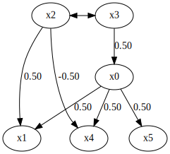
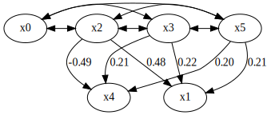
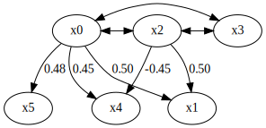

How to use prior knowledge in BottomUpParceLiNGAM
=================================================

Import and settings
-------------------

In this example, we need to import ``numpy``, ``pandas``, and
``graphviz`` in addition to ``lingam``.

.. code-block:: python

    import numpy as np
    import pandas as pd
    import graphviz
    import lingam
    from lingam.utils import make_prior_knowledge, make_dot
    
    print([np.__version__, pd.__version__, graphviz.__version__, lingam.__version__])
    
    np.set_printoptions(precision=3, suppress=True)
    np.random.seed(0)

.. parsed-literal::

    ['1.16.2', '0.24.2', '0.11.1', '1.5.2']
    

Utility function
----------------

We define a utility function to draw the directed acyclic graph.

.. code-block:: python

    def make_prior_knowledge_graph(prior_knowledge_matrix):
        d = graphviz.Digraph(engine='dot')
        
        labels = [f'x{i}' for i in range(prior_knowledge_matrix.shape[0])]
        for label in labels:
            d.node(label, label)
    
        dirs = np.where(prior_knowledge_matrix > 0)
        for to, from_ in zip(dirs[0], dirs[1]):
            d.edge(labels[from_], labels[to])
    
        dirs = np.where(prior_knowledge_matrix < 0)
        for to, from_ in zip(dirs[0], dirs[1]):
            if to != from_:
                d.edge(labels[from_], labels[to], style='dashed')
        return d

Test data
---------

We create test data consisting of 6 variables.

.. code-block:: python

    np.random.seed(1000)
    
    x6 = np.random.uniform(size=1000)
    x3 = 2.0*x6 + np.random.uniform(size=1000)
    x0 = 0.5*x3 + np.random.uniform(size=1000)
    x2 = 2.0*x6 + np.random.uniform(size=1000)
    x1 = 0.5*x0 + 0.5*x2 + np.random.uniform(size=1000)
    x5 = 0.5*x0 + np.random.uniform(size=1000)
    x4 = 0.5*x0 - 0.5*x2 + np.random.uniform(size=1000)
    
    # The latent variable x6 is not included.
    X = pd.DataFrame(np.array([x0, x1, x2, x3, x4, x5]).T, columns=['x0', 'x1', 'x2', 'x3', 'x4', 'x5'])

.. code-block:: python

    m = np.array([[0.0, 0.0,    0.0,    0.5, 0.0, 0.0],
                  [0.5, 0.0,    0.5,    0.0, 0.0, 0.0],
                  [0.0, 0.0,    0.0, np.nan, 0.0, 0.0],
                  [0.0, 0.0, np.nan,    0.0, 0.0, 0.0],
                  [0.5, 0.0,   -0.5,    0.0, 0.0, 0.0],
                  [0.5, 0.0,    0.0,    0.0, 0.0, 0.0]])
    
    make_dot(m)

Make Prior Knowledge Matrix
---------------------------

We create prior knowledge so that x0, x1 and x4 are sink variables.

The elements of prior knowledge matrix are defined as follows: 

* ``0``: :math:`{x}_{i}` does not have a directed path to :math:`{x}_{j}`
* ``1``: :math:`{x}_{i}` has a directed path to :math:`{x}_{j}`
* ``-1`` : No prior knowledge is available to know if either of the two cases above (0 or 1) is true.

.. code-block:: python

    prior_knowledge = make_prior_knowledge(
        n_variables=6,
        sink_variables=[0, 1, 4],
    )
    print(prior_knowledge)

.. parsed-literal::

    [[-1  0 -1 -1  0 -1]
     [ 0 -1 -1 -1  0 -1]
     [ 0  0 -1 -1  0 -1]
     [ 0  0 -1 -1  0 -1]
     [ 0  0 -1 -1 -1 -1]
     [ 0  0 -1 -1  0 -1]]
    

.. code-block:: python

    # Draw a graph of prior knowledge
    make_prior_knowledge_graph(prior_knowledge)

.. image:: ../image/pk_parcelingam2.svg

Causal Discovery
----------------

To run causal discovery using prior knowledge, we create a
``DirectLiNGAM`` object with the prior knowledge matrix.

.. code-block:: python

    model = lingam.BottomUpParceLiNGAM(prior_knowledge=prior_knowledge)
    model.fit(X)
    print(model.causal_order_)
    print(model.adjacency_matrix_)

.. parsed-literal::

    [[0, 2, 3, 5], 4, 1]
    [[ 0.     0.       nan    nan  0.       nan]
     [ 0.     0.     0.479  0.219  0.     0.212]
     [   nan  0.     0.       nan  0.       nan]
     [   nan  0.       nan  0.     0.       nan]
     [ 0.     0.    -0.494  0.212  0.     0.199]
     [   nan  0.       nan    nan  0.     0.   ]]
    

We can see that x0, x1, and x4 are output as sink variables, as
specified in the prior knowledge.

.. code-block:: python

    make_dot(model.adjacency_matrix_)

Next, let’s specify the prior knowledge so that x0 is an exogenous
variable.

.. code-block:: python

    prior_knowledge = make_prior_knowledge(
        n_variables=6,
        exogenous_variables=[0],
    )
    
    model = lingam.BottomUpParceLiNGAM(prior_knowledge=prior_knowledge)
    model.fit(X)
    
    make_dot(model.adjacency_matrix_)

