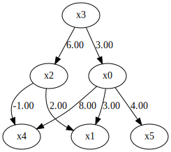
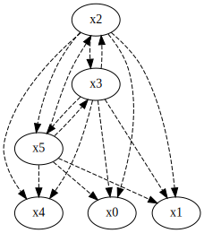
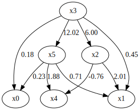
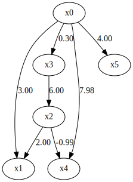

How to use prior knowledge in DirectLiNGAM
==========================================

Import and settings
-------------------

In this example, we need to import ``numpy``, ``pandas``, and
``graphviz`` in addition to ``lingam``.

.. code-block:: python

    import numpy as np
    import pandas as pd
    import graphviz
    import lingam
    from lingam.utils import make_prior_knowledge, make_dot
    
    print([np.__version__, pd.__version__, graphviz.__version__, lingam.__version__])
    
    np.set_printoptions(precision=3, suppress=True)
    np.random.seed(0)

.. parsed-literal::

    ['1.16.2', '0.24.2', '0.11.1', '1.5.2']
    

Utility function
----------------

We define a utility function to draw the directed acyclic graph.

.. code-block:: python

    def make_prior_knowledge_graph(prior_knowledge_matrix):
        d = graphviz.Digraph(engine='dot')
        
        labels = [f'x{i}' for i in range(prior_knowledge_matrix.shape[0])]
        for label in labels:
            d.node(label, label)
    
        dirs = np.where(prior_knowledge_matrix > 0)
        for to, from_ in zip(dirs[0], dirs[1]):
            d.edge(labels[from_], labels[to])
    
        dirs = np.where(prior_knowledge_matrix < 0)
        for to, from_ in zip(dirs[0], dirs[1]):
            if to != from_:
                d.edge(labels[from_], labels[to], style='dashed')
        return d

Test data
---------

We create test data consisting of 6 variables.

.. code-block:: python

    x3 = np.random.uniform(size=10000)
    x0 = 3.0*x3 + np.random.uniform(size=10000)
    x2 = 6.0*x3 + np.random.uniform(size=10000)
    x1 = 3.0*x0 + 2.0*x2 + np.random.uniform(size=10000)
    x5 = 4.0*x0 + np.random.uniform(size=10000)
    x4 = 8.0*x0 - 1.0*x2 + np.random.uniform(size=10000)
    X = pd.DataFrame(np.array([x0, x1, x2, x3, x4, x5]).T ,columns=['x0', 'x1', 'x2', 'x3', 'x4', 'x5'])
    X.head()

.. raw:: html

    

    
    <table border="1" class="dataframe">
      <thead>
        <tr style="text-align: right;">
          <th></th>
          <th>x0</th>
          <th>x1</th>
          <th>x2</th>
          <th>x3</th>
          <th>x4</th>
          <th>x5</th>
        </tr>
      </thead>
      <tbody>
        <tr>
          <th>0</th>
          <td>2.394708</td>
          <td>15.312359</td>
          <td>3.685054</td>
          <td>0.548814</td>
          <td>15.780259</td>
          <td>9.948090</td>
        </tr>
        <tr>
          <th>1</th>
          <td>2.325771</td>
          <td>16.145216</td>
          <td>4.332293</td>
          <td>0.715189</td>
          <td>14.335879</td>
          <td>9.514409</td>
        </tr>
        <tr>
          <th>2</th>
          <td>2.197313</td>
          <td>15.848718</td>
          <td>4.539881</td>
          <td>0.602763</td>
          <td>14.027410</td>
          <td>9.266158</td>
        </tr>
        <tr>
          <th>3</th>
          <td>1.672250</td>
          <td>13.200354</td>
          <td>3.675534</td>
          <td>0.544883</td>
          <td>10.421554</td>
          <td>6.771233</td>
        </tr>
        <tr>
          <th>4</th>
          <td>1.282752</td>
          <td>11.337503</td>
          <td>3.486211</td>
          <td>0.423655</td>
          <td>7.533376</td>
          <td>5.368668</td>
        </tr>
      </tbody>
    </table>
    

     

.. code-block:: python

    m = np.array([[0.0, 0.0, 0.0, 3.0, 0.0, 0.0],
                  [3.0, 0.0, 2.0, 0.0, 0.0, 0.0],
                  [0.0, 0.0, 0.0, 6.0, 0.0, 0.0],
                  [0.0, 0.0, 0.0, 0.0, 0.0, 0.0],
                  [8.0, 0.0,-1.0, 0.0, 0.0, 0.0],
                  [4.0, 0.0, 0.0, 0.0, 0.0, 0.0]])
    
    make_dot(m)

Make Prior Knowledge Matrix
---------------------------

We create prior knowledge so that x0, x1 and x4 are sink variables.

The elements of prior knowledge matrix are defined as follows:

* ``0``: :math:`{x}_{i}` does not have a directed path to :math:`{x}_{j}`
* ``1``: :math:`{x}_{i}` has a directed path to :math:`{x}_{j}`
* ``-1`` : No prior knowledge is available to know if either of the two cases above (0 or 1) is true.

.. code-block:: python

    prior_knowledge = make_prior_knowledge(
        n_variables=6,
        sink_variables=[0, 1, 4],
    )
    print(prior_knowledge)

.. parsed-literal::

    [[-1  0 -1 -1  0 -1]
     [ 0 -1 -1 -1  0 -1]
     [ 0  0 -1 -1  0 -1]
     [ 0  0 -1 -1  0 -1]
     [ 0  0 -1 -1 -1 -1]
     [ 0  0 -1 -1  0 -1]]
    

.. code-block:: python

    # Draw a graph of prior knowledge
    make_prior_knowledge_graph(prior_knowledge)

Causal Discovery
----------------

To run causal discovery using prior knowledge, we create a
``DirectLiNGAM`` object with the prior knowledge matrix.

.. code-block:: python

    model = lingam.DirectLiNGAM(prior_knowledge=prior_knowledge)
    model.fit(X)
    print(model.causal_order_)
    print(model.adjacency_matrix_)

.. parsed-literal::

    [3, 2, 5, 0, 1, 4]
    [[ 0.     0.     0.     0.178  0.     0.235]
     [ 0.     0.     2.01   0.45   0.     0.707]
     [ 0.     0.     0.     6.001  0.     0.   ]
     [ 0.     0.     0.     0.     0.     0.   ]
     [ 0.     0.    -0.757  0.     0.     1.879]
     [ 0.     0.     0.    12.017  0.     0.   ]]
    

We can see that x0, x1, and x4 are output as sink variables, as
specified in the prior knowledge.

.. code-block:: python

    make_dot(model.adjacency_matrix_)

Next, let’s specify the prior knowledge so that x0 is an exogenous
variable.

.. code-block:: python

    prior_knowledge = make_prior_knowledge(
        n_variables=6,
        exogenous_variables=[0],
    )
    
    model = lingam.DirectLiNGAM(prior_knowledge=prior_knowledge)
    model.fit(X)
    
    make_dot(model.adjacency_matrix_)

