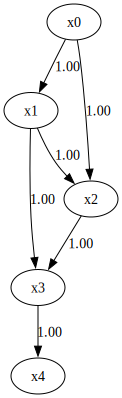

How to use prior knowledge in RESIT
===================================

Import and settings
-------------------

In this example, we need to import ``numpy``, ``pandas``, and
``graphviz`` in addition to ``lingam``.

.. code-block:: python

    import numpy as np
    import pandas as pd
    import graphviz
    import lingam
    from lingam.utils import make_prior_knowledge, make_dot

    import warnings
    warnings.filterwarnings('ignore')

    print([np.__version__, pd.__version__, graphviz.__version__, lingam.__version__])

    np.set_printoptions(precision=3, suppress=True)
    np.random.seed(0)

.. parsed-literal::

    ['1.26.4', '2.2.3', '0.20.3', '1.10.0']

Utility function
----------------

We define a utility function to draw the directed acyclic graph.

.. code-block:: python

    def make_prior_knowledge_graph(prior_knowledge_matrix):
        d = graphviz.Digraph(engine='dot')

        labels = [f'x{i}' for i in range(prior_knowledge_matrix.shape[0])]
        for label in labels:
            d.node(label, label)

        dirs = np.where(prior_knowledge_matrix > 0)
        for to, from_ in zip(dirs[0], dirs[1]):
            d.edge(labels[from_], labels[to])

        dirs = np.where(prior_knowledge_matrix < 0)
        for to, from_ in zip(dirs[0], dirs[1]):
            if to != from_:
                d.edge(labels[from_], labels[to], style='dashed')
        return d

Test data
---------

First, we generate a causal structure with 7 variables. Then we create a
dataset with 6 variables from x0 to x5, with x6 being the latent
variable for x2 and x3.

.. code-block:: python

    X = pd.read_csv('nonlinear_data.csv')

.. code-block:: python

    m = np.array([
        [0, 0, 0, 0, 0],
        [1, 0, 0, 0, 0],
        [1, 1, 0, 0, 0],
        [0, 1, 1, 0, 0],
        [0, 0, 0, 1, 0]])

    dot = make_dot(m)

    # Save pdf
    dot.render('dag')

    # Save png
    dot.format = 'png'
    dot.render('dag')

    dot

Make Prior Knowledge Matrix
---------------------------

We create prior knowledge so that x0 and x4 are sink variables.

The elements of prior knowledge matrix are defined as follows:

* ``0``: :math:`{x}_{i}` does not have a directed path to :math:`{x}_{j}`
* ``1``: :math:`{x}_{i}` has a directed path to :math:`{x}_{j}`
* ``-1`` : No prior knowledge is available to know if either of the two cases above (0 or 1) is true.

.. code-block:: python

    prior_knowledge = make_prior_knowledge(
        n_variables=5,
        sink_variables=[0, 4]
    )
    print(prior_knowledge)

.. parsed-literal::

    [[-1 -1 -1 -1  0]
     [ 0 -1 -1 -1  0]
     [ 0 -1 -1 -1  0]
     [ 0 -1 -1 -1  0]
     [ 0 -1 -1 -1 -1]]

.. code-block:: python

    # Draw a graph of prior knowledge
    make_prior_knowledge_graph(prior_knowledge)

Causal Discovery
----------------

To run causal discovery using prior knowledge, we create a ``RESIT``
object with the prior knowledge matrix.

.. code-block:: python

    from sklearn.ensemble import RandomForestRegressor
    reg = RandomForestRegressor(max_depth=4, random_state=0)

    model = lingam.RESIT(regressor=reg, prior_knowledge=prior_knowledge)
    model.fit(X)
    print(model.causal_order_)
    print(model.adjacency_matrix_)

.. parsed-literal::

    [1, 2, 3, 0, 4]
    [[0. 1. 1. 1. 0.]
     [0. 0. 0. 0. 0.]
     [0. 1. 0. 0. 0.]
     [0. 1. 0. 0. 0.]
     [0. 0. 0. 1. 0.]]

We can see that x0 and x4 are output as sink variables, as specified in
the prior knowledge.

.. code-block:: python

    make_dot(model.adjacency_matrix_)

Next, let’s specify the prior knowledge so that x2 is an exogenous
variable.

.. code-block:: python

    prior_knowledge = make_prior_knowledge(
        n_variables=5,
        exogenous_variables=[2],
    )

    model = lingam.RESIT(regressor=reg, prior_knowledge=prior_knowledge)
    model.fit(X)

    make_dot(model.adjacency_matrix_)

