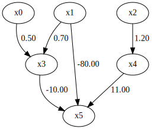

Adaptive logistic regression
============================

Import and settings
-------------------

To run this notebook, install R and glmnet and set up a PATH to Rscript.exe.
In this example, we need to import numpy, pandas, and graphviz in addition to lingam.

.. code-block:: python

    import lingam
    
    import numpy as np
    import scipy
    
    from lingam.utils import make_dot, predict_adaptive_logistic_regression
    import matplotlib.pyplot as plt
    
    np.set_printoptions(precision=3, suppress=True)
    print([np.__version__, scipy.__version__, lingam.__version__])
    
    np.random.seed(100)

.. parsed-literal::

    ['1.23.5', '1.10.1', '1.8.1']

Test data
---------

Test data is generated by this adjacency matrix.

.. code-block:: python

    m = np.array([
        [0.0, 0.0, 0.0, 0.0, 0.0, 0.0],
        [0.0, 0.0, 0.0, 0.0, 0.0, 0.0],
        [0.0, 0.0, 0.0, 0.0, 0.0, 0.0],
        [0.5, 0.7, 0.0, 0.0, 0.0, 0.0],
        [0.0, 0.0, 1.2, 0.0, 0.0, 0.0],
        [0.0,-80.0, 0.0,-10.0,11.0, 0.0],
    ])
    
    make_dot(m)

x0 to x4 are explanatory variables. x5 is a discrete variable and is the objective variable.

.. code-block:: python

    sample_num=1000
    
    x0 = np.random.uniform(size=sample_num)
    x1 = np.random.uniform(size=sample_num)
    x2 = np.random.uniform(size=sample_num)
    x3 = 0.5 * x0 + 0.7 * x1 + np.random.uniform(0, 8, size=sample_num)
    x4 = 1.2 * x2 + np.random.uniform(0, 8, size=sample_num)
    
    p5 = scipy.special.expit(-80 * x1 - 10.0 * x3 + 11 * x4 + 35)
    
    x5 = []
    for p in p5:
        x5.append(np.random.choice([1, 2], p=[p, 1 - p]))
    
    X = np.vstack([x0, x1, x2, x3, x4, x5]).T
    
    fig, axes = plt.subplots(1, X.shape[1], figsize=(12, 2))
    for i, data in enumerate(X.T):
        axes[i].hist(data)
        axes[i].set_title(f"x{i}")
    plt.tight_layout()
    plt.show()

.. image:: ../image/predict_adaptive_logistic_regression2.svg

Estimation
----------

The strength of regularization can be specified by gamma.

.. code-block:: python

    predictor_indices = [0, 1, 2, 3, 4]
    target_index = 5
    
    coef = predict_adaptive_logistic_regression(X, predictor_indices, target_index, gamma=0.01)
    coef

.. parsed-literal::

    array([[ 0.   , 52.178, -0.476,  6.476, -7.209]])

The larger gamma, the stronger the regularization. x0 and x2, which are not directly related to x5, have coefficients of 0.

.. code-block:: python

    coef = predict_adaptive_logistic_regression(X, predictor_indices, target_index, gamma=1)
    coef

.. parsed-literal::

    array([[  0.  ,  75.46,   0.  ,   9.37, -10.45]])
