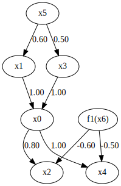
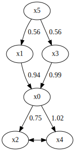
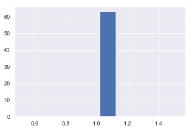

RCD
===

Import and settings
-------------------

In this example, we need to import ``numpy``, ``pandas``, and
``graphviz`` in addition to ``lingam``.

.. code-block:: python

    import numpy as np
    import pandas as pd
    import graphviz
    import lingam
    from lingam.utils import print_causal_directions, print_dagc, make_dot
    
    print([np.__version__, pd.__version__, graphviz.__version__, lingam.__version__])
    
    np.set_printoptions(precision=3, suppress=True)

.. parsed-literal::

    ['1.16.2', '0.24.2', '0.11.1', '1.5.4']
    

Test data
---------

First, we generate a causal structure with 7 variables. Then we create a
dataset with 5 variables from x0 to x4, with x5 and x6 being the latent
variables.

.. code-block:: python

    np.random.seed(0)
    
    get_external_effect = lambda n: np.random.normal(0.0, 0.5, n) ** 3
    n_samples = 300
    
    x5 = get_external_effect(n_samples)
    x6 = get_external_effect(n_samples)
    x1 = 0.6*x5 + get_external_effect(n_samples)
    x3 = 0.5*x5 + get_external_effect(n_samples)
    x0 = 1.0*x1 + 1.0*x3 + get_external_effect(n_samples)
    x2 = 0.8*x0 - 0.6*x6 + get_external_effect(n_samples)
    x4 = 1.0*x0 - 0.5*x6 + get_external_effect(n_samples)
    
    # The latent variable x6 is not included.
    X = pd.DataFrame(np.array([x0, x1, x2, x3, x4, x5]).T, columns=['x0', 'x1', 'x2', 'x3', 'x4', 'x5'])
    
    X.head()

.. raw:: html

    

    
    <table border="1" class="dataframe">
      <thead>
        <tr style="text-align: right;">
          <th></th>
          <th>x0</th>
          <th>x1</th>
          <th>x2</th>
          <th>x3</th>
          <th>x4</th>
          <th>x5</th>
        </tr>
      </thead>
      <tbody>
        <tr>
          <th>0</th>
          <td>-0.191493</td>
          <td>-0.054157</td>
          <td>0.014075</td>
          <td>-0.047309</td>
          <td>0.016311</td>
          <td>0.686190</td>
        </tr>
        <tr>
          <th>1</th>
          <td>-0.967142</td>
          <td>0.013890</td>
          <td>-1.115854</td>
          <td>-0.035899</td>
          <td>-1.254783</td>
          <td>0.008009</td>
        </tr>
        <tr>
          <th>2</th>
          <td>0.527409</td>
          <td>-0.034960</td>
          <td>0.426923</td>
          <td>0.064804</td>
          <td>0.894242</td>
          <td>0.117195</td>
        </tr>
        <tr>
          <th>3</th>
          <td>1.583826</td>
          <td>0.845653</td>
          <td>1.265038</td>
          <td>0.704166</td>
          <td>1.994283</td>
          <td>1.406609</td>
        </tr>
        <tr>
          <th>4</th>
          <td>0.286276</td>
          <td>0.141120</td>
          <td>0.116967</td>
          <td>0.329866</td>
          <td>0.257932</td>
          <td>0.814202</td>
        </tr>
      </tbody>
    </table>
    

     

.. code-block:: python

    m = np.array([[ 0.0, 1.0, 0.0, 1.0, 0.0, 0.0, 0.0],
                  [ 0.0, 0.0, 0.0, 0.0, 0.0, 0.6, 0.0],
                  [ 0.8, 0.0, 0.0, 0.0, 0.0, 0.0,-0.6],
                  [ 0.0, 0.0, 0.0, 0.0, 0.0, 0.5, 0.0],
                  [ 1.0, 0.0, 0.0, 0.0, 0.0, 0.0,-0.5],
                  [ 0.0, 0.0, 0.0, 0.0, 0.0, 0.0, 0.0],
                  [ 0.0, 0.0, 0.0, 0.0, 0.0, 0.0, 0.0]])
    dot = make_dot(m, labels=['x0', 'x1', 'x2', 'x3', 'x4', 'x5', 'f1(x6)'])
    
    # Save pdf
    dot.render('dag')
    
    # Save png
    dot.format = 'png'
    dot.render('dag')
    
    dot

Causal Discovery
----------------

To run causal discovery, we create a ``RCD`` object and call the ``fit``
method.

.. code-block:: python

    model = lingam.RCD()
    model.fit(X)

.. parsed-literal::

    <lingam.rcd.RCD at 0x25e725a4dd8>

Using the ``ancestors_list_`` properties, we can see the list of
ancestors sets as a result of the causal discovery.

.. code-block:: python

    ancestors_list = model.ancestors_list_
    
    for i, ancestors in enumerate(ancestors_list):
        print(f'M{i}={ancestors}')

.. parsed-literal::

    M0={1, 3, 5}
    M1={5}
    M2={0, 1, 3, 5}
    M3={5}
    M4={0, 1, 3, 5}
    M5=set()
    

Also, using the ``adjacency_matrix_`` properties, we can see the
adjacency matrix as a result of the causal discovery. The coefficients
between variables with latent confounders are np.nan.

.. code-block:: python

    model.adjacency_matrix_

.. parsed-literal::

    array([[0.   , 0.939, 0.   , 0.994, 0.   , 0.   ],
           [0.   , 0.   , 0.   , 0.   , 0.   , 0.556],
           [0.751, 0.   , 0.   , 0.   ,   nan, 0.   ],
           [0.   , 0.   , 0.   , 0.   , 0.   , 0.563],
           [1.016, 0.   ,   nan, 0.   , 0.   , 0.   ],
           [0.   , 0.   , 0.   , 0.   , 0.   , 0.   ]])

.. code-block:: python

    make_dot(model.adjacency_matrix_)

Independence between error variables
------------------------------------

To check if the LiNGAM assumption is broken, we can get p-values of
independence between error variables. The value in the i-th row and j-th
column of the obtained matrix shows the p-value of the independence of
the error variables :math:`e_i` and :math:`e_j`.

.. code-block:: python

    p_values = model.get_error_independence_p_values(X)
    print(p_values)

.. parsed-literal::

    [[0.    0.      nan 0.413   nan 0.68 ]
     [0.    0.      nan 0.732   nan 0.382]
     [  nan   nan 0.      nan   nan   nan]
     [0.413 0.732   nan 0.      nan 0.054]
     [  nan   nan   nan   nan 0.      nan]
     [0.68  0.382   nan 0.054   nan 0.   ]]
    

Bootstrapping
-------------

We call ``bootstrap()`` method instead of ``fit()``. Here, the second
argument specifies the number of bootstrap sampling.

.. code-block:: python

    import warnings
    warnings.filterwarnings('ignore', category=UserWarning)
    
    model = lingam.RCD()
    result = model.bootstrap(X, n_sampling=100)

Causal Directions
-----------------

Since ``BootstrapResult`` object is returned, we can get the ranking of
the causal directions extracted by ``get_causal_direction_counts()``
method. In the following sample code, ``n_directions`` option is limited
to the causal directions of the top 8 rankings, and
``min_causal_effect`` option is limited to causal directions with a
coefficient of 0.01 or more.

.. code-block:: python

    cdc = result.get_causal_direction_counts(n_directions=8, min_causal_effect=0.01, split_by_causal_effect_sign=True)

We can check the result by utility function.

.. code-block:: python

    print_causal_directions(cdc, 100)

.. parsed-literal::

    x0 <--- x1 (b>0) (100.0%)
    x4 <--- x0 (b>0) (99.0%)
    x1 <--- x5 (b>0) (97.0%)
    x2 <--- x0 (b>0) (96.0%)
    x0 <--- x3 (b>0) (92.0%)
    x3 <--- x5 (b>0) (67.0%)
    x2 <--- x4 (b>0) (13.0%)
    x4 <--- x3 (b<0) (11.0%)
    

Directed Acyclic Graphs
-----------------------

Also, using the ``get_directed_acyclic_graph_counts()`` method, we can
get the ranking of the DAGs extracted. In the following sample code,
``n_dags`` option is limited to the dags of the top 3 rankings, and
``min_causal_effect`` option is limited to causal directions with a
coefficient of 0.01 or more.

.. code-block:: python

    dagc = result.get_directed_acyclic_graph_counts(n_dags=3, min_causal_effect=0.01, split_by_causal_effect_sign=True)

We can check the result by utility function.

.. code-block:: python

    print_dagc(dagc, 100)

.. parsed-literal::

    DAG[0]: 47.0%
    	x0 <--- x1 (b>0)
    	x0 <--- x3 (b>0)
    	x1 <--- x5 (b>0)
    	x2 <--- x0 (b>0)
    	x3 <--- x5 (b>0)
    	x4 <--- x0 (b>0)
    DAG[1]: 20.0%
    	x0 <--- x1 (b>0)
    	x0 <--- x3 (b>0)
    	x1 <--- x5 (b>0)
    	x2 <--- x0 (b>0)
    	x4 <--- x0 (b>0)
    DAG[2]: 10.0%
    	x0 <--- x1 (b>0)
    	x0 <--- x3 (b>0)
    	x1 <--- x5 (b>0)
    	x2 <--- x0 (b>0)
    	x3 <--- x5 (b>0)
    	x4 <--- x0 (b>0)
    	x4 <--- x3 (b<0)
    

Probability
-----------

Using the ``get_probabilities()`` method, we can get the probability of
bootstrapping.

.. code-block:: python

    prob = result.get_probabilities(min_causal_effect=0.01)
    print(prob)

.. parsed-literal::

    [[0.   1.   0.   0.92 0.   0.08]
     [0.   0.   0.   0.   0.   0.97]
     [0.96 0.   0.   0.   0.13 0.  ]
     [0.   0.   0.   0.   0.   0.67]
     [0.99 0.01 0.02 0.12 0.   0.  ]
     [0.   0.   0.   0.   0.   0.  ]]
    

Total Causal Effects
--------------------

Using the ``get_total_causal_effects()`` method, we can get the list of
total causal effect. The total causal effects we can get are dictionary
type variable. We can display the list nicely by assigning it to
pandas.DataFrame. Also, we have replaced the variable index with a label
below.

.. code-block:: python

    causal_effects = result.get_total_causal_effects(min_causal_effect=0.01)
    
    # Assign to pandas.DataFrame for pretty display
    df = pd.DataFrame(causal_effects)
    labels = [f'x{i}' for i in range(X.shape[1])]
    df['from'] = df['from'].apply(lambda x : labels[x])
    df['to'] = df['to'].apply(lambda x : labels[x])
    df

.. raw:: html

    

    
    <table border="1" class="dataframe">
      <thead>
        <tr style="text-align: right;">
          <th></th>
          <th>from</th>
          <th>to</th>
          <th>effect</th>
          <th>probability</th>
        </tr>
      </thead>
      <tbody>
        <tr>
          <th>0</th>
          <td>x1</td>
          <td>x0</td>
          <td>0.929241</td>
          <td>0.97</td>
        </tr>
        <tr>
          <th>1</th>
          <td>x1</td>
          <td>x2</td>
          <td>0.642897</td>
          <td>0.97</td>
        </tr>
        <tr>
          <th>2</th>
          <td>x1</td>
          <td>x4</td>
          <td>0.940142</td>
          <td>0.96</td>
        </tr>
        <tr>
          <th>3</th>
          <td>x0</td>
          <td>x2</td>
          <td>0.733251</td>
          <td>0.91</td>
        </tr>
        <tr>
          <th>4</th>
          <td>x0</td>
          <td>x4</td>
          <td>0.976640</td>
          <td>0.91</td>
        </tr>
        <tr>
          <th>5</th>
          <td>x3</td>
          <td>x0</td>
          <td>0.986875</td>
          <td>0.66</td>
        </tr>
        <tr>
          <th>6</th>
          <td>x3</td>
          <td>x2</td>
          <td>0.732515</td>
          <td>0.66</td>
        </tr>
        <tr>
          <th>7</th>
          <td>x3</td>
          <td>x4</td>
          <td>0.899673</td>
          <td>0.65</td>
        </tr>
        <tr>
          <th>8</th>
          <td>x5</td>
          <td>x0</td>
          <td>1.021466</td>
          <td>0.63</td>
        </tr>
        <tr>
          <th>9</th>
          <td>x5</td>
          <td>x1</td>
          <td>0.555707</td>
          <td>0.63</td>
        </tr>
        <tr>
          <th>10</th>
          <td>x5</td>
          <td>x2</td>
          <td>0.741192</td>
          <td>0.63</td>
        </tr>
        <tr>
          <th>11</th>
          <td>x5</td>
          <td>x3</td>
          <td>0.563175</td>
          <td>0.63</td>
        </tr>
        <tr>
          <th>12</th>
          <td>x5</td>
          <td>x4</td>
          <td>0.941773</td>
          <td>0.61</td>
        </tr>
        <tr>
          <th>13</th>
          <td>x4</td>
          <td>x2</td>
          <td>0.225102</td>
          <td>0.13</td>
        </tr>
        <tr>
          <th>14</th>
          <td>x2</td>
          <td>x4</td>
          <td>0.243174</td>
          <td>0.03</td>
        </tr>
      </tbody>
    </table>
    

     

We can easily perform sorting operations with pandas.DataFrame.

.. code-block:: python

    df.sort_values('effect', ascending=False).head()

.. raw:: html

    

    
    <table border="1" class="dataframe">
      <thead>
        <tr style="text-align: right;">
          <th></th>
          <th>from</th>
          <th>to</th>
          <th>effect</th>
          <th>probability</th>
        </tr>
      </thead>
      <tbody>
        <tr>
          <th>8</th>
          <td>x5</td>
          <td>x0</td>
          <td>1.021466</td>
          <td>0.63</td>
        </tr>
        <tr>
          <th>5</th>
          <td>x3</td>
          <td>x0</td>
          <td>0.986875</td>
          <td>0.66</td>
        </tr>
        <tr>
          <th>4</th>
          <td>x0</td>
          <td>x4</td>
          <td>0.976640</td>
          <td>0.91</td>
        </tr>
        <tr>
          <th>12</th>
          <td>x5</td>
          <td>x4</td>
          <td>0.941773</td>
          <td>0.61</td>
        </tr>
        <tr>
          <th>2</th>
          <td>x1</td>
          <td>x4</td>
          <td>0.940142</td>
          <td>0.96</td>
        </tr>
      </tbody>
    </table>
    

     

.. code-block:: python

    df.sort_values('probability', ascending=True).head()

.. raw:: html

    

    
    <table border="1" class="dataframe">
      <thead>
        <tr style="text-align: right;">
          <th></th>
          <th>from</th>
          <th>to</th>
          <th>effect</th>
          <th>probability</th>
        </tr>
      </thead>
      <tbody>
        <tr>
          <th>14</th>
          <td>x2</td>
          <td>x4</td>
          <td>0.243174</td>
          <td>0.03</td>
        </tr>
        <tr>
          <th>13</th>
          <td>x4</td>
          <td>x2</td>
          <td>0.225102</td>
          <td>0.13</td>
        </tr>
        <tr>
          <th>12</th>
          <td>x5</td>
          <td>x4</td>
          <td>0.941773</td>
          <td>0.61</td>
        </tr>
        <tr>
          <th>8</th>
          <td>x5</td>
          <td>x0</td>
          <td>1.021466</td>
          <td>0.63</td>
        </tr>
        <tr>
          <th>9</th>
          <td>x5</td>
          <td>x1</td>
          <td>0.555707</td>
          <td>0.63</td>
        </tr>
      </tbody>
    </table>
    

     

Because it holds the raw data of the causal effect (the original data
for calculating the median), it is possible to draw a histogram of the
values of the causal effect, as shown below.

.. code-block:: python

    import matplotlib.pyplot as plt
    import seaborn as sns
    sns.set()
    %matplotlib inline
    
    from_index = 5 # index of x5
    to_index = 0 # index of x0
    plt.hist(result.total_effects_[:, to_index, from_index])

Bootstrap Probability of Path
-----------------------------

Using the ``get_paths()`` method, we can explore all paths from any
variable to any variable and calculate the bootstrap probability for
each path. The path will be output as an array of variable indices. For
example, the array ``[3, 0, 1]`` shows the path from variable X3 through
variable X0 to variable X1.

.. code-block:: python

    from_index = 5 # index of x5
    to_index = 4 # index of x4
    
    pd.DataFrame(result.get_paths(from_index, to_index))

.. raw:: html

    

    
    <table border="1" class="dataframe">
      <thead>
        <tr style="text-align: right;">
          <th></th>
          <th>path</th>
          <th>effect</th>
          <th>probability</th>
        </tr>
      </thead>
      <tbody>
        <tr>
          <th>0</th>
          <td>[5, 1, 0, 4]</td>
          <td>0.534675</td>
          <td>0.96</td>
        </tr>
        <tr>
          <th>1</th>
          <td>[5, 3, 0, 4]</td>
          <td>0.580992</td>
          <td>0.65</td>
        </tr>
        <tr>
          <th>2</th>
          <td>[5, 3, 4]</td>
          <td>-0.197046</td>
          <td>0.12</td>
        </tr>
        <tr>
          <th>3</th>
          <td>[5, 0, 4]</td>
          <td>0.505671</td>
          <td>0.08</td>
        </tr>
        <tr>
          <th>4</th>
          <td>[5, 1, 0, 2, 4]</td>
          <td>0.071415</td>
          <td>0.01</td>
        </tr>
        <tr>
          <th>5</th>
          <td>[5, 1, 4]</td>
          <td>0.530308</td>
          <td>0.01</td>
        </tr>
      </tbody>
    </table>
    

