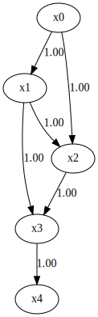
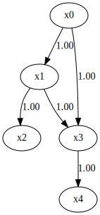

RESIT
=====

Model
-------------------
RESIT [2]_ is an estimation algorithm for Additive Noise Model [1]_. 

This method makes the following assumptions. 

#. Continouos variables
#. Nonlinearity
#. Additive noise
#. Acyclicity
#. No hidden common causes

Denote observed variables by $x_i$ and error variables by $e_i$ ( $i=1, ..., p$ ). 
The error variables $e_i$ ( $i=1, ..., p$ ) are independent due to the assumption of no hidden common causes. 
Then, mathematically, the model for observed variables $x_i$ ( $i=1, ..., p$ ) is written as 

$$ x_i = f_i (pa(x_i))+e_i, $$

where $f_i$ are some nonlinear (differentiable) functions and $pa(x_i)$ are the parents of $x_i$ ( $i=1, ..., p$ ).

References

    .. [1] P. O. Hoyer, D. Janzing, J. M. Mooij, and J. Peters. and B. Schölkopf.
       Nonlinear causal discovery with additive noise models.
       Advances in Neural Information Processing Systems 21, pages 689–696. 2009.
    .. [2] J. Peters, J. M. Mooij, D. Janzing, and B. Schölkopf.
       Causal discovery with continuous additive noise models
       Journal of Machine Learning Research, 15: 2009–2053, 2014.
 

Import and settings
-------------------

In this example, we need to import ``numpy``, ``pandas``, and
``graphviz`` in addition to ``lingam``.

.. code-block:: python

    import numpy as np
    import pandas as pd
    import graphviz
    import lingam
    from lingam.utils import print_causal_directions, print_dagc, make_dot
    
    import warnings
    warnings.filterwarnings('ignore')
    
    print([np.__version__, pd.__version__, graphviz.__version__, lingam.__version__])
    
    np.set_printoptions(precision=3, suppress=True)

.. parsed-literal::

    ['1.21.5', '1.3.2', '0.17', '1.6.0']

Test data
---------

First, we generate a causal structure with 7 variables. Then we create a
dataset with 6 variables from x0 to x5, with x6 being the latent
variable for x2 and x3.

.. code-block:: python

    X = pd.read_csv('nonlinear_data.csv')

.. code-block:: python

    m = np.array([
        [0, 0, 0, 0, 0],
        [1, 0, 0, 0, 0],
        [1, 1, 0, 0, 0],
        [0, 1, 1, 0, 0],
        [0, 0, 0, 1, 0]])
    
    dot = make_dot(m)
    
    # Save pdf
    dot.render('dag')
    
    # Save png
    dot.format = 'png'
    dot.render('dag')
    
    dot

Causal Discovery
----------------

To run causal discovery, we create a ``RESIT`` object and call the
``fit`` method.

.. code-block:: python

    from sklearn.ensemble import RandomForestRegressor
    reg = RandomForestRegressor(max_depth=4, random_state=0)
    
    model = lingam.RESIT(regressor=reg)
    model.fit(X)

.. parsed-literal::

    <lingam.resit.RESIT at 0x201a773c548>

Using the ``causal_order_`` properties, we can see the causal ordering
as a result of the causal discovery. x2 and x3, which have latent
confounders as parents, are stored in a list without causal ordering.

.. code-block:: python

    model.causal_order_

.. parsed-literal::

    [0, 1, 2, 3, 4]

Also, using the ``adjacency_matrix_`` properties, we can see the
adjacency matrix as a result of the causal discovery. The coefficients
between variables with latent confounders are np.nan.

.. code-block:: python

    model.adjacency_matrix_

.. parsed-literal::

    array([[0., 0., 0., 0., 0.],
           [1., 0., 0., 0., 0.],
           [0., 1., 0., 0., 0.],
           [1., 1., 0., 0., 0.],
           [0., 0., 0., 1., 0.]])

We can draw a causal graph by utility funciton.

.. code-block:: python

    make_dot(model.adjacency_matrix_)

Bootstrapping
-------------

We call ``bootstrap()`` method instead of ``fit()``. Here, the second
argument specifies the number of bootstrap sampling.

.. code-block:: python

    import warnings
    warnings.filterwarnings('ignore', category=UserWarning)
    
    n_sampling = 100
    model = lingam.RESIT(regressor=reg)
    result = model.bootstrap(X, n_sampling=n_sampling)

Causal Directions
-----------------

Since ``BootstrapResult`` object is returned, we can get the ranking of
the causal directions extracted by ``get_causal_direction_counts()``
method. In the following sample code, ``n_directions`` option is limited
to the causal directions of the top 8 rankings, and
``min_causal_effect`` option is limited to causal directions with a
coefficient of 0.01 or more.

.. code-block:: python

    cdc = result.get_causal_direction_counts(n_directions=8, min_causal_effect=0.01, split_by_causal_effect_sign=True)

We can check the result by utility function.

.. code-block:: python

    print_causal_directions(cdc, n_sampling)

.. parsed-literal::

    x1 <--- x0 (b>0) (100.0%)
    x2 <--- x1 (b>0) (71.0%)
    x4 <--- x1 (b>0) (62.0%)
    x2 <--- x0 (b>0) (62.0%)
    x3 <--- x1 (b>0) (53.0%)
    x3 <--- x4 (b>0) (52.0%)
    x4 <--- x3 (b>0) (47.0%)
    x3 <--- x0 (b>0) (44.0%)

Directed Acyclic Graphs
-----------------------

Also, using the ``get_directed_acyclic_graph_counts()`` method, we can
get the ranking of the DAGs extracted. In the following sample code,
``n_dags`` option is limited to the dags of the top 3 rankings, and
``min_causal_effect`` option is limited to causal directions with a
coefficient of 0.01 or more.

.. code-block:: python

    dagc = result.get_directed_acyclic_graph_counts(n_dags=3, min_causal_effect=0.01, split_by_causal_effect_sign=True)

We can check the result by utility function.

.. code-block:: python

    print_dagc(dagc, n_sampling)

.. parsed-literal::

    DAG[0]: 13.0%
    	x1 <--- x0 (b>0)
    	x2 <--- x1 (b>0)
    	x3 <--- x4 (b>0)
    	x4 <--- x0 (b>0)
    	x4 <--- x1 (b>0)
    DAG[1]: 13.0%
    	x1 <--- x0 (b>0)
    	x2 <--- x0 (b>0)
    	x2 <--- x1 (b>0)
    	x3 <--- x4 (b>0)
    	x4 <--- x1 (b>0)
    DAG[2]: 11.0%
    	x1 <--- x0 (b>0)
    	x2 <--- x1 (b>0)
    	x3 <--- x0 (b>0)
    	x3 <--- x1 (b>0)
    	x4 <--- x3 (b>0)

Probability
-----------

Using the ``get_probabilities()`` method, we can get the probability of
bootstrapping.

.. code-block:: python

    prob = result.get_probabilities(min_causal_effect=0.01)
    print(prob)

.. parsed-literal::

    [[0.   0.   0.   0.02 0.  ]
     [1.   0.   0.07 0.05 0.01]
     [0.62 0.71 0.   0.06 0.03]
     [0.44 0.53 0.18 0.   0.52]
     [0.43 0.62 0.21 0.47 0.  ]]

Bootstrap Probability of Path
-----------------------------

Using the ``get_paths()`` method, we can explore all paths from any
variable to any variable and calculate the bootstrap probability for
each path. The path will be output as an array of variable indices. For
example, the array ``[0, 1, 3]`` shows the path from variable X0 through
variable X1 to variable X3.

.. code-block:: python

    from_index = 0 # index of x0
    to_index = 3 # index of x3
    
    pd.DataFrame(result.get_paths(from_index, to_index))

.. raw:: html

    

    
    <table border="1" class="dataframe">
      <thead>
        <tr style="text-align: right;">
          <th></th>
          <th>path</th>
          <th>effect</th>
          <th>probability</th>
        </tr>
      </thead>
      <tbody>
        <tr>
          <th>0</th>
          <td>[0, 1, 3]</td>
          <td>1.0</td>
          <td>0.53</td>
        </tr>
        <tr>
          <th>1</th>
          <td>[0, 1, 4, 3]</td>
          <td>1.0</td>
          <td>0.51</td>
        </tr>
        <tr>
          <th>2</th>
          <td>[0, 3]</td>
          <td>1.0</td>
          <td>0.44</td>
        </tr>
        <tr>
          <th>3</th>
          <td>[0, 4, 3]</td>
          <td>1.0</td>
          <td>0.33</td>
        </tr>
        <tr>
          <th>4</th>
          <td>[0, 2, 3]</td>
          <td>1.0</td>
          <td>0.12</td>
        </tr>
        <tr>
          <th>5</th>
          <td>[0, 1, 2, 3]</td>
          <td>1.0</td>
          <td>0.11</td>
        </tr>
        <tr>
          <th>6</th>
          <td>[0, 2, 4, 3]</td>
          <td>1.0</td>
          <td>0.07</td>
        </tr>
        <tr>
          <th>7</th>
          <td>[0, 1, 2, 4, 3]</td>
          <td>1.0</td>
          <td>0.04</td>
        </tr>
        <tr>
          <th>8</th>
          <td>[0, 1, 4, 2, 3]</td>
          <td>1.0</td>
          <td>0.03</td>
        </tr>
        <tr>
          <th>9</th>
          <td>[0, 2, 1, 3]</td>
          <td>1.0</td>
          <td>0.01</td>
        </tr>
        <tr>
          <th>10</th>
          <td>[0, 4, 1, 3]</td>
          <td>1.0</td>
          <td>0.01</td>
        </tr>
      </tbody>
    </table>
    

