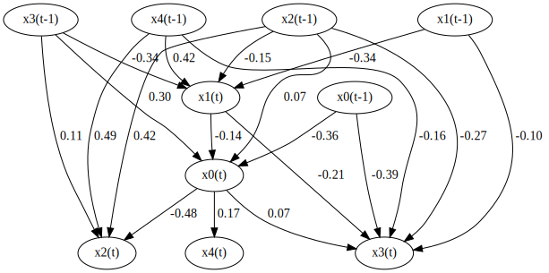
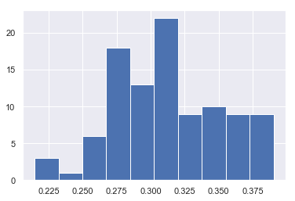

VARLiNGAM
=========

Model
-------------------
VARLiNGAM [2]_ is an extension of the basic LiNGAM model [1]_ to time series cases. 
It combines the basic LiNGAM model with the classic vector autoregressive models (VAR). 
It enables analyzing both lagged and contemporaneous (instantaneous) causal relations, whereas the classic VAR only analyzes lagged causal relations. 
This VARLiNGAM makes the following assumptions similarly to the basic LiNGAM model [1]_:
#. Linearity
#. Non-Gaussian continuous error variables (except at most one)
#. Acyclicity of contemporaneous causal relations
#. No hidden common causes

Denote observed variables at time point $t$ by $x_i (t)$ and error variables by $e_i (t)$ ( $i=1, ..., p$, $t=1,...,T$ ). 
Collect them in vectors $x(t)$ and $e(t)$ ( $t=1,...,T$ ), respectivelly. 
Further, denote by matrices $B_{\\tau}$ adjacency matrices with time lag $\\tau$ ( $\\tau = 1, ..., k$ ).

Due to the acyclicity assumption of contemporaneous causal relations, the coefficient matrix $B_0$ can be permuted to be strictly lower-triangular by a simultaneous row and column permutation.
The error variables $e_i (t)$ ( $i=1, ..., p$, $t=1,...,T$ ) are independent due to the assumption of no hidden common causes. 

Then, mathematically, the model for observed variable vector $x(t)$ is written as 

$$ x(t) = \\sum_{ \\tau = 0}^k B_{ \\tau } x(t - \\tau) + e(t).$$

Example applications are found `here <https://www.shimizulab.org/lingam/lingampapers/applications-and-tailor-made-methods>`__, especially in Section. Economics/Finance/Marketing. 
For example, [3]_ uses the VARLiNGAM model to to study the processes of firm growth and firm performance using microeconomic data 
and to analyse the effects of monetary policy using macroeconomic data. 

References

    .. [1] S. Shimizu, P. O. Hoyer, A. Hyvärinen, and A. J. Kerminen.
       A linear non-gaussian acyclic model for causal discovery.
       Journal of Machine Learning Research, 7:2003-2030, 2006.
    .. [2] A. Hyvärinen, K. Zhang, S. Shimizu, and P. O. Hoyer. 
        Estimation of a structural vector autoregression model using non-Gaussianity. 
        Journal of Machine Learning Research, 11: 1709-1731, 2010.
    .. [3] A. Moneta, D. Entner, P. O. Hoyer and A. Coad. 
        Causal inference by independent component analysis: Theory and applications. 
        Oxford Bulletin of Economics and Statistics, 75(5): 705-730, 2013.

Import and settings
-------------------

In this example, we need to import ``numpy``, ``pandas``, and
``graphviz`` in addition to ``lingam``.

.. code-block:: python

    import numpy as np
    import pandas as pd
    import graphviz
    import lingam
    from lingam.utils import make_dot, print_causal_directions, print_dagc
    
    print([np.__version__, pd.__version__, graphviz.__version__, lingam.__version__])
    
    np.set_printoptions(precision=3, suppress=True)
    np.random.seed(0)

.. parsed-literal::

    ['1.16.2', '0.24.2', '0.11.1', '1.5.2']
    

Test data
---------

We create test data consisting of 5 variables.

.. code-block:: python

    B0 = [
        [0,-0.12,0,0,0],
        [0,0,0,0,0],
        [-0.41,0.01,0,-0.02,0],
        [0.04,-0.22,0,0,0],
        [0.15,0,-0.03,0,0],
    ]
    B1 = [
        [-0.32,0,0.12,0.32,0],
        [0,-0.35,-0.1,-0.46,0.4],
        [0,0,0.37,0,0.46],
        [-0.38,-0.1,-0.24,0,-0.13],
        [0,0,0,0,0],
    ]
    causal_order = [1, 0, 3, 2, 4]
    
    # data generated from B0 and B1
    X = pd.read_csv('data/sample_data_var_lingam.csv')

Causal Discovery
----------------

To run causal discovery, we create a :class:`~lingam.VARLiNGAM` object and call the :func:`~lingam.VARLiNGAM.fit` method.

.. code-block:: python

    model = lingam.VARLiNGAM()
    model.fit(X)

.. parsed-literal::

    <lingam.var_lingam.VARLiNGAM at 0x20510e049b0>

Using the :attr:`~lingam.VARLiNGAM.causal_order_` properties, we can see the causal ordering as a result of the causal discovery.

.. code-block:: python

    model.causal_order_

.. parsed-literal::

    [1, 0, 3, 2, 4]

Also, using the :attr:`~lingam.VARLiNGAM.adjacency_matrices_` properties, we can see the adjacency matrix as a result of the causal discovery.

.. code-block:: python

    # B0
    model.adjacency_matrices_[0]

.. parsed-literal::

    array([[ 0.   , -0.144,  0.   ,  0.   ,  0.   ],
           [ 0.   ,  0.   ,  0.   ,  0.   ,  0.   ],
           [-0.372,  0.   ,  0.   ,  0.   ,  0.   ],
           [ 0.069, -0.21 ,  0.   ,  0.   ,  0.   ],
           [ 0.083,  0.   , -0.033,  0.   ,  0.   ]])

.. code-block:: python

    # B1
    model.adjacency_matrices_[1]

.. parsed-literal::

    array([[-0.366, -0.011,  0.074,  0.297,  0.025],
           [-0.083, -0.349, -0.168, -0.327,  0.43 ],
           [ 0.077, -0.043,  0.427,  0.046,  0.49 ],
           [-0.389, -0.097, -0.263,  0.014, -0.159],
           [-0.018,  0.01 ,  0.001,  0.071,  0.003]])

.. code-block:: python

    model.residuals_

.. parsed-literal::

    array([[-0.308,  0.911, -1.152, -1.159,  0.179],
           [ 1.364,  1.713, -1.389, -0.265, -0.192],
           [-0.861,  0.249,  0.479, -1.557, -0.462],
           ...,
           [-1.202,  1.819,  0.99 , -0.855, -0.127],
           [-0.133,  1.23 , -0.445, -0.753,  1.096],
           [-0.069,  0.558,  0.21 , -0.863, -0.189]])

Using ``DirectLiNGAM`` for the ``residuals_`` properties, we can
calculate B0 matrix.

.. code-block:: python

    dlingam = lingam.DirectLiNGAM()
    dlingam.fit(model.residuals_)
    dlingam.adjacency_matrix_

.. parsed-literal::

    array([[ 0.   , -0.144,  0.   ,  0.   ,  0.   ],
           [ 0.   ,  0.   ,  0.   ,  0.   ,  0.   ],
           [-0.372,  0.   ,  0.   ,  0.   ,  0.   ],
           [ 0.069, -0.21 ,  0.   ,  0.   ,  0.   ],
           [ 0.083,  0.   , -0.033,  0.   ,  0.   ]])

We can draw a causal graph by utility funciton.

.. code-block:: python

    labels = ['x0(t)', 'x1(t)', 'x2(t)', 'x3(t)', 'x4(t)', 'x0(t-1)', 'x1(t-1)', 'x2(t-1)', 'x3(t-1)', 'x4(t-1)']
    make_dot(np.hstack(model.adjacency_matrices_), ignore_shape=True, lower_limit=0.05, labels=labels)

Independence between error variables
------------------------------------

To check if the LiNGAM assumption is broken, we can get p-values of
independence between error variables. The value in the i-th row and j-th
column of the obtained matrix shows the p-value of the independence of
the error variables :math:`e_i` and :math:`e_j`.

.. code-block:: python

    p_values = model.get_error_independence_p_values()
    print(p_values)

.. parsed-literal::

    [[0.    0.065 0.068 0.038 0.249]
     [0.065 0.    0.13  0.88  0.57 ]
     [0.068 0.13  0.    0.321 0.231]
     [0.038 0.88  0.321 0.    0.839]
     [0.249 0.57  0.231 0.839 0.   ]]
    

Bootstrap
---------

Bootstrapping
~~~~~~~~~~~~~

We call :func:`~lingam.VARLiNGAM.bootstrap` method instead of :func:`~lingam.VARLiNGAM.fit`. Here, the second argument specifies the number of bootstrap sampling.

.. code-block:: python

    model = lingam.VARLiNGAM()
    result = model.bootstrap(X, n_sampling=100)

Causal Directions
-----------------

Since :class:`~lingam.BootstrapResult` object is returned, we can get the ranking of the causal directions extracted by :func:`~lingam.BootstrapResult.get_causal_direction_counts` method. In the following sample code, ``n_directions`` option is limited to the causal directions of the top 8 rankings, and ``min_causal_effect`` option is limited to causal directions with a coefficient of 0.3 or more.

.. code-block:: python

    cdc = result.get_causal_direction_counts(n_directions=8, min_causal_effect=0.3, split_by_causal_effect_sign=True)

We can check the result by utility function.

.. code-block:: python

    print_causal_directions(cdc, 100, labels=labels)

.. parsed-literal::

    x0(t) <--- x0(t-1) (b<0) (100.0%)
    x1(t) <--- x1(t-1) (b<0) (100.0%)
    x1(t) <--- x3(t-1) (b<0) (100.0%)
    x1(t) <--- x4(t-1) (b>0) (100.0%)
    x2(t) <--- x2(t-1) (b>0) (100.0%)
    x2(t) <--- x4(t-1) (b>0) (100.0%)
    x3(t) <--- x0(t-1) (b<0) (100.0%)
    x2(t) <--- x0(t) (b<0) (99.0%)
    

Directed Acyclic Graphs
-----------------------

Also, using the :func:`~lingam.BootstrapResult.get_directed_acyclic_graph_counts` method, we can get the ranking of the DAGs extracted. In the following sample code, ``n_dags`` option is limited to the dags of the top 3 rankings, and ``min_causal_effect`` option is limited to causal directions with a coefficient of 0.2 or more.

.. code-block:: python

    dagc = result.get_directed_acyclic_graph_counts(n_dags=3, min_causal_effect=0.2, split_by_causal_effect_sign=True)

We can check the result by utility function.

.. code-block:: python

    print_dagc(dagc, 100, labels=labels)

.. parsed-literal::

    DAG[0]: 57.0%
    	x0(t) <--- x0(t-1) (b<0)
    	x0(t) <--- x3(t-1) (b>0)
    	x1(t) <--- x1(t-1) (b<0)
    	x1(t) <--- x3(t-1) (b<0)
    	x1(t) <--- x4(t-1) (b>0)
    	x2(t) <--- x0(t) (b<0)
    	x2(t) <--- x2(t-1) (b>0)
    	x2(t) <--- x4(t-1) (b>0)
    	x3(t) <--- x1(t) (b<0)
    	x3(t) <--- x0(t-1) (b<0)
    	x3(t) <--- x2(t-1) (b<0)
    DAG[1]: 42.0%
    	x0(t) <--- x0(t-1) (b<0)
    	x0(t) <--- x3(t-1) (b>0)
    	x1(t) <--- x1(t-1) (b<0)
    	x1(t) <--- x3(t-1) (b<0)
    	x1(t) <--- x4(t-1) (b>0)
    	x2(t) <--- x0(t) (b<0)
    	x2(t) <--- x2(t-1) (b>0)
    	x2(t) <--- x4(t-1) (b>0)
    	x3(t) <--- x0(t-1) (b<0)
    	x3(t) <--- x2(t-1) (b<0)
    DAG[2]: 1.0%
    	x0(t) <--- x0(t-1) (b<0)
    	x0(t) <--- x3(t-1) (b>0)
    	x1(t) <--- x1(t-1) (b<0)
    	x1(t) <--- x3(t-1) (b<0)
    	x1(t) <--- x4(t-1) (b>0)
    	x2(t) <--- x0(t) (b<0)
    	x2(t) <--- x2(t-1) (b>0)
    	x2(t) <--- x4(t-1) (b>0)
    	x3(t) <--- x1(t) (b<0)
    	x3(t) <--- x0(t-1) (b<0)
    	x3(t) <--- x2(t-1) (b<0)
    	x4(t) <--- x0(t) (b>0)
    

Probability
-----------

Using the :func:`~lingam.BootstrapResult.get_probabilities` method, we can get the probability of bootstrapping.

.. code-block:: python

    prob = result.get_probabilities(min_causal_effect=0.1)
    print('Probability of B0:\n', prob[0])
    print('Probability of B1:\n', prob[1])

.. parsed-literal::

    Probability of B0:
     [[0.   0.98 0.   0.02 0.  ]
     [0.   0.   0.   0.   0.  ]
     [1.   0.   0.   0.   0.01]
     [0.1  1.   0.   0.   0.  ]
     [0.51 0.   0.02 0.08 0.  ]]
    Probability of B1:
     [[1.   0.   0.02 1.   0.  ]
     [0.   1.   1.   1.   1.  ]
     [0.03 0.   1.   0.05 1.  ]
     [1.   0.16 1.   0.   1.  ]
     [0.   0.   0.   0.25 0.  ]]
    

Total Causal Effects
--------------------

Using the ``get_causal_effects()`` method, we can get the list of total
causal effect. The total causal effects we can get are dictionary type
variable. We can display the list nicely by assigning it to
pandas.DataFrame. Also, we have replaced the variable index with a label
below.

.. code-block:: python

    causal_effects = result.get_total_causal_effects(min_causal_effect=0.01)
    df = pd.DataFrame(causal_effects)
    
    df['from'] = df['from'].apply(lambda x : labels[x])
    df['to'] = df['to'].apply(lambda x : labels[x])
    df

.. raw:: html

    

    
    <table border="1" class="dataframe">
      <thead>
        <tr style="text-align: right;">
          <th></th>
          <th>from</th>
          <th>to</th>
          <th>effect</th>
          <th>probability</th>
        </tr>
      </thead>
      <tbody>
        <tr>
          <th>0</th>
          <td>x1(t)</td>
          <td>x0(t)</td>
          <td>-0.131094</td>
          <td>1.00</td>
        </tr>
        <tr>
          <th>1</th>
          <td>x4(t-1)</td>
          <td>x2(t)</td>
          <td>0.463646</td>
          <td>1.00</td>
        </tr>
        <tr>
          <th>2</th>
          <td>x4(t-1)</td>
          <td>x3(t)</td>
          <td>-0.224349</td>
          <td>1.00</td>
        </tr>
        <tr>
          <th>3</th>
          <td>x0(t-1)</td>
          <td>x0(t)</td>
          <td>-0.297905</td>
          <td>1.00</td>
        </tr>
        <tr>
          <th>4</th>
          <td>x1(t)</td>
          <td>x3(t)</td>
          <td>-0.217983</td>
          <td>1.00</td>
        </tr>
        <tr>
          <th>5</th>
          <td>x3(t-1)</td>
          <td>x0(t)</td>
          <td>0.273013</td>
          <td>1.00</td>
        </tr>
        <tr>
          <th>6</th>
          <td>x2(t-1)</td>
          <td>x3(t)</td>
          <td>-0.177952</td>
          <td>1.00</td>
        </tr>
        <tr>
          <th>7</th>
          <td>x0(t-1)</td>
          <td>x3(t)</td>
          <td>-0.269388</td>
          <td>1.00</td>
        </tr>
        <tr>
          <th>8</th>
          <td>x1(t-1)</td>
          <td>x1(t)</td>
          <td>-0.260914</td>
          <td>1.00</td>
        </tr>
        <tr>
          <th>9</th>
          <td>x2(t-1)</td>
          <td>x2(t)</td>
          <td>0.310371</td>
          <td>1.00</td>
        </tr>
        <tr>
          <th>10</th>
          <td>x4(t-1)</td>
          <td>x1(t)</td>
          <td>0.397907</td>
          <td>1.00</td>
        </tr>
        <tr>
          <th>11</th>
          <td>x0(t)</td>
          <td>x2(t)</td>
          <td>-0.404106</td>
          <td>1.00</td>
        </tr>
        <tr>
          <th>12</th>
          <td>x1(t)</td>
          <td>x2(t)</td>
          <td>0.090684</td>
          <td>1.00</td>
        </tr>
        <tr>
          <th>13</th>
          <td>x3(t-1)</td>
          <td>x1(t)</td>
          <td>-0.206743</td>
          <td>0.99</td>
        </tr>
        <tr>
          <th>14</th>
          <td>x3(t-1)</td>
          <td>x3(t)</td>
          <td>0.091307</td>
          <td>0.93</td>
        </tr>
        <tr>
          <th>15</th>
          <td>x2(t-1)</td>
          <td>x1(t)</td>
          <td>-0.121280</td>
          <td>0.86</td>
        </tr>
        <tr>
          <th>16</th>
          <td>x0(t)</td>
          <td>x4(t)</td>
          <td>0.106232</td>
          <td>0.86</td>
        </tr>
        <tr>
          <th>17</th>
          <td>x0(t-1)</td>
          <td>x2(t)</td>
          <td>0.083258</td>
          <td>0.79</td>
        </tr>
        <tr>
          <th>18</th>
          <td>x3(t-1)</td>
          <td>x2(t)</td>
          <td>-0.085736</td>
          <td>0.73</td>
        </tr>
        <tr>
          <th>19</th>
          <td>x0(t)</td>
          <td>x3(t)</td>
          <td>0.075516</td>
          <td>0.68</td>
        </tr>
        <tr>
          <th>20</th>
          <td>x2(t-1)</td>
          <td>x0(t)</td>
          <td>0.070990</td>
          <td>0.58</td>
        </tr>
        <tr>
          <th>21</th>
          <td>x1(t-1)</td>
          <td>x2(t)</td>
          <td>-0.043181</td>
          <td>0.55</td>
        </tr>
        <tr>
          <th>22</th>
          <td>x4(t-1)</td>
          <td>x0(t)</td>
          <td>-0.047978</td>
          <td>0.50</td>
        </tr>
        <tr>
          <th>23</th>
          <td>x1(t-1)</td>
          <td>x0(t)</td>
          <td>0.026918</td>
          <td>0.32</td>
        </tr>
        <tr>
          <th>24</th>
          <td>x2(t)</td>
          <td>x4(t)</td>
          <td>-0.049998</td>
          <td>0.29</td>
        </tr>
        <tr>
          <th>25</th>
          <td>x3(t)</td>
          <td>x0(t)</td>
          <td>0.053440</td>
          <td>0.23</td>
        </tr>
        <tr>
          <th>26</th>
          <td>x4(t)</td>
          <td>x2(t)</td>
          <td>-0.053585</td>
          <td>0.22</td>
        </tr>
        <tr>
          <th>27</th>
          <td>x3(t)</td>
          <td>x2(t)</td>
          <td>-0.034164</td>
          <td>0.22</td>
        </tr>
        <tr>
          <th>28</th>
          <td>x3(t-1)</td>
          <td>x4(t)</td>
          <td>0.069278</td>
          <td>0.20</td>
        </tr>
        <tr>
          <th>29</th>
          <td>x1(t)</td>
          <td>x4(t)</td>
          <td>-0.032277</td>
          <td>0.17</td>
        </tr>
        <tr>
          <th>30</th>
          <td>x4(t)</td>
          <td>x3(t)</td>
          <td>-0.041963</td>
          <td>0.16</td>
        </tr>
        <tr>
          <th>31</th>
          <td>x1(t-1)</td>
          <td>x3(t)</td>
          <td>0.018327</td>
          <td>0.14</td>
        </tr>
        <tr>
          <th>32</th>
          <td>x2(t)</td>
          <td>x3(t)</td>
          <td>-0.017783</td>
          <td>0.13</td>
        </tr>
        <tr>
          <th>33</th>
          <td>x0(t-1)</td>
          <td>x1(t)</td>
          <td>0.084306</td>
          <td>0.04</td>
        </tr>
        <tr>
          <th>34</th>
          <td>x3(t)</td>
          <td>x4(t)</td>
          <td>-0.117271</td>
          <td>0.02</td>
        </tr>
        <tr>
          <th>35</th>
          <td>x4(t)</td>
          <td>x0(t)</td>
          <td>0.081813</td>
          <td>0.01</td>
        </tr>
        <tr>
          <th>36</th>
          <td>x0(t-1)</td>
          <td>x4(t)</td>
          <td>-0.085855</td>
          <td>0.01</td>
        </tr>
        <tr>
          <th>37</th>
          <td>x1(t-1)</td>
          <td>x4(t)</td>
          <td>0.036685</td>
          <td>0.01</td>
        </tr>
      </tbody>
    </table>
    

     

We can easily perform sorting operations with pandas.DataFrame.

.. code-block:: python

    df.sort_values('effect', ascending=False).head()

.. raw:: html

    

    
    <table border="1" class="dataframe">
      <thead>
        <tr style="text-align: right;">
          <th></th>
          <th>from</th>
          <th>to</th>
          <th>effect</th>
          <th>probability</th>
        </tr>
      </thead>
      <tbody>
        <tr>
          <th>1</th>
          <td>x4(t-1)</td>
          <td>x2(t)</td>
          <td>0.463646</td>
          <td>1.00</td>
        </tr>
        <tr>
          <th>10</th>
          <td>x4(t-1)</td>
          <td>x1(t)</td>
          <td>0.397907</td>
          <td>1.00</td>
        </tr>
        <tr>
          <th>9</th>
          <td>x2(t-1)</td>
          <td>x2(t)</td>
          <td>0.310371</td>
          <td>1.00</td>
        </tr>
        <tr>
          <th>5</th>
          <td>x3(t-1)</td>
          <td>x0(t)</td>
          <td>0.273013</td>
          <td>1.00</td>
        </tr>
        <tr>
          <th>16</th>
          <td>x0(t)</td>
          <td>x4(t)</td>
          <td>0.106232</td>
          <td>0.86</td>
        </tr>
      </tbody>
    </table>
    

     

And with pandas.DataFrame, we can easily filter by keywords. The following code extracts the causal direction towards x1(t).

.. code-block:: python

    df[df['to']=='x1(t)'].head()

.. raw:: html

    

    
    <table border="1" class="dataframe">
      <thead>
        <tr style="text-align: right;">
          <th></th>
          <th>from</th>
          <th>to</th>
          <th>effect</th>
          <th>probability</th>
        </tr>
      </thead>
      <tbody>
        <tr>
          <th>8</th>
          <td>x1(t-1)</td>
          <td>x1(t)</td>
          <td>-0.260914</td>
          <td>1.00</td>
        </tr>
        <tr>
          <th>10</th>
          <td>x4(t-1)</td>
          <td>x1(t)</td>
          <td>0.397907</td>
          <td>1.00</td>
        </tr>
        <tr>
          <th>13</th>
          <td>x3(t-1)</td>
          <td>x1(t)</td>
          <td>-0.206743</td>
          <td>0.99</td>
        </tr>
        <tr>
          <th>15</th>
          <td>x2(t-1)</td>
          <td>x1(t)</td>
          <td>-0.121280</td>
          <td>0.86</td>
        </tr>
        <tr>
          <th>33</th>
          <td>x0(t-1)</td>
          <td>x1(t)</td>
          <td>0.084306</td>
          <td>0.04</td>
        </tr>
      </tbody>
    </table>
    

     

Because it holds the raw data of the causal effect (the original data
for calculating the median), it is possible to draw a histogram of the
values of the causal effect, as shown below.

.. code-block:: python

    import matplotlib.pyplot as plt
    import seaborn as sns
    sns.set()
    %matplotlib inline
    
    from_index = 7 # index of x2(t-1). (index:2)+(n_features:5)*(lag:1) = 7
    to_index = 2 # index of x2(t). (index:2)+(n_features:5)*(lag:0) = 2
    plt.hist(result.total_effects_[:, to_index, from_index])

