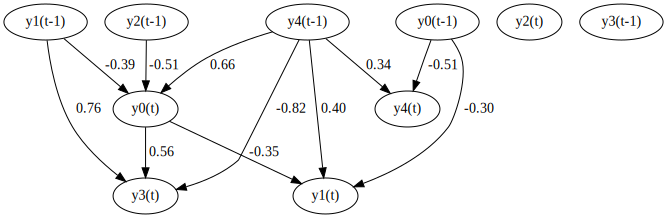
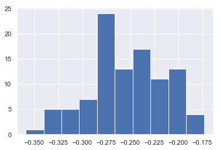

VARMALiNGAM
===========

Import and settings
-------------------

In this example, we need to import ``numpy``, ``pandas``, and
``graphviz`` in addition to ``lingam``.

.. code-block:: python

    import numpy as np
    import pandas as pd
    import graphviz
    import lingam
    from lingam.utils import make_dot, print_causal_directions, print_dagc
    
    import warnings
    warnings.filterwarnings('ignore')
    
    print([np.__version__, pd.__version__, graphviz.__version__, lingam.__version__])
    
    np.set_printoptions(precision=3, suppress=True)
    np.random.seed(0)

.. parsed-literal::

    ['1.16.2', '0.24.2', '0.11.1', '1.5.2']
    

Test data
---------

We create test data consisting of 5 variables.

.. code-block:: python

    psi0 = np.array([
        [ 0.  ,  0.  , -0.25,  0.  ,  0.  ],
        [-0.38,  0.  ,  0.14,  0.  ,  0.  ],
        [ 0.  ,  0.  ,  0.  ,  0.  ,  0.  ],
        [ 0.44, -0.2 , -0.09,  0.  ,  0.  ],
        [ 0.07, -0.06,  0.  ,  0.07,  0.  ]
    ])
    phi1 = np.array([
        [-0.04, -0.29, -0.26,  0.14,  0.47],
        [-0.42,  0.2 ,  0.1 ,  0.24,  0.25],
        [-0.25,  0.18, -0.06,  0.15,  0.18],
        [ 0.22,  0.39,  0.08,  0.12, -0.37],
        [-0.43,  0.09, -0.23,  0.16,  0.25]
    ])
    theta1 = np.array([
        [ 0.15, -0.02, -0.3 , -0.2 ,  0.21],
        [ 0.32,  0.12, -0.11,  0.03,  0.42],
        [-0.07, -0.5 ,  0.03, -0.27, -0.21],
        [-0.17,  0.35,  0.25,  0.24, -0.25],
        [ 0.09,  0.4 ,  0.41,  0.24, -0.31]
    ])
    causal_order = [2, 0, 1, 3, 4]
    
    # data generated from psi0 and phi1 and theta1, causal_order
    X = np.loadtxt('data/sample_data_varma_lingam.csv', delimiter=',')

Causal Discovery
----------------

To run causal discovery, we create a :class:`~lingam.VARMALiNGAM` object and call the :func:`~lingam.VARMALiNGAM.fit` method.

.. code-block:: python

    model = lingam.VARMALiNGAM(order=(1, 1), criterion=None)
    model.fit(X)

.. parsed-literal::

    <lingam.varma_lingam.VARMALiNGAM at 0x1acfc3fa6d8>

Using the :attr:`~lingam.VARMALiNGAM.causal_order_` properties, we can see the causal ordering as a result of the causal discovery.

.. code-block:: python

    model.causal_order_

.. parsed-literal::

    [2, 0, 1, 3, 4]

Also, using the :attr:`~lingam.VARMALiNGAM.adjacency_matrices_` properties, we can see the adjacency matrix as a result of the causal discovery.

.. code-block:: python

    # psi0
    model.adjacency_matrices_[0][0]

.. parsed-literal::

    array([[ 0.   ,  0.   , -0.238,  0.   ,  0.   ],
           [-0.392,  0.   ,  0.182,  0.   ,  0.   ],
           [ 0.   ,  0.   ,  0.   ,  0.   ,  0.   ],
           [ 0.523, -0.149,  0.   ,  0.   ,  0.   ],
           [ 0.   ,  0.   ,  0.   ,  0.   ,  0.   ]])

.. code-block:: python

    # psi1
    model.adjacency_matrices_[0][1]

.. parsed-literal::

    array([[-0.145, -0.288, -0.418,  0.041,  0.592],
           [-0.324,  0.027,  0.024,  0.231,  0.379],
           [-0.249,  0.191, -0.01 ,  0.136,  0.261],
           [ 0.182,  0.698,  0.21 ,  0.197, -0.815],
           [-0.486,  0.063, -0.263,  0.112,  0.26 ]])

.. code-block:: python

    # omega0
    model.adjacency_matrices_[1][0]

.. parsed-literal::

    array([[ 0.247, -0.12 , -0.128, -0.124,  0.037],
           [ 0.378,  0.319, -0.12 , -0.023,  0.573],
           [-0.107, -0.624,  0.012, -0.303, -0.246],
           [-0.22 ,  0.26 ,  0.313,  0.227, -0.057],
           [ 0.255,  0.405,  0.41 ,  0.256, -0.286]])

Using ``DirectLiNGAM`` for the ``residuals_`` properties, we can
calculate psi0 matrix.

.. code-block:: python

    dlingam = lingam.DirectLiNGAM()
    dlingam.fit(model.residuals_)
    dlingam.adjacency_matrix_

.. parsed-literal::

    array([[ 0.   ,  0.   , -0.238,  0.   ,  0.   ],
           [-0.392,  0.   ,  0.182,  0.   ,  0.   ],
           [ 0.   ,  0.   ,  0.   ,  0.   ,  0.   ],
           [ 0.523, -0.149,  0.   ,  0.   ,  0.   ],
           [ 0.   ,  0.   ,  0.   ,  0.   ,  0.   ]])

We can draw a causal graph by utility funciton

.. code-block:: python

    labels = ['y0(t)', 'y1(t)', 'y2(t)', 'y3(t)', 'y4(t)', 'y0(t-1)', 'y1(t-1)', 'y2(t-1)', 'y3(t-1)', 'y4(t-1)']
    make_dot(np.hstack(model.adjacency_matrices_[0]), lower_limit=0.3, ignore_shape=True, labels=labels)

Independence between error variables
------------------------------------

To check if the LiNGAM assumption is broken, we can get p-values of
independence between error variables. The value in the i-th row and j-th
column of the obtained matrix shows the p-value of the independence of
the error variables :math:`e_i` and :math:`e_j`.

.. code-block:: python

    p_values = model.get_error_independence_p_values()
    print(p_values)

.. parsed-literal::

    [[0.    0.517 0.793 0.004 0.001]
     [0.517 0.    0.09  0.312 0.071]
     [0.793 0.09  0.    0.058 0.075]
     [0.004 0.312 0.058 0.    0.011]
     [0.001 0.071 0.075 0.011 0.   ]]
    

Bootstrap
---------

Bootstrapping
~~~~~~~~~~~~~

We call :func:`~lingam.VARMALiNGAM.bootstrap` method instead of :func:`~lingam.VARMALiNGAM.fit`. Here, the second argument specifies the number of bootstrap sampling.

.. code-block:: python

    model = lingam.VARMALiNGAM()
    result = model.bootstrap(X, n_sampling=100)

Causal Directions
-----------------

Since :class:`~lingam.BootstrapResult` object is returned, we can get the ranking of the causal directions extracted by :func:`~lingam.BootstrapResult.get_causal_direction_counts` method. In the following sample code, ``n_directions`` option is limited to the causal directions of the top 8 rankings, and ``min_causal_effect`` option is limited to causal directions with a coefficient of 0.4 or more.

.. code-block:: python

    cdc = result.get_causal_direction_counts(n_directions=8, min_causal_effect=0.4, split_by_causal_effect_sign=True)

We can check the result by utility function.

.. code-block:: python

    labels = ['y0(t)', 'y1(t)', 'y2(t)', 'y3(t)', 'y4(t)', 'y0(t-1)', 'y1(t-1)', 'y2(t-1)', 'y3(t-1)', 'y4(t-1)', 'e0(t-1)', 'e1(t-1)', 'e2(t-1)', 'e3(t-1)', 'e4(t-1)']
    print_causal_directions(cdc, 100, labels=labels)

.. parsed-literal::

    y0(t) <--- y2(t-1) (b<0) (100.0%)
    y0(t) <--- y4(t-1) (b>0) (100.0%)
    y1(t) <--- e4(t-1) (b>0) (100.0%)
    y2(t) <--- e1(t-1) (b<0) (100.0%)
    y3(t) <--- y0(t) (b>0) (100.0%)
    y3(t) <--- y1(t-1) (b>0) (100.0%)
    y3(t) <--- y4(t-1) (b<0) (100.0%)
    y4(t) <--- y0(t-1) (b<0) (100.0%)
    

Directed Acyclic Graphs
-----------------------

Also, using the :func:`~lingam.BootstrapResult.get_directed_acyclic_graph_counts` method, we can get the ranking of the DAGs extracted. In the following sample code, ``n_dags`` option is limited to the dags of the top 3 rankings, and ``min_causal_effect`` option is limited to causal directions with a coefficient of 0.3 or more.

.. code-block:: python

    dagc = result.get_directed_acyclic_graph_counts(n_dags=3, min_causal_effect=0.3, split_by_causal_effect_sign=True)

We can check the result by utility function.

.. code-block:: python

    print_dagc(dagc, 100, labels=labels)

.. parsed-literal::

    DAG[0]: 40.0%
    	y0(t) <--- y2(t-1) (b<0)
    	y0(t) <--- y4(t-1) (b>0)
    	y1(t) <--- y0(t) (b<0)
    	y1(t) <--- y0(t-1) (b<0)
    	y1(t) <--- y4(t-1) (b>0)
    	y1(t) <--- e0(t-1) (b>0)
    	y1(t) <--- e1(t-1) (b>0)
    	y1(t) <--- e4(t-1) (b>0)
    	y2(t) <--- e1(t-1) (b<0)
    	y2(t) <--- e3(t-1) (b<0)
    	y3(t) <--- y0(t) (b>0)
    	y3(t) <--- y1(t-1) (b>0)
    	y3(t) <--- y4(t-1) (b<0)
    	y3(t) <--- e2(t-1) (b>0)
    	y4(t) <--- y0(t-1) (b<0)
    	y4(t) <--- e1(t-1) (b>0)
    	y4(t) <--- e2(t-1) (b>0)
    DAG[1]: 19.0%
    	y0(t) <--- y2(t-1) (b<0)
    	y0(t) <--- y4(t-1) (b>0)
    	y1(t) <--- y0(t) (b<0)
    	y1(t) <--- y0(t-1) (b<0)
    	y1(t) <--- y4(t-1) (b>0)
    	y1(t) <--- e0(t-1) (b>0)
    	y1(t) <--- e4(t-1) (b>0)
    	y2(t) <--- e1(t-1) (b<0)
    	y2(t) <--- e3(t-1) (b<0)
    	y3(t) <--- y0(t) (b>0)
    	y3(t) <--- y1(t-1) (b>0)
    	y3(t) <--- y4(t-1) (b<0)
    	y3(t) <--- e2(t-1) (b>0)
    	y4(t) <--- y0(t-1) (b<0)
    	y4(t) <--- e1(t-1) (b>0)
    	y4(t) <--- e2(t-1) (b>0)
    DAG[2]: 7.0%
    	y0(t) <--- y2(t) (b<0)
    	y0(t) <--- y2(t-1) (b<0)
    	y0(t) <--- y4(t-1) (b>0)
    	y1(t) <--- y0(t) (b<0)
    	y1(t) <--- y0(t-1) (b<0)
    	y1(t) <--- y4(t-1) (b>0)
    	y1(t) <--- e0(t-1) (b>0)
    	y1(t) <--- e1(t-1) (b>0)
    	y1(t) <--- e4(t-1) (b>0)
    	y2(t) <--- e1(t-1) (b<0)
    	y2(t) <--- e3(t-1) (b<0)
    	y3(t) <--- y0(t) (b>0)
    	y3(t) <--- y1(t-1) (b>0)
    	y3(t) <--- y4(t-1) (b<0)
    	y3(t) <--- e2(t-1) (b>0)
    	y4(t) <--- y0(t-1) (b<0)
    	y4(t) <--- e1(t-1) (b>0)
    	y4(t) <--- e2(t-1) (b>0)
    

Probability
-----------

Using the :func:`~lingam.BootstrapResult.get_probabilities` method, we can get the probability of bootstrapping.

.. code-block:: python

    prob = result.get_probabilities(min_causal_effect=0.1)
    print('Probability of psi0:\n', prob[0])
    print('Probability of psi1:\n', prob[1])
    print('Probability of omega1:\n', prob[2])

.. parsed-literal::

    Probability of psi0:
     [[0.   0.   1.   0.   0.  ]
     [1.   0.   0.95 0.   0.  ]
     [0.   0.   0.   0.   0.  ]
     [1.   0.96 0.24 0.   0.  ]
     [0.16 0.03 0.1  0.04 0.  ]]
    Probability of psi1:
     [[1.   1.   1.   0.   1.  ]
     [1.   0.   0.   1.   1.  ]
     [1.   1.   0.   1.   1.  ]
     [1.   1.   1.   1.   1.  ]
     [1.   0.19 1.   0.96 1.  ]]
    Probability of omega1:
     [[1.   0.77 1.   0.96 0.  ]
     [1.   1.   1.   0.   1.  ]
     [1.   1.   0.   1.   1.  ]
     [1.   1.   1.   1.   0.04]
     [1.   1.   1.   1.   1.  ]]
    

Total Causal Effects
--------------------

Using the ``get_total causal_effects()`` method, we can get the list of
total causal effect. The total causal effects we can get are dictionary
type variable. We can display the list nicely by assigning it to
pandas.DataFrame. Also, we have replaced the variable index with a label
below.

.. code-block:: python

    causal_effects = result.get_total_causal_effects(min_causal_effect=0.01)
    df = pd.DataFrame(causal_effects)
    
    df['from'] = df['from'].apply(lambda x : labels[x])
    df['to'] = df['to'].apply(lambda x : labels[x])
    df

.. raw:: html

    

    
    <table border="1" class="dataframe">
      <thead>
        <tr style="text-align: right;">
          <th></th>
          <th>from</th>
          <th>to</th>
          <th>effect</th>
          <th>probability</th>
        </tr>
      </thead>
      <tbody>
        <tr>
          <th>0</th>
          <td>y4(t-1)</td>
          <td>y2(t)</td>
          <td>0.377029</td>
          <td>1.00</td>
        </tr>
        <tr>
          <th>1</th>
          <td>y2(t)</td>
          <td>y3(t)</td>
          <td>-0.238642</td>
          <td>1.00</td>
        </tr>
        <tr>
          <th>2</th>
          <td>y1(t)</td>
          <td>y3(t)</td>
          <td>-0.213468</td>
          <td>1.00</td>
        </tr>
        <tr>
          <th>3</th>
          <td>y0(t)</td>
          <td>y3(t)</td>
          <td>0.563522</td>
          <td>1.00</td>
        </tr>
        <tr>
          <th>4</th>
          <td>y3(t-1)</td>
          <td>y4(t)</td>
          <td>0.343541</td>
          <td>1.00</td>
        </tr>
        <tr>
          <th>5</th>
          <td>y0(t-1)</td>
          <td>y2(t)</td>
          <td>-0.254723</td>
          <td>1.00</td>
        </tr>
        <tr>
          <th>6</th>
          <td>y4(t-1)</td>
          <td>y1(t)</td>
          <td>0.438051</td>
          <td>1.00</td>
        </tr>
        <tr>
          <th>7</th>
          <td>y3(t-1)</td>
          <td>y1(t)</td>
          <td>0.266735</td>
          <td>1.00</td>
        </tr>
        <tr>
          <th>8</th>
          <td>y1(t-1)</td>
          <td>y1(t)</td>
          <td>0.312631</td>
          <td>1.00</td>
        </tr>
        <tr>
          <th>9</th>
          <td>y0(t-1)</td>
          <td>y4(t)</td>
          <td>-0.531720</td>
          <td>1.00</td>
        </tr>
        <tr>
          <th>10</th>
          <td>y1(t-1)</td>
          <td>y4(t)</td>
          <td>0.226082</td>
          <td>1.00</td>
        </tr>
        <tr>
          <th>11</th>
          <td>y2(t)</td>
          <td>y1(t)</td>
          <td>0.231064</td>
          <td>1.00</td>
        </tr>
        <tr>
          <th>12</th>
          <td>y0(t)</td>
          <td>y1(t)</td>
          <td>-0.310366</td>
          <td>1.00</td>
        </tr>
        <tr>
          <th>13</th>
          <td>y4(t-1)</td>
          <td>y0(t)</td>
          <td>0.210816</td>
          <td>1.00</td>
        </tr>
        <tr>
          <th>14</th>
          <td>y3(t-1)</td>
          <td>y0(t)</td>
          <td>0.375119</td>
          <td>1.00</td>
        </tr>
        <tr>
          <th>15</th>
          <td>y2(t-1)</td>
          <td>y0(t)</td>
          <td>-0.377158</td>
          <td>1.00</td>
        </tr>
        <tr>
          <th>16</th>
          <td>y2(t-1)</td>
          <td>y4(t)</td>
          <td>-0.368007</td>
          <td>1.00</td>
        </tr>
        <tr>
          <th>17</th>
          <td>y0(t-1)</td>
          <td>y1(t)</td>
          <td>-0.419723</td>
          <td>1.00</td>
        </tr>
        <tr>
          <th>18</th>
          <td>y1(t-1)</td>
          <td>y2(t)</td>
          <td>0.329416</td>
          <td>0.99</td>
        </tr>
        <tr>
          <th>19</th>
          <td>y0(t-1)</td>
          <td>y0(t)</td>
          <td>-0.188156</td>
          <td>0.99</td>
        </tr>
        <tr>
          <th>20</th>
          <td>y1(t-1)</td>
          <td>y3(t)</td>
          <td>0.120133</td>
          <td>0.98</td>
        </tr>
        <tr>
          <th>21</th>
          <td>y0(t-1)</td>
          <td>y3(t)</td>
          <td>0.217037</td>
          <td>0.98</td>
        </tr>
        <tr>
          <th>22</th>
          <td>y4(t-1)</td>
          <td>y3(t)</td>
          <td>-0.186410</td>
          <td>0.97</td>
        </tr>
        <tr>
          <th>23</th>
          <td>y3(t-1)</td>
          <td>y2(t)</td>
          <td>0.184045</td>
          <td>0.97</td>
        </tr>
        <tr>
          <th>24</th>
          <td>y4(t-1)</td>
          <td>y4(t)</td>
          <td>0.287224</td>
          <td>0.92</td>
        </tr>
        <tr>
          <th>25</th>
          <td>y2(t)</td>
          <td>y0(t)</td>
          <td>-0.147135</td>
          <td>0.91</td>
        </tr>
        <tr>
          <th>26</th>
          <td>y3(t)</td>
          <td>y4(t)</td>
          <td>0.056672</td>
          <td>0.73</td>
        </tr>
        <tr>
          <th>27</th>
          <td>y3(t-1)</td>
          <td>y3(t)</td>
          <td>-0.139039</td>
          <td>0.63</td>
        </tr>
        <tr>
          <th>28</th>
          <td>y0(t)</td>
          <td>y4(t)</td>
          <td>0.086335</td>
          <td>0.46</td>
        </tr>
        <tr>
          <th>29</th>
          <td>y2(t-1)</td>
          <td>y1(t)</td>
          <td>0.081208</td>
          <td>0.41</td>
        </tr>
        <tr>
          <th>30</th>
          <td>y1(t-1)</td>
          <td>y0(t)</td>
          <td>-0.040277</td>
          <td>0.26</td>
        </tr>
        <tr>
          <th>31</th>
          <td>y2(t)</td>
          <td>y4(t)</td>
          <td>-0.088182</td>
          <td>0.20</td>
        </tr>
        <tr>
          <th>32</th>
          <td>y2(t-1)</td>
          <td>y2(t)</td>
          <td>-0.052064</td>
          <td>0.19</td>
        </tr>
        <tr>
          <th>33</th>
          <td>y1(t)</td>
          <td>y4(t)</td>
          <td>-0.056033</td>
          <td>0.05</td>
        </tr>
        <tr>
          <th>34</th>
          <td>y4(t)</td>
          <td>y3(t)</td>
          <td>0.057538</td>
          <td>0.04</td>
        </tr>
        <tr>
          <th>35</th>
          <td>y2(t-1)</td>
          <td>y3(t)</td>
          <td>-0.261473</td>
          <td>0.02</td>
        </tr>
        <tr>
          <th>36</th>
          <td>y4(t)</td>
          <td>y1(t)</td>
          <td>0.013746</td>
          <td>0.01</td>
        </tr>
      </tbody>
    </table>
    

     

We can easily perform sorting operations with pandas.DataFrame.

.. code-block:: python

    df.sort_values('effect', ascending=False).head()

.. raw:: html

    

    
    <table border="1" class="dataframe">
      <thead>
        <tr style="text-align: right;">
          <th></th>
          <th>from</th>
          <th>to</th>
          <th>effect</th>
          <th>probability</th>
        </tr>
      </thead>
      <tbody>
        <tr>
          <th>3</th>
          <td>y0(t)</td>
          <td>y3(t)</td>
          <td>0.563522</td>
          <td>1.0</td>
        </tr>
        <tr>
          <th>6</th>
          <td>y4(t-1)</td>
          <td>y1(t)</td>
          <td>0.438051</td>
          <td>1.0</td>
        </tr>
        <tr>
          <th>0</th>
          <td>y4(t-1)</td>
          <td>y2(t)</td>
          <td>0.377029</td>
          <td>1.0</td>
        </tr>
        <tr>
          <th>14</th>
          <td>y3(t-1)</td>
          <td>y0(t)</td>
          <td>0.375119</td>
          <td>1.0</td>
        </tr>
        <tr>
          <th>4</th>
          <td>y3(t-1)</td>
          <td>y4(t)</td>
          <td>0.343541</td>
          <td>1.0</td>
        </tr>
      </tbody>
    </table>
    

     

And with pandas.DataFrame, we can easily filter by keywords. The
following code extracts the causal direction towards y2(t).

.. code-block:: python

    df[df['to']=='y2(t)'].head()

.. raw:: html

    

    
    <table border="1" class="dataframe">
      <thead>
        <tr style="text-align: right;">
          <th></th>
          <th>from</th>
          <th>to</th>
          <th>effect</th>
          <th>probability</th>
        </tr>
      </thead>
      <tbody>
        <tr>
          <th>0</th>
          <td>y4(t-1)</td>
          <td>y2(t)</td>
          <td>0.377029</td>
          <td>1.00</td>
        </tr>
        <tr>
          <th>5</th>
          <td>y0(t-1)</td>
          <td>y2(t)</td>
          <td>-0.254723</td>
          <td>1.00</td>
        </tr>
        <tr>
          <th>18</th>
          <td>y1(t-1)</td>
          <td>y2(t)</td>
          <td>0.329416</td>
          <td>0.99</td>
        </tr>
        <tr>
          <th>23</th>
          <td>y3(t-1)</td>
          <td>y2(t)</td>
          <td>0.184045</td>
          <td>0.97</td>
        </tr>
        <tr>
          <th>32</th>
          <td>y2(t-1)</td>
          <td>y2(t)</td>
          <td>-0.052064</td>
          <td>0.19</td>
        </tr>
      </tbody>
    </table>
    

     

Because it holds the raw data of the causal effect (the original data
for calculating the median), it is possible to draw a histogram of the
values of the causal effect, as shown below.

.. code-block:: python

    import matplotlib.pyplot as plt
    import seaborn as sns
    sns.set()
    %matplotlib inline
    
    from_index = 5 # index of y0(t-1). (index:0)+(n_features:5)*(lag:1) = 5
    to_index = 2 # index of y2(t). (index:2)+(n_features:5)*(lag:0) = 2
    plt.hist(result.total_effects_[:, to_index, from_index])

