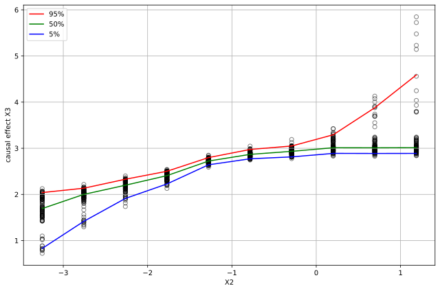

Nonlinear Causal Effect
-----------------------

Import and settings
-------------------

.. code-block:: python

    import numpy as np
    import pandas as pd
    
    from lingam import RESIT
    from sklearn.ensemble import RandomForestRegressor, RandomForestClassifier
    
    from lingam.utils import make_dot, visualize_nonlinear_causal_effect
    import matplotlib.pyplot as plt
    
    np.random.seed(0)

Data generation
---------------

.. code-block:: python

    n_samples = 1000
    
    def N(size):
        return np.random.uniform(size=size) - 0.5
    
    X = np.zeros([n_samples, 5])
    X[:, 0] = N(n_samples)
    X[:, 1] = 3 * (X[:, 0] + 0.25) * (X[:, 0] - 0.25) + N(n_samples)
    X[:, 2] = -0.75 * (X[:, 0] - 1) * (X[:, 0] - 2) + 1.5 * X[:, 1] + N(n_samples)
    X[:, 3] = 5 * (X[:, 1] + 0.4) * (X[:, 1] - 0.1) * (X[:, 1] - 0.5) + 1 * np.log(5 * X[:, 2] + 20) + N(n_samples)
    X[:, 4] = -0.8 * (X[:, 3] - 1.5) * (X[:, 3] - 3.5) + N(n_samples)
    X = pd.DataFrame(X, columns=[f'X{i}' for i in range(5)])
    
    pd.plotting.scatter_matrix(X, figsize=(8, 8), alpha=0.5)
    plt.show()
    
.. image:: ../image/visualize_nonlinear_causal_effect1.svg

Causal Discovery
----------------

.. code-block:: python

    regressor = RandomForestRegressor()
    model = RESIT(regressor=regressor, alpha=1)
    bs_result = model.bootstrap(X, n_sampling=100)

Visualization of nonlinear causal effect
----------------------------------------

.. code-block:: python

    fig = plt.figure(figsize=(9, 6))
    
    fig = visualize_nonlinear_causal_effect(X, bs_result, RandomForestRegressor(), "X2", "X3", fig=fig)
    
    for ax in fig.get_axes():
        ax.legend()
        ax.grid()
    
    fig.tight_layout()
    fig.show()

